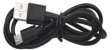
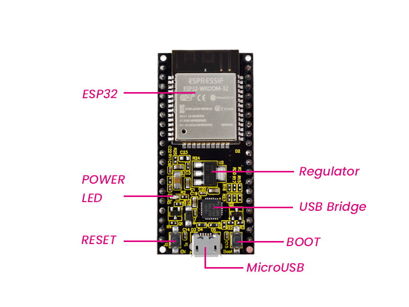

# **Keyestudio ESP32 Learning Kit Ultimate Edition**

## 1.Introduction：

Do you want to learn about programming?

As long as you're passionate about science and dare to explore new things, this kit is surely the best choice for you. The Keyestudio ESP32 Learning Kit Ultimate Edition mainly contains some common electronic components/sensors/modules, a ESP32 mainboard and bread wires are also included.

As many as 117 project tutorials are provided, which contain detailed wiring diagrams, components knowledge, and fascinating project code. Each project is produced using Thonny for Windows, Arduino IDE for Windows, and Arduino IDE for Raspberry Pi.  It's easy to get started.

You can create numerous fascinating DIY experiments with one controller(ESP32), various of sensors/modules and electronics. These courses can give you a deeper understanding of programming methods, logic, electronic circuits and the Linux operating system (Raspberry Pi).

## 2.Kit list：

When you received the kit , the first thing you see is a beautiful packaged box. Each accessory was safely and orderly packed in a small bag. Let's check them first:

|                                           |                                                |                                          |                                           |                                           |
| ----------------------------------------- | ---------------------------------------------- | ---------------------------------------- | ----------------------------------------- | ----------------------------------------- |
|   |        |  |   |   |
| ESP32 Mainboard*1                         | Blue LED*10                                    | Red LED*10                               | Yellow LED*10                             | Green LED*10                              |
|  |       |                  |                   |                  |
| RGB*1                                     | 220ΩResistor*10                                | 10KΩResistor*10                          | 1KΩResistor*10                            | 10KΩ Potentiometer*1                      |
|                  |                       |                 |                  |                  |
| Active Buzzer*1                           | Passive Buzzer*1                               | Button*4                                 | Tilt Switch*1                             | Photoresistor*2                           |
|                  |                       |                 |                  |                  |
| Flame Sensor*1                            | Yellow Cap*4                                   | IC 74HC595N *1                           | 1-Digit Tube Display*1                    | 4-Digit Tube Display*1                    |
|                  |                       |                 |                  |  |
| 8*8 Dot Matrix Display *1                 | Temperature and Humidity Sensor*1              | LCD_128X32_DOT *1                        | IR Receiver*1                             | IR Remote Controller*1                    |
|                  |                       |                 |                  |                  |
| Servo*1                                   | 4*4 Membrane Keypad*1                          | 130 DC Motor*1                           | Stepper Motor Driver Board*1              | Stepper Motor*1                           |
|                  |                       |                 |  |                  |
| Joystick Module*1                         | Sound Sensor*1                                 | PIR Motion Sensor*1                      | RFID Module*1                             | Ultrasonic Sensor*1                       |
|                  |                       |                 |                  |                  |
| LM35 Temperature Sensor*1                 | 5V Relay Module*1                              | 10K Thermistor*1                         | ABS Key Chain*1                           | White Card*1                              |
|                  |                       |                 |                  |                  |
| Breadboard*1                              | USB Cable*1                                    | Resistance Card*1                        | Jumper Wire*30                            | M-F Dupont Wire40                         |
|                  |                       |                 |                  |                  |
| Battery Holder*1                          | Keyestudio bread board special power module *1 | Fan*1                                    | NPN transistor(S8050)*1                   | PNP transistor(S8550)*1                   |

## 3.Keyestudio ESP32 Mainboard

**Introduction**

Keyestudio ESP32 Core board is a Mini development board based on the ESP-WROOM-32 module. The board has brought out most I/O ports to pin headers of 2.54mm pitch. These provide an easy way of connecting peripherals according to your own needs.

When it comes to developing and debugging with the development board, the both side standard pin headers can make your operation more simple and handy.

The ESP-WROOM-32 module is the industry's leading integrated WiFi + Bluetooth solution with less than 10 external components. It integrates antenna switches, RF balun, power amplifiers, low noise amplifiers, filters as well as power management modules. At the same time, it also integrates TSMC's low-power 40nm technology, power performance and RF performance, making it safe, reliable and easy to expand to a variety of applications.  

**Specifications**

Microcontroller: ESP-WROOM-32Module

USB to Serial Port Chip: CP2102-GMR

Working Voltage: DC 5V

Working Current：80mA（[Average](C:/Users/NINGMEI/AppData/Local/youdao/dict/Application/8.10.7.0/resultui/html/index.html#/javascript:;)）

Current Supply：500mA（[Minimum](C:/Users/NINGMEI/AppData/Local/youdao/dict/Application/8.10.7.0/resultui/html/index.html#/javascript:;)）

Working Temperature Range : -40°C \~ +85°C

WiFi Mode：Station/SoftAP/SoftAP+Station/P2P

WiFi [Protocol](C:/Users/NINGMEI/AppData/Local/youdao/dict/Application/8.10.7.0/resultui/html/index.html#/javascript:;) ：802.11 b/g/n/e/i（802.11n，Speed up to 150 Mbps

WiFi Frequency Range：2.4 GHz \~ 2.5 GHz

[Bluetooth](C:/Users/NINGMEI/AppData/Local/youdao/dict/Application/8.10.7.0/resultui/html/index.html#/javascript:;) [Protocol](C:/Users/NINGMEI/AppData/Local/youdao/dict/Application/8.10.7.0/resultui/html/index.html#/javascript:;) ：conform to Bluetooth v4.2 BR/EDR and BLE Standard

Dimensions：55\*26\*13mm

Weight：9.3g

**Pin out**

ESP32 has fewer pins than commonly used processors, but it doesn't have any problems reusing multiple functions on pins.    

Warning: The pin voltage level of the ESP32 is 3.3V.  If you want to connect the ESP32 to another device with an operating voltage of 5V, you should use a level converter to convert the voltage level.  

**●Power Pins:** The module has two power pins +5V and 3.3V. You can use these two pins to power other devices and modules. 

**● GND Pins**The module has three grounded pins.  
**● Enable pin (EN) :** This pin is used to enable and disable modules. The pin enables module at high level and disables module at low level.  

**● Input/Output pins (GPIO) :** You can use 32 GPIO pins to communicate with LEDs, switches and other input/output devices. You can also pull these pins up or down internally.  

**● Note:** Though GPIO6 to GPIO11 pins (SCK/CLK, SDO/SD0, SDI/SD1, SHD/SD2, SWP/SD3 and SCS/CMD pins) are used for SPI communication for the internal module, which are not recommended.    
**● ADC:** You can use the 16 ADC pins on this module to convert analog voltages (the output of some sensors) into digital voltages. Some of these converters are connected to internal amplifiers and which are capable of measuring small voltages with high accuracy.

**● DAC:** ESP32 module has two A/D converters with 8-bit precision.  
**● Touch pad:** There are 10 pins on the ESP32 module that are sensitive to capacitance changes.  You can attach these pins to certain PCB’s pads and use them as touch switches.   
**● SPI:** There are two SPI interfaces on the module, which can be used to connect the display screen, SD/microSD memory card module as well as external flash memory, etc.  
**● I2C:** SDA and SCL pins are used for I2C communication.    
**● Serial Communication (UART) :** There are two UART serial interfaces on this module, which can be used to transfer up to 5Mbps of information between two devices .  The UART0 also has CTS and RTS control functions. 

**●PWM:** Almost all ESP32 input/output pins can be used for PWM(pulse-width modulation). Using these pins can control the motor, LED lights and color changes for some other sensors（for example: color sensor）, etc.  

**Components**

