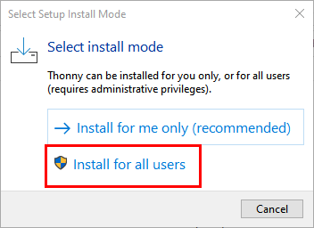
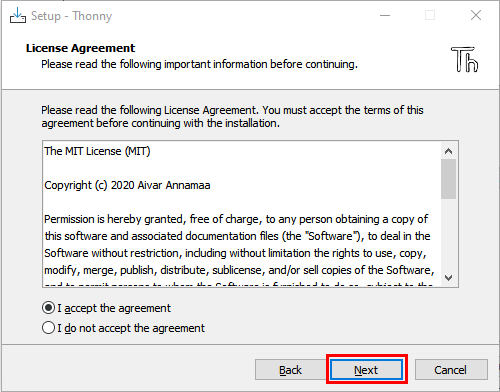
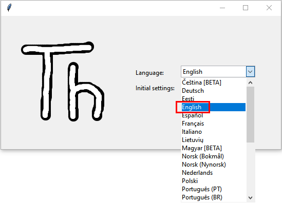
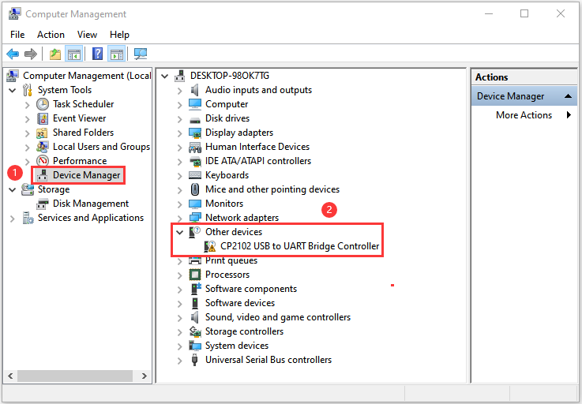
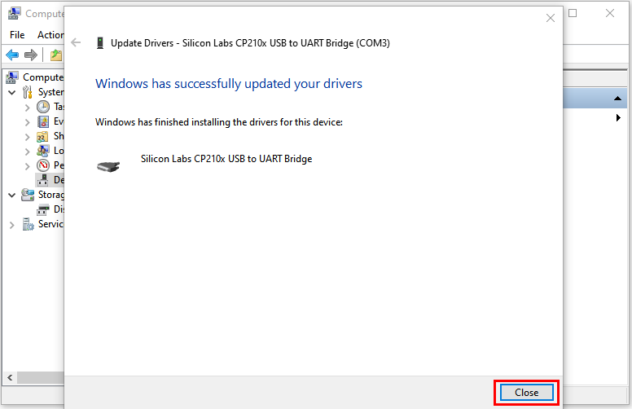
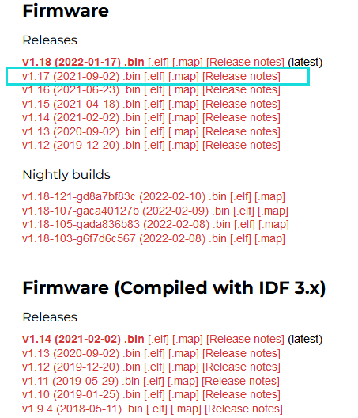
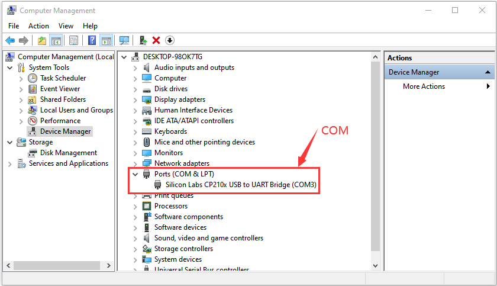
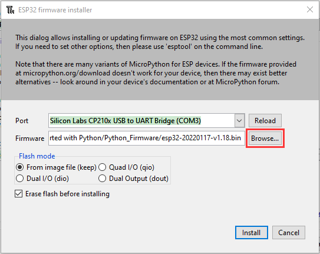
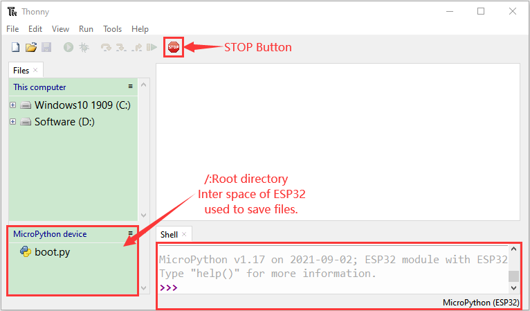
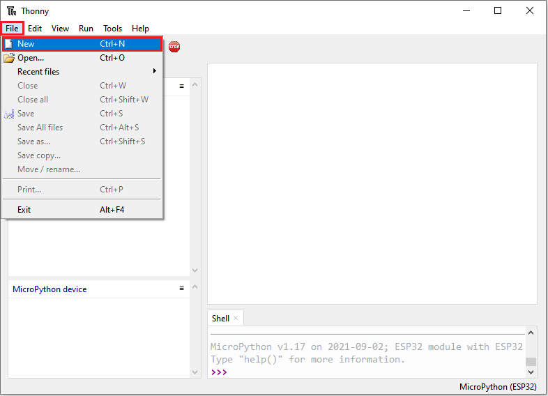

# Getting started with Python

Before starting building the projects, you need to make some preparation first. Do not skip this step as it provides crucial information for installing.

### 1.Installing Thonny (Important)：

Thonny is a free, open-source software platform with compact size, simple interface, simple operation and rich functions, making it a Python IDE for beginners. In this tutorial, we use this IDE to develop ESP32 during the whole process.

Thonny supports various operating system, including Windows、Mac OS、Linux.

#### **(1) Downloading Thonny：**

①Enter the official website of Thonny: [https://thonny.org](https://thonny.org) and download the latest version of Thonny.

②Open-source code repositories of Thonny: [https://github.com/thonny/thonny](https://github.com/thonny/thonny)

Follow the instruction of official website to install Thonny or click the links below to download and install. (Select the appropriate one based on your operating system.)

| Operating System | Download links/methods                                       |
| :--------------: | ------------------------------------------------------------ |
|     MAC OS：     | [https://github.com/thonny/thonny/releases/download/v3.2.7/thonny-3.2.7.pkg](https://github.com/thonny/thonny/releases/download/v3.2.7/thonny-3.2.7.pkg) |
|    Windows：     | [https://github.com/thonny/thonny/releases/download/v3.2.7/thonny-3.2.7.exe]( https:/github.com/thonny/thonny/releases/download/v3.2.7/thonny-3.2.7.exe) |
|     Linux：      | **The latest version:** **Binary bundle for PC (Thonny+Python):** bash <(wget -O - https://thonny.org/installer-for-linux) **With pip:** pip3 install thonny  **Distro packages (may not be the latest version):** **Debian, Rasbian, Ubuntu, Mint and others:** sudo apt install thonny **Fedora:** sudo dnf install thonny |

#### **(2) Install Thonny on Windows：**

The icon of Thonny after downloading is as below.

1.  Double click“thonny-3.3.13.exe”，the following dialog box will appear. I choose“”to operate, you can also select“” to operate.
    
    
    
2.  If you’re not familiar with computer software installation, you can simply keep clicking “**Next**” until the installation completes.
    

3. If you want to change Thonny’s installation path, you can click “**Browse...**” to modify it. After selecting installation path, click “**OK**”. If you do not want to change it, just click “**Next**”.

4.  Check “**Create desktop icon**” and then it will generate a shortcut on your desktop to facilitate you to open Thonny later.

5.  Click “**Install**” to install the software.
    
    

6.  During the installation, you only need to wait for completion, and you should not click "**Cancel**", otherwise Thonny will fail to be installed.
    

7. Once you see the interface as below, Thonny has been installed successfully. Click “**Finish**”.

8. If you’ve check“**Create desktop icon**”during the installation process, you can see the below icon on your desktop.

### 2. Basic Configuration of Thonny：

1.  Click the desktop icon of Thonny and you can see the interface of it as follows, and we can also choose the language and initial settings.  Once set, click "**Let's Go\!**"
    
    
    
    
    
    
    
2.  Select“**View**”→“**Files**”and“**Shell**”.
    
    
    
    
    
    

### 3.Installing CP2102 driver：

ESP32 uses CP2102 to download codes. So before using it, we need to install CP2102 driver in our computers.

#### **Windows System**

Check whether CP2102 has been installed

(1). Connect your computer and ESP32 with a USB cable.

(2). Turn to the main interface of your computer, select “**This PC**” and right-click to select “**Manage**”.

(3). Click “**Device Manager**”, your computer has installed CP2102 driver，you can see “Silicon Labs CP210x USB to UART Bridge (COMx)”

Installing CP2102 driver

(1) If you have not yet installed the CP2102 driver, you’ll see the following interface.

(2) Click “CP2102USB to UART Bridge Controller”, and right-click to select “Update driver”.

(3) Click “Browse my computer for drivers ”.

(4) Click “Browse...” select CP210x\_6.7.4 (Driver path：2. Windows System\\1. Python\_Tutorial\\1. Preparation for Python(Windows)\\CP2102 Driver File-Windows), Click “Next”.

(5) Wait for the CP2102 driver installation to be finished. When you see the following interface, which indicates that the CP2102 driver has been installed to your computer. You can close the interface.

(6) When ESP32 is connected to computer, the interface appears as follows.

#### **MAC System**

You can refer to the link：[https://docs.keyestudio.com/projects/KS5010/en/latest/docs/3.1Get-started-with-Arduino.html#how-to-install-the-cp2102-driver](https://docs.keyestudio.com/projects/KS5010/en/latest/docs/3.1Get-started-with-Arduino.html#how-to-install-the-cp2102-driver)

### 4.Burning Micropython Firmware (Important)

To run Python programs on ESP32, we need to burn a firmware to ESP32 first.

#### (1) Downloading Micropython firmware

Official website of microPython：<http://micropython.org/>

Webpage listing firmware of microPython for ESP32：[https://micropython.org/download/esp32/](https://micropython.org/download/esp32/)

Firmware used in this tutorial is **esp32-20210902-v1.17.bin**

Click the following link to download directly：[Python_Firmware](Python_Firmware.zip)

#### (2) Burning a Micropython Firmware

Connect your computer and ESP32 with a USB cable.

Make sure that the driver has been installed successfully and that it can recognize COM port correctly. Open device manager and expand “**Ports(COM\&LPT)**”.

Note: COM ports may be different on different computers

A. Open Thonny，click “**Run**” and select “**Select interpreter...**”.

B. Select “**Micropython (ESP32)**”, select “**Silicon Labs CP210x USB to UART Bridge(COM3**)”, and then click “**Install or update firmware**”. 

C. The following dialog box pops up, Select “**Silicon Labs CP210x USB to UART Bridge(COM3)**” for “**Port**”, and then click “**Browse...**”. Select the previous prepared microPython firmware “**esp32-20210902-v1.17.bin”**. Check “**Erase flash before installing**” and “**Flash mode**”, then click “**Install**” to wait for the prompt of finishing installation.

（Note: If you fail to install the firmware, press the Boot on the ESP32 mainboard and click “Install” again.）

D. Wait for the installation to be done, then click“**Close**”and“**OK**”.

E. Close all dialog boxes, turn to main interface and click“**STOP**”. As shown in the illustration below:

F. So far, all the preparations have been made.

### 5.Test Code：

Testing the Shell commander

Enter “**print('hello world')**” in “**Shell**” and press Enter.

Running Online(Important)

ESP32 needs to be connected to a computer when it is run online. Users can use Thonny to writer and debug programs.

1.  Open Thonny and click “**Open…**”.
    

2.  Click “**This computer**”on the newly pop-up window.
    

3.  In the new dialog box, select “**Project\_01\_HelloWorld.py**” in “...\2. Python Projects\\Project 01：Hello World” folder.

4.  Click“Run current script”to execute the program and “**Hello World**” will be printed in“**Shell**”.
    

**Note**：When running online, if you press the Reset button of ESP32, user’s code will not be executed again. If you wish to run the code automatically after resetting the code, please refer to the following Running Offline.

Running Offline(Important)

After ESP32 is reset, it runs the file boot\.py in root directory first and then runs your code file, and finally it enters “**Shell**”. Therefore, to make ESP32 execute user’s programs after resetting, we need to add a guiding program in boot\.py to execute user’s code.

1.  Move the program folder “2. Windows System\\1. Python\_Tutorial\\2. Python Projects” to disk(D) in advance with the path of “D:/2. Python Projects”. Open “**Thonny**”.

2.  Expand “**Project 00: Boot**” in the “**2. Python Projects**” in the directory of disk(D), and double-click ”**boot\.py**”, which is provided by us to enable programs in“**MicroPython device**” to run offline.

3. If you want your written programs to run offline, you need to upload “**boot\.py”** we provided and all your codes to “MicroPython device” and press ESP32’s Reset button. Here we use programs **Project 00** and **Project 01** as examples. Select “**boot\.py**”, right-click to select “**Upload to /**”.

4. Similarly, upload“**Project\_01\_HelloWorld.py**” to“**MicroPython device**”.

5. Press ESP32’s Reset button and in the box of the “**Shell**” below, you can see the code is executed.

### 6.Thonny Common operations：

Upload the code to ESP32

For convenience, let's take the opertation on “**boot\.py**” as an example. 

If we add “**boot\.py**” to each code directory, every time when ESP32 restarts, if there is a “**boot\.py**” in the root directory, it will execute this code first.

Select “**boot\.py**” in “**Project 03：LED Flashing**”, right-click your mouse and select “**Upload to /**” to upload code to ESP32’s root directory, select to click “**OK**”.

Downloading Code to Computer

Select “**boot\.py**” in “**MicroPython device**”, right-click to select “**Download to ...**” to download the code to your computer.

Delete files from ESP32 Root Directory

Select “**boot\.py**” in “**MicroPython device**”, right-click it and select “**Delete**” to delete “**boot\.py**” from ESP32’s root directory.

Select “**boot\.py**” in “**Project 03：LED Flashing**”, right-click it and select “**Move to Recycle Bin**” to delete it from “**Project 03：LED Flashing**”.

Creating and Saving the code

Click “**File**” → “**New**” to create and write codes.

Enter codes in the newly opened file. Here we use codes of “**Project\_03\_LED\_Flashing.py**” as an example.

Click“**Save**”on the menu bar, you can save the codes either to your computer or to ESP32.

Select “**MicroPython device**”, enter “**main\.py**” in the newly pop-up window and click “**OK**”.

You can see that the code has been uploaded to ESP32.

Disconnect and reconnect USB cable, and then you can see that LED is on for 0.5 s and then off for 0.5s.

