# Python Project

Click on the link to enter the Thonny tutorial: [Thonny Tutorial](Preparation-for-Python.md)

## Download code files

Click on the link to download the code file: [Download Python Codes file](Python-Codes.zip)

## Project 01: Hello World

### **1. Introduction**：

For ESP32 beginners, we'll start with some simple things. In this project, you just need an ESP32 mainboard, USB cable and computer to complete “Hello World\!” Project. It is not only a communication test for ESP32 mainboard and computer, but also a primary project for ESP32.

### **2. Components：**

|  ||
| ---------------------------------- | ---------------------- |
| ESP32\*1                           | USB cable\*1           |

### **3. Wiring：**

In this project, we use a USB cable to connect the ESP32 to the computer.


### **4. Running code online：**

To run ESP32 online, you need to connect it to computer, which allows you to use Thonny to compile or debug programs.

**Advantages：**

1)  You can use Thonny to compile or debug programs.

2)  Through the "**Shell**" window, you can read the error information and output results generated during the running of the program and query related function information online to help improve the program.

**Disadvantages：**

(1) To run ESP32 online, you have to be connected to a computer and run with Thonny.

(2) If ESP32 disconnects from computer, the program won’t run again when they reconnect to each other.

**Basic Operation:**

（1)  Open Thonnyand click  “Open...”.


(2) On the newly pop-up window, click“**This computer**”.


（2）In the new dialog box, select “Project\_01\_HelloWorld.py”, click “Open”.

Codes used in this tutorial are saved in ”**2. Python Projects**”. （If you haven't downloaded the code file, please click on the link to download it: [Download Python Codes](Python-Codes.zip)）


(3) Click “Run current script” to execute the program “Hello World\!”, "Welcome Keyestudio", which will be printed in the “**Shell**” window.


**Exit running online**

When running online, click“**Stop /Restart Backend**” or press “Ctrl+C” to exit the program.


### **5.** **Project code：**

```python
print("Hello World!")
print("Welcome Keyestudio")
```

## Project 02: Turn on LED

### 1.**Introduction**：

In this project, we will show you how to light up the LED. We use the ESP32's digital pin to turn on the LED so that the LED is lit up.

### 2.**Components：**

|  |  |  |              
| ---------------------------------- | ---------------------- | ---------------------- | 
| ESP32\*1                           | Breadboard\*1          | USB Cable\*1 |         
|  ||||
| Red LED\*1                         | 220Ω Resistor\*1       | Jumper Wire\*2         |   

### 3.**Component knowledge：**

#### **（1）LED:**


The LED is a semiconductor known as “light-emitting diode” ,which is an electronic device made from semiconducting materials(silicon, selenium, germanium, etc.). It has an anode and a cathode, the short lead is cathode, which connects to GND; the long lead is anode, which connects to3.3V or 5V.


#### **（2）Five-color ring resistor**

A resistor is an electronic component in a circuit that restricts or regulates the flow current flow. On the left is the appearance of the resistor and on the right is the symbol for the resistance in the circuit . Its unit is(Ω). 1 mΩ= 1000 kΩ，1kΩ= 1000Ω.


We can use resistors to protect sensitive components, such as LED. The strength of the resistance is marked on the body of the resistor with an electronic color code. Each color code represents a number, and you can refer to it in a resistance card.

\-Color 1 – 1st Digit.

\-Color 2 – 2nd Digit.

\-Color 3 – 3rd Digit.

\-Color 4 – Multiplier.

\-Color 5 – Tolerance.


In this kit, we provide three Five-color ring resistor with different resistance values. Take three Five-color ring resistor as an example.

220Ω Resistor\*10


10KΩ Resistor\*10


1KΩ Resistor\*10


In the same voltage, there will be less current and more resistance. The connection between current(I), voltage(V), and resistance(R) can be expressed by the formula: I=U/R. In the figure below, if the voltage is 3V, the current through R1 is: I = U / R = 3 V / 10 KΩ= 0.0003A= 0.3mA.


Don’t connect a low resistance directly to the two poles of the power supply. as this will cause excessive current to damage the electronic components. Resistors do not have positive and negative poles.

#### **（3）Breadboard**

Breadboards are used to build and test circuits quickly before completing any circuit design. There are many holes in the breadboard that can be inserted into circuit components such as integrated circuit board and resistors. A typical breadboard is shown below：


The breadboard has strips of metal , which run underneath the board and connect the holes on the top of the board. The metal strips are laid out as shown below. Note that the top and bottom rows of holes are connected horizontally，while the remaining holes are connected vertically.


The first two rows (top) and the last two rows (bottom) of the breadboard are used for the positive pole (+) and negative pole (-) of the power supply respectively. The conductive layout of the breadboard is shown in the figure below:


When we connect DIP (Dual In-line Packages) components, such as integrated circuits, microcontrollers, chips and so on, we can see that a groove in the middle isolates the middle part, so the top and bottom of the groove is not connected. DIP components can be connected as shown in the following diagram:


#### (4) **Power Supply**

The ESP32 needs 3.3V-5V power supply. In this project, we connected the ESP32 to the computer by using a USB cable.


### 4.**Wiring diagram：**

First, disconnect all power from the ESP32. Then build the circuit according to the wiring diagram. After the circuit is built and verified correct, connect the ESP32 to your computer by using a USB cable.

**Note:** Be careful to avoid short circuit when connecting 3.3V and GND\!

**WARNING:** A short circuit can cause high current in your circuit, create excessive component heat and cause permanent damage to your hardware\!


Note:

How to connect a LED


How to identify the 220Ω Five-color ring resistor


### 5.**Project code：**

Codes used in this tutorial are saved in“**2. Python Projects**”. （If you haven't downloaded the code file, please click on the link to download it:[Download Python Codes](Python-Codes.zip)）


Code running online:

Open “Thonny”，click “This computer”→“D:”→“2. Python Projects”→“Project 02：Turn On LED”.


Expand folder“Project 02：Turn On LED”and click“Project\_02\_Turn\_On\_LED.py” to open it. As shown in the illustration below：


```python
from machine import Pin
import time

led = Pin(15, Pin.OUT)   # create LED object from Pin 15, Set Pin 15 to output

led.value(1)    # Set led turn on
```


Make sure the ESP32 has been connected to the computer. Click“Stop/Restart backend” and see what will display in the“**Shell**” window.


Click“Run current script”, the code starts to be executed and the LED in the circuit lit up. Press “Ctrl+C” or click“Stop/Restart backend” to exit the program.


**Note**: This is the code running online. If you disconnect USB cable and repower ESP32 or press its reset button, LED is not bright and the following messages will be displayed in the "**Shell**" window of Thonny:


Code running offline (Upload the code to ESP32): 

Make sure the ESP32 has been connected to the computer, click“Stop/Restart backend”.


As shown below, right-click the file“Project\_02\_Turn\_On\_LED.py”，select “**Upload to /**”to upload the code to ESP32.

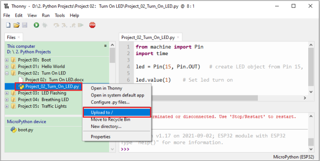

Upload “boot.py” in the same way.


Press the reset button of ESP32 and you can see LED is ON .


**Note**: Codes here is run offline. If you want to stop running offline and enter “**Shell**”, just click“Stop/Restart backend”in Thonny.


## Project 03：LED Flashing 

### 1.**Introduction**：

In this project, we will show you the LED flashing effect. We use the  ESP32's digital pin to turn on the LED and make it flashing.

### 2.**Components：**

|  |  |  ||
| ---------------------------------- | ---------------------- | ---------------------- | 
| ESP32\*1                           | Breadboard\*1          | USB Cable\*1 |                
|  ||||
| Red LED\*1                         | 220Ω Resistor\*1       | Jumper Wire\*2         |        

### 3.**Wiring diagram：**

First, disconnect all power from the ESP32. Then build the circuit according to the wiring diagram. After the circuit is built and verified correct, connect the ESP32 to your computer using a USB cable.

**Note:** Avoid any possible short circuits (especially connecting 3.3V and GND)\!

**WARNING:** A short circuit can cause high current in your circuit, create excessive component heat and cause permanent damage to your hardware\!


Note:

How to connect a LED


How to identify the 220Ω Five-color ring resistor


### 4.**Project code：**

Codes used in this tutorial are saved in “**2. Python Projects**”. （If you haven't downloaded the code file, please click on the link to download it:[Download Python Codes](Python-Codes.zip)）


Code running online:

Open “Thonny”，click“This computer”→“D:”→“2. Python Projects”→“Project 03：LED Flashing”.


Expand folder “Project 03：LED Flashing” and click “Project\_03\_LED\_Flashing.py” to open it. As shown in the illustration below：


```python
from machine import Pin
import time
    
led = Pin(15, Pin.OUT)   # create LED object from Pin 15, Set Pin 15 to output
    
try:
     while True:
            led.value(1)    # Set led turn on
            time.sleep(0.5) # Sleep 0.5s
            led.value(0)    # Set led turn off
            time.sleep(0.5) # Sleep 0.5s
except:
        pass
```

Make sure the ESP32 has been connected to the computer. Click“Stop/Restart backend” and see what will display in the “**Shell**” window.


Click“Run current script”, the code starts to be executed and you can see the LED is ON for 0.5s and then OFF for 0.5s, which repeats in an endless loop. Press“Ctrl+C”or click“Stop/Restart backend” to exit the program.


**Note**: This is the code running online. If you disconnect USB cable and repower ESP32 or press its reset button, the LED in the circuit stops flashing and the following messages will be displayed in the "Shell" window of Thonny:


Code running offline（Upload the code to ESP32）：

Make sure the ESP32 has been connected to the computer, click“Stop/Restart backend”.


As shown below, right-click the file“Project\_03\_LED\_Flashing.py”，select “**Upload to /**”to upload the code to ESP32.

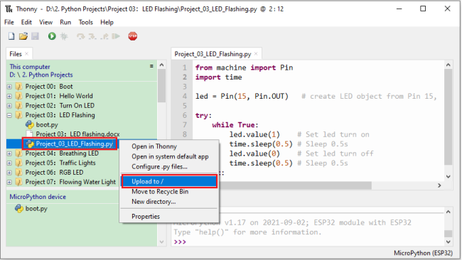

Upload “boot.py” in the same way.


Press the reset button of ESP32 and you can see the LED is ON for 0.5 seconds and then OFF for 0.5 seconds, which repeats in an endless loop.


**Note**：Codes here is run offline. If you want to stop running offline and enter“**Shell**”, just click “Stop/Restart backend”in Thonny.


## Project 04: Breathing Led

### 1.**Introduction：**

In previous studies, we know that LEDs have on/off state, so how to enter the intermediate state? How to output an intermediate state to make the LED half bright? That's what we're going to learn.

Breathing light, that is, LED is turned from off to on gradually, and gradually from on to off, just like "breathing". So, how to control the brightness of a LED? We will use ESP32’s PWM to achieve this target.

### 2.**Components：**

|  |  |  ||
| ---------------------------------- | ---------------------- | ---------------------- |
| ESP32\*1                           | Breadboard\*1          | USB Cable\*1 |                     
|  ||||
| Red LED\*1                         | 220Ω Resistor\*1       | Jumper Wire\*2         |         

### 3.**Component knowledge：**


#### **Analog & Digital:**

An Analog Signal is a continuous signal in both time and value. On the contrary, a Digital Signal or discrete time signal is a time series consisting of a sequence of quantities. Most signals in life are analog signals. A familiar example of an Analog Signal would be how the temperature throughout the day is continuously changing and could not suddenly change instantaneously from 0℃ to 10℃. However, Digital Signals can instantaneously change in value. This change is expressed in numbers as 1 and 0 (the basis of binary code). Their differences can more easily be seen when compared when graphed as below.


In practical application, we often use binary as the digital signal, that is a series of 0’s and 1’s. Since a binary signal only has two
values (0 or 1), it has great stability and reliability. Lastly, both analog and digital signals can be converted into the other.

#### **PWM：**

PWM, Pulse-Width Modulation, is a very effective method for using digital signals to control analog circuits. Common processors cannot directly output analog signals. PWM technology makes it very convenient to achieve this conversion (translation of digital to analog signals).

PWM technology uses digital pins to send certain frequencies of square waves, that is, the output of high levels and low levels, which alternately last for a while. The total time for each set of high levels and low levels is generally fixed, which is called the period (Note: the reciprocal of the period is frequency). The time of high level outputs are generally called “pulse width”, and the duty cycle is the percentage of the ratio of pulse duration, or pulse width (PW) to the total period (T) of the waveform.

The longer the output of high levels last, the longer the duty cycle and the higher the corresponding voltage in the analog signal will be. The following figures show how the analog signal voltages vary between 0V-3V3 (high level is 3V3) corresponding to the pulse width 0%-100%:


The longer the PWM duty cycle is, the higher the output power will be. Now that we understand this relationship, we can use PWM to control the brightness of an LED or the speed of DC motor and so on. It is evident from the above that PWM is not real analog, and the effective value of the voltage is equivalent to the corresponding analog. so, we can control the output power of the LED and other output modules to achieve different effects.

#### **ESP32 and PWM:**

The ESP32 PWM controller has 8 independent channels, each of which can independently control frequency, duty cycle, and even accuracy. Unlike traditional PWM pins, the PWM output pins of ESP32 are configurable and they can be configured to PWM.

### 4.**Wiring diagram：**


**Note:**

How to connect a LED


How to identify the 220Ω Five-color ring resistor


### **5. Project code：**

The design of this project makes the GP15 output PWM, and the pulse width gradually increases from 0% to 100%, and then gradually decreases from 100% to 0%.

Codes used in this tutorial are saved in “**2. Python Projects**”. （If you haven't downloaded the code file, please click on the link to download it:[Download Python Codes](Python-Codes.zip)）


Open“Thonny”，click“This computer”→“D:”→“2. Python Projects”→“Project 04：Breathing Led”, and double left-click “Project\_04\_Breathing\_LED.py”.


```python
import time
from machine import Pin,PWM

#The way that the ESP32 PWM pins output is different from traditionally controllers.
#It can change frequency and duty cycle by configuring PWM’s parameters at the initialization stage.
#Define GPIO15’s output frequency as 10000Hz and its duty cycle as 0, and assign them to PWM.
pwm =PWM(Pin(15,Pin.OUT),10000,0)

try:
    while True:
#The range of duty cycle is 0-1023, so we use the first for loop to control PWM to change the duty
#cycle value,making PWM output 0% -100%; Use the second for loop to make PWM output 100%-0%.  
        for i in range(0,1023):
            pwm.duty(i)
            time.sleep_ms(1)
            
        for i in range(0,1023):
            pwm.duty(1023-i)
            time.sleep_ms(1)  
except:
#Each time PWM is used, the hardware Timer will be turned ON to cooperate it. Therefore, after each use of PWM,
#deinit() needs to be called to turned OFF the timer. Otherwise, the PWM may fail to work next time.
    pwm.deinit()

```


### **6. Project result：**

Make sure the ESP32 has been connected to the computer, click“Stop/Restart backend” .


Click“Run current script”, the code starts to be executed and you'll see that the LED is turned from ON to OFF and then back from OFF to ON gradually like breathing. Press “Ctrl+C” or click“Stop/Restart backend” to exit the program.


## Project 05：Traffic Lights

### 1.**Introduction：**

Traffic lights are closely related to people's daily life, which generally show red, yellow, and green. Everyone should obey the traffic rules, which can avoid many traffic accidents. In this project, we will use ESP32 and some LEDs (red, green and yellow) to simulate the traffic lights.

### 2.**Components：**

|  |  |||
| ---------------------------------- | ---------------------- | --------------------------- | ----------------------- |
| ESP32\*1                           | Bread board\*1         | Red LED\*1                  | Yellow LED\*1           |
|  |  |||
| Green LED\*1                       | USB Cable\*1           | 220Ω Resistor\*3            | Jumper Wires            |

### **3.** **Wiring diagram：**


**Note:**

How to connect a LED


How to identify the 220Ω Five-color ring resistor


### **4. Project code：**

Codes used in this tutorial are saved in”**2. Python Projects**”. （If you haven't downloaded the code file, please click on the link to download it:[Download Python Codes](Python-Codes.zip)）


Open“Thonny”，click“This computer”→“D:”→“2. Python Projects”→“Project 05：Traffic Lights”. and double left-click “Project\_05\_Traffic\_Lights.py”.


```python
from machine import Pin
import time

led_red = Pin(0, Pin.OUT)  # create red led object from Pin 0, Set Pin 0 to output
led_yellow = Pin(2, Pin.OUT)  # create yellow led object from Pin 2, Set Pin 2 to output
led_green = Pin(15, Pin.OUT) # create green led object from Pin 15, Set Pin 15 to output

while True:
    led_red.value(1)  # Set red led turn on
    time.sleep(5)   # Sleep 5s
    led_red.value(0) # Set red led turn off 
    led_yellow.value(1)
    time.sleep(0.5)
    led_yellow.value(0)
    time.sleep(0.5)
    led_yellow.value(1)
    time.sleep(0.5)
    led_yellow.value(0)
    time.sleep(0.5)
    led_yellow.value(1)
    time.sleep(0.5)
    led_yellow.value(0)
    time.sleep(0.5)
    led_green.value(1)
    time.sleep(5) 
    led_green.value(0) 
```

### 5.**Project result：**

Make sure the ESP32 has been connected to the computer, click“Stop/Restart backend” .


Click“Run current script”, the code starts to be executed and you'll see are below:

① First, the green light will be on for five seconds and then off; 

② Next, the yellow light blinks three times and then goes off;

③ Then, the red light goes on for five seconds and then goes off;

④ Repeat steps 1 to 3 above.

Press “Ctrl+C” or click“Stop/Restart backend” to exit the program.


## Project 06: RGB LED

### **1.Introduction：**


RGB is composed of three colors (red, green and blue),which can emit different colors of light by mixing these three basic colors.

In this project, we will introduce the RGB and show you how to use ESP32 to control the RGB to emit different color light. RGB is pretty basic, but it’s also a great way to learn the fundamentals of electronics and coding.

### 2.**Components：**

|  |  |  ||
| ---------------------------------- | ---------------------- | ---------------------- | 
| ESP32\*1                           | Breadboard\*1          | USB Cable\*1 |                        
|  ||||
| RGB LED\*1                         | 220Ω Resistor\*3       | Jumper Wires           |            

### **3.** **Component knowledge：**

Most monitors adopt the RGB color standard, and all colors on a computer screen are a mixture of red, green and blue in varying proportions.

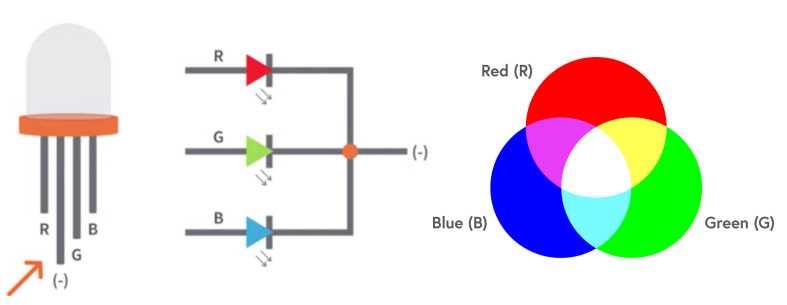

This RGB LED has 4 pins, each color (red, green, blue) and a common cathode,To change its brightness, we can use the PWM of the ESP32 pins, which can give different duty cycle signals to the RGB to produce different colors of light.

If we use three 10-bit PWM to control the RGB, in theory, we can create 2 <sup>10</sup>\*2<sup>10</sup>\*2<sup>10</sup> = 1,073,741,824 (1 billion) colors through different combinations.

### 4.**Wiring diagram：**


**Note:**

How to connect a LED


How to identify the 220Ω Five-color ring resistor


### 5.**Project code：**

Codes used in this tutorial are saved in”**2. Python Projects**”. （If you haven't downloaded the code file, please click on the link to download it:[Download Python Codes](Python-Codes.zip)）


Open“Thonny”, click “This computer” → “D:” → “2. Python Projects” → “Project 06：RGB LED”, and double left-click “Project\_06\_RGB\_LED.py”.


```python
## import Pin, PWM and Random function modules.
from machine import Pin, PWM
from random import randint
import time

#Configure ouput mode of GPIO15, GPIO2 and GPIO0 as PWM output and PWM frequency as 10000Hz.
pins = [0, 2, 15]

pwm0 = PWM(Pin(pins[0]),10000)  
pwm1 = PWM(Pin(pins[1]),10000)
pwm2 = PWM(Pin(pins[2]),10000)

#define a function to set the color of RGBLED.
def setColor(r, g, b):
    pwm0.duty(1023-r)
    pwm1.duty(1023-g)
    pwm2.duty(1023-b)
    
try:
    while True:
        red   = randint(0, 1023) 
        green = randint(0, 1023)
        blue  = randint(0, 1023)
        setColor(red, green, blue)
        time.sleep_ms(200)
except:
    pwm0.deinit()
    pwm1.deinit()
    pwm2.deinit()
```

### **Project result：**

Make sure the ESP32 has been connected to the computer, click“Stop/Restart backend” .


Click“Run current script”, the code starts to be executed and you'll see that RGB begins to display random colors. Press “Ctrl+C” or click“Stop/Restart backend” to exit the program.

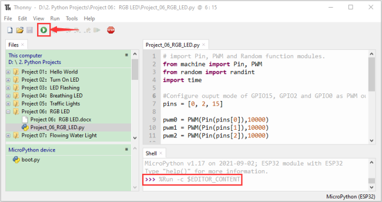

## Project 07: Flowing Water Light

### 1.**Introduction：**

In our daily life, we can see many billboards composed of different colors of LED. They constantly change the light (like water) to attract customers' attention. In this project, we will use ESP32 to control 10 leds to achieve the effect of flowing water.

### 2.**Components：**

|  |  |  ||
| ---------------------------------- | ---------------------- | ---------------------- | 
| ESP32\*1                           | Breadboard\*1          | USB Cable\*1 |                       
|  ||||
| Red LED\*10                        | 220Ω Resistor\*10      | Jumper Wires           |           

### 3.**Wiring diagram :**


**Note:**

How to connect a LED


How to identify the 220Ω Five-color ring resistor


### 4.**Project code：**

This project is designed to make a flowing water lamp. Which are these actions: First turn LED \#1 ON, then turn it OFF. Then turn LED \#2 ON, and then turn it OFF... and repeat the same to all 10 LEDs until the last LED is turns OFF. This process is repeated to achieve the “movements” of flowing water.

Codes used in this tutorial are saved in”**2. Python Projects**”. （If you haven't downloaded the code file, please click on the link to download it:[Download Python Codes](Python-Codes.zip)）


Open“Thonny”，click“This computer”→“D:”→“2. Python Projects”→“Project 07：Flowing Water Light”, and double left-click
“Project\_07\_Flowing\_Water\_Light.py”.


```python
from machine import Pin
import time

#Use an array to define 10 GPIO ports connected to LED Bar Graph for easier operation.
pins = [22, 21, 19, 18, 17, 16, 4, 0, 2, 15]
#Use two for loops to turn on LEDs separately from left to right and then back from right to left
def showLed():
    for pin in pins:
        print(pin)
        led = Pin(pin, Pin.OUT)
        led.value(1)
        time.sleep_ms(100)
        led.value(0)
        time.sleep_ms(100)        
    for pin in reversed(pins):
        print(pin)
        led = Pin(pin, Pin.OUT)
        led.value(1)
        time.sleep_ms(100)
        led.value(0)
        time.sleep_ms(100)
          
while True:
    showLed()
```

### **5. Project result：**

Make sure the ESP32 has been connected to the computer, click“Stop/Restart backend” .


Click“Run current script”, the code starts to be executed and you'll see that 10 LEDs will light up from left to right and then back from right to left. Press“Ctrl+C” or click“Stop/Restart backend” to exit the program.


## Project 08：1-Digit Digital Tube

### 1.**Introduction：**

A 1-Digit 7-Segment Display is an electronic display device that displays decimal numbers. It is widely used in digital clocks,
electronic meters, basic calculators and other electronic devices that display digital information. Eventhough they may not look modern enough, they are an alternative to more complex dot matrix displays and are easy to use in limited light conditions and strong sunlight. In this project, we will use ESP32 to control 1-Digit 7-segment display displays numbers.

### 2.**Components：**

|  |  |  ||
| ---------------------------------- | ---------------------- | ---------------------- | 
| ESP32\*1                           | Breadboard\*1          | USB Cable\*1 |                    
|  ||||
| 1-Digit 7-Segment Display\*1       | 220Ω Resistor\*8       | Jumper Wires           |         

### **3. Component knowledge：**


**1-Digit 7-Segment Display principle:** 

Digital tube display is a semiconductor light emitting device,its basic unit is a light-emitting diode (LED). Thedigital tube display can be divided into 7-segment display and 8-segment display according to the number of segments. The 8-segment display has one more LED unit than the 7-segment display (used for decimal point display). Each segment of the 7-segment display is a separate LED. According to the connection mode of the LED unit, the digital tube can be divided into a common anode digital tube and a common cathode digital tube.

In the common cathode 7-segment display, all the cathodes (or negative electrodes) of the segmented LEDs are connected together, so you should connect the common cathode to GND. To light up a segmented LED, you can set its associated pin to“HIGH”.

In the common anode 7-segment display, the LED anodes (positive electrodes) of all segments are connected together, so you should connect the common anode to“+5V”. To light up a segmented LED, you can set its associated pin to“LOW”.


Each part of the digital tube is composed of an LED. So when you use it, you also need to use a current limiting resistor. Otherwise, the LED will be damaged. In this experiment, we use an ordinary common cathode one-digit digital tube. As we mentioned above, you should connect the common cathode to GND. To light up a segmented LED, you can set its associated pin to“HIGH”.

### **4.Wiring diagram：**

Note: The direction of the 7-segment display inserted into the breadboard is consistent with the wiring diagram, with one more point in the lower right corner.


### **5.Project code：**

The digital display is divided into 7 segments, and the decimal point display is divided into 1 segment. When certain numbers are displayed, the corresponding segment will be lit. For example, when the number 1 is displayed, segments b and c will be turned on.

Codes used in this tutorial are saved in ”**2. Python Projects**”. （If you haven't downloaded the code file, please click on the link to download it:[Download Python Codes](Python-Codes.zip)）


Open“Thonny”，click“This computer”→“D:”→“2. Python Projects”→“Project 08：1-Digit Digital Tube”, and double left-click
“Project\_08\_One\_Digit\_Digital\_Tube.py”.


```python
from machine import Pin
import time

a = Pin(16, Pin.OUT)
b = Pin(4, Pin.OUT)
c = Pin(5, Pin.OUT)
d = Pin(18, Pin.OUT)
e = Pin(19, Pin.OUT)
f = Pin(22, Pin.OUT)
g = Pin(23, Pin.OUT)
dp = Pin(17, Pin.OUT)

pins = [Pin(id,Pin.OUT) for id in [16, 4, 5, 18, 19, 22, 23, 17]]

def show(code):
    for i in range(0, 8):
        pins[i].value(~code & 1)
        code = code >> 1

#Select code from 0 to 9
mask_digits = [0xc0, 0xf9, 0xa4, 0xb0, 0x99, 0x92, 0x82, 0xf8,0x80, 0x90]
for code in reversed(mask_digits):
    show(code)
    time.sleep(1)
```

### 6.**Project result：**

Make sure the ESP32 has been connected to the computer, click“Stop/Restart backend”.


Click“Run current script”, the code starts to be executed and you'll see that the 1-Digit 7-Segment Display will display numbers from 9 to 0. Press “Ctrl+C” or click“Stop/Restart backend” to exit the program.


## Project 09：4-Digit Digital Tube

### 1.**Introduction：**

A 4-digit 7-segment display is a very practical display device and it is used for devices such as electronic clocks，score counters and the number of people in the park. Because of the low price, easy to use, more and more projects will use 4 Digit 7-segment display. In this project, we use ESP32 control 4-digit 7-segment display to display four digits.

### 2.**Components：**

|  |  ||
| ----------------------------------- | --------------------------- | 
| ESP32\*1                            | Breadboard\*1               |                        
|  ||
| 4-digit 7-segment display Module\*1 | M-F Dupont Wires            |            

### 3.**Component knowledge：**

**TM1650** **4-digit 7-segment display：**It is a 12-pin 4-digit 7-segment display module with clock dots. The driver chip is TM1650
which only needs 2 signal lines to enable the microcontroller to control the 4-digit 7-segment display. The control interface level can be 5V or 3.3V.

**Specifications of 4-bit 7-segment display module:**

Working voltage: DC 3.3V-5V

Maximum current: 100MA

Maximum power: 0.5W

**Schematic diagram of 4-digit 7-segment display module:**


### 4.**Wiring diagram：**


### **5.** **Project code：**

Codes used in this tutorial are saved in”**2. Python Projects**”. （If you haven't downloaded the code file, please click on the link to download it:[Download Python Codes](Python-Codes.zip)）


Open“Thonny”，click“This computer”→“D:”→“2. Python Projects”→“Project 09：4-Digit Digital Tube”. and then double left-click “Project\_09\_Four\_Digit\_Digital\_Tube.py”. 


```python
from machine import Pin
import time

## definitions for TM1650
ADDR_DIS = 0x48  #mode command
ADDR_KEY = 0x49  #read key value command

## definitions for brightness
BRIGHT_DARKEST = 0
BRIGHT_TYPICAL = 2
BRIGHTEST      = 7

on  = 1
off = 0

## number:0~9
NUM = [0x3f,0x06,0x5b,0x4f,0x66,0x6d,0x7d,0x07,0x7f,0x6f] 
## DIG = [0x68,0x6a,0x6c,0x6e]
DIG = [0x6e,0x6c,0x6a,0x68]
DOT = [0,0,0,0]

clkPin = 22
dioPin = 21
clk = Pin(clkPin, Pin.OUT)
dio = Pin(dioPin, Pin.OUT)

DisplayCommand = 0

def writeByte(wr_data):
    global clk,dio
    for i in range(8):
        if(wr_data & 0x80 == 0x80):
            dio.value(1)
        else:
            dio.value(0)
        clk.value(0)
        time.sleep(0.0001)
        clk.value(1)
        time.sleep(0.0001)
        clk.value(0)
        wr_data <<= 1
    return

def start():
    global clk,dio
    dio.value(1)
    clk.value(1)
    time.sleep(0.0001)
    dio.value(0)
    return
    
def ack():
    global clk,dio
    dy = 0
    clk.value(0)
    time.sleep(0.0001)
    dio = Pin(dioPin, Pin.IN)
    while(dio.value() == 1):
        time.sleep(0.0001)
        dy += 1
        if(dy>5000):
            break
    clk.value(1)
    time.sleep(0.0001)
    clk.value(0)
    dio = Pin(dioPin, Pin.OUT)
    return 
    
def stop():
    global clk,dio
    dio.value(0)
    clk.value(1)
    time.sleep(0.0001)
    dio.value(1)
    return
    
def displayBit(bit, num):
    global ADDR_DIS
    if(num > 9 and bit > 4):
        return
    start()
    writeByte(ADDR_DIS)
    ack()
    writeByte(DisplayCommand)
    ack()
    stop()
    start()
    writeByte(DIG[bit-1])
    ack()
    if(DOT[bit-1] == 1):
        writeByte(NUM[num] | 0x80)
    else:
        writeByte(NUM[num])
    ack()
    stop()
    return
    
def clearBit(bit):
    if(bit > 4):
        return
    start()
    writeByte(ADDR_DIS)
    ack()
    writeByte(DisplayCommand)
    ack()
    stop()
    start()
    writeByte(DIG[bit-1])
    ack()
    writeByte(0x00)
    ack()
    stop()
    return
    
    
def setBrightness(b = BRIGHT_TYPICAL):
    global DisplayCommand,brightness
    DisplayCommand = (DisplayCommand & 0x0f)+(b<<4)
    return

def setMode(segment = 0):
    global DisplayCommand
    DisplayCommand = (DisplayCommand & 0xf7)+(segment<<3)
    return
    
def displayOnOFF(OnOff = 1):
    global DisplayCommand
    DisplayCommand = (DisplayCommand & 0xfe)+OnOff
    return

def displayDot(bit, OnOff):
    if(bit > 4):
        return
    if(OnOff == 1): 
        DOT[bit-1] = 1;
    else:
        DOT[bit-1] = 0;
    return
        
def InitDigitalTube():
    setBrightness(2)
    setMode(0)
    displayOnOFF(1)
    for _ in range(4):
        clearBit(_)
    return

def ShowNum(num): #0~9999
    displayBit(1,num%10)
    if(num < 10):
        clearBit(2)
        clearBit(3)
        clearBit(4)
    if(num > 9 and num < 100):
        displayBit(2,num//10%10)
        clearBit(3)
        clearBit(4)
    if(num > 99 and num < 1000):
        displayBit(2,num//10%10)
        displayBit(3,num//100%10)
        clearBit(4)
    if(num > 999 and num < 10000):
        displayBit(2,num//10%10)
        displayBit(3,num//100%10)
        displayBit(4,num//1000)

InitDigitalTube()

while True:
    #displayDot(1,on)     # on or off, DigitalTube.Display(bit,number); bit=1---4  number=0---9
    for i in range(0,9999):
        ShowNum(i)
        time.sleep(0.01)
```
### **6. Project result：**

Make sure the ESP32 has been connected to the computer, click“Stop/Restart backend” .


Click“Run current script”, the code starts to be executed and you'll see that 4-digit 7-segment display displays digits，the number increments by one and repeat these actions in an infinite loop. Press “Ctrl+C” or click“Stop/Restart backend” to exit the program.


## Project 10：8×8 Dot-matrix Display

### 1.**Introduction：**

Dot matrix display is an electronic digital display device that can display information on machine, clocks, public transport departure indicators and many other devices. In this project, we will use ESP32 control 8x8 LED dot matrix to display patterns.

### 2.**Components：**

|  |  | |
| ---------------------------------- | --------------------------- | ---------------------- |
| ESP32\*1                           | Breadboard\*1               |                        |
|  |||
| 8\*8 dot matrix module\*1          | M-F Dupont Wires            | USB Cable\*1           |

### 3.**Component knowledge：**

**8\*8 dot matrix module：** 

The 8\*8 dot matrix is composed of 64 LEDs, and each LED is placed at the intersection of a row and a column. When using the single chip microcomputer to drive an 8\*8 dot matrix, we need 16 digital ports in total, which greatly wastes the data of the single chip microcomputer.

To this end, we specially designed this module, using the HT16K33 chip to drive an 8\*8 dot matrix, and only need to use the I2C communication port of the MCU to control the 8\*8 dot matrix, which greatly saving the MCU resources.

**Specifications of 8\*8 dot matrix module：**

- Working voltage: DC 5V

- Current: 200MA

- Maximum power: 1W

**Schematic diagram of 8\*8 dot matrix module：**


Some modules have three DIP switches that you can toggle at will. These switches are used to set the I2C communication address, the setting method is as follows. The module has fixed the communication address. A0, A1 and A2 are connected to GND, and the address is 0x70.


### **4.Wiring diagram：**


### 5.**Project code：**

Codes used in this tutorial are saved in“**2. Python Projects**”. （If you haven't downloaded the code file, please click on the link to download it:[Download Python Codes](Python-Codes.zip)）


Open“Thonny”，click“This computer”→“D:”→“2. Python Projects”→“Project 10：8×8 Dot-matrix Display”. 

Select “ht16k33matrix\.py” and “ht16k33\.py”, right-click your mouse to select “Upload to /”, wait for “ht16k33matrix\.py” and “ht16k33\.py” to be uploaded to ESP32, and then double left-click “Project\_10\_8×8\_Dot\_Matrix\_Display.py”.


```python
## IMPORTS
import utime as time
from machine import I2C, Pin, RTC
from ht16k33matrix import HT16K33Matrix

## CONSTANTS
DELAY = 0.01
PAUSE = 3

## START
if __name__ == '__main__':
    i2c = I2C(scl=Pin(22), sda=Pin(21))
    display = HT16K33Matrix(i2c)
    display.set_brightness(2)

    # Draw a custom icon on the LED
    icon = b"\x00\x66\x00\x00\x18\x42\x3c\x00"
    display.set_icon(icon).draw()
    # Rotate the icon
    display.set_angle(0).draw()
    time.sleep(PAUSE)
```

### 6.**Project result：**

Make sure the ESP32 has been connected to the computer, click“Stop/Restart backend” .


Click“Run current script”, the code starts to be executed and you'll see that the 8\*8 dot matrix displays“Smiling face” pattern. Press“Ctrl+C” or click“Stop/Restart backend”to exit the program.


## Project 11：74HC595N Control 8 LEDs 

### 1.**Introduction：**

In previous projects, we learned how to light up an LED. With only 32 IO ports on ESP32, how do we light up a lot of
leds? Sometimes it is possible to run out of pins on the ESP32, and you need to extend it with the shift register.You can use the 74HC595N chip to control 8 outputs at a time, taking up only a few pins on your microcontroller. 

In addition, you can also connect multiple registers together to further expand the output. In this project, we will use ESP32, 74HC595 chip and LED to make a flowing water light to understand the function of the 74HC595 chip.

### 2.**Components：**

|  ||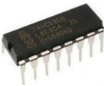||
| ---------------------------------- | --------------------------- | ---------------------- | ---------------------- |
| ESP32\*1                           | Breadboard\*1               | 74HC595N chip\*1       | Jumper Wires           |
|  |  || |
| 220ΩResistor\*8                    | Red LED\*8                  | USB Cable\*1           |                        |

### 3.**Component knowledge：**


**74HC595N Chip:** 

The 74HC595 chip is used to convert serial data into parallel data. A 74HC595 chip can convert the serial data of one byte into 8 bits, and send its corresponding level to each of the 8 ports correspondingly. 

With this characteristic, the 74HC595 chip can be used to expand the IO ports of an ESP32. At least 3 ports are required to control the 8 ports of the 74HC595 chip.


The ports of the 74HC595 chip are described as follows ：

|              PIN              | FUNCTION                                                     |
| :---------------------------: | ------------------------------------------------------------ |
|          Pin 13--OE           | Enable output, When this pin is in high level, Q0-Q7 is in high resistance state. <br />When this pin is in low level, Q0-Q7 is in output mode. |
|          Pin 14---SI          | Serial data Input, only enter one bit at a time, so you can enter eight consecutive times to form one byte. |
|         Pin 10---SCLR         | Remove shift register: <br />When this pin is in low level, the content in shift register will be cleared.<br />In this experiment, we connect VCC to maintain a high level. |
|         Pin 11---SCK          | Serial shift clock: <br />when its electrical level is rising, serial data input register will do a shift. |
|         Pin 12---RCK          | Parallel Update Output: <br />when its electrical level is rising, it will update the parallel data output. <br />In this case, the data is output from ports Q0 to Q7 in parallel |
|          Pin 9---SQH          | Serial data output: it can be connected to more 74HC595 in series. |
| Q0--Q7<br />(Pin 15，Pin 1-7) | Parallel data output, can directly control the 8 segments of the digital tube. |

### **4.** **Wiring diagram：**

Note: Note the orientation in which the 74HC595N chip is inserted.


### **5.** **Project code：**

Codes used in this tutorial are saved in “**2. Python Projects**”. （If you haven't downloaded the code file, please click on the link to download it:[Download Python Codes](Python-Codes.zip)）


Open“Thonny”，click“This computer”→“D:”→“2. Python Projects”→“Project 11：74HC595N Control 8 LEDs”. 

Select“my74HC595\.py”, right click your mouse to select“Upload to /”，wait for“my74HC595\.py”to be uploaded to ESP32, and then double left-click “Project\_11\_74HC595N\_Controls\_8\_LEDs.py”.


```python
#Import time and my74HC595 modules.
from my74HC595 import Chip74HC595
import time

#Create a Chip74HC595 object and configure pins
chip = Chip74HC595(14, 12, 13)
## ESP32-14: 74HC595-DS(14)
## ESP32-12: 74HC595-STCP(12)
## ESP32-13: 74HC595-SHCP(11)

#The first for loop makes LED Bar display separately from left to right
#while the second for loop make it display separately from right to left.
while True:
    x = 0x01
    for count in range(8):
        chip.shiftOut(1, x)
        x = x<<1;
        time.sleep_ms(300)
    x = 0x01
    for count in range(8):
        chip.shiftOut(0, x)
        x = x<<1
        time.sleep_ms(300)
```

### 6.**Project result：**

Make sure the ESP32 has been connected to the computer, click“Stop/Restart backend”.


Click“Run current script”, the code starts to be executed and you'll see that the 8 LEDs start flashing in flowing water mode. Press“Ctrl+C”or click“Stop/Restart backend”to exit the program.


## Project 12：Active Buzzer

### 1.**Introduction：**

Active buzzer is a sound component that is widely used as a sound component for computers、printers、alarms、electronic toys and phones、timers etc. It has an internal vibration source, just by connecting to a 5V power supply, it can continuously buzz. In this project, we will use ESP32 to control the active buzzer to beep.

### 2.**Components：**

|                 | 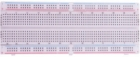 |                 |                        |
| ------------------------------------- | ------------------------------------- | ------------------------------------- | ---------------------- |
| ESP32*1                               | Breadboard*1                          | Active buzzer*1                       |                        |
|  |  |  |  |
| NPN transistor(S8050)*1               | 1kΩResistor*1                         | Jumper Wires                          | USB Cable*1            |

### **3. Component knowledge：**


**Active buzzer:** 

Active buzzer inside has a simple oscillator circuit, which can convert constant direct current into a certain frequency pulse signal. Once active buzzer receives a high level, it will produce sound. Passive buzzer is an internal without vibration source integrated electronic buzzer, it must be driven by 2k to 5k square wave, rather than a DC signal. 

The two buzzers are very similar in appearance, but one buzzer with a green circuit board is a passive buzzer, while the other buzzer with black tape is an active buzzer. Passive buzzers don't have positive polarity, but active buzzers have. As shown below:

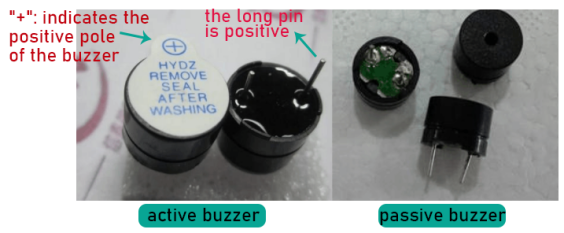

**Transistor:**

 

Because the buzzer requires such large current that GPIO of ESP32 output capability cannot meet the requirement, a transistor of NPN type is needed here to amplify the current.

Transistor, the full name: semiconductor transistor, is a semiconductor device that controls current. Transistorcan be used to amplify weak signal, or works as a switch. It has three electrodes(PINs): base (b), collector (c) and emitter (e). 

When there is current passing between "be", "ce" will allow several-fold current (transistor magnification) pass, at this point, transistor works in the amplifying area. When current between "be" exceeds a certain value, "ce" will not allow current to increase any longer, at this point, transistor works in the saturation area. Transistor has two types as shown below: PNP and NPN,


In our kit, the PNP transistor is marked with 8550, and the NPN transistor is marked with 8050.

Based on the transistor's characteristics, it is often used as a switch in digital circuits. As micro-controller's capacity to output current is very weak, we will use transistor to amplify current and drive large-current components.

When using NPN transistor to drive buzzer, we often adopt the following method. If GPIO outputs high level, current will flow through R1, the transistor will get conducted, and the buzzer will sound. If GPIO outputs low level, no current flows through R1, the transistor will not be conducted, and buzzer will not sound.

When using PNP transistor to drive buzzer, we often adopt the following method. If GPIO outputs low level, current will flow through R1, the transistor will get conducted, and the buzzer will sound. If GPIO outputs high level, no current flows through R1, the transistor will not be conducted, and buzzer will not sound.


### 4.**Wiring diagram：**


Note: The buzzer power supply in this circuit is 5V. On a 3.3V power supply, the buzzer can work, but will reduce the loudness.

### 5.**Project code：**

Codes used in this tutorial are saved in“**2. Python Projects**”. （If you haven't downloaded the code file, please click on the link to download it:[Download Python Codes](Python-Codes.zip)）


Open“Thonny”，click“This computer”→“D:”→“2. Python Projects”→“Project 12：Active Buzzer”, and then double left-click “Project\_12\_Active\_Buzzer.py”.


```python
from machine import Pin
import time

buzzer = Pin(15, Pin.OUT)   # create buzzer object from Pin 15, Set Pin 15 to output

try:
    while True:
        buzzer.value(1)    # Set buzzer turn on
        time.sleep(0.5) # Sleep 0.5s
        buzzer.value(0)    # Set buzzer turn off
        time.sleep(0.5) # Sleep 0.5s
except:
    pass
```

### 6.**Project result：**

Make sure the ESP32 has been connected to the computer, click “Stop/Restart backend” .


Click“Run current script”, the code starts to be executed and you'll see that the active buzzer beeps. Press “Ctrl+C” or click“Stop/Restart backend” to exit the program.


## Project 13：Passive Buzzer

### 1.Introduction:

In a previous project, we studied an active buzzer, which can only make a sound and may make you feel very monotonous. In this project, we will learn a passive buzzer and use the ESP32 control it to work. Unlike the active buzzer, the passive buzzer can emit sounds of different frequencies.

### 2.Components：

|  |  |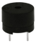| |
| ---------------------------------- | ---------------------- | ---------------------------------------------- | ---------------------- |
| ESP32\*1                           | Breadboard\*1          | Passive Buzzer \*1                             |                        |
|  ||||
| NPN transistor(S8050)\*1           | 1kΩResistor\*1         | Jumper Wires                                   | USB Cable\*1           |

### 3.Component knowledge：


**Passive buzzer:** 

A passive buzzer is an integrated electronic buzzer with no internal vibration source and it has to be driven by 2K-5K square waves, not DC signals. 

The two buzzers are very similar in appearance, but one buzzer with a green circuit board is a passive buzzer and the other buzzer with black tape is an active buzzer. Passive buzzers cannot distinguish between positive polarity while active buzzers can.


**Transistor:** Please refer to Project 12.

### 4.Wiring diagram:


### 5.Project code：

Codes used in this tutorial are saved in“**2. Python Projects**”. （If you haven't downloaded the code file, please click on the link to download it:[Download Python Codes](Python-Codes.zip)）


Open “Thonny”, click “This computer”→“D:”→“2. Python Projects”→“Project 13：Passive Buzzer”, and then double left-click “Project\_13\_Passive\_Buzzer.py”.


```python
from machine import Pin
import time

#Initialize the passive buzzer
buzzer = Pin(15,Pin.OUT)

#Simulate two different frequencies
while True:
    #Output 500HZ frequency sound
    for i in range(80):
        buzzer.value(1)
        time.sleep(0.001)
        buzzer.value(0)
        time.sleep(0.001)
    #Output 250HZ frequency sound
    for i in range(100):
        buzzer.value(1)
        time.sleep(0.002)
        buzzer.value(0)
        time.sleep(0.002)
```

### 6.Project result：

Make sure the ESP32 has been connected to the computer, click“Stop/Restart backend”.


Click“Run current script”, the code starts to be executed and you'll see that the passive buzzer sounds alarm. Press “Ctrl+C” or click“Stop/Restart backend”to exit the program.


## Project 14: Mini Table Lamp

### 1.Introduction：

Do you know that the ESP32 can light up an LED when you press a button? In this project, we will use ESP32, a button switch and an LED to make a mini table lamp.


### 2.Components：

| 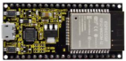 |  |  |  |                           |
| ------------------------- | ------------------------- | ------------------------- | ------------------------- | ------------------------- |
| ESP32*1                   | Breadboard*1              | Button*1                  | 10KΩ Resistor*1           |                           |
|  |  |  |  |  |
| Red LED*1                 | 220Ω Resistor*1           | USB Cable*1               | Jumper Wires              | Button Cap*1              |

### **3. Component knowledge：**


**Button:** 

A button can control the circuit on and off, the button is plugged into a circuit, the circuit is disconnected when the button is not pressed. The circuit works when you press the button, but breaks again when you release it. 

Why does it only work when you press it? It starts from the internal structure of the button, which don’t allow current to travel from one end of the button to the other before it is pressed; When pressed, a metal strip inside the button connects the two sides to allow electricity to pass through.

The internal structure of the button is shown in the figure：. 

Before the button is pressed, 1 and 2 are on, 3 and 4 are also on, but 1, 3 or 1, 4 or 2, 3 or 2, 4 are off (not working). Only when the button is pressed, 1, 3 or 1, 4 or 2, 3 or 2, 4 are on.

The button switch is one of the most commonly used components in circuit design.

**Schematic diagram of the button:** 

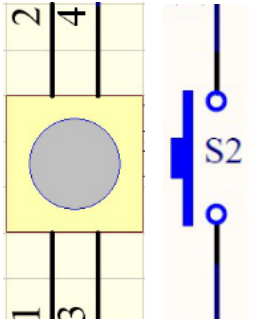

**What is button shake?**

We think of the switch circuit as "press the button and turn it on immediately", "press it again and turn it off immediately". In fact,
this is not the case.

The button usually uses a mechanical elastic switch, and the mechanical elastic switch will produce a series of shake due to the elastic action at the moment when the mechanical contact is opened and closed (usually about 10ms). As a result, the button switch will not immediately and stably turn on the circuit when it is closed, and it will not be completely and instantaneously disconnected when it is turned off.


**How to eliminate the shake?**

There are two common methods, namely fix shake in the software and hardware. We only discuss the shake removal in the software.

We already know that the shake time generated by elasticity is about 10ms, and the delay command can be used to delay the
execution time of the command to achieve the effect of shake removal.

Therefore, we delay 0.02s in the code to achieve the key anti-shake function.


### 4.Wiring Diagram：


**Note:**

Connect the LED

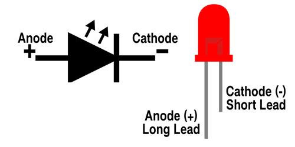

220Ω 5-band resistor


10KΩ 5-band resistor


### 5.Project code：

Codes used in this tutorial are saved in“**2. Python Projects**”. （If you haven't downloaded the code file, please click on the link to download it:[Download Python Codes](Python-Codes.zip)）


Open“Thonny”，click“This computer”→“D:”→“2. Python Projects”→“Project 14：Mini Table Lamp”, and then double left-click “Project\_14\_Mini\_Table\_Lamp.py”.


```python
from machine import Pin
import time

led = Pin(4, Pin.OUT) # create LED object from Pin 4,Set Pin 4 to output                   
button = Pin(15, Pin.IN, Pin.PULL_UP) #Create button object from Pin15,Set GP15 to input

#Customize a function and name it reverseGPIO(),which reverses the output level of the LED
def reverseGPIO():
    if led.value():
        led.value(0)     #Set led turn off
    else:
        led.value(1)     #Set led turn on

try:
    while True:
        if not button.value():
            time.sleep_ms(20)
            if not button.value():
                reverseGPIO()
                while not button.value():
                    time.sleep_ms(20)
except:
    pass
```

### 6.Project result：

Make sure the ESP32 has been connected to the computer, click“Stop/Restart backend” .


Click“Run current script”, the code starts to be executed and you'll see that press the push button switch, the LED turns on; When it is released, the LED is still on. 

Press it again, and the LED turns off. When it is released, the LED stays off. Doesn't it look like a mini table lamp? Press “Ctrl+C” or click“Stop/Restart backend” to exit the program.


## Project 15：Tilt and LED

### 1.Introduction：

The ancients without electronic clock, so the hourglass are invented to measure time. The hourglass has a large capacity on both sides, and which is filled with fine sand on one side. What’s more, there is a small channel in the middle, which can make the hourglass stand upright , the side with fine sand is on the top. 

Due to the effect of gravity,the fine sand will flow down through the channel to the other side of the hourglass. When the sand reaches the bottom, turn it upside down and record the number of times it has gone through the hourglass, therefore, the next day we can know the approximate time of the day by it. In this project, we will use ESP32 to control the tilt switch and LED lights to simulate an hourglass and make an electronic hourglass.

### 2.Components：

|  |  |  |  |
| ------------------------- | ------------------------- | ------------------------- | ------------------------- |
| ESP32*1                   | Tilt Switch*1             | Red LED*4                 | 10KΩ Resistor*1           |
|  |  |  |  |
| Breadboard*1              | 220Ω Resistor*4           | USB Cable*1               | Jumper Wires              |

### 3.Component knowledge：

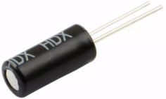

Tilt switch is also called digital switch. Inside is a metal ball that can roll. The principle of rolling the metal ball to contact with the
conductive plate at the bottom, which is used to control the on and off of the circuit. When it is a rolling ball tilt sensing switch with single directional trigger, the tilt sensor is tilted toward the trigger end (two gold-plated pin ends), the tilt switch is in a closed circuit and the voltage at the analog port is about 5V(binary number is 1023),

In this way, the LED will light up. When the tilting switch is in horizontal position or tilting to the other end, the tilting switch is
in open state the voltage of the analog port is about 0V (binary number is 0), the LED will turn off. In the program, we judge the state of the switch based on whether the voltage value of the analog port is greater than 2.5V (binary number is 512).

The internal structure of the tilt switch is used here to illustrate how it works, as shown below:


### **4. Wiring Diagram：**


**Note:**

How to connect the LED


How to identify the 220Ω 5-band resistor and 10KΩ 5-band resistor


### 5.Project code：

Codes used in this tutorial are saved in“**2. Python Projects**”. （If you haven't downloaded the code file, please click on the link to download it:[Download Python Codes](Python-Codes.zip)）


Open“Thonny”，click“This computer”→“D:”→“2. Python Projects”→“Project 15：Tilt And LED”, and then double left-click “Project\_15\_Tilt\_And\_LED.py”.


```python
from machine import Pin
import time

led1 = Pin(16, Pin.OUT) # create LED object from Pin 2,Set Pin 2 to output
led2 = Pin(17, Pin.OUT) # create LED object from Pin 0,Set Pin 0 to output
led3 = Pin(18, Pin.OUT) # create LED object from Pin 4,Set Pin 4 to output
led4 = Pin(19, Pin.OUT) # create LED object from Pin 16,Set Pin 16 to output
Tilt_Sensor = Pin(15,Pin.IN) #Create tilt object from Pin15,Set GP15 to input

while True:
    if(Tilt_Sensor.value() == 0) : #when the value of tilt sensor is 0
        led1.value(1) # led1 turn on
        time.sleep_ms(200)#delay
        led2.value(1) # led2 turn on
        time.sleep_ms(200)#delay
        led3.value(1) # led3 turn on
        time.sleep_ms(200)#delay
        led4.value(1) # led4 turn on
        time.sleep_ms(200)#delay 
    else :           #when the value of tilt sensor is 1
        led4.value(0) # led4 turn off
        time.sleep_ms(200)#delay
        led3.value(0) # led3 turn off
        time.sleep_ms(200)#delay
        led2.value(0) # led2 turn off
        time.sleep_ms(200)#delay
        led1.value(0) # led1 turn off
        time.sleep_ms(200)#delay
```

### 6.Project result：

Make sure the ESP32 has been connected to the computer, click“Stop/Restart backend” .


Click“Run current script”, the code starts to be executed and you'll see that when you tilt the breadboard to an angle, the LEDs will light up one by one. 

When you turn the breadboard to the original angle, the LEDs will turn off one by one. Like the hourglass, the sand will leak out over time. 

Press“Ctrl+C”or click“Stop/Restart backend” to exit the program.


## Project 16：Burglar Alarm

### 1.Introduction：

The human body infrared sensor measures the thermal infrared (IR) light emitted by moving objects. The sensor can detect the movement of people、animals and carsto trigger safety alarms and lighting. They are used to detect movement and ideal for security such as burglar alarms and security lighting systems. In this project, we will use the ESP32 control human body infrared sensor、buzzer and LED to simulate burglar alarm.

### 2.Components：

|  | 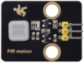    | 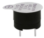 |   |                            |
| ------------------------- | ---------------------------- | ------------------------- | -------------------------- | -------------------------- |
| ESP32*1                   | Human Body Infrared Sensor*1 | Active Buzzer*1           | Red LED*1                  |                            |
|  |     |  |  |  |
| Breadboard*1              | M-F Dupont Wires             | 220ΩResistor*1            | USB Cable*1                | Jumper Wires               |

### 3.Component knowledge：


**Human Body Infrared Sensor :** 

Its principle is that when some crystals, such as lithium tantalate and triglyceride sulfate are heated, the two ends of the crystal will generate an equal number of charges with opposite signs. These charges can be converted into voltage output by an amplifier. Due to the human body will release infrared light, although relatively weak, can still be detected. When the Human Body Infrared Sensor detects the movement of a nearby person, the sensor signal terminal outputs a high level 1, otherwise, it outputs low level 0. 

Special attention should be paid to the fact that this sensor can detect people、animals and cars in motion, which cannot be detected in static, and the maximum detection distance is about 7 meters.

**Note:** Since vulnerable to radio frequency radiation and temperature changes, the PIR motion sensor should be kept away from heat sources like radiators, heaters and air conditioners, as well as direct irradiation of sunlight, headlights and incandescent light.

**Features:**

- Maximum input voltage: DC 3.3 \~ 5V.

- Maximum operating current: 50MA.

- Maximum power: 0.3W.

- Operating temperature: -20 \~ 85℃.

- Output high level is 3V, low level is 0V.

- Delay time: about 2.3 to 3 seconds.

- Detection Angle: about 100 degrees.

- Maximum detection distance: about 7 meters.

- Indicator light output (when the output is high, it will light up).

- Pin limiting current: 50MA.


**Schematic diagram:**


### 4. Wiring Diagram：


### 5.Project code：

Codes used in this tutorial are saved in“**2. Python Projects**”. （If you haven't downloaded the code file, please click on the link to download it:[Download Python Codes](Python-Codes.zip)）


Open“Thonny”，click“This computer”→“D:”→“2. Python Projects”→“Project 16：Burglar Alarm”, and then double left-click “Project\_16\_Burglar\_Alarm.py”.


```python
## Import Pin and time modules.
from machine import Pin
import time

## Define the pins of the Human infrared sensor,led and Active buzzer. 
sensor_pir = Pin(15, Pin.IN)
led = Pin(0, Pin.OUT)
buzzer = Pin(2, Pin.OUT)

while True: 
      if sensor_pir.value():
          buzzer.value(1)
          led.value(1)
          time.sleep(0.2)
          buzzer.value(0)
          led.value(0)
          time.sleep(0.2)         
      else:
          buzzer.value(0)
          led.value(0)
```

### 6.Project result：

Make sure the ESP32 has been connected to the computer, click“Stop/Restart backend” .


Click“Run current script”, the code starts to be executed and you'll see that if the human body infrared sensor detects someone moving nearby, the buzzer will continuously issue an alarm and the LED will continuously flash. 

Press“Ctrl+C”or click“Stop/Restart backend” to exit the program.


## Project 17： I2C 128×32 LCD

### 1.Introduction：

In everyday life, we can do all kinds of experiments with the display module and also DIY a variety of small objects. For example, you can make a temperature meter with a temperature sensor and display, or make a distance meter with an ultrasonic module and display. In this project, we will use the LCD\_128X32\_DOT module as the display and connect it to the ESP32, which will be used to control the LCD\_128X32\_DOT display to display various English words, common symbols and numbers.

### 2.Components：

|  |  |                            |
| -------------------------- | -------------------------- | -------------------------- |
| ESP32*1                    | Breadboard*1               |                            |
|  |  |  |
| LCD_128X32_DOT*1           | M-F Dupont Wires           | USB Cable*1                |

### 3.Component knowledge：


**LCD\_128X32\_DOT:** 

It is an LCD module with 128\*32 pixels and its driver chip is ST7567A. The module uses the IIC communication mode, while the code contains a library of all alphabets and common symbols that can be called directly. When using, we can also set it in the code so that the English letters and symbols show different text sizes. 

To make it easy to set up the pattern display, we also provide a mold capture software that converts a specific pattern into control code and then copies it directly into the test code for use.

**Schematic diagram of LCD\_128X32\_DOT：**


**Features:**

- Pixel: 128\*32 character

- Operating voltage(chip)：4.5V to 5.5V

- Operating current：100mA (5.0V)

- Optimal operating voltage(module):5.0V


### 4.Wiring Diagram：


### 5.Project code：

Codes used in this tutorial are saved in“**2. Python Projects**”. （If you haven't downloaded the code file, please click on the link to download it:[Download Python Codes](Python-Codes.zip)）


Open“Thonny”，click“This computer”→“D:”→“2. Python Projects”→“Project 17：I2C 128×32 LCD”. Select“lcd128\_32.py”and “lcd128\_32\_fonts.py”，click your mouse to select“Upload to”，wait for“lcd128\_32.py”and“lcd128\_32\_fonts.py”to be uploaded to ESP32，and then click“Project\_17\_I2C\_128\_32\_LCD.py”.


```python
import machine
import time
import lcd128_32_fonts
from lcd128_32 import lcd128_32

#i2c config
clock_pin = 22
data_pin = 21
bus = 0
i2c_addr = 0x3f
use_i2c = True

def scan_for_devices():
    i2c = machine.I2C(bus,sda=machine.Pin(data_pin),scl=machine.Pin(clock_pin))
    devices = i2c.scan()
    if devices:
        for d in devices:
            print(hex(d))
    else:
        print('no i2c devices')
           
    if use_i2c:
        scan_for_devices()
        lcd = lcd128_32(data_pin, clock_pin, bus, i2c_addr)

    lcd.Clear()
    lcd.Cursor(0, 4)
lcd.Display("KEYESTUDIO")
lcd.Cursor(1, 0)
lcd.Display("ABCDEFGHIJKLMNOPQR")
lcd.Cursor(2, 0)
lcd.Display("123456789+-*/<>=$@")
lcd.Cursor(3, 0)
lcd.Display("%^&(){}:;'|?,.~\\[]")
"""
while True:
    scan_for_devices()
    time.sleep(0.5)
"""
```

### 6.Project result：

Make sure the ESP32 has been connected to the computer, click“Stop/Restart backend” .


Click“Run current script”, the code starts to be executed and you'll see that the 128X32 LCD module display will show “KEYESTUDIO” at the first line, “ABCDEFGHIJKLMNOPQR” will be displayed at the second line, “123456789+-\*/\<\>=$@” will be shown at the third line and “%^&(){}:;'|?,.\~\\\\\[\]” will be displayed at the fourth line. Press “Ctrl+C” or click“Stop/Restart backend” to exit the program.


## Project 18：Small Fan

### 1.Introduction：

In hot summer, we need electric fans to cool us down, so in this project, we will use ESP32 control 130 motor module and small fan blade to make a small electric fan.

### 2.Components：

|  | 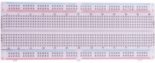                    |  |      |
| -------------------------- | --------------------------------------------- | -------------------------- | ------------------------------ |
| ESP32*1                    | Breadboard*1                                  | Battery Holder*1           | Fan*1                          |
|  |                     | 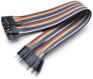 |      |
| 130 Motor Module*1         | Keyestudio bread board special power module*1 | M-F Dupont Wires           | No.5 battery (self-provided)*6 |
|  |                                               |                            |                                |
| USB Cable*1                |                                               |                            |                                |

### 3.Component knowledge :


**130 motor module:** The motor control module uses the HR1124S motor control chip. which is a single-channel H-bridge driver chip for DC motor. The H-bridge driver part of the HR1124S uses low on-resistance PMOS and NMOS power tubes. The low on-resistance ensure low power loss of the chip and make the chip work safely for longer time In addition, the HR1124S has low standby current and low static operating current, which makes the HR1124S easy to use in toy solutions.

**Features:**

- Working voltage: 5V

- Working current: 200MA

- Working power: 2W

- Working temperature: -10℃\~ +50℃


**Schematic diagram of 130 motor module：**

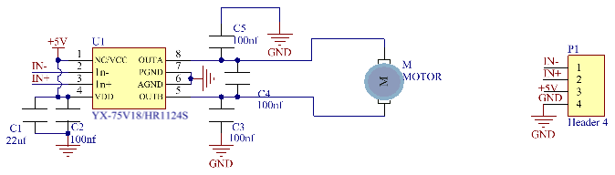

**Keyestudio Breadboard Power Supply Module：**


**Introduction:**

This breadboard power supply module is compatible with 5V and 3.3V, which can be applied to MB102 breadboard. The module contains two channels of independent control, powered by the USB all the way.

The output voltage is constant for the DC5V, and another way is powered by DC6.5-12V, output controlled by the slide switch, respectively for DC5V and DC3.3V.

If the other power supply is DC 6.5-12v, when the slide switch is switched to +5V, the output voltages of the left and right lines of the module are DC 5V. When the slide switch is switched to +3V, the output voltage of the USB power supply terminal of the module is DC5V , and the output voltage of the DC 6.5-12V power supply terminal of the other power supply is DC3.3V.

**Specification:**

- Applied to MB102 breadboard;

- Input voltage：DC 6.5-12V or powered by USB;

- Output voltage：3.3V or 5V

- Max output current：\<700ma

- Up and down two channels of independent control, one of which can be switched to 3.3V or 5V;

- Comes with two sets of DC output pins, easy for external use.

### **4. Wiring Diagram：**


(Note: Connect the wires and then install a small fan blade on the DC motor. )

### 5.Project code：

Codes used in this tutorial are saved in“**2. Python Projects**”. （If you haven't downloaded the code file, please click on the link to download it:[Download Python Codes](Python-Codes.zip)）


Open“Thonny”，click“This computer”→“D:”→“2. Python Projects”→“Project 18：Small Fan”, and then double left-click“Project\_18\_
Small\_Fan.py”.


```python
from machine import Pin
import time

motor1a = Pin(15, Pin.OUT) # create motor1a object from Pin 15, Set Pin 15 to output
motor1b = Pin(2, Pin.OUT) # create motor1b object from Pin 2, Set Pin 2 to output

def forward():
    motor1a.value(1) # Set motor1a high
    motor1b.value(0) # Set motor1b low
def backward():
    motor1a.value(0)
    motor1b.value(1)
def stop():
    motor1a.value(0)
    motor1b.value(0)

def test():
    forward() # motor forward
    time.sleep(5) #delay
    stop() # motor stop
    time.sleep(2)
    backward()# motor backward 
    time.sleep(5)
    stop()
    time.sleep(2)
    
for i in range(5):
    test() 
```

### 6.Project result：

Make sure the ESP32 has been connected to the computer, click“Stop/Restart backend” .


External power supply and power on. 

Click “Run current script”, the code starts to be executed and you'll see that the small fan turns counterclockwise for 5 seconds and stops for 2 seconds, and then turns clockwise for 5 seconds and stops for 2 seconds. 

Repeat this rule for 5 times and then the small fan stops. 

Press“Ctrl+C”or click“Stop/Restart backend”to exit the program.

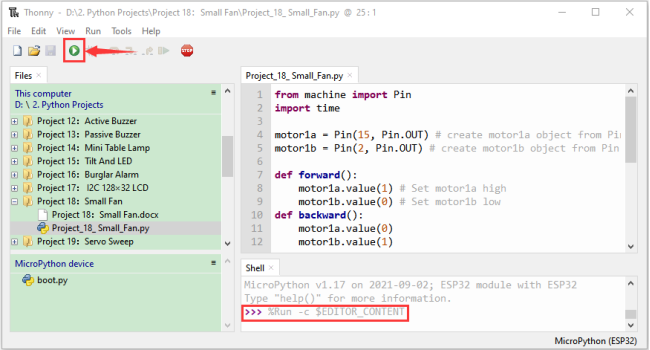

## Project 19：Servo Sweep

### 1.Introduction：

Servo is an electric motor that can rotate very precisely. At present, it has been widely used in toy cars，remote control
helicopters，airplanes，robots, etc. In this project, we will use ESP32 to control the rotation of the servo.

### 2.Components：

|  |  |  |
| -------------------------- | -------------------------- | -------------------------- |
| ESP32*1                    | Breadboard*1               | USB Cable*1                |
|  | 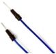 |                            |
| Servo*1                    | Jumper Wires               |                            |

### 3.Component knowledge：

**Servo：**


The servo is a kind of position servo driver, which is mainly composed of housing, circuit board, copless motor, gear and position detector. 

Its working principle is that the receiver or microcontroller sends a signal to the servo which has an internal reference circuit that generates a reference signal with a period of 20ms and a width of 1.5ms, and compares the DC bias voltage with the voltage of the potentiometer to output voltage difference.The IC on the circuit board determines the direction of rotation, and then drives the coreless motor to start rotation and transmits the power to the swing arm through the reduction gear, while the position detector sends back a signal to determine whether it has reached the positioning. 

It is suitable for those control systems that require constant change of angle and can be maintained.

When the motor rotates at a certain speed, the potentiometer is driven by the cascade reduction gear to rotate so that the voltage difference is 0 and the motor stops rotating. The angle range of general servo rotation is 0 to 180 degrees.

The pulse period for controlling the servo is 20ms, the pulse width is 0.5ms to 2.5ms, and the corresponding position is -90 degrees to +90 degrees. The following is an example of a 180 degree servo：


Servo motors have many specifications, but they all have three connecting wires, which are brown, red, and orange (different brands may have different colors). The brown is GND, the red is the positive power supply, and the orange is the signal line.


### 4.Wiring Diagram：

When supplying the servo, please note that the power supply voltage should be 3.3V-5V. Make sure there are no errors when connecting the servo to the power supply.


### 5.Project code：

Codes used in this tutorial are saved in“**2. Python Projects**”. （If you haven't downloaded the code file, please click on the link to download it:[Download Python Codes](Python-Codes.zip)）


Open“Thonny”，click“This computer”→“D:”→“2. Python Projects”→“Project 19：Servo Sweep”. Select“myservo\.py”，right-click your mouse to select“Upload to /”，wait for“myservo\.py”to be uploaded to ESP32，and then click“Project\_19\_Servo\_Sweep.py”.


```python
from myservo import myServo #Import myservo module.
import time

#Initialize pins of the servo and set the starting point of the servo to 0 degree.
servo=myServo(15)
servo.myServoWriteAngle(0)
time.sleep_ms(1000)

try:
    while True:
#Use two for loops. The first one controls the servo to rotate from 0 degree to 180 degrees
#while the other controls it to rotate back from 180 degrees to 0 degree.
        for i in range(0,180,1):
            servo.myServoWriteAngle(i) #Control the servo to rotate to a specified angle within the range of 0-180 degrees.
            time.sleep_ms(15)
        for i in range(180,0,-1):
            servo.myServoWriteAngle(i)
            time.sleep_ms(15)        
except:
    servo.deinit()
```

### 6.Project result：

Make sure the ESP32 has been connected to the computer, click“Stop/Restart backend” .


Click“Run current script”, the code starts to be executed and you'll see that the Servo will rotate from 0 degrees to 180 degrees and then reverse the direction to make it rotate from 180 degrees to 0 degrees and repeat these actions in an endless loop. 

Press“Ctrl+C”or click“Stop/Restart backend” to exit the program.


## Project 20：Stepping Motor 

### 1.Introduction：

Stepper motor is the most important part of industrial robot 3D printer lathes and other mechanical equipment with accurate positioning. In this project, we will use ESP32 control ULN2003 stepper motor drive board to drive the stepper motor to rotate.

### 2.Components：

| 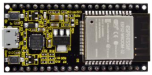 | 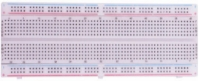                    |           |
| -------------------------- | --------------------------------------------- | ----------------------------------- |
| ESP32*1                    | Breadboard*1                                  | ULN2003 Stepper Motor Drive Board*1 |
|  |                     |           |
| Stepper Motor *1           | M-F Dupont Wires                              | USB Cable*1                         |
|  | 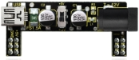                    | 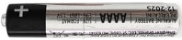          |
| Battery Holder*1           | Keyestudio bread board special power module*1 | No.5 battery (self-provided)*6      |

### 3.Component knowledge :


**Stepper motor:** 

It is a motor controlled by a series of electromagnetic coils. It can rotate by the exact number of degrees (or steps) needed, allowing you to move it to a precise position and keep it there. It does this by supplying power to the coil inside the motor in a very short time, but you must always supply power to the motor to keep it in the position you want. 

There are two basic types of stepping motors, namely unipolar stepping motor and bipolar stepping motor. In this project, we use a 28-BYJ48 unipolar stepper motor.


**Working Principle:**

The stepper motor is mainly composed of a stator and a rotor. The stator is fixed. As shown in the figure below, the part of the coil group A, B, C, and D will generate a magnetic field when the coil group is energized. The rotor is the rotating part. As follows, the middle part of the stator, two poles are permanent magnets.


Single -phase four beat: 

At the beginning, the coils of group A are turned on, and the poles of the rotor point at A coil. Next, the group A coil are disconnected, and the group B coils are turned on. The rotor will turn clockwise to the group B. Then, group B is disconnected, group C is turned on, and the rotor is turned to group C. After that, group C is disconnected, and group D is turned on, and the rotor is turned to group D. Finally, group D is disconnected, group A is turned on, and the rotor is turned to group A coils. Therefore, rotor turns 180° and continuously rotates B-C-D-A, which means it runs a circle (eight phase). 

As shown below, he rotation principle of stepper motor is A - B C - D - A.

You make order inverse(D - C - B - A - D .....) if you want to make stepper motor rotate anticlockwise.


Half-phase and eight beat: 

8 beat adopts single and dual beat way，A - AB B - BC - C - CD - D - DA - A ...... ，rotor will rotate half phase in this order. For example, when A coil is electrified，rotor faces to A coil , then A and B coil are connected, on this condition, the strongest magnetic field produced lies in the central part of AB coil, which means rotating half-phase clockwise.

**Stepper Motor Parameters:**

The rotor rotates one circle when the stepper motor we provide rotates 32 phases and with the output shaft driven by 1:64 reduction geared set. Therefore the rotation (a circle) of output shaft requires 32 \* 64 = 2048 phases.

The step angle of 4-beat mode of 5V and 4-phase stepper motor is 11.25. And the step angle of 8-beat mode is 5.625, the reduction ratio is 1:64.

**ULN2003Stepper Motor Drive Board:** It is a stepper motor driver, which converts the weak signal into a stronger control signal to drive the stepper motor. 

The following schematic diagram shows how to use the ULN2003 stepper motor driver board interface to connect a unipolar stepper motor to the pins of the ESP32, and shows how to use four TIP120 interfaces.


### 4.Wiring Diagram：


### 5.Project code：

Codes used in this tutorial are saved in“**2. Python Projects**”. （If you haven't downloaded the code file, please click on the link to download it:[Download Python Codes](Python-Codes.zip)）


Open“Thonny”，click“This computer”→“D:”→“2. Python Projects”→“Project 20：Stepping Motor”, and then double left-click “Project\_20\_Stepping\_Motor.py”.


```python
from machine import Pin
import time
 
## Pin initialization
in1 = Pin(15, Pin.OUT)
in2 = Pin(16, Pin.OUT)
in3 = Pin(17, Pin.OUT)
in4 = Pin(18, Pin.OUT)
 
## Delay time
delay = 1
 
## The number of steps required for the motor to rotate one revolution, (about 360°), with a slight deviation
ROUND_VALUE = 509
 
## The sequence value of the four-phase eight-beat stepper motor: A-AB-B-BC-C-CD-D-DA-A。
STEP_VALUE = [
    [1, 0, 0, 0],
    [1, 1, 0, 0],
    [0, 1, 0, 0],
    [0, 1, 1, 0],
    [0, 0, 1, 0],
    [0, 0, 1, 1],
    [0, 0, 0, 1],
    [1, 0, 0, 1],
]
 
## Pin output low level
def reset():
    in1(0)
    in2(0)
    in3(0)
    in4(0)
 
## If count is positive integers turn clockwise, if count is negative integers turn counterclockwise
def step_run(count):
    direction = 1     # turn clockwise
    if count < 0:
        direction = -1  # turn counterclockwise
        count = -count
    for x in range(count):
        for bit in STEP_VALUE[::direction]:
            in1(bit[0])
            in2(bit[1])
            in3(bit[2])
            in4(bit[3])
            time.sleep_ms(delay)
    reset()
 
## If a is positive integers turn clockwise, if a is negative integers turn counterclockwise
def step_angle(a):
    step_run(int(ROUND_VALUE * a / 360))
 
## Cycle: turn clockwise one circle, then counterclockwise one circle.
while True:
    step_run(509)
    step_run(-509)
    step_angle(360)
    step_angle(-360)
```

### 6.Project result：

Make sure the ESP32 has been connected to the computer, click“Stop/Restart backend” .


External power supply and power on. Click“Run current script”, the code starts to be executed and you'll see that the four LEDs ( D1,D2,D3 ,D4) on the ULN2003 drive module will light up. The stepper motor rotates clockwise first, then counterclockwise, and repeat these actions in an endless loop. Press“Ctrl+C”or click“Stop/Restart backend”to exit the program.


## Project 21：Relay

### 1.**Introduction**：

In our daily life, we usually use communication to drive electrical equipments, and sometimes we use switches to control electrical equipments. If the switch is connected directly to the ac circuit, leakage occurs and people are in danger. 

Therefore, from the perspective of safety, we specially designed this relay module with NO(normally open) end and NC(normally closed) end. 

In this project, we will learn a relatively special and easy-to-use switch, which is the relay module.

### 2.Components：

| 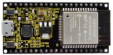 | 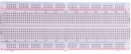 | 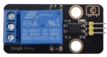 |  |  |
| -------------------------- | -------------------------- | -------------------------- | -------------------------- | -------------------------- |
| ESP32*1                    | Breadboard*1               | Relay Module*1             | M-F Dupont Wires           | USB Cable*1                |

### 3.Component knowledge：

**Relay:** 

It is an "automatic switch" that uses a small current to control the operation of a large current.

- Input voltage：3.3V-5V

- Rated load：5A 250VAC (NO/NC) 5A 24VDC (NO/NC)


The rated load means that devices with dc voltage of 24V or AC voltage of 250V can be controlled using 3.3V-5V microcontrollers.

**Schematic diagram of Relay：**


### 4. Wiring Diagram：


### 5.Project code：

Codes used in this tutorial are saved in“**2. Python Projects**”. （If you haven't downloaded the code file, please click on the link to download it:[Download Python Codes](Python-Codes.zip)）


Open “Thonny”, click “This computer” → “D:” → “2. Python Projects” → “Project 21：Relay”, and then click “Project\_21\_Relay.py”.


```python
from machine import Pin
import time

## create relay from Pin 15, Set Pin 15 to output 
relay = Pin(15, Pin.OUT)
 
## The relay is opened, COM and NO are connected on the relay, and COM and NC are disconnected.
def relay_on():
    relay(1)
 
## The relay is closed, the COM and NO on the relay are disconnected, and the COM and NC are connected.
def relay_off():
    relay(0)
 
## Loop, the relay is on for one second and off for one second
while True:
    relay_on()
    time.sleep(1)
    relay_off()
    time.sleep(1)
```

### 6.Project result：

Make sure the ESP32 has been connected to the computer, click“Stop/Restart backend” .


Click“Run current script”, the code starts to be executed and you'll see that the relay will cycle on and off, on for 1 second, off for 1 second.  

At the same time, you can hear the sound of the relay on and off, and you can also see the change of the indicator light on the relay. Press“Ctrl+C”or click“Stop/Restart backend”to exit the program.


## Project 22：Dimming Light

### 1.Introduction：

A potentiometer is a three-terminal resistor with sliding or rotating contacts that forms an adjustable voltage divider. It works by changing the position of the sliding contacts across a uniform resistance. In the potentiometer, the entire input voltage is applied across the whole length of the resistor, and the output voltage is the voltage drop between the fixed and sliding contact.

In this project, we will learn how to use ESP32 to read the values of the potentiometer, and make a dimming lamp with LED.

### 2.Components：

|  |  | 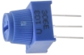 |  |
| -------------------------- | -------------------------- | -------------------------- | -------------------------- |
| ESP32*1                    | Breadboard*1               | Potentiometer*1            | Red LED*1                  |
|  |  |  |                            |
| 220ΩResistor*1             | Jumper Wires               | USB Cable*1                |                            |

### 3.Component knowledge：


**Adjustable potentiometer:** 

It is a kind of resistor and an analog electronic component, which has two states of 0 and 1(high level and low level). The analog quantity is different, its data state presents a linear state such as 1 \~ 1024.

**ADC :** 

An ADC is an electronic integrated circuit used to convert analog signals such as voltages to digital or binary form consisting of 1s and 0s. The range of our ADC on ESP32 is 12 bits, that means the resolution is 2^12=4096, and it represents a range (at 3.3V) will be divided equally to 4096 parts. The rage of analog values corresponds to ADC values. So the more bits the ADC has, the denser the partition of analog will be and the greater the precision of the resulting conversion.


Subsection 1: the analog in rang of 0V---3.3/4095 V corresponds to digital 0;

Subsection 2: the analog in rang of 3.3/4095 V---2\*3.3 /4095V corresponds to digital 1;

…

The following analog will be divided accordingly.

The conversion formula is as follows:
$$
ADC = AnalogVoltage / 3.3 * 4095
$$
**DAC：**

The reversing of this process requires a DAC, Digital-to-Analog Converter. The digital I/O port can output high level and low level (0 or 1), but cannot output an intermediate voltage value. This is where a DAC is useful. ESP32 has two DAC output pins with 8-bit accuracy, GPIO25 and GPIO26, which can divide VCC (here is 3.3V) into 2^8=256 parts. For example, when the digital quantity is 1, the output voltage value is 3.3/256 \*1 V, and when the digital quantity is 128, the output voltage value is 3.3/256\*128=1.65V, the higher the accuracy of DAC, the higher the accuracy of output voltage value will be.

The conversion formula is as follows:
$$
AnalogVoltage = DAC / 255 * 3.3(V)
$$
**ADC on ESP32：**

ESP32 has 16 pins can be used to measure analog signals. GPIO pin sequence number and analog pin definition are shown in the following table：

| ADC number in ESP32 | ESP32 GPIO number |
| :-----------------: | :---------------: |
|        ADC0         |      GPIO 36      |
|        ADC3         |      GPIO 39      |
|        ADC4         |      GPIO 32      |
|        ADC5         |      GPIO33       |
|        ADC6         |      GPIO34       |
|        ADC7         |      GPIO 35      |
|        ADC10        |      GPIO 4       |
|        ADC11        |       GPIO0       |
|        ADC12        |       GPIO2       |
|        ADC13        |      GPIO15       |
|        ADC14        |      GPIO13       |
|        ADC15        |      GPIO 12      |
|        ADC16        |      GPIO 14      |
|        ADC17        |      GPIO27       |
|        ADC18        |      GPIO25       |
|        ADC19        |      GPIO26       |

**DAC on ESP32：**

ESP32 has two 8-bit digital analog converters to be connected to GPIO25 and GPIO26 pins, respectively, and it is immutable. As shown in the following table：

| Simulate pin number | GPIO number |
| :-----------------: | :---------: |
|        DAC1         |   GPIO25    |
|        DAC2         |   GPIO26    |

### 4.**Read the ADC value, DAC value and voltage value of the potentiometer：**

We connect the potentiometer to the analog IO port of ESP32 to read the ADC value, DAC value and voltage value of the potentiometer, please refer to the wiring diagram below：


Codes used in this tutorial are saved in“**2. Python Projects**”. （If you haven't downloaded the code file, please click on the link to download it:[Download Python Codes](Python-Codes.zip)）


Open“Thonny”，click“This computer”→“D:”→“2. Python Projects”→“Project 22：Dimming Light”，and then double left-click
“Project\_22.1\_Read\_Potentiometer\_Analog\_Value.py”.


```python
## Import Pin, ADC and DAC modules.
from machine import ADC,Pin,DAC
import time

## Turn on and configure the ADC with the range of 0-3.3V 
adc=ADC(Pin(36))
adc.atten(ADC.ATTN_11DB)
adc.width(ADC.WIDTH_12BIT)

## Read ADC value once every 0.1seconds, convert ADC value to DAC value and output it,
## and print these data to “Shell”. 
try:
    while True:
        adcVal=adc.read()
        dacVal=adcVal//16
        voltage = adcVal / 4095.0 * 3.3
        print("ADC Val:",adcVal,"DACVal:",dacVal,"Voltage:",voltage,"V")
        time.sleep(0.1)
except:
    pass
```

Make sure the ESP32 has been connected to the computer, click“Stop/Restart backend” .


Click“Run current script”, the code starts to be executed and you'll see that the "Shell" window of Thonny IDE will print the ADC value, DAC value and voltage value of the potentiometer, turn the potentiometer handle, the ADC value and voltage value will change. Press “Ctrl+C” or click“Stop/Restart backend” to exit the program.


### 5.Wiring diagram of the dimming lamp：

In the previous step, we read the ADC value, DAC value and voltage value of the potentiometer. Now we need to convert the ADC value of the potentiometer into the brightness of the LED to make a lamp that can adjust the brightness.The wiring diagram is as follows:


### 6.Project code：

Codes used in this tutorial are saved in“**2. Python Projects**”. （If you haven't downloaded the code file, please click on the link to download it:[Download Python Codes](Python-Codes.zip)）


Open“Thonny”，click“This computer”→“D:”→“2. Python Projects”→“Project 22：Dimming Light”，and then click“Project\_22.2\_Dimming\_Light.py”.


```python
from machine import Pin,PWM,ADC
import time

pwm =PWM(Pin(15,Pin.OUT),1000)
adc=ADC(Pin(36))
adc.atten(ADC.ATTN_11DB)
adc.width(ADC.WIDTH_10BIT)

try:
    while True:
        adcValue=adc.read()
        pwm.duty(adcValue)
        print(adc.read())
        time.sleep_ms(100)
except:
    pwm.deinit()
```

### 7.Project result：

Make sure the ESP32 has been connected to the computer, click“Stop/Restart backend”.


Click“Run current script”, the code starts to be executed and you'll see that turn the potentiometer handle and the brightness of the LED will change accordingly. Press “Ctrl+C” or click“Stop/Restart backend” to exit the program.


## Project 23：Flame Alarm

### 1.Introduction：

Fire is a terrible disaster and fire alarm systems are very useful in houses、commercial buildings and factories. In this project, we will use ESP32 to control a flame sensor, a buzzer and a LED to simulate fire alarm devices. This is a meaningful maker activity.

### 2.Components：

| 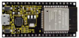 |  |  |  |
| -------------------------- | -------------------------- | -------------------------- | -------------------------- |
| ESP32*1                    | Breadboard*1               | Red LED*1                  | Active Buzzer*1            |
|  |  |  |  |
| Flame Sensor*1             | 220ΩResistor*1             | 10KΩResistor*1             | Jumper Wires               |
|  |  |  |                            |
| NPN transistor(S8050)*1    | 1kΩ Resistor*1             | USB Cable*1                |                            |

### 3.Component knowledge：


The flame emits a certain amount IR light that is invisible to the human eye, but our flame sensor can detect it and alert a microcontroller (such as ESP32) that a fire has been detected. It has a specially designed infrared receiver tube to detect the flame and then convert the flame brightness into a fluctuating level signal. The short pin of the receiving triode is negative pole and the other long pin is positive pole. We should connect the short pin (negative) to 5V and the long pin (positive) to the analog pin, a resistor and GND. As shown in the figure below：


**Note:** 

Since vulnerable to radio frequency radiation and temperature changes, the flame sensor should be kept away from heat sources like radiators, heaters and air conditioners, as well as direct irradiation of sunlight, headlights and incandescent light.

### 4.Read the ADC value, DAC value and voltage value of the flame sensor：

We first use a simple code to read the ADC value, DAC value and voltage value of the flame sensor and print them out. Please refer to the wiring diagram below：


Codes used in this tutorial are saved in“**2. Python Projects**”. （If you haven't downloaded the code file, please click on the link to download it:[Download Python Codes](Python-Codes.zip)）


Open“Thonny”, click “This computer”→“D:”→“2. Python Projects”→“Project 23：Flame Alarm”，and then double left-click
“Project\_23.1\_Read\_Analog\_Value\_Of\_Flame\_Sensor.py”.

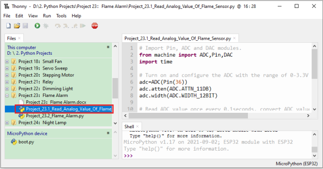

```python
## Import Pin, ADC and DAC modules.
from machine import ADC,Pin,DAC
import time

## Turn on and configure the ADC with the range of 0-3.3V 
adc=ADC(Pin(36))
adc.atten(ADC.ATTN_11DB)
adc.width(ADC.WIDTH_12BIT)

## Read ADC value once every 0.1seconds, convert ADC value to DAC value and output it,
## and print these data to “Shell”. 
try:
    while True:
        adcVal=adc.read()
        dacVal=adcVal//16
        voltage = adcVal / 4095.0 * 3.3
        print("ADC Val:",adcVal,"DACVal:",dacVal,"Voltage:",voltage,"V")
        time.sleep(0.1)
except:
    pass
```

Make sure the ESP32 has been connected to the computer, click “Stop/Restart backend” .


Click“Run current script”, the code starts to be executed and you'll see that the "Shell" window of Thonny IDE will print the ADC value、DAC value and voltage value of the flame sensor. 

When the flame is close to the flame sensor, the ADC value, DAC value and voltage value increase; Conversely, the ADC value, DAC value and voltage value decrease. Press “Ctrl+C” or click“Stop/Restart backend” to exit the program.


### 5.Wiring diagram of the flame alarm：

Next, we will use a flame sensor, a buzzer, and a LED to make an interesting project, that is flame alarm. When flame is detected, the LED flashes and the buzzer alarms.


### 6.Project code：

（Note:  the threshold of 500 in the code can be reset itself as required)

Codes used in this tutorial are saved in“**2. Python Projects**”. （If you haven't downloaded the code file, please click on the link to download it:[Download Python Codes](Python-Codes.zip)）


Open“Thonny”，click“This computer”→“D:”→“2. Python Projects”→“Project 23：Flame Alarm”, and then double left-click
“Project\_23.2\_Flame\_Alarm.py”.


```python
from machine import ADC, Pin
import time

## Turn on and configure the ADC with the range of 0-3.3V 
adc=ADC(Pin(36))
adc.atten(ADC.ATTN_11DB)
adc.width(ADC.WIDTH_12BIT)
## create LED object from Pin 15,Set Pin 15 to output
led = Pin(15, Pin.OUT) 
## create buzzer object from Pin 4, Set Pin 4 to output
buzzer = Pin(4, Pin.OUT)   
 
## If the flame sensor detects a flame, the buzzer will beep
## and the LED will blink when the analog value is greater than 500
## Otherwise, the buzzer does not sound and the LED goes off 
while True:
    adcVal=adc.read()
    if adcVal >500:
        buzzer.value(1)    # Set buzzer turn on
        led.value(1)    # Set led turn on
        time.sleep(0.5) # Sleep 0.5s
        buzzer.value(0) 
        led.value(0)    # Set led turn off
        time.sleep(0.5) # Sleep 0.5s
    else:
        buzzer.value(0)    # Set buzzer turn off
        led.value(0)    # Set led turn off
```

### 7.**Project result：**

Make sure the ESP32 has been connected to the computer, click“Stop/Restart backend”.


Click“Run current script”, the code starts to be executed and you'll see that when the flame sensor detects the flame, the LED flashes and the buzzer alarms. 

Otherwise, the LED does not light, the buzzer does not sound.Press“Ctrl+C”or click“Stop/Restart backend” to exit the program.


## Project 24：Night Lamp

### 1.Introduction：

Sensors or components are ubiquitous in our daily life. For example, some public street lamps will automatically turn on at night and turn off during the day. 

Why? In fact, this make use of a photosensitive element that senses the intensity of external ambient light. 

When the outdoor brightness decreases at night, the street lights will turn on automatically; In the daytime, the street lights will automatically turn off. the principle of which is very simple, In this Project, we use ESP32 to control a LED to achieve the effect of the street light.

### 2.Components：

|  |  |  |  |
| -------------------------- | -------------------------- | -------------------------- | -------------------------- |
| ESP32*1                    | Breadboard*1               | Red LED*1                  | 10KΩResistor*1             |
|  |  |  |  |
| Photoresistor*1            | 220ΩResistor*1             | Jumper Wires               | USB Cable*1                |

### 3.Component knowledge：


**Photoresistor :** 

It is a kind of photosensitive resistance, its principle is that the photoresistor surface receives brightness (light) to reduce the resistance, the resistance value will change with the detected intensity of the ambient light . With this characteristic, we can use the photosensitive resistance to detect the light intensity. 

Photosensitive resistance and its electronic symbol are as follows：


The following circuit is used to detect changes in resistance values of photoresistors：


In the circuit above, when the resistance of the photoresistor changes due to the change of light intensity, the voltage between the photoresistor and resistance R2 will also change.  Thus, the intensity of light can be obtained by measuring this voltage.

### 4.Read the ADC value, DAC value and voltage value of the photoresistor：

We first use a simple code to read the ADC value, DAC value and voltage value of the photoresistor and print them out. Please refer to the following wiring diagram：


Codes used in this tutorial are saved in“**2. Python Projects**”. （If you haven't downloaded the code file, please click on the link to download it:[Download Python Codes](Python-Codes.zip)）


Open“Thonny”，click“This computer”→“D:”→“2. Python Projects”→“Project 24：Night Lamp”，and then double left-click
“Project\_24.1\_Read\_Photosensitive\_Analog\_Value.py”.


```python
## Import Pin, ADC and DAC modules.
from machine import ADC,Pin,DAC
import time

## Turn on and configure the ADC with the range of 0-3.3V 
adc=ADC(Pin(36))
adc.atten(ADC.ATTN_11DB)
adc.width(ADC.WIDTH_12BIT)

## Read ADC value once every 0.1seconds, convert ADC value to DAC value and output it,
## and print these data to “Shell”. 
try:
    while True:
        adcVal=adc.read()
        dacVal=adcVal//16
        voltage = adcVal / 4095.0 * 3.3
        print("ADC Val:",adcVal,"DACVal:",dacVal,"Voltage:",voltage,"V")
        time.sleep(0.1)
except:
    pass
```

Make sure the ESP32 has been connected to the computer, click“Stop/Restart backend” .


Click “Run current script”, the code starts to be executed and you'll see that the "Shell" window of Thonny IDE will print the ADC value、DAC value and voltage value of the photoresistor. 

When the light intensity around the photoresistor is gradually reduced, the ADC value、DAC value and voltage value will gradually increase. On the contrary, the ADC value, DAC value and voltage value decreases gradually. 

Press“Ctrl+C”or click“Stop/Restart backend” to exit the program.


### 5.Wiring diagram of the light-controlled lamp：

We made a small dimming lamp in the front, now we will make a light controlled lamp. The principle is the same, that is, the ESP32 takes the ADC value of the sensor, and then adjusts the brightness of the LED.


### 6.Project code：

Codes used in this tutorial are saved in“**2. Python Projects**”. （If you haven't downloaded the code file, please click on the link to download it:[Download Python Codes](Python-Codes.zip)）


Open“Thonny”，click“This computer”→“D:”→“2. Python Projects”→“Project 24：Night Lamp”，and then double left-click
“Project\_24.2\_Night\_Lamp.py”.


```python
from machine import Pin,PWM,ADC
import time

pwm =PWM(Pin(15,Pin.OUT),1000)
adc=ADC(Pin(36))
adc.atten(ADC.ATTN_11DB)
adc.width(ADC.WIDTH_10BIT)

try:
    while True:
        adcValue=adc.read()
        pwm.duty(adcValue)
        print(adc.read())
        time.sleep_ms(100)
except:
    pwm.deinit()
```

### 7.Project result：

Make sure the ESP32 has been connected to the computer, click“Stop/Restart backend” .


Click“Run current script”, the code starts to be executed and you'll see that when the intensity of light around the photoresistor is reduced, the LED will be bright, on the contraty, the LED will be dim. 

Press“Ctrl+C”or click“Stop/Restart backend” to exit the program.


## Project 25：Human Induction Lamp

### 1.Introduction：

Human body induction lamp is used commonly in the dark corridor area. With the development of science and technology, the use of the human body induction lamp is very common in our real life, such as the corridor of the community, the bedroom of the room, the garage of the dungeon, the bathroom and so on. The human induction lamp are generally composed of a human body infrared sensor, a led, a photoresistor sensor and so on.

In this project, we will learn how to use a Human Body Infrared Sensor, a led, and a photoresistor to make a human induction lamp.

### 2.Components：

|  | 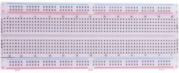   |  |  | 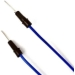 |  |
| -------------------------- | ---------------------------- | -------------------------- | -------------------------- | -------------------------- | -------------------------- |
| ESP32*1                    | Breadboard*1                 | Red LED*1                  | 10KΩResistor*1             | Jumper Wires               | USB Cable*1                |
|  |    |  |  |                            |                            |
| Photoresistor*1            | Human Body Infrared Sensor*1 | 220ΩResistor*1             | M-F Dupont Wires           |                            |                            |

### 3.Wiring Diagram：


### 4.Project code：

Codes used in this tutorial are saved in“**2. Python Projects**”. （If you haven't downloaded the code file, please click on the link to download it:[Download Python Codes](Python-Codes.zip)）


Open“Thonny”, click“This computer”→“D:”→“2. Python Projects”→“Project 25：Human Induction Lamp”，and then double left-click “Project\_25\_Human\_ Induction\_Lamp.py”.


```python
from machine import Pin, ADC
import time
 
## Human infrared sensor pin
human = Pin(15, Pin.IN)
 
## Initialize the photosensitive sensor pin to GP36 (ADC function)
adc=ADC(Pin(36))
adc.atten(ADC.ATTN_11DB)
adc.width(ADC.WIDTH_10BIT)
#create the LED object from Pin 4, Set Pin 4 to output 
led = Pin(4, Pin.OUT)

def detect_someone():
    if human.value() == 1:
        return True
    return False
 
abc = 0
 
while True:
    adcVal=adc.read()
    if adcVal >= 500:
        if detect_someone() == True:
            abc += 1
            led.value(1)
            print("value=", abc)
            time.sleep(1)
        else:
            if abc != 0:
                abc = 0
                led.value(0)
    else:
        led.value(0)
 
    time.sleep(0.1)
```

### 5.Project result：

Make sure the ESP32 has been connected to the computer, click“Stop/Restart backend” .


Click“Run current script”, the code starts to be executed and you'll see that When your hand covers the photosensitive part of the photoresistor to simulate darkness, then shake your other hand in front of the Human Body Infrared Sensor, the external LED will light up, and after a delay of a few seconds, the external LED will automatically turn off.  

At the same time, the "Shell" window of Thonny IDE will print the delay time when the external LED lights up. If the photosensitive part of the photoresistor is not covered, then shake your hand  in front of  the human infrared sensor and the LED is turned off. Press “Ctrl+C” or click“Stop/Restart backend” to exit the program.


## Project 26：Sound Control Fan

### 1.Introduction：

The sound sensor has a built-in capacitive electret microphone and power amplifier which can be used to detect the sound intensity of the environment. In this project, we use ESP32 to control the sound sensor and the motor module to simulate a voice-controlled fan.

### 2.Components：

|                     |  | 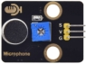     |
| --------------------------------------------- | -------------------------- | ------------------------------ |
| ESP32*1                                       | Breadboard*1               | Sound Sensor*1                 |
| 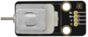                    | 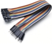 |      |
| 130 Motor Module*1                            | M-F Dupont Wires           | USB Cable*1                    |
|                     | 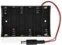 |      |
| Keyestudio bread board special power module*1 | Battery Holder*1           | No.5 battery (self-provided)*6 |
|                     |                            |                                |
| Fan*1                                         |                            |                                |

### 3.Component knowledge：


Sound sensor is usually used to detect the loudness of the sound in the surrounding environment. Microcontrol board can collect its output signal through the analog input interface.The S pin is an analog output, which is the real-time output of the microphone voltage signal. The sensor comes with a potentiometer so you can adjust the signal strength. It also has two fixing holes so that the sensor can be installed on any other equipment. You can use it to make some interactive works, such as
voice-operated switches.

### 4.Read the ADC value, DAC value and voltage value of the sound sensor：

We first use a simple code to read the ADC value, DAC value and voltage value of the sound sensor and print them out. Please refer to the wiring diagram below：


Codes used in this tutorial are saved in“**2. Python Projects**”. （If you haven't downloaded the code file, please click on the link to download it:[Download Python Codes](Python-Codes.zip)）


Open“Thonny”，click“This computer”→“D:”→“2. Python Projects”→“Project 26：Sound Control Fan”, and then double left-click
“Project\_26.1\_Read\_Sound\_Sensor\_Analog\_Value.py”.


```python
## Import Pin, ADC and DAC modules.
from machine import ADC,Pin,DAC
import time

## Turn on and configure the ADC with the range of 0-3.3V 
adc=ADC(Pin(36))
adc.atten(ADC.ATTN_11DB)
adc.width(ADC.WIDTH_12BIT)

## Read ADC value once every 0.1seconds, convert ADC value to DAC value and output it,
## and print these data to “Shell”. 
try:
    while True:
        adcVal=adc.read()
        dacVal=adcVal//16
        voltage = adcVal / 4095.0 * 3.3
        print("ADC Val:",adcVal,"DACVal:",dacVal,"Voltage:",voltage,"V")
        time.sleep(0.1)
except:
    pass
```

Make sure the ESP32 has been connected to the computer, click“Stop/Restart backend” .


Click“Run current script”, the code starts to be executed and you'll see that the "Shell" window of Thonny IDE will print the ADC value，DAC value and voltage value of the sound sensor.

When you clap your hands to the sensor, the ADC value, DAC value and voltage value will change significantly. Press“Ctrl+C”or click“Stop/Restart backend”to exit the program.


### 5.Wiring diagram of the intelligent fan：

Next, we officially entered the project. We used a sound sensor, a motor module and a fan blade to simulate a voice-controlled fan. The wiring diagram is as follows：


(Note: Connect the wires and then install a small fan blade on the DC motor. )

### 6.Project code：

（Note：The threshold 600 in the code can be reset itself as needed)

Codes used in this tutorial are saved in “**2. Python Projects**”. （If you haven't downloaded the code file, please click on the link to download it:[Download Python Codes](Python-Codes.zip)）


Open“Thonny”, click “This computer”→“D:”→“2. Python Projects”→“Project 26：Sound Control Fan”，and then click
“Project\_26.2\_Sound\_Control\_Fan.py”.


```python
from machine import ADC, Pin
import time
 
## Turn on and configure the ADC with the range of 0-3.3V 
adc=ADC(Pin(36))
adc.atten(ADC.ATTN_11DB)
adc.width(ADC.WIDTH_12BIT)
 
## Pin initialization
motor1a = Pin(15, Pin.OUT) # create motor1a object from Pin 15, Set Pin 15 to output
motor1b = Pin(2, Pin.OUT) # create motor1b object from Pin 2, Set Pin 2 to output

## If the Sound sensor detects Sounds, and the motor will rotate
## when the analog value is greater than 600,Otherwise, the motor does not rotate.    
while True:
    adcVal=adc.read()
    print(adcVal)
    time.sleep(0.5)
    if adcVal >600:
        motor1a.value(1) # Set motor1a high
        motor1b.value(0) # Set motor1b low
        time.sleep(5)   # delay time 
    else:
        motor1a.value(0)
        motor1b.value(0)
```

### 7.Project result：

Make sure the ESP32 has been connected to the computer, click“Stop/Restart backend” .


External power supply and power on. 

Click“Run current script”, the code starts to be executed and you'll see that clap your hands to the sound sensor, and when the sound intensity exceeds a threshold, the small fan rotates;  conversely, the small fan doesn't rotate. 

Press“Ctrl+C”or click“Stop/Restart backend”to exit the program.


## Project 27：Temperature Measurement

### 1.**Introduction：**

LM35 is a common used and easy-to-use temperature sensor. It doesn't require any other hardware and you only need an analog port. The difficulty lies in compiling the code and converting the analog values to Celsius temperature. In this project, we used a temperature sensor and 3 LEDs to make a temperature tester. When the temperature sensor touches different temperature objects, the LEDs will show different colors.

### 2.Components：

|  | 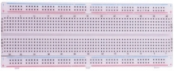 |  |  |  | 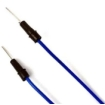 |
| -------------------------- | -------------------------- | -------------------------- | -------------------------- | -------------------------- | -------------------------- |
| ESP32*1                    | Breadboard*1               | LM35*1                     | USB Cable*1                | M-F Dupont Wires           | Jumper Wires               |
|  |  |  |  |                            |                            |
| 220Ω Resistor*3            | Red LED*1                  | Yellow LED*1               | Green LED*1                |                            |                            |

### 3.Component knowledge：

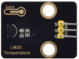

**Working principle of LM35 temperature sensor:** 

LM35 temperature sensor is a widely used temperature sensor with a variety of package types. At room temperature, it can achieve the accuracy of 1/4°C without additional calibration processing. LM35 temperature sensor can produce different voltage according to different temperatures, when the temperature is 0 ℃, it output 0V; If increasing 1 ℃, the output voltage will increase 10mv. The output temperature is 0℃ to 100℃, the conversion formula is as follows：


### 4.Read the temperature value of the LM35：

We first use a simple code to read the value of the temperature sensor and printing them out, wiring diagram is shown below：

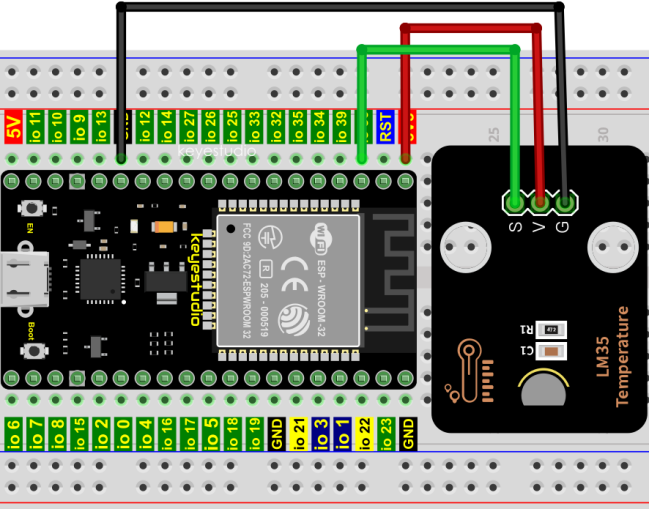

LM35 output is given to analog pin GPIO36 of the ESP32, this analog voltage is converted to its digital form and processed to get the temperature reading.

Codes used in this tutorial are saved in“**2. Python Projects**”. （If you haven't downloaded the code file, please click on the link to download it:[Download Python Codes](Python-Codes.zip)）


Open “Thonny”，click “This computer”→“D:”→“2. Python Projects”→“Project 27：Temperature Measurement”, and then double left-click “Project\_27.1\_Read\_LM35\_Temperature\_Value.py”.


```python
from machine import ADC, Pin
import time

## Turn on and configure the ADC with the range of 0-3.3V 
adc=ADC(Pin(36))
adc.atten(ADC.ATTN_11DB)
adc.width(ADC.WIDTH_12BIT)
conversion_factor = 3.3 / (4095)

while True:
    adcVal=adc.read()
    reading = adcVal * conversion_factor 
    temperature = reading * 102.4 
    print(temperature)
    time.sleep(1)
```

Make sure the ESP32 has been connected to the computer, click“Stop/Restart backend” .

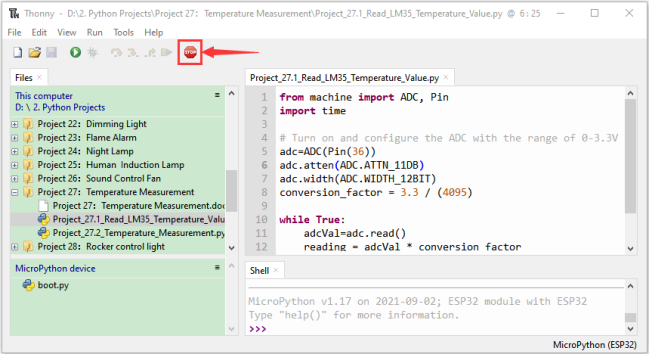

Click“Run current script”, the code starts to be executed and you'll see that the "Shell" window of Thonny IDE will print the temperature values read by the LM35 temperature sensor. 

Hold the LM35 element by hand, the temperature value read by the LM35 temperature sensor will change. Press “Ctrl+C” or click“Stop/Restart backend” to exit the program.


### 5.Diagram of the temperature measurement：

Now we use a LM35 temperature sensor and three LED lights to do a temperature test. When the LM35 temperature sensor senses different temperatures, different LED lights will light up. Follow the diagram below for wiring.


### 6.Project code：

Codes used in this tutorial are saved in“**2. Python Projects**”. （If you haven't downloaded the code file, please click on the link to download it:[Download Python Codes](Python-Codes.zip)）


Open“Thonny”，click“This computer”→“D:”→“2. Python Projects”→“Project 27：Temperature Measurement”，and then double left-click “Project\_27.2\_Temperature\_Measurement.py”.

(Note: The temperature threshold in the code can be reset itself as required.)


```python
from machine import ADC, Pin
import time

## Turn on and configure the ADC with the range of 0-3.3V 
adc=ADC(Pin(36))
adc.atten(ADC.ATTN_11DB)
adc.width(ADC.WIDTH_12BIT)
conversion_factor = 3.3 / (4095)

## create red led object from Pin 15, Set Pin 15 to output
led_red = Pin(15, Pin.OUT)  
## create yellow led object from Pin 2, Set Pin 2 to output
led_yellow = Pin(2, Pin.OUT)
## create green led object from Pin 4, Set Pin 4 to output
led_green = Pin(4, Pin.OUT) 

while True:
    adcVal=adc.read()
    reading = adcVal * conversion_factor 
    temperature = reading * 102.4 
    print(temperature)
    time.sleep(0.2)
    if temperature <20:
        led_red.value(1)  # Set red led turn on
        led_yellow.value(0) # Set yellow led turn off 
        led_green.value(0)  # Set green led turn off
    elif temperature >=20 and temperature <25:
        led_red.value(0)  # Set red led turn off
        led_yellow.value(1) # Set yellow led turn on 
        led_green.value(0)  # Set green led turn off
    else:
        led_red.value(0)  # Set red led turn off
        led_yellow.value(0) # Set yellow led turn off 
        led_green.value(1)  # Set green led turn on
```

### 7.Project result：

Make sure the ESP32 has been connected to the computer, click“Stop/Restart backend” .


Click“Run current script”, the code starts to be executed and you'll see that the "Shell" window of Thonny IDE will print the temperature values read by the LM35 temperature sensor. 

When the LM35 temperature sensor senses different temperatures, different LEDS will light up. Press“Ctrl+C”or click“Stop/Restart backend”to exit the program.


## Project 28：Rocker control light

### 1.Introduction：

The rocker module is a component with two analog inputs and one digital input. It is widely used in areas such as game operation, robot control and drone control. 

In this project, we use ESP32 and a joystick module to control RGB, so that you can have a deeper understanding of the principle and operation of the joystick module in practice. 

### 2.Components：

|  |  |  | 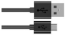 | 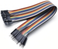 |
| -------------------------- | -------------------------- | -------------------------- | -------------------------- | -------------------------- |
| ESP32*1                    | Breadboard*1               | Rocker Module*1            | USB Cable*1                | M-F Dupont Wires           |
|  |  |  |                            |                            |
| RGB LED*1                  | 220ΩResistor*3             | Jumper Wires               |                            |                            |

### 3.Component knowledge：

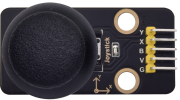

**Rocker module:** 

It mainly uses PS2 joystick components. In fact, the joystick module has 3 signal terminal pins, which simulate a three-dimensional space. 

The pins of the joystick module are GND, VCC, and signal terminals (B, X, Y). The signal terminals X and Y simulate the X-axis and Y-axis of the space. When controlling, the X and Y signal terminals of the module are connected to the analog port of the microcontroller. The signal terminal B simulates the Z axis of the space, it is generally connected to the digital port and used as a button.

VCC is connected to the microcontroller power output VCC (3.3V or 5V), GND is connected to the microcontroller GND, the voltage in the original state is about 1.65V or 2.5V. 

In the X-axis direction, when moving in the direction of the arrow, the voltage value increases, and the maximum voltage can be reached. Moving in the opposite direction of the arrow, the voltage value gradually decreases to the minimum voltage.

In the Y-axis direction, the voltage value decreases gradually as it moves in the direction of the arrow on the module, decreasing to the minimum voltage. As the arrow is moved in the opposite direction, the voltage value increases and can reach the maximum voltage. 

In the Z-axis direction, the signal terminal B is connected to the digital port and outputs 0 in the original state and outputs 1 when pressed. 

In this way, we can read the two analog values and the high and low level conditions of the digital port to determine the operating status of the joystick on the module.

**Features:**

- Input Voltage: DC 3.3V \~ 5V.

- Output Signal: X/Y dual axis analog value +Z axis digital signal.

- Range of Allication: Suitable for control point coordinate movement in plane as well as control of two degrees of freedom steering gear, etc.  

- Product features: Exquisite appearance, joystick feel superior, simple operation, sensitive response, long service life.


### 4.Read the value of the Rocker Module：

We must use ESP32’s analog IO port to read the value from the X/Y pin of the rocker module and use the digital IO port to read the digital signal of the button. Please connect the wires according to the wiring diagram below：


Codes used in this tutorial are saved in“**2. Python Projects**”. （If you haven't downloaded the code file, please click on the link to download it:[Download Python Codes](Python-Codes.zip)）


Open“Thonny”，click“This computer”→“D:”→“2. Python Projects”→“Project 28：Rocker control light”, and then double left-click
“Project\_28.1\_Read\_Rocker\_Value.py”.


```python
from machine import Pin, ADC
import time
## Initialize the joystick module (ADC function)
rocker_x=ADC(Pin(36))
rocker_y=ADC(Pin(39))
button_z=Pin(14,Pin.IN,Pin.PULL_UP)

## Set the acquisition range of voltage of the two ADC channels to 0-3.3V,
## and the acquisition width of data to 0-4095.
rocker_x.atten(ADC.ATTN_11DB)
rocker_y.atten(ADC.ATTN_11DB)
rocker_x.width(ADC.WIDTH_12BIT)
rocker_y.width(ADC.WIDTH_12BIT)
 
## In the code, configure Z_Pin to pull-up input mode.
## In loop(), use Read () to read the value of axes X and Y 
## and use value() to read the value of axis Z, and then display them.
while True:
    print("X,Y,Z:",rocker_x.read(),",",rocker_y.read(),",",button_z.value())
    time.sleep(0.5)
```

Make sure the ESP32 has been connected to the computer, click“Stop/Restart backend” .


Click“Run current script”, the code starts to be executed and you'll see that the "Shell" window of Thonny IDE will print the analog and digital values of the current joystick. 

Moving the joystick or pressing it will change the analog and digital values in "Shell". Press“Ctrl+C”or click“Stop/Restart backend”to exit the program.


### 5.Wiring diagram：

We just read the value of the rocker module, we need to do something with the rocker module and RGB here, Follow the diagram below for wiring：


### 6.Project code：

Codes used in this tutorial are saved in“**2. Python Projects**”. （If you haven't downloaded the code file, please click on the link to download it:[Download Python Codes](Python-Codes.zip)）


Open“Thonny”，click“This computer”→“D:”→“2. Python Projects”→“Project 28：Rocker control light”，and then double left-click “Project\_28.2\_Rocker\_Control\_Light.py”.


```python
from machine import Pin, ADC,PWM 
import time
#Set RGB light interface and frequency
rgb_r = PWM(Pin(4))
rgb_g = PWM(Pin(0))
rgb_b = PWM(Pin(2))
rgb_b.freq(1000)
rgb_r.freq(1000)
rgb_g.freq(1000)
#Set rocker pin
rocker_x=ADC(Pin(36))
rocker_y=ADC(Pin(39))
## Set the acquisition range of voltage of the two ADC channels to 0-3.3V,
## and the acquisition width of data to 0-4095.
rocker_x.atten(ADC.ATTN_11DB)
rocker_y.atten(ADC.ATTN_11DB)
rocker_x.width(ADC.WIDTH_12BIT)
rocker_y.width(ADC.WIDTH_12BIT)

while True:
    y = rocker_y.read()#Get Y value of rocker
    x = rocker_x.read()#Get X value of rocker
    if x < 1000:    #left
        rgb_b.duty(0)
        rgb_r.duty(1023)
        rgb_g.duty(0)
    elif x > 3000:    #right
        rgb_b.duty(0)
        rgb_r.duty(0)
        rgb_g.duty(1023)
    elif y < 1000:    #down
        rgb_b.duty(1023)
        rgb_r.duty(0)
        rgb_g.duty(0)
    elif y > 3000:    #up
        rgb_b.duty(1023)
        rgb_r.duty(1023)
        rgb_g.duty(1023)
    time.sleep(0.01)
```

### 7.Project result：

Make sure the ESP32 has been connected to the computer, click“Stop/Restart backend” .


Click“Run current script”, the code starts to be executed and you'll see that 

①If the rocker is moved to the far left in the X direction, the RGB light turns red. 

② If the rocker is moved to the far right in the X direction, the RGB light turns green. 

③If the rocker is moved to the up in the Y direction, the RGB light turns white. 

④If the rocker is moved to the down in the Y direction, the RGB light turns blue. 

Press“Ctrl+C”or click“Stop/Restart backend”to exit the program.


## Project 29：Temperature Humidity Meter 

### 1.Introduction：

In winter, the humidity in the air is very low, that is, the air is very dry, Coupled with cold, the skin of the human body is easy to be too dry and cracked, so you need to use a humidifier to increase the humidity of the air at home, but how do you know that the air is too dry? Then you need equipment to detect air humidity. In this Project, we will how to use the temperature and humidity sensor. We use the sensor to make a thermohygrometer, and also combined with a LCD 128X32 DOT to display the temperature and humidity values.

### 2.Components：

|  | 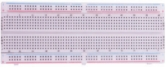 |         |
| -------------------------- | -------------------------- | --------------------------------- |
| ESP32*1                    | Breadboard*1               | Temperature and Humidity Sensor*1 |
|  |  |         |
| LCD 128X32 DOT*1           | M-F Dupont Wires           | USB Cable*1                       |

### 3.Component knowledge：


**Temperature and humidity sensor:** 

It is a temperature and humidity composite sensor with calibrated digital signal output, its precision humidity is±5%RH, temperature is±2℃, range humidity is 20 to 90%RH, and temperature is 0 to 50℃. The temperature and humidity sensor applies dedicated digital module acquisition technology and temperature and humidity sensing technology to ensure extremely high reliability and excellent long-term stability of the product. 

The temperature and humidity sensor includes a resistive-type humidity measurement and an NTC temperature measurement component, which is very suitable for temperature and humidity measurement applications where accuracy and real-time performance are not required. The operating voltage is in the range of 3.3V to 5.5V.

The temperature and humidity sensor has three pins, which are VCC、GND and S. S is the pin for data output, using serial communication.

**Single bus format definition of Temperature and Humidity Sensor：**

| **Description** | **Definition**                                               |
| --------------- | ------------------------------------------------------------ |
| Start signal    | Microprocessor pulls data bus (SDA) down at least 18ms for a period of time(Maximum is 30ms), notifying the sensor to prepare data. |
| Response signal | The sensor pulls the data bus (SDA) low for 83µs, and then pulls up for 87µs to respond to the host's start signal. |
| Humidity        | The high humidity is an integer part of the humidity data, and the low humidity is a fractional part of the humidity data. |
| Temperature     | The high temperature is the integer part of the temperature data, the low temperature is the fractional part of the temperature data. And the low temperature Bit8 is 1, indicating a negative temperature, otherwise, it is a positive temperature. |
| Parity bit      | Parity bit=Humidity high bit+ Humidity low bit+temperature high bit+temperature low bit |

**Data sequence diagram** **of Temperature and Humidity Sensor：**

When MCU sends a start signal, the Temperature and Humidity Sensor changes from the low-power-consumption mode to the high-speed mode, waiting for MCU completing the start signal. Once it is completed, the Temperature and Humidity Sensor sends a response signal of 40-bit data and triggers a signal acquisition. 

The signal is sent as shown in the figure:


Combined with the code, you can understand better.

The XHT11 temperature and humidity sensor can easily add temperature and humidity data to your DIY electronic projects. It is perfect for remote weather stations, home environmental control systems, and farm or garden monitoring systems.

**Specification:**

- Working voltage: +5V

- Temperature range: 0°C to 50°C, error of ± 2°C

- Humidity range: 20% to 90% RH,± 5% RH error

- Interface: Digital interface


**Schematic diagram of** **Temperature and Humidity Sensor:**


### 4.Read temperature and humidity value：


Codes used in this tutorial are saved in“**2. Python Projects**”. （If you haven't downloaded the code file, please click on the link to download it:[Download Python Codes](Python-Codes.zip)）


Open“Thonny”，click“This computer”→“D:”→“2. Python Projects”→“Project 29：Temperature Humidity Meter”, and then double left-click “Project\_29.1\_Detect\_Temperature\_Humidity.py”.


```python
## Import machine, time and dht modules. 
import machine
import time
import dht

#Associate DHT11 with Pin(13).
DHT = dht.DHT11(machine.Pin(13))

## Obtain temperature and humidity data once per second and print them out. 
while True:
    DHT.measure() # Start DHT11 to measure data once.
   # Call the built-in function of DHT to obtain temperature
   # and humidity data and print them in “Shell”.
    print('temperature:',DHT.temperature(),'℃','humidity:',DHT.humidity(),'%')
    time.sleep_ms(1000)
```

Make sure the ESP32 has been connected to the computer, click“Stop/Restart backend” .


Click“Run current script”, if the temperature and humidity sensor is incorrectly connected, the following information is displayed in the “Shell”window. Please make sure your circuit is properly connected. 

Clickagain, the code starts to be executed and you'll see that the "Shell" window of Thonny IDE will print the temperature and humidity datas in the current surroundings, as shown in the following figure. 

Press“Ctrl+C”or click“Stop/Restart backend” to exit the program.


### 5.Wiring diagram of the thermohygrometer：

Now we start to print the values of the temperature and humidity sensor with LCD\_128X32\_DOT. We will see the corresponding values on the screen of LCD\_128X32\_DOT. Let's get started with this project. Please connect cables according to the following wiring diagram：


### 6.Project code：

Codes used in this tutorial are saved in“**2. Python Projects**”. （If you haven't downloaded the code file, please click on the link to download it:[Download Python Codes](Python-Codes.zip)）


Open“Thonny”，click“This computer”→“D:”→“2. Python Projects”→“Project 29：Temperature Humidity Meter”. Select“lcd128\_32.py”and“lcd128\_32\_fonts.py”，right-click your mouse to select“Upload to /”，wait for “lcd128\_32.py” and “lcd128\_32\_fonts.py” to be uploaded to ESP32，and double left-click “Project\_29.2\_Temperature\_Humidity\_Meter.py”.


```python
from machine import Pin
import machine
import dht
import time
import lcd128_32_fonts
from lcd128_32 import lcd128_32

temp = 0
humi = 0

#Associate DHT11 with Pin(13).
DHT = dht.DHT11(Pin(13))

#i2c config
clock_pin = 22
data_pin = 21
bus = 0
i2c_addr = 0x3f
use_i2c = True

def scan_for_devices():
    i2c = machine.I2C(bus,sda=machine.Pin(data_pin),scl=machine.Pin(clock_pin))
    devices = i2c.scan()
    if devices:
        for d in devices:
            print(hex(d))
    else:
        print('no i2c devices')

try:
    while True:
        DHT.measure()
        temp = int(DHT.temperature())
        humi = int(DHT.humidity())
        if use_i2c:
            scan_for_devices()
            lcd = lcd128_32(data_pin, clock_pin, bus, i2c_addr)         
        lcd.Clear()
        lcd.Cursor(0, 0)
        lcd.Display("temper:")
        lcd.Cursor(0, 8)
        lcd.Display(str(temp))
        lcd.Cursor(0, 11)
        lcd.Display("C")
        lcd.Cursor(2, 0)
        lcd.Display("Humid:")
        lcd.Cursor(2, 7)
        lcd.Display(str(humi))
        lcd.Cursor(2, 10)
        lcd.Display("%")
        time.sleep(0.1)
except:
    pass
```

### 7.Project result：

Make sure the ESP32 has been connected to the computer, click“Stop/Restart backend” .


Click“Run current script”, the code starts to be executed and you'll see that the LCD 128X32 DOT will display temperature and humidity value in the current environment. 

Press“Ctrl+C”or click“Stop/Restart backend” to exit the program.


## Project 30：Ultrasonic Ranger

### 1. **Introduction：**  

The HC-SR04 ultrasonic sensor is a very affordable distance sensor, mainly used for obstacle avoidance in various robotic
projects. It is also used for water level sensing and even as a parking sensor. We treat the ultrasonic sensors as bat's eyes,, in
the dark, bats can still identify objects in front of them and directions through ultrasound. 

In this project, we use ESP32 to control a ultrasonic sensor and LEDs to simulate ultrasonic rangefinder.

### 2. Components：

|  |  |  |  |
| -------------------------- | -------------------------- | -------------------------- | -------------------------- |
| ESP32*1                    | Breadboard*1               | Ultrasonic Sensor*1        | Red LED*4                  |
|  |  |  |  |
| M-F Dupont Wires           | 220ΩResistor*4             | Jumper Wires               | USB Cable*1                |

### 3. Component knowledge：

**HC-SR04 Ultrasonic Sensor :** 

Like bats, sonar is used to determine the distance to an object. It provides accurate non-contact range detection, high-precision and stable readings. 

Its operation is not affected by sunlight or black materials, just like a precision camera (acoustically softer materials like cloth are difficult to detect). It has an ultrasonic transmitter and receiver.

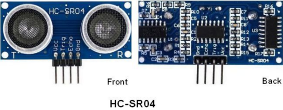

In front of the ultrasonic sensor are two metal cylinders, these are the converters. The converters convert the mechanical energy into an electrical signal. In the ultrasonic sensor, there are transmitting converters and receiving converters. The transmitting converter converts the electric signal into an ultrasonic pulse, and the receiving converter converts the reflected ultrasonic pulse back to an electric signal. If you look at the back of the ultrasonic sensor, you will see an IC behind the transmitting converter, which controls the transmitting converter. 

There is also an IC behind the receiving converter, which is a quad operational amplifier that amplifies the signal generated by the receiving converter into a signal large enough to be transmitted to the
Microcontroller.

**Sequence diagrams:**

The figure shows the sequence diagram of the HC-SR04. To start the measurement, the Trig of SR04 must receive at least 10us high pulse (5V), which will activate the sensor to emit 8 cycles of 40kHz ultrasonic pulses, and wait for the reflected ultrasonic pulses. When the sensor detects ultrasound from the receiver, it sets the Echo pin to high (5V) and delays it by one cycle (width), proportional to the distance. To get the distance, measure the width of the Echo pin.

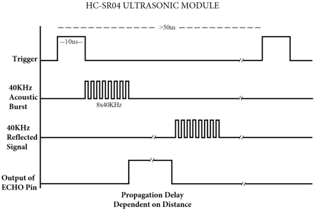

Time = Echo pulse width, its unit is“us” (microseconds)

$$
Distance(cm) = time / 58
$$

$$
Distance(inch) = time / 148
$$

### 4. Read the distance value of the ultrasonic sensor:

We will start with a simple ultrasonic ranging and print the measured distance.


The HC-SR04 ultrasonic sensor has four pins, they are Vcc, Trig, Echo and GND. 

The Vcc pin provides the power source for generating ultrasonic pulses and is connected to Vcc (+5V). 

The GND pin is grounded. 

The Trig pin is where the Arduino sends a signal to start the ultrasonic pulse. 

The Echo pin is where the ultrasonic sensor sends information about the duration of the ultrasonic pulse to the Control board. 

Wiring as shown below:


Codes used in this tutorial are saved in“**2. Python Projects**”. （If you haven't downloaded the code file, please click on the link to download it:[Download Python Codes](Python-Codes.zip)）


Open“Thonny”，click“This computer”→“D:”→“2. Python Projects”→“Project 30：Ultrasonic Ranger”, and then double left-click“Project 30.1\_Ultrasonic\_Ranging.py”.


```python
from machine import Pin
import time

## Define the control pins of the ultrasonic ranging module. 
Trig = Pin(13, Pin.OUT, 0)
Echo = Pin(14, Pin.IN, 0)

distance = 0 # Define the initial distance to be 0.
soundVelocity = 340 #Set the speed of sound.

## The getDistance() function is used to drive the ultrasonic module to measure distance,
## the Trig pin keeps at high level for 10us to start the ultrasonic module.
## Echo.value() is used to read the status of ultrasonic module’s Echo pin,
## and then use timestamp function of the time module to calculate the duration of Echo
## pin’s high level,calculate the measured distance based on time and return the value.
def getDistance():
    Trig.value(1)
    time.sleep_us(10)
    Trig.value(0)
    while not Echo.value():
        pass
    pingStart = time.ticks_us()
    while Echo.value():
        pass
    pingStop = time.ticks_us()
    pingTime = time.ticks_diff(pingStop, pingStart) // 2
    distance = int(soundVelocity * pingTime // 10000)
    return distance

## Delay for 2 seconds and wait for the ultrasonic module to stabilize,
## Print data obtained from ultrasonic module every 500 milliseconds. 
time.sleep(2)
while True:
    time.sleep_ms(500)
    distance = getDistance()
    print("Distance: ", distance, "cm")
```

Make sure the ESP32 has been connected to the computer, click“Stop/Restart backend” .


Click“Run current script”, the code starts to be executed and you can use it to measure the distance between the ultrasonic sensor and the object. 

Press“Ctrl+C”or click“Stop/Restart backend”to exit the program.


### 5. Wiring diagram of the ultrasonic rangefinder：

Next, we will use ESP32 to control an ultrasonic sensor and 4 LEDs to simulate ultrasonic rangefinder. Connect the line as shown below：


### 6. Project code：

Codes used in this tutorial are saved in“**2. Python Projects**”. （If you haven't downloaded the code file, please click on the link to download it:[Download Python Codes](Python-Codes.zip)）


Open“Thonny”，click“This computer”→“D:”→“2. Python Projects”→“Project 30：Ultrasonic Ranger”，and double left-click“Project\_30.2\_Ultrasonic\_Ranger.py”.


```python
from machine import Pin
import time

#Define the pins of four leds.
led1 = Pin(4, Pin.OUT)
led2 = Pin(0, Pin.OUT)
led3 = Pin(2, Pin.OUT)
led4 = Pin(15, Pin.OUT)

## Define the control pins of the ultrasonic ranging module. 
Trig = Pin(13, Pin.OUT, 0)
Echo = Pin(14, Pin.IN, 0)

distance = 0 # Define the initial distance to be 0.
soundVelocity = 340 #Set the speed of sound.

## The getDistance() function is used to drive the ultrasonic module to measure distance,
## the Trig pin keeps at high level for 10us to start the ultrasonic module.
## Echo.value() is used to read the status of ultrasonic module’s Echo pin,
## and then use timestamp function of the time module to calculate the duration of Echo
## pin’s high level,calculate the measured distance based on time and return the value.
def getDistance():
    Trig.value(1)
    time.sleep_us(10)
    Trig.value(0)
    while not Echo.value():
        pass
    pingStart = time.ticks_us()
    while Echo.value():
        pass
    pingStop = time.ticks_us()
    pingTime = time.ticks_diff(pingStop, pingStart) // 2
    distance = int(soundVelocity * pingTime // 10000)
    return distance

## Delay for 2 seconds and wait for the ultrasonic module to stabilize,
## Print data obtained from ultrasonic module every 500 milliseconds. 
time.sleep(2)
while True:
    time.sleep_ms(500)
    distance = getDistance()
    print("Distance: ", distance, "cm")
    if distance <= 5:
       led1.value(1)
    else:
       led1.value(0)
    if distance <= 10:
       led2.value(1)
    else:
       led2.value(0)
    if distance <= 15:
       led3.value(1)
    else:
       led3.value(0)
    if distance <= 20:
       led4.value(1)
    else:
       led4.value(0)
```

### 7. Project result：

Make sure the ESP32 has been connected to the computer, click“Stop/Restart backend” .

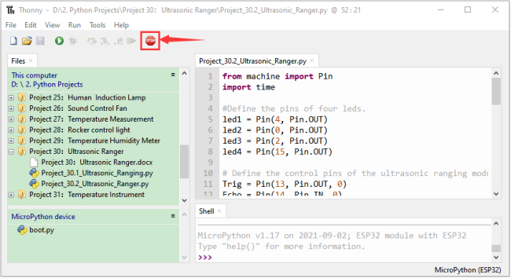

Click“Run current script”, the code starts to be executed and you'll see that the "Shell" window of Thonny IDE will print the distance between the ultrasonic sensor and the object, and the corresponding LED will light up when we move our hand in front of the ultrasonic sensor. 

Press“Ctrl+C”or click“Stop/Restart backend”to exit the program.

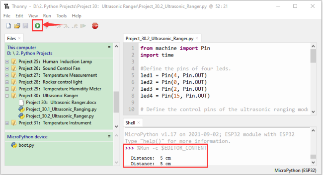

## Project 31：Temperature Instrument

### 1. Introduction： 

Thermistor is a kind of resistor whose resistance depends on temperature changes, which is widely used in gardening, home alarm system and other devices. Therefore, we can use the feature to make a temperature instrument.

### 2. Components：

|  |  |  |  |
| -------------------------- | -------------------------- | -------------------------- | -------------------------- |
| ESP32*1                    | Breadboard*1               | Thermistor*1               | 10KΩResistor*1             |
|  | 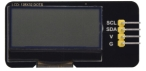 | 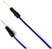 |  |
| M-F Dupont Wires           | LCD 128X32 DOT*1           | Jumper Wires               | USB Cable*1                |

### 3. Component knowledge：

**Thermistor:** 

A Thermistor is a temperature sensitive resistor. When it senses a change in temperature, the resistance of the Thermistor will change. We can take advantage of this characteristic by using a Thermistor to detect temperature intensity. A Thermistor and its electronic symbol are shown below:


The relationship between resistance value and temperature of a thermistor is：


**Rt** is the thermistor resistance under T2 temperature;

**R** is the nominal resistance of thermistor under T1 temperature;

**EXP\[n\]** is nth power of e;

**B** is for thermal index;

**T1, T2** is Kelvin temperature (absolute temperature). Kelvin temperature=273.15 + Celsius temperature.

For the parameters of the Thermistor, we use: B=3950, R=10k, T1=25.

The circuit connection method of the Thermistor is similar to photoresistor, as the following：


We can use the value measured by the ADC converter to obtain the resistance value of Thermistor, and then we can use the formula to obtain the temperature value. Therefore, the temperature formula can be derived as:：

### 4. Read the value of the Thermistor：

First we will learn the thermistor to read the current ADC value, voltage value and temperature value and print them out. Please
connect the wires according to the wiring diagram below：


Codes used in this tutorial are saved in“**2. Python Projects**”. （If you haven't downloaded the code file, please click on the link to download it:[Download Python Codes](Python-Codes.zip)）


Open“Thonny”，click“This computer”→“D:”→“2. Python Projects”→“Project 31：Temperature Instrument”, and then double left-click “Project\_31.1\_Read\_the\_thermistor\_analog\_value.py”.


```python
from machine import Pin, ADC
import time
import math

#Set ADC
adc=ADC(Pin(36))
adc.atten(ADC.ATTN_11DB)
adc.width(ADC.WIDTH_12BIT)

try:
    while True:
        adcValue = adc.read()
        voltage = adcValue / 4095 * 3.3
        Rt = 10 * voltage / (3.3-voltage)
        tempK = (1 / (1 / (273.15+25) + (math.log(Rt/10)) / 3950))
        tempC = (tempK - 273.15)
        print("ADC value:",adcValue,"  Voltage:",voltage,"V","  Temperature: ",tempC,"C");
        time.sleep(1)
except:
    pass
```

Make sure the ESP32 has been connected to the computer, click“Stop/Restart backend”.


Click“Run current script”, the code starts to be executed and you'll see that the "Shell" window of Thonny IDE will continuously display the thermistor's current ADC value, voltage value and temperature value. Try pinching the thermistor with your index finger and thumb (don't touch wires) for a while, and you will see the temperature increase. 

Press“Ctrl+C”or click“Stop/Restart backend”to exit the program.


### 5. Wiring diagram of the temperature instrument：


### 6. Project code：

Codes used in this tutorial are saved in“**2. Python Projects**”. （If you haven't downloaded the code file, please click on the link to download it:[Download Python Codes](Python-Codes.zip)）


Open “Thonny”, click “This computer” → “D:” → “2. Python Projects” → “Project 31：Temperature Instrument”.  Select “lcd128\_32.py” and “lcd128\_32\_fonts.py”, right-click your mouse to select “Upload to /”, wait for “lcd128\_32.py” and “lcd128\_32\_fonts.py” to be uploaded to ESP32, and double left-click “Project\_31.2\_Temperature\_Instrument.py”.


```python
from machine import Pin, ADC, I2C
import machine
import time
import math
import lcd128_32_fonts
from lcd128_32 import lcd128_32

#Set ADC
adc=ADC(Pin(36))
adc.atten(ADC.ATTN_11DB)
adc.width(ADC.WIDTH_12BIT)

#i2c config
clock_pin = 22
data_pin = 21
bus = 0
i2c_addr = 0x3f
use_i2c = True

def scan_for_devices():
    i2c = machine.I2C(bus,sda=machine.Pin(data_pin),scl=machine.Pin(clock_pin))
    devices = i2c.scan()
    if devices:
        for d in devices:
            print(hex(d))
    else:
        print('no i2c devices')
        
try:
    while True:
        adcValue = adc.read()
        voltage = adcValue / 4095 * 3.3
        Rt = 10 * voltage / (3.3-voltage)
        tempK = (1 / (1 / (273.15+25) + (math.log(Rt/10)) / 3950))
        tempC = int(tempK - 273.15)        
        if use_i2c:
            scan_for_devices()
            lcd = lcd128_32(data_pin, clock_pin, bus, i2c_addr)  
        lcd.Clear()
        lcd.Cursor(0, 0)
        lcd.Display("Voltage:")
        lcd.Cursor(0, 8)
        lcd.Display(str(voltage))
        lcd.Cursor(0, 20)
        lcd.Display("V")
        lcd.Cursor(2, 0)
        lcd.Display("Temperature:")
        lcd.Cursor(2, 12)
        lcd.Display(str(tempC))
        lcd.Cursor(2, 15)
        lcd.Display("C")
        time.sleep(0.5)
except:
    pass
```

### 7. Project result：

Make sure the ESP32 has been connected to the computer, click“Stop/Restart backend” .


Click“Run current script”, the code starts to be executed and you'll see that the LCD 128X32 DOT displays the voltage value of the thermistor and the temperature value in the current environment. 

Press“Ctrl+C”or click“Stop/Restart backend”to exit the program.


## Project 32：RFID

### 1. Introduction： 

Nowadays, many residential districts use this function to open the door by swiping the card, which is very convenient. In this Project, we will learn how to use RFID(radio frequency identification) wireless communication technology and read and write the key chain card (white card) and control the steering gear rotation by RFID-MFRC522 module.

### 2. Components：

|  |  |  |
| -------------------------- | -------------------------- | -------------------------- |
| ESP32*1                    | Breadboard*1               | RFID-RC522 Module*1        |
|  |  |  |
| M-F Dupont Wires           | Servo*1                    | White Card*1               |
|  |  |  |
| Key Chain*1                | Jumper wires               | USB Cable*1                |

### 3. Component knowledge：

**RFID：**

RFID (Radio Frequency Identification) is a wireless communication technology. A complete RFID system is generally composed of the responder and reader. Generally, we use tags as responders, and each tag has a unique code, which is attached to the object to identify the target object. The reader is a device for reading (or writing) tag information.

Products derived from RFID technology can be divided into three categories: passive RFID products, active RFID products and semi active RFID products. And Passive RFID products are the earliest, the most mature and most widely used products in the market among others. It can be seen everywhere in our daily life such as, the bus card, dining card, bank card, hotel access cards, etc., and all of these belong to close-range contact recognition. The main operating frequency of Passive RFID products are: 125KHZ (low frequency), 13.56MHZ (high frequency), 433MHZ (ultrahigh frequency) and 915MHZ (ultrahigh frequency). Active
and semi active RFID products work at higher frequencies.

The RFID module we use is a passive RFID product with the operating frequency of 13.56MHz.

**RFID-RC522 Module：**

The MFRC522 is a highly integrated reader/writer IC for contactless communication at 13.56MHz. The MFRC522's internal transmitter is able to drive a reader/writer antenna designed to communicate with ISO/IEC 14443 A/MIFARE cards and transponders without additional active circuitry. The receiver module provides a robust and efficient implementation for demodulating and decoding signals from ISO/IEC 14443 A/MIFARE compatible cards and transponders. The digital module manages the complete ISO/IEC 14443A framing and error detection (parity and CRC) functionality.

This RFID Module uses MFRC522 as the control chip and adopts I2C (Inter-Integrated Circuit) interface.


**Specifications:**

- Operating voltage: DC 3.3V-5V

- Operating current: 13—100mA/DC 5V

- Idling current: 10-13mA/DC 5V

- Sleep current: \<80uA

- Peak current: \<100mA

- Operating frequency: 13.56MHz

- Maximum power: 0.5W

- Supported card types: mifare1 S50, mifare1 S70, mifare UltraLight, mifare Pro, mifare Desfire.

- Environmental operating temperature: -20 to 80 degrees Celsius.

- Environment storage temperature: -40 to 85 degrees Celsius.

- Relative Humidity: 5% to 95%.

- Data transfer rate: The maximum is 10Mbit/s.


### 4. RFID Read UID：

We will read the UNIQUE ID number (UID) of the RFID card and identify the type of the RFID card, and display the relevant
information through the serial port. The wiring diagram is shown below：


Codes used in this tutorial are saved in“**2. Python Projects**”. （If you haven't downloaded the code file, please click on the link to download it:[Download Python Codes](Python-Codes.zip)）


Open “Thonny”, click “This computer” → “D:” → “2. Python Projects” → “Project 32：RFID”. 

Select “mfrc522\_config.py”, “mfrc522\_i2c.py” and “soft\_iic.py”, right-click your mouse to select “Upload to /”, wait for “mfrc522\_config.py”, “mfrc522\_i2c.py” and “soft\_iic.py” to be uploaded to ESP32, and double left-click “Project\_32.1\_RFID\_Read\_UID.py”.


```python
import machine
import time
from mfrc522_i2c import mfrc522

#i2c config
addr = 0x28
scl = 22
sda = 21
    
rc522 = mfrc522(scl, sda, addr)
rc522.PCD_Init()
rc522.ShowReaderDetails()            # Show details of PCD - MFRC522 Card Reader details

while True:
    if rc522.PICC_IsNewCardPresent():
        #print("Is new card present!")
        if rc522.PICC_ReadCardSerial() == True:
            print("Card UID:")
            print(rc522.uid.uidByte[0 : rc522.uid.size])
    #time.sleep(1)
```

Make sure the ESP32 has been connected to the computer, click“Stop/Restart backend”.


Click“Run current script”, the code starts to be executed and you'll see that place the door card and key chain close to the module sensor area respectively, the "Shell" window of Thonny IDE will display the card number and key chain value respectively, as shown below. Press“Ctrl+C”or click“Stop/Restart backend”to exit the program.


**Note:** the door card value and key chain value may be different for different RRFID -RC522 door cards and key chains.

### 5. Wiring diagram of the RFID MFRC522：

Now we use the RFID -RC522 module, white card/key chain and Servo to simulate an intelligent access control system. When the white card/key chain close to the RFID -RC522 module induction area, the servo rotates. Wiring according to the figure below：


### 6. Project code：

Codes used in this tutorial are saved in“**2. Python Projects**”. （If you haven't downloaded the code file, please click on the link to download it:[Download Python Codes](Python-Codes.zip)）


Open“Thonny”, click“This computer”→“D:”→“2. Python Projects”→“Project 32：RFID”. Select “mfrc522\_config.py”, “mfrc522\_i2c.py” and “soft\_iic.py”, click your mouse to select “Upload to /”, wait for “mfrc522\_config.py”, “mfrc522\_i2c.py” and “soft\_iic.py” to be uploaded to ESP32, and click “Project\_32.2\_RFID\_Control\_Servo.py”.


```python
from machine import Pin, PWM
import time
from mfrc522_i2c import mfrc522

#Define GPIO15’s output frequency as 50Hz and assign them to PWM.
servoPin = Pin(15)
pwm = PWM(servoPin, freq=50)

#i2c config
addr = 0x28
scl = 22
sda = 21
    
rc522 = mfrc522(scl, sda, addr)
rc522.PCD_Init()
rc522.ShowReaderDetails()            # Show details of PCD - MFRC522 Card Reader details

uid1 = [147, 173, 247, 32]
uid2 = [57, 182, 70, 194]

pwm = PWM(servoPin, freq=50)
pwm.duty(128)
time.sleep(1)

while True:
    if rc522.PICC_IsNewCardPresent():
        #print("Is new card present!")
        if rc522.PICC_ReadCardSerial() == True:
            print("Card UID:", end=' ')
            print(rc522.uid.uidByte[0 : rc522.uid.size])
            if rc522.uid.uidByte[0 : rc522.uid.size] == uid1 or rc522.uid.uidByte[0 : rc522.uid.size] == uid2:
                pwm = PWM(servoPin, freq=50)
                pwm.duty(25)
            else :
                pwm = PWM(servoPin, freq=50)
                pwm.duty(128)
            time.sleep(500)
```

Note: Different RFID-RC522 modules, ID cards and key chains may cause different uid1 values and uid2 values. The UID1 and UID2 values of the white card and key chain read by your RRFID RC522 module can be replaced by the corresponding values in the program code. If not, click **“Run current script”** to run the code may cause your own white card and key chain to fail to control the servo.  

For example: You can replace the UID1 and UID2 values in the program codewith your own white card and key chain values.

### 7. **Project result：**

Make sure the ESP32 has been connected to the computer, click“Stop/Restart backend” .


Click“Run current script”, the code starts to be executed and you'll see that when using the white card or a key card swiping, the "Shell" window of Thonny IDE  displays the card number value respectively, and at the same time, the servo rotates to the corresponding angle to simulate opening the door. 

Press“Ctrl+C”or click“Stop/Restart backend” to exit the program.


## Project 33：Keypad Door

### 1. Introduction：

Commonly used digital button sensor, one button uses an IO port. However, it will occupy too many IO ports when we need a lot of buttons. In order to save the use of IO ports, the multiple buttons are made into a matrix type, through the control of the line and row to achieve less IO port control of multiple buttons. In this project, we will learn ESP32 and thin film 4\*4 matrix keyboard
control a servo and a buzzer.

### 2. Components：

|      |  |  |  |
| ------------------------------ | -------------------------- | -------------------------- | -------------------------- |
| ESP32*1                        | Breadboard*1               | Servo*1                    | Active Buzzer*1            |
|      |  |  |  |
| 4*4 Membrane Matrix Keyboard*1 | Jumper Wires               | USB Cable*1                | 1kΩResistor*1              |
|      |                            |                            |                            |
| NPN transistor(S8050)*1        |                            |                            |                            |

### 3. Component knowledge：

**4\*4 Matrix keyboard：**

A Keypad Matrix is a device that integrates a number of keys in one package. As is shown below, a 4x4 Keypad Matrix integrates 16 keys:


Similar to the integration of an LED Matrix, the 4x4 Keypad Matrix has each row of keys connected with one pin and this is the same for the columns. Such efficient connections reduce the number of processor ports required. The internal circuit of the Keypad Matrix is shown below.


The method of usage is similar to the Matrix LED, by using a row or column scanning method to detect the state of each key’s position by column and row. Take column scanning method as an example, send low level to the first 4 column (Pin4), detect level state of row 1, 2, 3, 4 to judge whether the key A, B, C, D are pressed. Then send low level to column3, 2, 1 in turn to detect whether other keys are pressed. By this means, you can get the state of all of the keys.

### 4. Read the key value of the 4\*4 matrix keyboard：

We start with a simple code to read the values of the 4\*4 matrix keyboard and print them in the serial monitor. Its wiring diagram is shown below：


Codes used in this tutorial are saved in“**2. Python Projects**”. （If you haven't downloaded the code file, please click on the link to download it:[Download Python Codes](Python-Codes.zip)）


Open“Thonny”, click “This computer”→“D:”→“2. Python Projects”→“Project 33：Keypad Door”. Select “keypad\.py”, select “Upload to /”, wait for “keypad\.py” to be uploaded to ESP32, and  click “Project\_33.1\_4x4\_Matrix\_Keypad\_Display.py”.


```python
## Import keypad module.
from keypad import KeyPad
import time
## Associate the keypad module to ESP32 pins. 
keyPad = KeyPad(22, 21, 19, 18, 17, 16, 4, 0)
#Call function keyPan.scan() to obtain the value of the pressed key. Once it is obtained, print it out. 
def key():
    keyvalue = keyPad.scan()
    if keyvalue != None:
        print(keyvalue, end="\t")
        time.sleep_ms(300)
        return keyvalue
            
while True:
    key()
```


Make sure the ESP32 has been connected to the computer, click“Stop/Restart backend”.


Click“Run current script”, the code starts to be executed and you'll see that press the keyboard and the "Shell" window of Thonny IDE prints the corresponding key value, as shown below. Press“Ctrl+C”or click“Stop/Restart backend” to exit the program.


### 5. Wiring diagram of the Keypad Door：

In the last experiment, we have known the key values of the 4\*4 matrix keyboard. Next, we use it as the keyboard to control a servo and a buzzer.


### 6. Project code：

Codes used in this tutorial are saved in“**2. Python Projects**”. （If you haven't downloaded the code file, please click on the link to download it: [Download Python Codes](Python-Codes.zip)）


Open “Thonny”, click“This computer”→“D:”→“2. Python Projects”→“Project 33： Keypad Door”. Select “keypad.py” and “myservo.py”, click your mouse to select “Upload to /”, wait for “keypad.py” and “myservo.py” to be uploaded to ESP32, and , click “Project\_33.2\_Keypad\_Door.py”.


```python
from myservo import myServo #Import myservo module.
from keypad import KeyPad
from machine import Pin
import time

keyPad = KeyPad(22, 21, 19, 18, 17, 16, 4, 0)
servo=myServo(15)
servo.myServoWriteAngle(0)
time.sleep_ms(1000)
activeBuzzer = Pin(2, Pin.OUT)

## Define an array and set the password. 
passWord = "1234"
keyIn = ""
def key():
    keyvalue = keyPad.scan()
    if keyvalue != None:
        print('Your input:', keyvalue)
        time.sleep_ms(200)
        return keyvalue

while True:
 # Each time a key is pressed, the buzzer will short beep once,
 # and the key value of the key will be stored in the keyIn array. 
    keydata = key()
    if keydata != None:
        activeBuzzer.value(1)
        time.sleep_ms(100)
        activeBuzzer.value(0)
        keyIn += keydata 
## When 4 keys are pressed, it will judge whether the password is correct.
## If it is correct, the servo will rotate 90 degrees, and then turn back after 1 second.
## If the password is wrong, the buzzer will long beep once and the keyInNum value will be cleared.        
    if len(keyIn) == 4:
        if keyIn == passWord:
            print("passWord right!")
            servo.myServoWriteAngle(90)
            time.sleep_ms(1000)
            servo.myServoWriteAngle(0)
        else:
            print("passWord error!")
            activeBuzzer.value(1)
            time.sleep_ms(1000)
            activeBuzzer.value(0)
        keyIn = ""
```

### 7. Project result：

Make sure the ESP32 has been connected to the computer, click“Stop/Restart backend”.


Click“Run current script”, the code starts to be executed and you'll see that press the keypad to input password with 4 characters. If the input is correct(Correct password :1234), the servo will move to a certain degree, and then return to the original position. If the input is wrong, an input error alarm will be generated.

Press“Ctrl+C”or click“Stop/Restart backend”to exit the program.


## Project 34：IR Control Sound and LED

### 1. Introduction：

An infrared(IR) remote control is a low-cost and easy-to-use wireless communication technology. IR light is very similar to visible light, except that its wavelength is slightly longer. This means that infrared rays cannot be detected by the human eye, which is perfect for wireless communication. For example, when you press a button on the TV remote control, an infrared LED will switch on and off repeatedly at a frequency of 38,000 times per second, transmitting information (such as volume or channel control) to the infrared sensor on the TV.

We'll start by explaining how common infrared communication protocols work. Then we will start the project with a remote control and an infrared receiver component.

### 2. Components：

|  |  |  |  |
| -------------------------- | -------------------------- | -------------------------- | -------------------------- |
| ESP32*1                    | Breadboard*1               | IR Receiver *1             | RGB LED*1                  |
|  |  |  |  |
| IR Remote Controller*1     | Active buzzer*1            | 10KΩResistor*1             | 220ΩResistor*3             |
|  |  |  |  |
| NPN transistor(S8050)*1    | 1kΩResistor*1              | Jumper Wires               | USB Cable*1                |

### 3. Component knowledge：

**Infrared Remote：**

An infrared (IR) remote control is a device with a certain number of buttons. Pressing down different buttons will make the infrared emission tube, which is located in the front of the remote control, send infrared ray with different command. Infrared remote control technology is widely used in electronic products such as TV, airconditioning, etc. Thus making it possible for you to switch TV programs and adjust the temperature of the air conditioning when away from them. The remote control we use is shown below:

The infrared remote controller adopts NEC code and the signal cycle is 110ms.


**Infrared receiver：**receiver is a component which can receive the infrared light, so we can use it to detect the signal emitted by the infrared remote control.

The infrared receiver demodules the received infrared signal and converts it back to binary, then passes the information to the microcontroller.

**Infrared signal modulation process diagram：**


**NEC Infrared communication protocol：**

**NEC Protocol:**

To my knowledge the protocol I describe here was developed by NEC (Now Renesas). I've seen very similar protocol descriptions on the internet, and there the protocol is called Japanese Format.   I do admit that I don't know exactly who developed it. What I do know is that it was used in my late VCR produced by Sanyo and was marketed under the name of Fisher. NEC manufactured the remote control IC.  This description was taken from my VCR's service manual. Those were the
days, when service manuals were filled with useful information\!

**Features:**

- >  8 bit address and 8 bit command length.

- >  Extended mode available, doubling the address size.

- >  Address and command are transmitted twice for reliability.

- >  Pulse distance modulation.

- >  Carrier frequency of 38kHz.

- >  Bit time of 1.125ms or 2.25ms.

**Modulation:**


The NEC protocol uses pulse distance encoding of the bits. Each pulse is a 560µs long 38kHz carrier burst (about 21 cycles). A logical "1" takes 2.25ms to transmit, while a logical "0" is only half of that, being 1.125ms. The recommended carrier duty-cycle is 1/4 or 1/3.

**Protocol:**


The picture above shows a typical pulse train of the NEC protocol. With this protocol the LSB is transmitted first. In this case Address $59 and Command $16 is transmitted. A message is started by a 9ms AGC burst, which was used to set the gain of the earlier IR receivers. This AGC burst is then followed by a 4.5ms space, which is then followed by the Address and Command. Address and Command are transmitted twice. The second time all bits are inverted and can be used for verification of the received message. The total transmission time is constant because every bit is repeated with its inverted length. If you're not interested in this reliability you can ignore the inverted values, or you can expand the Address and Command to 16 bits each\!   Keep in mind that one extra 560µs burst has to follow at the end of the message in order to be able to determine the value of the last bit.


A command is transmitted only once, even when the key on the remote control remains pressed. Every 110ms a repeat code is transmitted for as long as the key remains down. This repeat code is simply a 9ms AGC pulse followed by a 2.25ms space and a 560µs burst.


**Extended NEC protocol:**

The NEC protocol is so widely used that soon all possible addresses were used up. By sacrificing the address redundancy the address range was extended from 256 possible values to approximately 65000 different values. This way the address range was extended from 8 bits to 16 bits without changing any other property of the protocol.  

By extending the address range this way the total message time is no longer constant. It now depends on the total number of 1's and 0's in the message. If you want to keep the total message time constant you'll have to make sure the number 1's in the address field is 8 (it automatically means that the number of 0's is also 8). This will reduce the maximum number of different addresses to just about 13000.

The command redundancy is still preserved. Therefore each address can still handle 256 different commands.


Keep in mind that 256 address values of the extended protocol are invalid because they are in fact normal NEC protocol addresses. Whenever the low byte is the exact inverse of the high byte it is not a valid extended address.

### 4. Decoded infrared signal：

We connect the infrared receiving element to the ESP32, according to the wiring diagram below:


Codes used in this tutorial are saved in“**2. Python Projects**”. （If you haven't downloaded the code file, please click on the link to download it:[Download Python Codes](Python-Codes.zip)）

（If you haven't downloaded the code file, please click on the link to download it:[Download Python Codes](Python-Codes.zip)）


Open “Thonny”, click“This computer”→“D:”→“2. Python Projects”→“Project 34：IR Control Sound and LED”. 

Select “irrecvdata\.py”, click your mouse to select “Upload to /”, wait for “irrecvdata\.py” to be uploaded to ESP32, and click “Project\_34.1\_Decoded\_IR\_Signal.py”.


```python
## Import the infrared decoder.
from irrecvdata import irGetCMD

## Associate the infrared decoder with GP0.
recvPin = irGetCMD(0)

#When infrared key value is obtained, print it out in"Shell". 
try:
    while True:
        irValue = recvPin.ir_read() #Call ir_read() to read the value of the pressed key and assign it to IRValue.
        if irValue:
            print(irValue)
except:
    pass
```

Make sure the ESP32 has been connected to the computer, click“Stop/Restart backend”.


Click“Run current script”, the code starts to be executed and you'll see that aim the infrared remote control transmitter at the infrared receiving head, press the button on the infrared controller, and the "Shell" window of Thonny IDE prints the current received key code values. 

Press“Ctrl+C”or click“Stop/Restart backend”to exit the program.


Write down the code associated with each button, because you will need that information later.


### 5. **Wiring diagram of the infrared remote control：**


### 6. **Project code：**

Codes used in this tutorial are saved in“**2. Python Projects**”. （If you haven't downloaded the code file, please click on the link to download it:[Download Python Codes](Python-Codes.zip)）


Open“Thonny”, click “This computer” → “D:” → “2. Python Projects” → “Project 34：IR Control Sound and LED”. Select “irrecvdata\.py”, click your mouse to select “Upload to /”, wait for “irrecvdata\.py” to be uploaded to ESP32, and click “Project\_34.2\_IR\_Control\_Sound\_And\_LED.py”.


```python
from machine import Pin,PWM
import time
from irrecvdata import irGetCMD

#Set RGB light interface and frequency
rgb_r = PWM(Pin(22))
rgb_g = PWM(Pin(21))
rgb_b = PWM(Pin(4))
rgb_r.freq(1000)
rgb_g.freq(1000)
rgb_b.freq(1000)
rgb_r.duty(0)
rgb_g.duty(0)
rgb_b.duty(0)
## Initialize the buzzer pin 
buzzer=Pin(15, Pin.OUT)

#Configure infrared receiving pin and library
recvPin = irGetCMD(0)

while True:
    irValue = recvPin.ir_read() # Read remote control data
## Determine whether there is a button that meets the needs 
    if irValue:
        print(irValue)
        buzzer.value(1)
        time.sleep(0.1)
        buzzer.value(0)
        if irValue == '0xff6897':   #1
           rgb_r.duty(1023)
           rgb_g.duty(0)
           rgb_b.duty(0)
           print('1')
        elif irValue == '0xff9867': #2
            rgb_r.duty(0)
            rgb_g.duty(1023)
            rgb_b.duty(0)
            print('2')
        elif irValue == '0xffb04f': #3
            rgb_r.duty(0)
            rgb_g.duty(0)
            rgb_b.duty(1023)
            print('3')
        elif irValue == '0xff30cf': #4
            rgb_r.duty(1023)
            rgb_g.duty(1023)
            rgb_b.duty(0)
            print('4')
        elif irValue == '0xff18e7': #5
            rgb_r.duty(1023)
            rgb_g.duty(0)
            rgb_b.duty(1023)
            print('5')
        elif irValue == '0xff7a85': #6
            rgb_r.duty(0)
            rgb_g.duty(1023)
            rgb_b.duty(1023)
            print('6')
        elif irValue == '0xff10ef': #7
            rgb_r.duty(1023)
            rgb_g.duty(1023)
            rgb_b.duty(1023)
            print('7') 
        else:
            rgb_r.duty(0)
            rgb_g.duty(0)
            rgb_b.duty(0)
```

### 7. Project result：

Make sure the ESP32 has been connected to the computer, click“Stop/Restart backend”.


Click“Run current script”, the code starts to be executed and you'll see that press the 1 to 7 key of the infrared remote controller, the buzzer will sound once, and the RGB light will be red, green, blue, yellow ,red, blue ,green and white respectively. Press another key (except 1 to 7 key), and the RGB light will go off. 

Press“Ctrl+C”or click“Stop/Restart backend”to exit the program.


**Note：** When the code is running, the following prompt appears, you just need to click“Stop/Restart backend”, then click“Run current script” to make the code run again.


(Note: Before use, we need to remove the plastic sheet from the bottom of the infrared remote controller.)

## Project 35：Bluetooth Control LED


### 1. Introduction：

In this experiment, we develop a simple Bluetooth Low Power (BLE) serial communication application with an ESP32 microcontroller. The ESP32 integrates Wi-Fi and Bluetooth, making it ideal for developing wireless applications. BLE is a low power wireless communication protocol designed for short distance communication. 

Here’s how to set up an ESP32 as a BLE server and communicate with BLE clients over a serial connection. We also add LED configuration and custom commands such as “1” and “0”. These commands allow you to control the on and off of the LED by sending commands from **LightBlue** APP on your mobile device.


### 2.  Component Knowledge

**(1) ESP32 Bluetooth**

The ESP32 WROOM 32 integrates Wi-Fi and Bluetooth. It supports Bluetooth Low Energy (BLE) and Classic Bluetooth protocols and can be used as a Bluetooth client or server. As a Bluetooth client, it can connect to other Bluetooth devices and exchange data with them. As a Bluetooth server it provides services to other devices.

The module supports several Bluetooth profiles, including Generic Access Profile (GAP), Generic Attribute Profile (GATT), and Serial Port Profile (SPP). The SPP allows the module to emulate a serial port over Bluetooth, enabling serial communication with other Bluetooth devices.

When using the Bluetooth of the ESP32 WROOM 32, we need to program with an appropriate software development kit (SDK) or an Arduino IDE with the ESP32 BLE library that provides advanced interfaces for BLE, including an example of how to use the module as a BLE client and server.

Bluetooth is a short-distance communication system that can be divided into two types, namely Bluetooth Low Energy (BLE) and classic bluetooth. There are two modes for simple data transfer: master mode and slave mode.

**Master Mode**: In this mode, work is done on the master device and can be connected to the slave device. When the device initiates a connection request in the main mode, information such as the address and pairing password of other bluetooth devices are required. Once paired, you can connect directly to them.

**Slave Mode**: A bluetooth module in the slave mode can only accept connection requests from the host, but cannot initiate connection requests. After being connected to a host device, it can send and receive data through the host device . Bluetooth devices can interact with each other, when they interact, the bluetooth device in the main mode searches for nearby devices. While a connection is established, they can exchange data. For example, when a mobile phone exchanges data with ESP32, the mobile phone is usually in master mode and the ESP32 is in slave mode.


Overall, the Bluetooth capability of the ESP32 WROOM 32 provides a convenient and low-power way to enable wireless communication in the project.


### 3. Components


|  |  |  |                   
| ---------------------------------- | ---------------------- | ---------------------- | 
| ESP32\*1                           | Breadboard\*1          | USB Cable\*1 |                       
|  ||||
| Red LED\*1                         | 220Ω Resistor\*1       | Jumper Wire\*2         |            


### 4. Wiring Diagram 

We adopt digital pin IO15 in this experiment. In the circuit, we connect a 220Ω resistor in serial, which protect the LED from over-current.


### 5. LightBlue APP

Take a tablet or smartphone, click [App Store](https://apps.apple.com/us/app/lightblue/id557428110)(iOS users) or [Google Play](https://play.google.com/store/apps/details?id=com.punchthrough.lightblueexplorer)(Android users) to download LightBlue. Or directly search “LightBlue” in **App Store**(iOS users) or **Google Play**(Android users) to download the APP.


### 6. aioble Package

To use codes and Bluetooth with the ESP32, we need to install the <span style="color: rgb(255, 76, 65);">**aioble**</span> package, which is currently the recommended library for BLE with MicroPython.

Before you can do this, you need to install it on your ESP32 board.

1\. Connect the ESP32 board (MicroPython installed - check prerequisites) to your computer and connect it to the Thonny IDE.

2\. Click “**Tools**” > “**Manage Packages...**” .


3\. Search **<span style="color: rgb(255, 76, 65);">aioble</span>** and choose **aioble** to install.


### 7. Test Code

```python
# Import related library
from micropython import const
import asyncio
import aioble
import bluetooth
import struct
from machine import Pin
from random import randint

# Init LED
led = Pin(15, Pin.OUT)
led.value(0)

# Init random value
value = 0

# See the following for generating UUIDs:
# https://www.uuidgenerator.net/
_BLE_SERVICE_UUID = bluetooth.UUID('19b10000-e8f2-537e-4f6c-d104768a1214')
_BLE_SENSOR_CHAR_UUID = bluetooth.UUID('19b10001-e8f2-537e-4f6c-d104768a1214')
_BLE_LED_UUID = bluetooth.UUID('19b10002-e8f2-537e-4f6c-d104768a1214')
# How frequently to send advertising beacons.
_ADV_INTERVAL_MS = 250_000

# Register GATT server, the service and characteristics
ble_service = aioble.Service(_BLE_SERVICE_UUID)
sensor_characteristic = aioble.Characteristic(ble_service, _BLE_SENSOR_CHAR_UUID, read=True, notify=True)
led_characteristic = aioble.Characteristic(ble_service, _BLE_LED_UUID, read=True, write=True, notify=True, capture=True)

# Register service(s)
aioble.register_services(ble_service)

# Helper to encode the data characteristic UTF-8
def _encode_data(data):
    return str(data).encode('utf-8')

# Helper to decode the LED characteristic encoding (bytes).
def _decode_data(data):
    try:
        if data is not None:
            # Decode the UTF-8 data
            number = int.from_bytes(data, 'big')
            return number
    except Exception as e:
        print("Error decoding temperature:", e)
        return None

# Get sensor readings
def get_random_value():
    return randint(0,100)

# Get new value and update characteristic
async def sensor_task():
    while True:
        value = get_random_value()
        sensor_characteristic.write(_encode_data(value), send_update=True)
        print('New random value written: ', value)
        await asyncio.sleep_ms(1000)
        
# Serially wait for connections. Don't advertise while a central is connected.
async def peripheral_task():
    while True:
        try:
            async with await aioble.advertise(
                _ADV_INTERVAL_MS,
                name="ESP32_Bluetooth",
                services=[_BLE_SERVICE_UUID],
                ) as connection:
                    print("Connection from", connection.device)
                    await connection.disconnected()             
        except asyncio.CancelledError:
            # Catch the CancelledError
            print("Peripheral task cancelled")
        except Exception as e:
            print("Error in peripheral_task:", e)
        finally:
            # Ensure the loop continues to the next iteration
            await asyncio.sleep_ms(100)

async def wait_for_write():
    while True: 
        try:
            connection, data = await led_characteristic.written()
            print(data)
            print(type)
            data = _decode_data(data)
            print('Connection: ', connection)
            print('Data: ', data)
            if data == 1:
                print('Turning LED ON')
                led.value(1)
            elif data == 0:
                print('Turning LED OFF')
                led.value(0)
            else:
                print('Unknown command')
        except asyncio.CancelledError:
            # Catch the CancelledError
            print("Peripheral task cancelled")
        except Exception as e:
            print("Error in peripheral_task:", e)
        finally:
            # Ensure the loop continues to the next iteration
            await asyncio.sleep_ms(100)
            
# Run tasks
async def main():
    t1 = asyncio.create_task(sensor_task())
    t2 = asyncio.create_task(peripheral_task())
    t3 = asyncio.create_task(wait_for_write())
    await asyncio.gather(t1, t2)
    
asyncio.run(main())
```


### 8. Test Result

Please follow the steps below:

**⚠️Here we take Android system as an example, and iOS users may have a reference.**


1\. Open “Thonny IDE” and choose “This Computer” → “D:” → “2. Python Projects” → “Project 35：Bluetooth Control LED”. Open the file “Project_35_Bluetooth_Control_LED.py” or copy and paste the above code into “Thonny IDE”.

2\. Connect the ESP32 board to the computer via USB cable. Click  to run code and the “Shell” shows the temperature written by the sensor on the ESP32 board.


3\. After uploading code, enable Bluetooth on your mobile device (smartphone) and open **LightBlue**.


4\. In **Peripherals**, find **ESP32-Bluetooth** and click “**Connect**”. If you don’t see it, try refreshing the page a few times. Once “**Connected**”, the Bluetooth is connected. Scroll down to set **3 UUIDs** in the code. And Thonny IDE “Shell” shows it detects a new connection.


(**⚠️ATTENTION:** On iOS devices, if the **LightBlue** APP you downloaded and installed is an older version, find **MPY ESP32** and click “**Connect**”. If **LightBlue** is a new version, find **ESP32-Bluetooth** and click “**Connect**”. Other operations are similar to Android system.) 


5\. Tap **Send** UUID and “**Write New Value**” to write a “**1**”. Click “**Write**” and the external LED lights up. Meanwhile, the “Shell” shows related messages.


6\. Tap “**Write New Value**” again to write “**0**” to see if the LED responds to this command. Input “**0**” and click “**Write**”, and the LED goes off. Meanwhile, the “Shell” shows related messages.


7\. Click  to exit the execution.


### 9. Code Explanation

- **Include libraries**: Libraries, including asyncio, aioble, randint, random, and bluetooth, should be imported before connecting the ESP32 board to Bluetooth.

```python
from micropython import const
import asyncio
import aioble
import bluetooth
import struct
from machine import Pin
from random import randint
```
- **Define UUID and register GATT services and characteristics**: Define the UUID of the service and its characteristics, one will hold the LED value and the other will hold the assumed sensor reading (it is recommended to use the same UUID we are using); Then, register GATT services and characteristics.

```python
_BLE_SERVICE_UUID = bluetooth.UUID('19b10000-e8f2-537e-4f6c-d104768a1214')
_BLE_SENSOR_CHAR_UUID = bluetooth.UUID('19b10001-e8f2-537e-4f6c-d104768a1214')
_BLE_LED_UUID = bluetooth.UUID('19b10002-e8f2-537e-4f6c-d104768a1214')
# How frequently to send advertising beacons.
_ADV_INTERVAL_MS = 250_000

# Register GATT server, the service and characteristics
ble_service = aioble.Service(_BLE_SERVICE_UUID)
sensor_characteristic = aioble.Characteristic(ble_service, _BLE_SENSOR_CHAR_UUID, read=True, notify=True)
led_characteristic = aioble.Characteristic(ble_service, _BLE_LED_UUID, read=True, write=True, notify=True, capture=True)

# Register service(s)
aioble.register_services(ble_service)
```
- **Encode and decode data**: The data to write characteristics needs to be in a specific format. `_encode_data()` converts the data to UTF-8 format.

```python
def _encode_data(data):
    return str(data).encode('utf-8')
```
- When other devices write `led_characteristic` , the data will be in byte format. The following function converts bytes to integers.

```python
def _decode_data(data):
    try:
        if data is not None:
            # Decode the UTF-8 data
            number = int.from_bytes(data, 'big')
            return number
    except Exception as e:
        print("Error decoding temperature:", e)
        return None
```
- **Get new values and write characteristics**: `sensor_task()` is an asynchronous function that gets a new random value. It performs a write characteristic to the `sensor_characteristic` through `write()`. This task is repeated once per second. You can adjust the delay time as needed.

```python
async def sensor_task():
    while True:
        value = get_random_value()
        sensor_characteristic.write(_encode_data(value), send_update=True)
        #print('New random value written: ', value)
        await asyncio.sleep_ms(1000)
```
When using `get_random_value()`, we should replace it with a function that will get the sensor data, for example, the temperature from the DS18B20 temperature sensor.

- **Annunciation**: In addition to writing the sensor characteristics, we also need to announce the ESP32 as a BLE service. So we use `peripheral_task()`.

```python
async def peripheral_task():
    while True:
        try:
            async with await aioble.advertise(
                _ADV_INTERVAL_MS,
                name="ESP32_Bluetooth",
                services=[_BLE_SERVICE_UUID],
                ) as connection:
                    print("Connection from", connection.device)
                    await connection.disconnected()             
        except asyncio.CancelledError:
            # Catch the CancelledError
            print("Peripheral task cancelled")
        except Exception as e:
            print("Error in peripheral_task:", e)
        finally:
            # Ensure the loop continues to the next iteration
            await asyncio.sleep_ms(100)
```

**⚠️Attention please,** In this function, we define the BLE device name to “ESP32_Bluetooth”. You can rename it if you want. However, if you want to follow our example, we recommend that you keep the name.

- **Wait to write**:  `wait_for_write()` keeps checking whether the `led_characteristic` is written. When it is activated, we decode the data and turn the ESP32 on-board LED on or off accordingly.

```python
async def wait_for_write():
    while True:
        try:
            connection, data = await led_characteristic.written()
            print(data)
            print(type)
            data = _decode_data(data)
            print('Connection: ', connection)
            print('Data: ', data)
            if data == 1:
                print('Turning LED ON')
                led.value(1)
            elif data == 0:
                print('Turning LED OFF')
                led.value(0)
            else:
                print('Unknown command')
        except asyncio.CancelledError:
            # Catch the CancelledError
            print("Peripheral task cancelled")
        except Exception as e:
            print("Error in peripheral_task:", e)
        finally:
            # Ensure the loop continues to the next iteration
            await asyncio.sleep_ms(100)
```
- **Main function**: We create an asynchronous `main()` function, in which the basis of the code will be written. We create three asynchronous tasks: one for announcements, one for writing sensor characteristics, and one for controlling LED when writing `led_characteristic` on other devices.
```python
async def main():
    t1 = asyncio.create_task(sensor_task())
    t2 = asyncio.create_task(peripheral_task())
    t3 = asyncio.create_task(wait_for_write())
    await asyncio.gather(t1, t2)
```
Finally, run the code as follows.
```python
asyncio.run(main())
```


## Project 36: Bluetooth Control Buzzer


### **1. Overview**

In previous experiments, we have learned how Bluetooth transmits data and controls LED. Here we  configure buzzer to set custom commands such as “1” and “0”. These commands allow you to control the buzzer to emit sound by sending commands from **LightBlue** APP on your mobile device.


### **2. Components**

|                 |  |                 |                        |
| ------------------------------------- | ------------------------------------- | ------------------------------------- | ---------------------- |
| ESP32*1                               | Breadboard*1                          | Active buzzer*1                       |                        |
|  |  |  |  |
| NPN transistor(S8050)*1               | 1kΩResistor*1                         | Jumper Wires                          | USB Cable*1            |


### **3. Wiring Diagram**


Note: The buzzer power supply in this circuit is 5V. On a 3.3V power supply, the buzzer can work, but will reduce the loudness.

### **4. LightBlue APP**

**⚠️ATTENTION:** If you have installed LightBlue APP, skip this step. If not, please refer to Project 35.


### **5. aioble Package**

**⚠️ATTENTION:** If you have installed aioble package, skip this step. If not, please refer to Project 35.


### **6. Test Code**

```python
# Import related library
from micropython import const
import asyncio
import aioble
import bluetooth
import struct
from machine import Pin
from random import randint

# Init buzzer
buzzer = Pin(15, Pin.OUT)
buzzer.value(0)

# Init random value
value = 0

# See the following for generating UUIDs:
# https://www.uuidgenerator.net/
_BLE_SERVICE_UUID = bluetooth.UUID('19b10000-e8f2-537e-4f6c-d104768a1214')
_BLE_SENSOR_CHAR_UUID = bluetooth.UUID('19b10001-e8f2-537e-4f6c-d104768a1214')
_BLE_LED_UUID = bluetooth.UUID('19b10002-e8f2-537e-4f6c-d104768a1214')
# How frequently to send advertising beacons.
_ADV_INTERVAL_MS = 250_000

# Register GATT server, the service and characteristics
ble_service = aioble.Service(_BLE_SERVICE_UUID)
sensor_characteristic = aioble.Characteristic(ble_service, _BLE_SENSOR_CHAR_UUID, read=True, notify=True)
buzzer_characteristic = aioble.Characteristic(ble_service, _BLE_LED_UUID, read=True, write=True, notify=True, capture=True)

# Register service(s)
aioble.register_services(ble_service)

# Helper to encode the data characteristic UTF-8
def _encode_data(data):
    return str(data).encode('utf-8')

# Helper to decode the buzzer characteristic encoding (bytes).
def _decode_data(data):
    try:
        if data is not None:
            # Decode the UTF-8 data
            number = int.from_bytes(data, 'big')
            return number
    except Exception as e:
        print("Error decoding temperature:", e)
        return None

# Get sensor readings
def get_random_value():
    return randint(0,100)

# Get new value and update characteristic
async def sensor_task():
    while True:
        value = get_random_value()
        sensor_characteristic.write(_encode_data(value), send_update=True)
        print('New random value written: ', value)
        await asyncio.sleep_ms(1000)
        
# Serially wait for connections. Don't advertise while a central is connected.
async def peripheral_task():  
    while True:
        try:
            async with await aioble.advertise(
                _ADV_INTERVAL_MS,
                name="ESP32_Bluetooth",
                services=[_BLE_SERVICE_UUID],
                ) as connection:
                    print("Connection from", connection.device)
                    await connection.disconnected()             
        except asyncio.CancelledError:
            # Catch the CancelledError
            print("Peripheral task cancelled")
        except Exception as e:
            print("Error in peripheral_task:", e)
        finally:
            # Ensure the loop continues to the next iteration
            await asyncio.sleep_ms(100)

async def wait_for_write():
    while True: 
        try:
            connection, data = await buzzer_characteristic.written()
            print(data)
            print(type)
            data = _decode_data(data)
            print('Connection: ', connection)
            print('Data: ', data)
            if data == 1:
                print('Turning Buzzer ON')
                buzzer.value(1)
            elif data == 0:
                print('Turning Buzzer OFF')
                buzzer.value(0)
            else:
                print('Unknown command')
        except asyncio.CancelledError:
            # Catch the CancelledError
            print("Peripheral task cancelled")
        except Exception as e:
            print("Error in peripheral_task:", e)
        finally:
            # Ensure the loop continues to the next iteration
            await asyncio.sleep_ms(100)
            
# Run tasks
async def main():
    t1 = asyncio.create_task(sensor_task())
    t2 = asyncio.create_task(peripheral_task())
    t3 = asyncio.create_task(wait_for_write())
    await asyncio.gather(t1, t2)
    
asyncio.run(main())
```


### **7. Test Result**

Please follow the steps below:

***⚠️Here we take Android system as an example, and iOS users may have a reference.***

1\. Open “Thonny IDE” and choose “This Computer” → “D:” → “2. Python Projects” → “Project 36：Bluetooth Control Buzzer”. Open the file “Project_36_Bluetooth_Control_Buzzer.py” or copy and paste the above code into “Thonny IDE”.

2\. Connect the ESP32 board to the computer via USB cable. Click  to run code and the “Shell” shows the temperature written by the sensor on the ESP32 board.


3\. After uploading code, enable Bluetooth on your mobile device (smartphone) and open **LightBlue**.


4\. In **Peripherals**, find <span style="color: rgb(255, 76, 65); font-size: 17px;">ESP32-Bluetooth</span> and click “**Connect**”. If you don’t see it, try refreshing the page a few times. Once “**Connected**”, the Bluetooth is connected. Scroll down to set **3 UUIDs** in the code. And Thonny IDE “Shell” shows it detects a new connection.


(***⚠️ATTENTION:*** On iOS devices, if the **LightBlue** APP you downloaded and installed is an older version, find **MPY ESP32** and click “**Connect**”. If **LightBlue** is a new version, find **ESP32-Bluetooth** and click “**Connect**”. Other operations are similar to Android system.) 


5\. Tap **Send** UUID and “**Write New Value**” to write a “**1**”. Click “**Write**” and the active buzzer beeps. Meanwhile, the “Shell” shows related messages.


6\. Tap “**Write New Value**” again to write “**0**” to see if the active buzzer responds to this command. Input “**0**” and click “**Write**”, and the buzzer does not buzz. Meanwhile, the “Shell” shows related messages.


7\. Click  to exit the execution.


## Project 37：WiFi Station Mode

### 1. Introduction：

ESP32 has three different WiFi operating modes : Station mode，AP mode and AP+Station mode. All WiFi programming projects must be configured with WiFi operating mode before using WiFi, otherwise WiFi cannot be used. In this project, we will learn about ESP32's WiFi Station mode.

### 2. Components：

|  |  |
| -------------------------- | -------------------------- |
| USB  Cable*1               | ESP32*1                    |

### 3. Project wiring：

Connect the ESP32 to the USB port on your computer using a USB cable.


### 4. Component knowledge：

**Station mode:** When ESP32 selects Station mode, it acts as a WiFi client. It can connect to the router network and communicate with other devices on the router via WiFi connection. As shown below, the PC is connected to the router, and if ESP32 wants to communicate with the PC, it needs to be connected to the router.


### 5. Project code：

Codes used in this tutorial are saved in“**2. Python Projects**”. （If you haven't downloaded the code file, please click on the link to download it:[Download Python Codes](Python-Codes.zip)）


Open“Thonny”, click “This computer” → “D:” → “2. Python Projects” → “Project 37：WiFi Station Mode”, and double left-click “Project\_37\_WiFi\_Station\_Mode.py”.


```python
import time
import network # Import network module.

ssidRouter     = 'ChinaNet-2.4G-0DF0' # Enter the router name
passwordRouter = 'ChinaNet@233' # Enter the router password

def STA_Setup(ssidRouter,passwordRouter):
    print("Setup start")
    sta_if = network.WLAN(network.STA_IF) # Set ESP32 in Station mode.
    if not sta_if.isconnected():
        print('connecting to',ssidRouter)
  # Activate ESP32’s Station mode, initiate a connection request to the router
  # and enter the password to connect.      
        sta_if.active(True)
        sta_if.connect(ssidRouter,passwordRouter)
  #Wait for ESP32 to connect to router until they connect to each other successfully.      
        while not sta_if.isconnected():
            pass
  # Print the IP address assigned to ESP32-WROVER in “Shell”. 
    print('Connected, IP address:', sta_if.ifconfig())
    print("Setup End")

try:
    STA_Setup(ssidRouter,passwordRouter)
except:
    sta_if.disconnect()
```

### 6. Project result：

Because the names and passwords of routers in various places are different, before the code runs, users need to enter the correct router’s name and password in the box as shown in the illustration above.

After making sure the router name and password are entered correctly, click“Run current script”, the code starts to be executed and wait for ESP32 to connect to your router and print the IP address assigned by the router to ESP32 in the "Shell" window of Thonny IDE.


## Project 38：WiFi AP Mode

### 1. Introduction：

ESP32 has three different WiFi operating modes : Station mode，AP mode and AP+Station mode. All WiFi programming projects must be configured with WiFi operating mode before using WiFi, otherwise WiFi cannot be used. In this project, we will learn about ESP32's WiFi AP mode.

### 2. Components：

|  |  |
| -------------------------- | -------------------------- |
| USB  Cable*1               | ESP32*1                    |

### 3. Project wiring：

Connect the ESP32 to the USB port on your computer using a USB cable.


### 4. Component knowledge：

**AP mode :** 

When ESP32 selects AP mode, it creates a hotspot network that is separated from the Internet and waits for other WiFi devices to connect. As shown in the figure below, ESP32 is used as a hotspot. If a mobile phone or PC wants to communicate with ESP32, it must be connected to the hotspot of ESP32. Only after a connection is established with ESP32 can they communicate.


### 5. Project code：

Codes used in this tutorial are saved in“**2. Python Projects**”. （If you haven't downloaded the code file, please click on the link to download it:[Download Python Codes](Python-Codes.zip)）


Open“Thonny”，click“This computer”→“D:”→“2. Python Projects”→“Project 38：WiFi AP Mode”, and double left-click “Project\_38\_WiFi\_AP\_Mode.py”.


```python
import network #Import network module.

#Enter correct router name and password.
ssidAP         = 'ESP32_WiFi' #Enter the router name
passwordAP     = '12345678'  #Enter the router password

local_IP       = '192.168.1.147'
gateway        = '192.168.1.1'
subnet         = '255.255.255.0'
dns            = '8.8.8.8'

#Set ESP32 in AP mode.
ap_if = network.WLAN(network.AP_IF)

def AP_Setup(ssidAP,passwordAP):
    ap_if.ifconfig([local_IP,gateway,subnet,dns])
    print("Setting soft-AP  ... ")
    ap_if.config(essid=ssidAP,authmode=network.AUTH_WPA_WPA2_PSK, password=passwordAP)
    ap_if.active(True)
    print('Success, IP address:', ap_if.ifconfig())
    print("Setup End\n")

try:
    AP_Setup(ssidAP,passwordAP)
except:
    print("Failed, please disconnect the power and restart the operation.")
    ap_if.disconnect()
```

### 6. Project result：

Before the code runs, you can make any changes to the AP name and password for ESP32 in the box as shown in the illustration above. Of course, you can leave it alone by default.

Click“Run current script”, the code starts to be executed and open the AP function of ESP32 and print the access point information in the "Shell" window of Thonny IDE.


Turn on the WiFi scanning function of your phone, and you can see the ssid\_AP on ESP32, which is called "ESP32\_Wifi" in this code. You can enter the password "12345678" to connect it or change its AP name and password by modifying Code.


## Project 39：WiFi Station+AP Mode

### 1. Introduction：

ESP32 has three different WiFi operating modes : Station mode，AP mode and AP+Station mode. All WiFi programming projects must be configured with WiFi operating mode before using WiFi, otherwise WiFi cannot be used. In this project, we will learn ESP32's WiFi Station+AP mode.

### 2. Components：

|  |  |
| -------------------------- | -------------------------- |
| USB  Cable*1               | ESP32*1                    |

### 3. Project wiring：

Connect the ESP32 to the USB port on your computer using a USB cable.


### 4. Component knowledge：

**AP+Station mode:** In addition to AP mode and Station mode, ESP32 can also use AP mode and Station mode at the same time. This mode contains the functions of the previous two modes. Turn on ESP32's Station mode, connect it to the router network, and it can communicate with the Internet via the router. At the same time, turn on its AP mode to create a hotspot network. Other WiFi devices can choose to connect to the router network or the hotspot network to communicate with ESP32.

### 5. Project code：

Codes used in this tutorial are saved in“**2. Python Projects**”. （If you haven't downloaded the code file, please click on the link to download it:[Download Python Codes](Python-Codes.zip)）


Open“Thonny”，click“This computer”→“D:”→“2. Python Projects”→“Project 39：WiFi Station+AP Mode”，and double left-click “Project\_39\_WiFi\_Station+AP\_Mode.py”.


```python
import network #Import network module.

ssidRouter     = 'ChinaNet-2.4G-0DF0' #Enter the router name
passwordRouter = 'ChinaNet@233' #Enter the router password

ssidAP         = 'ESP32_WiFi'#Enter the AP name
passwordAP     = '12345678' #Enter the AP password

local_IP       = '192.168.4.147'
gateway        = '192.168.1.1'
subnet         = '255.255.255.0'
dns            = '8.8.8.8'

sta_if = network.WLAN(network.STA_IF)
ap_if = network.WLAN(network.AP_IF)
    
def STA_Setup(ssidRouter,passwordRouter):
    print("Setting soft-STA  ... ")
    if not sta_if.isconnected():
        print('connecting to',ssidRouter)
        sta_if.active(True)
        sta_if.connect(ssidRouter,passwordRouter)
        while not sta_if.isconnected():
            pass
    print('Connected, IP address:', sta_if.ifconfig())
    print("Setup End")
    
def AP_Setup(ssidAP,passwordAP):
    ap_if.ifconfig([local_IP,gateway,subnet,dns])
    print("Setting soft-AP  ... ")
    ap_if.config(essid=ssidAP,authmode=network.AUTH_WPA_WPA2_PSK, password=passwordAP)
    ap_if.active(True)
    print('Success, IP address:', ap_if.ifconfig())
    print("Setup End\n")

try:
    AP_Setup(ssidAP,passwordAP)    
    STA_Setup(ssidRouter,passwordRouter)
except:
    sta_if.disconnect()
    ap_if.idsconnect()
```

### 6. Project result：

It is analogous to Project 35 and project 36. Before running the code, you need to modify ssidRouter, passwordRouter, ssidAP and passwordAP shown in the box of the illustration above.

After making sure that the code is modified correctly, click“Run current script” the code starts to be executed and the “Shell” window of Thonny IDE will display as follows:


Turn on the WiFi scanning function of your phone, and you can see the ssidAP on ESP32.


