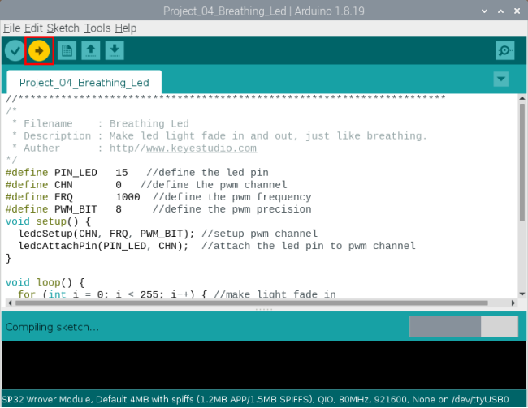
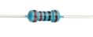
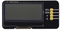
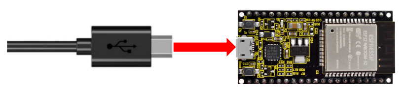
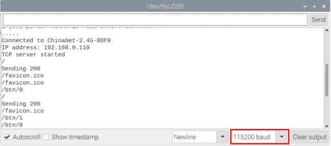

# RaspberryPi Arduino Project

Click on the link to enter the Raspberry Pi Arduino IDE tutorial: [Raspberry Pi Arduino IDE Tutoria](Preparation-for-RaspberryPi-Arduino.md)

## Download code files and Libraries files

Click on the link to download the code file: [Download Arduino C Codes file](Arduino-Codes.zip)

Click on the link to download the Libraries file: [Download Libraries file](Arduino-Libraries.zip)

## Project 01: Hello World

### 1.Introduction：

For ESP32 beginners, we'll start with some simple things. In this project, you just need an ESP32 mainboard, USB cable and Raspberry Pi to complete “Hello World\!” Project. It is not only a communication test for ESP32 mainboard and Raspberry Pi, but also a primary project for ESP32.

### 2.Components：

|  |  |
| --------------------------------------------------------- | --------------------------------------------------------- |
| ESP32*1                                                   | USB cable*1                                               |

### 3.Wiring：

In this project, we use a USB cable to connect the ESP32 to the Raspberry Pi.


### 4.Project code：

You can open the code we provide：（If you haven't downloaded the code file, please click on the link to download it：[Download Arduino C Codes file](Arduino-Codes.zip)）

The code used in this project is saved in folder(path :) **“Arduino-Codes\\Project 01：Hello  World\\Project\_01\_Hello\_World”**.

```c
//*************************************************************************************
/*
 * Filename    : Hello World
 * Description : Enter the letter R,and the serial port displays"Hello World".
 * Auther      :http//www.keyestudio.com
*/
char val;// defines variable "val"
void setup()
{
Serial.begin(115200);// sets baudrate to 115200
}
void loop()
{
  if (Serial.available() > 0) {
    val=Serial.read();// reads symbols assigns to "val"
    if(val=='R')// checks input for the letter "R"
    {  // if so,    
     Serial.println("Hello World!");// shows “Hello World !”.
    }
  }
}
//*************************************************************************************
```

Before uploading the project code to ESP32，click “Tools”→“Board” and select“ESP32 Wrover Module”.


Select the serial port.


Clickto download the code to ESP32.


**Note:** If uploading the code fails, you can press the Boot button on ESP32 after click, and release the Boot button after the percentage of uploading progress appears, as shown below:


The Project code is uploaded successfully！

### 5.Project result：

After the project code is uploaded successfully, power up with a USB cable and click the iconto enter the serial
monitor.

Set baud rate to 115200 and type "R" in the text box. Click "Send", and the serial monitor will display "Hello World\!”.

(**Note:** If you enter“R” in the text box and click“Send”, the serial monitor does not print“Hello World\!” , you need to press the RESET button on the ESP32 mainboard and repeat the above operation.)


## Project 02: Turn On LED

### 1.Introduction：

In this project, we will show you how to light up the LED. We use the ESP32's digital pin to turn on the LED so that the LED is lit up.

### 2.Components：

|                   |  |  |  |
| ---------------------------------------------------------- | ---------------------------------------------------------- | ---------------------------------------------------------- | ---------------------------------------------------------- |
| ESP32*1                                                    | Breadboard*1                                               | Jumper Wire*2                                              | USB Cable*1                                                |
|  |  |                                                            |                                                            |
| Red LED*1                                                  | 220Ω Resistor*1                                            |                                                            |                                                            |

### 3.Component knowledge：

（1）LED:


The LED is a semiconductor known as “light-emitting diode” , which is an electronic device made from semiconducting materials(silicon, selenium, germanium, etc.). It has an anode and a cathode, the short lead is cathode, which connects to GND; the long lead is anode, which connects to 3.3V or 5V.


（2）Five-color ring resistor

A resistor is an electronic component in a circuit that restricts or regulates the flow current flow. On the left is the appearance of the resistor and on the right is the symbol for the resistance in the circuit . Its unit is(Ω). 1 mΩ= 1000 kΩ，1kΩ= 1000Ω.


We can use resistors to protect sensitive 2.Components, such as LED. The strength of the resistance is marked on the body of the resistor with an electronic color code. Each color code represents a number, and you can refer to it in a resistance card.

\-Color 1 – 1st Digit.

\-Color 2 – 2nd Digit.

\-Color 3 – 3rd Digit.

\-Color 4 – Multiplier.

\-Color 5 – Tolerance.


In this kit, we provide three Five-color ring resistor with different resistance values. Take three Five-color ring resistor as an example.

220Ω Resistor\*10


10KΩ Resistor\*10


1KΩ Resistor\*10


In the same voltage, there will be less current and more resistance. The connection between current(I), voltage(V), and resistance(R) can be expressed by the formula: I=U/R. In the figure below, if the voltage is 3V, the current through R1 is: I = U / R = 3 V / 10 KΩ= 0.0003A= 0.3mA.


Don’t connect a low resistance directly to the two poles of the power supply. as this will cause excessive current to damage the electronic 2.Components. Resistors do not have positive and negative poles.

（3）Bread board

Breadboards are used to build and test circuits quickly before completing any circuit design. There are many holes in the breadboard that can be inserted into circuit 2.Components such as integrated circuits and resistors. A typical breadboard is shown below：


The breadboard has strips of metal , which run underneath the board and connect the holes on the top of the board. The metal strips are laid out as shown below. Note that the top and bottom rows of holes are connected horizontally，while the remaining holes are connected vertically.


The first two rows (top) and the last two rows (bottom) of the breadboard are used for the positive pole (+) and negative pole (-) of the power supply respectively. The conductive layout of the breadboard is shown in the figure below:


When we connect DIP (Dual In-line Packages) 2.Components, such as integrated circuits, microcontrollers, chips and so on, we can see that a groove in the middle isolates the middle part, so the top and bottom of the groove is not connected. DIP 2.Components can be connected as shown in the following diagram:


Power Supply

In this project, we connected the ESP32 to the Raspberry Pi by using USB cable.


### 4.Wiring diagram：

First, disconnect all power from the ESP32. Then build the circuit according to the 4.Wiring diagram. After the circuit is built and verified correct, connect the ESP32 to the Raspberry Pi by using a USB cable.

**Note:** Avoid any possible short circuits (especially connecting 3.3V and GND)\!

**WARNING:** A short circuit can cause high current in your circuit, create excessive component heat and cause permanent damage to your hardware\!


Note:

How to connect a LED


How to identify the 220Ω Five-color ring resistor


### 5.Project code：

You can open the code we provide：（If you haven't downloaded the code file, please click on the link to download it：[Download Arduino C Codes file](Arduino-Codes.zip)）

The code used in this project is saved in folder(path:) **“Arduino-Codes\\Project 02：Turn On LED\\Project\_02\_Turn\_On\_LED”**.

```c
//**********************************************************************
/*
 * Filename    : Turn On LED
 * Description : Make an led on.
 * Auther      : http//www.keyestudio.com
*/
##define LED_BUILTIN 15

// the setup function runs once when you press reset or power the board
void setup() {
  // initialize digital pin LED_BUILTIN as an output.
  pinMode(LED_BUILTIN, OUTPUT);
}
void loop() {
  digitalWrite(LED_BUILTIN, HIGH);   // turn the LED on (HIGH is the voltage level)
}
//*************************************************************************************
```


Before uploading the project code to ESP32，click “Tools”→“Board” and select“ESP32 Wrover Module”.


Select the serial port.


Clickto download the code to ESP32.


**Note:** If uploading the code fails, you can press the Boot button on ESP32 after click, and release the Boot
button after the percentage of uploading progress
appears, as shown below:


The Project code is uploaded successfully！


### 6.Project result：

After the project code was uploaded successfully, power up with a USB cable and the LED is lit up.


## Project 03：LED Flashing 

### 1.Introduction：

In this project, we will show you the LED flashing effect. We use the ESP32's digital pin to turn on the LED and make it flashing.

### 2.Components：

|                   |   |                                                             |                                                             |
| ---------------------------------------------------------- | ----------------------------------------------------------- | ----------------------------------------------------------- | ----------------------------------------------------------- |
| ESP32*1                                                    | Breadboard*1                                                |                                                             |                                                             |
|  |  |  |  |
| Red LED*1                                                  | 220Ω Resistor*1                                             | Jumper Wire*2                                               | USB Cable*1                                                 |

### 3.Wiring diagram：

First, disconnect all power from the ESP32. Then build the circuit according to the 4.Wiring diagram. After the circuit is built and verified correct, connect the ESP32 to your computer using a USB cable.

**Note:** Avoid any possible short circuits (especially connecting 3.3V and GND)\!

**WARNING:** A short circuit can cause high current in your circuit, create excessive component heat and cause permanent damage to your hardware\!


Note:

How to connect a LED


How to identify the 220Ω Five-color ring resistor


### 4.Project code：

You can open the code we provide: （If you haven't downloaded the code file, please click on the link to download it：[Download Arduino C Codes file](Arduino-Codes.zip)） 

The code used in this project is saved in folder **“Arduino-Codes\\Project 03：LED Flashing\\Project\_03\_LED\_Flashing”**.

```c
//**********************************************************************
/*
 * Filename    : External LED flashing
 * Description : Make an led blinking.
 * Auther      : http//www.keyestudio.com
*/
##define PIN_LED   15   //define the led pin

// the setup function runs once when you press reset or power the board
void setup() {
  // initialize digital pin LED as an output.
  pinMode(PIN_LED, OUTPUT);
}

// the loop function runs over and over again forever
void loop() {
  digitalWrite(PIN_LED, HIGH);   // turn the LED on (HIGH is the voltage level)
  delay(500);                       // wait for 0.5s
  digitalWrite(PIN_LED, LOW);    // turn the LED off by making the voltage LOW
  delay(500);                       // wait for 0.5s
}
//*************************************************************************************
```


Before uploading Project Code to ESP32, please check the configuration of Arduino IDE.

Click "**Tools**" to confirm the board type and port as shown below:


Clickto download the project code to ESP32.


**Note:** If uploading the code fails, you can press the Boot button on ESP32 after click, and release the Boot
button after the percentage of uploading progress
appears, as shown below:


The Project code is uploaded successfully！


### 5.Project result：

After the project code was uploaded successfully, power up with a USB cable and the LED start flashing.


## Project 04: Breathing Led

### 1.Introduction：

In previous studies, we know that LEDs have on/off state, so how to enter the intermediate state? How to output an intermediate state to make the LED half bright? That's what we're going to learn.

Breathing light, that is, LED is turned from off to on gradually, and gradually from on to off, just like "breathing". So, how to control the brightness of a LED? We will use ESP32’s PWM to achieve this target.

### 2.Components：

|                   |  |                                                             |                                                             |
| ----------------------------------------------------------- | ----------------------------------------------------------- | ----------------------------------------------------------- | ----------------------------------------------------------- |
| ESP32*1                                                     | Breadboard*1                                                |                                                             |                                                             |
|  |  |  |  |
| Red LED*1                                                   | 220Ω Resistor*1                                             | Jumper Wire*2                                               | USB Cable*1                                                 |

### 3.Component knowledge：


**Analog & Digital**

An Analog Signal is a continuous signal in both time and value. On the contrary, a Digital Signal or discrete time signal is a time series consisting of a sequence of quantities. Most signals in life are analog signals. A familiar example of an Analog Signal would be how the temperature throughout the day is continuously changing and could not suddenly change instantaneously from 0℃ to 10℃. However, Digital Signals can instantaneously change in value. This change is expressed in numbers as 1 and 0 (the basis of binary code). Their differences can more easily be seen when compared when graphed as below.


In practical application, we often use binary as the digital signal, that is a series of 0’s and 1’s. Since a binary signal only has two
values (0 or 1), it has great stability and reliability. Lastly, both analog and digital signals can be converted into the other.

**PWM：**

PWM, Pulse-Width Modulation, is a very effective method for using digital signals to control analog circuits. Common processors cannot directly output analog signals. PWM technology makes it very convenient to achieve this conversion (translation of digital to analog signals).

PWM technology uses digital pins to send certain frequencies of square waves, that is, the output of high levels and low levels, which alternately last for a while. The total time for each set of high levels and low levels is generally fixed, which is called the period (Note: the reciprocal of the period is frequency). The time of high level outputs are generally called “pulse width”, and the duty cycle is the percentage of the ratio of pulse duration, or pulse width (PW) to the total period (T) of the waveform.

The longer the output of high levels last, the longer the duty cycle and the higher the corresponding voltage in the analog signal will be. The following figures show how the analog signal voltages vary between 0V-3V3 (high level is 3V3) corresponding to the pulse width 0%-100%:


The longer the PWM duty cycle is, the higher the output power will be. Now that we understand this relationship, we can use PWM to control the brightness of an LED or the speed of DC motor and so on. It is evident from the above that PWM is not real analog, and the effective value of the voltage is equivalent to the corresponding analog. So, we can control the output power of the LED and other output modules to achieve different effects.

**ESP32 and PWM:**

On ESP32, the LEDC(PWM) controller has 16 separate channels, each of which can independently control frequency, duty cycle, and even accuracy. Unlike traditional PWM pins, the PWM output pins of ESP32 are configurable, with one or more PWM output pins per channel. The relationship between the maximum frequency and bit precision is shown in the following formula, where the maximum value of bit is 31.


For example, generate a PWM with an 8-bit precision (2<sup>8</sup>=256. Values range from 0 to 255) with a maximum frequency of 80,000,000/255 =312,500Hz.）

### 4.Wiring diagram：


Note:

How to connect a LED


How to identify the 220Ω Five-color ring resistor


### 5.Project code：

The design of this project makes the GP15 output PWM, and the pulse width gradually increases from 0% to 100%, and then gradually decreases from 100% to 0%.

You can open the code we provide：（If you haven't downloaded the code file, please click on the link to download it：[Download Arduino C Codes file](Arduino-Codes.zip)）

The code used in this project is saved in folder **“Arduino-Codes\\Project 04：Breathing Led\\Project\_04\_Breathing\_Led”**.

```c
//**********************************************************************
/*
 * Filename    : Breathing Led
 * Description : Make led light fade in and out, just like breathing.
 * Auther      : http//www.keyestudio.com
*/
##define PIN_LED   15   //define the led pin
##define CHN       0   //define the pwm channel
##define FRQ       1000  //define the pwm frequency
##define PWM_BIT   8     //define the pwm precision
void setup() {
  ledcSetup(CHN, FRQ, PWM_BIT); //setup pwm channel
  ledcAttachPin(PIN_LED, CHN);  //attach the led pin to pwm channel
}

void loop() {
  for (int i = 0; i < 255; i++) { //make light fade in
    ledcWrite(CHN, i);
    delay(10);
  }
  for (int i = 255; i > -1; i--) {  //make light fade out
    ledcWrite(CHN, i);
    delay(10);
  }
}
//*************************************************************************************
```


Before uploading Project Code to ESP32, please check the configuration of Arduino IDE.

Click "**Tools**" to confirm the board type and port as shown below:


Clickto download the project code to ESP32.



**Note:** If uploading the code fails, you can press the Boot button on ESP32 after click, and release the Boot
button after the percentage of uploading progress
appears, as shown below:


The Project code is uploaded successfully！


### 6.Project result：

After the project code was uploaded successfully, power up with a USB cable and the LED is turned from ON to OFF and then back from OFF to ONgradually like breathing.


## Project 05：Traffic Lights

### 1.Introduction：

Traffic lights are closely related to people's daily lives, which generally show red, yellow, and green. Everyone should obey the traffic rules, which can avoid many traffic accidents. In this project, we will use ESP32 and some LEDs (red, green and yellow) to simulate the traffic lights.

### 2.Components：

|                   |  |  |  |
| ----------------------------------------------------------- | ----------------------------------------------------------- | ------------------------------------------ | ----------------------------------------------------------- |
| ESP32*1                                                     | Bread board*1                                               | Red LED*1                                  | Yellow LED*1                                                |
|  |  |  |  |
| GreenLED*1                                                  | USB Cable*1                                                 | 220Ω Resistor*3                            | Jumper Wires                                                |

### 3.Wiring diagram：


Note:

How to connect a LED


How to identify the 220Ω Five-color ring resistor


### 4.Project code：

You can open the code we provide: （If you haven't downloaded the code file, please click on the link to download it：[Download Arduino C Codes file](Arduino-Codes.zip)）

The code used in this project is saved in folder **“Arduino-Codes\\Project 05：Traffic Lights\\Project\_05\_Traffic\_Lights”**.

```c
//**********************************************************************
/*
 * Filename    : Traffic Lights
 * Description : Simulated traffic lights.
 * Auther      : http//www.keyestudio.com
*/
##define PIN_LED_RED   0   //define the red led pin
##define PIN_LED_YELLOW   2   //define the yellow led pin
##define PIN_LED_GREEN  15   //define the green led pin

void setup() {
  pinMode(PIN_LED_RED, OUTPUT);
  pinMode(PIN_LED_YELLOW, OUTPUT);
  pinMode(PIN_LED_GREEN, OUTPUT);
}

void loop() {
   digitalWrite(PIN_LED_RED, HIGH);// turns on the red led
   delay(5000);// delays 5 seconds
   digitalWrite(PIN_LED_GREEN, LOW); // turns off the green led
   for(int i=0;i<3;i++)// flashes 3 times.
{
   delay(500);// delays 0.5 second
   digitalWrite(PIN_LED_YELLOW, HIGH);// turns on the yellow led
   delay(500);// delays 0.5 second
   digitalWrite(PIN_LED_YELLOW, LOW);// turns off the yellow led
} 
   delay(500);// delays 0.5 second
   digitalWrite(PIN_LED_GREEN, HIGH);// turns on the green led
   delay(5000);// delays 5 second
   digitalWrite(PIN_LED_RED, LOW);// turns off the red led
}
//*************************************************************************************
```


Before uploading Project Code to ESP32, please check the configuration of Arduino IDE.

Click "**Tools**" to confirm the board type and port as shown below:


Clickto download the project code to ESP32.


**Note:** If uploading the code fails, you can press the Boot button on ESP32 after click, and release the Boot button after the percentage of uploading progress appears, as shown below:


The Project code is uploaded successfully！


### 5.Project result：

After the project code was uploaded successfully, power up with a USB cable and you'll see are below:

① First, the green light will be on for five seconds and then off; 

② Next, the yellow light blinks three times and then goes off;

③ Then, the red light goes on for five seconds and then goes off;

④ Repeat steps 1 to 3 above.

## Project 06: RGB LED

### 1.Introduction：


RGB is composed of three colors (red, green and blue),which can emit different colors of light by mixing these three basic colors.

In this project, we will introduce the RGB and show you how to use ESP32 to control the RGB to emit different color light .RGB is pretty basic, but it’s also a great way to learn the fundamentals of electronics and coding.

### 2.Components：

|                   |  |                                            |                           |
| ------------------------------------------ | ------------------------------------------ | ------------------------------------------ | ------------------------- |
| ESP32*1                                    | Breadboard*1                               |                                            |                           |
|  |  |  |  |
| RGB LED*1                                  | 220Ω Resistor*3                            | Jumper Wires                               | USB Cable*1               |

### 3.Component knowledge：

Most monitors adopt the RGB color standard, and all colors on a computer screen are a mixture of red, green and blue in varying proportions.


This RGB LED has 4 pins, each color (red, green, blue) and a common cathode,To change its brightness, we can use the PWM of the ESP32 pins, which can give different duty cycle signals to the RGB to produce different colors of light.

If we use three 10-bit PWM to control the RGB, in theory, we can create 2 <sup>10</sup>\*2<sup>10</sup>\*2<sup>10</sup>=1,073,741,824(1 billion) colors through different combinations.

### 4.Wiring diagram：


Note:

How to connect a LED


How to identify the 220Ω Five-color ring resistor


### 5.Project code：

You can open the code we provide: （If you haven't downloaded the code file, please click on the link to download it：[Download Arduino C Codes file](Arduino-Codes.zip)）

The code used in this project is saved in folder **“Arduino-Codes\\Project 06：RGB LED\\Project\_06\_RGB\_LED”**.

```c
//**********************************************************************
/*
 * Filename    : RGB LED
 * Description : Use RGBLED to show random color.
 * Auther      : http//www.keyestudio.com
*/
int ledPins[] = {0, 2, 15};    //define red, green, blue led pins
const byte chns[] = {0, 1, 2};        //define the pwm channels
int red, green, blue;
void setup() {
  for (int i = 0; i < 3; i++) {   //setup the pwm channels,1KHz,8bit
    ledcSetup(chns[i], 1000, 8);
    ledcAttachPin(ledPins[i], chns[i]);
  }
}

void loop() {
  red = random(0, 256);
  green = random(0, 256);
  blue = random(0, 256);
  setColor(red, green, blue);
  delay(200);
}

void setColor(byte r, byte g, byte b) {
  ledcWrite(chns[0], 255 - r); //Common anode LED, low level to turn on the led.
  ledcWrite(chns[1], 255 - g);
  ledcWrite(chns[2], 255 - b);
}
//*************************************************************************************
```

### 6.Project result：

Compile and upload the code to ESP32, after the code is uploaded successfully, power up with a USB cable and you will see that the RGB LED starts to display random colors.

## Project 07: Flowing Water Light

### 1.Introduction：

In our daily life, we can see many billboards composed of different colors of LED. They constantly change the light (like water) to attract customers' attention. In this project, we will use ESP32 to control 10 leds to achieve the effect of flowing water.

### 2.Components：

|                   |                   |                           |                           |
| ------------------------------------------ | ------------------------------------------ | ------------------------- | ------------------------- |
| ESP32*1                                    | Breadboard*1                               |                           |                           |
|  |  |  |  |
| Red LED*1                                  | 220Ω Resistor*1                            | Jumper Wires              | USB Cable*1               |

### 3.Wiring diagram:


Note:

How to connect a LED


How to identify the 220Ω Five-color ring resistor


### 4.Project code：

This project is designed to make a flowing water lamp. Which are these actions: First turn LED \#1 ON, then turn it OFF. Then turn LED \#2 ON, and then turn it OFF... and repeat the same to all 10 LEDs until the last LED is turns OFF. This process is repeated to achieve the “movements” of flowing water.

You can open the code we provide: （If you haven't downloaded the code file, please click on the link to download it：[Download Arduino C Codes file](Arduino-Codes.zip)）

The code used in this project is saved in folder “**Arduino-Codes\\Project 07：Flowing Water Light\\Project\_07\_Flowing\_Water\_Light**”

```c
//**********************************************************************
/* 
 * Filename    : Flowing Water Light
 * Description : Using ten leds to demonstrate flowing lamp.
 * Auther      : http//www.keyestudio.com
*/
byte ledPins[] = {22, 21, 19, 18, 17, 16, 4, 0, 2, 15};
int ledCounts;

void setup() {
  ledCounts = sizeof(ledPins);
  for (int i = 0; i < ledCounts; i++) {
    pinMode(ledPins[i], OUTPUT);
  }
}

void loop() {
  for (int i = 0; i < ledCounts; i++) {
    digitalWrite(ledPins[i], HIGH);
    delay(100);
    digitalWrite(ledPins[i], LOW);
  }
  for (int i = ledCounts - 1; i > -1; i--) {
    digitalWrite(ledPins[i], HIGH);
    delay(100);
    digitalWrite(ledPins[i], LOW);
  }
}
//**********************************************************************
```

### 5.Project result：

Compile and upload the code to ESP32, after the code is uploaded successfully, power up with a USB cable and you will see that 10 LEDs will light up from left to right and then back from right to left.


## Project 08：1-Digit Digital Tube

### 1.Introduction：

A 1-Digit 7-Segment Display is an electronic display device that displays decimal numbers. It is widely used in digital clocks,
electronic meters, basic calculators and other electronic devices that display digital information. Eventhough they may not look modern enough, they are an alternative to more complex dot matrix displays and are easy to use in limited light conditions and strong sunlight. In this project, we will use ESP32 to control 1-Digit 7-segment display displays numbers.

### 2.Components：

|                   |                   |                                            |                                            |
| ------------------------------------------ | ------------------------------------------ | ------------------------------------------ | ------------------------------------------ |
| ESP32*1                                    | Breadboard*1                               |                                            |                                            |
|  |  |  |  |
| 1-Digit 7-Segment Display*1                | 220Ω Resistor*8                            | Jumper Wires                               | USB Cable*1                                |

### 3.Component knowledge：


**1-Digit 7-Segment Display principle:** Digital tube display is a semiconductor light emitting device,its basic unit is a light-emitting
diode (LED). Thedigital tube display can be divided into 7-segment display and 8-segment display according to the number of segments. The 8-segment display has one more LED unit than the 7-segment display (used for decimal point display). Each segment of the 7-segment display is a separate LED. According to the connection mode of the LED unit, the digital tube can be divided into a common anode digital tube and a common cathode digital tube.

In the common cathode 7-segment display, all the cathodes (or negative electrodes) of the segmented LEDs are connected together, so you should connect the common cathode to GND. To light up a segmented LED, you can set its associated pin to“HIGH”.

In the common anode 7-segment display, the LED anodes (positive electrodes) of all segments are connected together, so you should connect the common anode to “+5V”. To light up a segmented LED, you can set its associated pin to “LOW”.


Each part of the digital tube is composed of an LED. So when you use it, you also need to use a current limiting resistor. Otherwise, the LED will be damaged. In this experiment, we use an ordinary common cathode one-digit digital tube. As we mentioned above, you should connect the common cathode to GND. To light up a segmented LED, you can set its
associated pin to “HIGH”.

### 4.Wiring diagram：

Note: The direction of the 7-segment display inserted into the breadboard is consistent with the 4.Wiring diagram, with one more point in the lower right corner.


### 5.Project code：

The digital display is divided into 7 segments, and the decimal point display is divided into 1 segment. When certain numbers are displayed, the corresponding segment will be lit. For example, when the number 1 is displayed, segments b and c will be turned on.

You can open the code we provide: （If you haven't downloaded the code file, please click on the link to download it：[Download Arduino C Codes file](Arduino-Codes.zip)）

The code used in this project is saved in folder **“Arduino-Codes\\Project 08：1-Digit Digital
Tube\\Project\_08\_One\_Digit\_Digital\_Tube**.

```c
//**********************************************************************
/* 
 * Filename    : 1-Digit Digital Tube
 * Description : One Digit Tube displays numbers from 9 to 0.
 * Auther      : http//www.keyestudio.com
*/
// sets the IO PIN for every segment
int a=16; // digital PIN 16 for segment a
int b=4; // digital PIN 4 for segment b
int c=5; // digital PIN 5 for segment c
int d=18; // digital PIN 18 for segment d
int e=19; // digital PIN 19 for segment e
int f=22; // digital PIN 22 for segment f
int g=23; // digital PIN 23 for segment g
int dp=17; // digital PIN 17 for segment dp
void digital_0(void) // displays number 0
{
digitalWrite(a,HIGH);
digitalWrite(b,HIGH);
digitalWrite(c,HIGH);
digitalWrite(d,HIGH);
digitalWrite(e,HIGH);
digitalWrite(f,HIGH);
digitalWrite(g,LOW);
digitalWrite(dp,LOW);
}
void digital_1(void) // displays number 1
{
digitalWrite(a,LOW);
digitalWrite(b,HIGH);
digitalWrite(c,HIGH);
digitalWrite(d,LOW);
digitalWrite(e,LOW);
digitalWrite(f,LOW);
digitalWrite(g,LOW);
digitalWrite(dp,LOW);
}
void digital_2(void) // displays number 2
{
digitalWrite(a,HIGH);
digitalWrite(b,HIGH);
digitalWrite(c,LOW);
digitalWrite(d,HIGH);
digitalWrite(e,HIGH);
digitalWrite(f,LOW);
digitalWrite(g,HIGH);
digitalWrite(dp,LOW);
}
void digital_3(void) // displays number 3
{
digitalWrite(a,HIGH);
digitalWrite(b,HIGH);
digitalWrite(c,HIGH);
digitalWrite(d,HIGH);
digitalWrite(f,LOW);
digitalWrite(e,LOW);
digitalWrite(dp,LOW);
digitalWrite(g,HIGH);
}
void digital_4(void) // displays number 4
{
digitalWrite(a,LOW);
digitalWrite(b,HIGH);
digitalWrite(c,HIGH);
digitalWrite(d,LOW);
digitalWrite(e,LOW);
digitalWrite(f,HIGH);
digitalWrite(g,HIGH);
digitalWrite(dp,LOW);
}
void digital_5(void) // displays number 5
{
digitalWrite(a,HIGH);
digitalWrite(b,LOW);
digitalWrite(c,HIGH);
digitalWrite(d,HIGH);
digitalWrite(e,LOW);
digitalWrite(f,HIGH);
digitalWrite(g,HIGH);
digitalWrite(dp,LOW);
}
void digital_6(void) // displays number 6
{
digitalWrite(a,HIGH);
digitalWrite(b,LOW);
digitalWrite(c,HIGH);
digitalWrite(d,HIGH);
digitalWrite(e,HIGH);
digitalWrite(f,HIGH);
digitalWrite(g,HIGH);
digitalWrite(dp,LOW);
}
void digital_7(void) // displays number 7
{
digitalWrite(a,HIGH);
digitalWrite(b,HIGH);
digitalWrite(c,HIGH);
digitalWrite(d,LOW);
digitalWrite(e,LOW);
digitalWrite(f,LOW);
digitalWrite(g,LOW);
digitalWrite(dp,LOW);
}
void digital_8(void) // displays number 8
{
digitalWrite(a,HIGH);
digitalWrite(b,HIGH);
digitalWrite(c,HIGH);
digitalWrite(d,HIGH);
digitalWrite(e,HIGH);
digitalWrite(f,HIGH);
digitalWrite(g,HIGH);
digitalWrite(dp,LOW);
}
void digital_9(void) // displays number 9
{
digitalWrite(a,HIGH);
digitalWrite(b,HIGH);
digitalWrite(c,HIGH);
digitalWrite(d,HIGH);
digitalWrite(e,LOW);
digitalWrite(f,HIGH);
digitalWrite(g,HIGH);
digitalWrite(dp,LOW);
}
void setup()
{
  // initialize digital pin LED as an output.
  pinMode(a, OUTPUT);
  pinMode(b, OUTPUT);
  pinMode(c, OUTPUT);
  pinMode(d, OUTPUT);
  pinMode(e, OUTPUT);
  pinMode(f, OUTPUT);
  pinMode(g, OUTPUT);
  pinMode(dp, OUTPUT);
}
void loop()
{
while(1)
{
digital_9();// displays number 9
delay(1000); // waits a sencond
digital_8();// displays number 8
delay(1000); // waits a sencond
digital_7();// displays number 7
delay(1000); // waits a sencond
digital_6();// displays number 6
delay(1000); // waits a sencond
digital_5();// displays number 5
delay(1000); // waits a sencond
digital_4();// displays number 4
delay(1000); // waits a sencond
digital_3();// displays number 3
delay(1000); // waits a sencond
digital_2();// displays number 2
delay(1000); // waits a sencond
digital_1();// displays number 1
delay(1000);// waits a sencond
digital_0();// displays number 0
delay(1000);// waits a sencond
}}
//**********************************************************************
```

### 6.Project result：

Compile and upload the code to ESP32, after the code is uploaded successfully, power up with a USB cable and you will see that the display will display numbers from 9 to 0.

## Project 09：4-Digit Digital Tube

### 1.Introduction：

A 4-digit 7-segment display is a very practical display device and it is used for devices such as electronic clocks, score counters and the number of people in the park. Because of the low price, easy to use, more and more projects will use 4 Digit 7-segment display. In this project, we use ESP32 control 4-digit 7-segment display to display four digits.

### 2.Components：

|                   |   |                                             |
| ------------------------------------------ | ------------------------------------------- | ------------------------------------------- |
| ESP32*1                                    | Breadboard*1                                |                                             |
|  |  |  |
| 4-digit 7-segment display Module*1         | M-F Dupont Wires                            | USB Cable*1                                 |


### 3.Component knowledge：

**TM1650 4-digit 7-segment display：**It is a 12-pin 4-digit 7-segment display module with clock dots. The driver chip is TM1650 which only needs 2 signal lines to enable the microcontroller to control the 4-digit 7-segment display. The control interface level can be 5V or 3.3V.

Specifications of 4-bit 7-segment display module:

Working voltage: DC 3.3V-5V

Maximum current: 100MA

Maximum power: 0.5W

Schematic diagram of 4-digit 7-segment display module:


### 4.Wiring diagram：


### 5.Adding the TM1650 library：

This code uses a library named "**TM1650**", if you haven't installed it yet, please do so before learning. The steps to add third-party
libraries are as follows:


### 6.Project code：

After the **TM1650** library is added, You can open the code we provide：（If you haven't downloaded the code file, please click on the link to download it：[Download Arduino C Codes file](Arduino-Codes.zip)）

The code used in this project is saved in folder **“Arduino-Codes\\Project 09：4-Digit Digital
Tube\\Project\_09\_Four\_Digit\_Digital\_Tube”**.

```c
//**********************************************************************
/* 
 * Filename    : 4-Digit Digital Tube
 * Description : Four Digit Tube displays numbers from 1111 to 9999.
 * Auther      : http//www.keyestudio.com
*/
##include "TM1650.h"
##define CLK 22    //pins definitions for TM1650 and can be changed to other ports 
##define DIO 21
TM1650 DigitalTube(CLK,DIO);

void setup(){
  //DigitalTube.setBrightness();  //stes brightness from 0 to 7(default is 2)
  //DigitalTube.displayOnOFF();   // 0= off,1= on(default is 1)
  for(char b=1;b<5;b++){
    DigitalTube.clearBit(b);      //which bit to clear
  }
  DigitalTube.displayDot(1,true); // displays the first number
  DigitalTube.displayDot(2,true);
  DigitalTube.displayDot(3,true);
  DigitalTube.displayDot(4,true);
  DigitalTube.displayBit(3,0);    //which number to display. bit=1-4, number=0-9
}

void loop(){
  for(int num=0; num<10; num++){
    DigitalTube.displayBit(1,num);
    DigitalTube.displayBit(2,num);
    DigitalTube.displayBit(3,num);
    DigitalTube.displayBit(4,num);
    delay(1000);
  }  
 }
//**********************************************************************************
```

### 7.Project result：

Compile and upload the code to ESP32, after the code is uploaded successfully, power up with a USB cable and you will see that 4-digit 7-segment display displays four digits，and repeat these actions in an infinite loop.

## Project 10：8×8 Dot-matrix Display

### 1.Introduction：

Dot matrix display is an electronic digital display device that can display information on machine, clocks, public transport departure indicators and many other devices. In this project, we will use ESP32 control 8x8 LED dot matrix to display patterns.

### 2.Components：

|                    |                    |                                             |
| ------------------------------------------- | ------------------------------------------- | ------------------------------------------- |
| ESP32*1                                     | Breadboard*1                                |                                             |
|  |  |  |
| 8*8 dot matrix module*1                     | M-F Dupont Wires                            | USB Cable*1                                 |

### 3.Component knowledge：

**8\*8 dot matrix module**

The 8\*8 dot matrix is composed of 64 LEDs, and each LED is placed at the intersection of a row and a column. When using the single chip microcomputer to drive an 8\*8 dot matrix, we need 16 digital ports in total, which greatly wastes the data of the single chip microcomputer.To this end, we specially designed this module, using the HT16K33 chip to drive an 8\*8 dot matrix, and only need to use the I2C communication port of the MCU to control the 8\*8 dot matrix, which greatly saving the MCU resources.

Specifications of 8\*8 dot matrix module：

- Working voltage: DC 5V

- Current: 200MA

- Maximum power: 1W

- Schematic diagram of 8\*8 dot matrix module：


Some modules have three DIP switches that you can toggle at will. These switches are used to set the I2C communication address, the setting method is as follows. The module has fixed the communication address. A0, A1 and A2 are connected to GND, and the address is 0x70.


### 4.Wiring diagram：


### 5.Adding the HT16K33\_Lib\_For\_ESP32 library：

This code uses a library named “**HT16K33\_Lib\_For\_ESP32**”, if you haven't installed it yet, please do so before learning. The steps to add third-party libraries are as follows:


### 6.Project code：

After the **HT16K33\_Lib\_For\_ESP32** library is added, You can open the code we provide：（If you haven't downloaded the code file, please click on the link to download it：[Download Arduino C Codes file](Arduino-Codes.zip)）

The code used in this project is saved in folder **“Arduino-Codes\\Project 10：8×8 Dot-matrix Display\\Project\_10\_8×8\_Dot\_Matrix\_Display”.**

```c
//**********************************************************************************
/*
 * Filename    : 8×8 Dot-matrix Display
 * Description : 8x8 LED dot matrix display“Heart” pattern.
 * Auther      : http//www.keyestudio.com
*/
##include "HT16K33_Lib_For_ESP32.h"

##define SDA 21
##define SCL 22

ESP32_HT16K33 matrix = ESP32_HT16K33();

//The brightness values can be set from 1 to 15, with 1 darkest and 15 brightest
##define  A  15

byte result[8][8];
byte test1[8] = {0x00,0x42,0x41,0x09,0x09,0x41,0x42,0x00};

void setup()
{
  matrix.init(0x70, SDA, SCL);//Initialize matrix
  matrix.showLedMatrix(test1,0,0);
  matrix.show();
}

void loop()
{
  for (int i = 0; i <= 7; i++)
  {
    matrix.setBrightness(i);
    delay(100);
  }
  for (int i = 7; i > 0; i--)
  {
    matrix.setBrightness(i);
    delay(100);
  }
}
//**********************************************************************************
```

### 7.Project result：

Compile and upload the code to ESP32, after the code is uploaded successfully, power up with a USB cable and you will see that the 8\*8 dot matrix display “Smiling face” pattern.

## Project 11：74HC595N Control 8 LEDs 

### 1.Introduction：

In previous projects, we learned how to light up an LED.

With only 32 IO ports on ESP32, how do we light up a lot of leds? Sometimes it is possible to run out of pins on the ESP32, and you need to extend it with the shift register.You can use the 74HC595N chip to control 8 outputs at a time, taking up only a few pins on your microcontroller. In addition, you can also connect multiple registers together to further expand the output. In this project, we will use an ESP32, a 74HC595 chip and LEDs to make a flowing water light to understand the function of the 74HC595 chip.

### 2.Components：

|  |  |  |  |
| ------------------------- | ------------------------- | ------------------------- | ------------------------------------------------------------ |
| ESP32*1                   | Breadboard*1              | 74HC595N chip*1           | Jumper Wires                                                 |
|  |  |  |                                                              |
| 220ΩResistor*8            | Red LED*8                 | USB Cable*1               |                                                              |

### 3.Component knowledge：


**74HC595N Chip:** The 74HC595 chip is used to convert serial data into parallel data. A 74HC595 chip can convert the serial data of one byte into 8 bits, and send its corresponding level to each of the 8 ports correspondingly. With this characteristic, the 74HC595 chip can be used to expand the IO ports of an ESP32. At least 3 ports are required to control the 8 ports of the 74HC595 chip.


The ports of the 74HC595 chip are described as follows ：

| PIN                     | FUNCTION                                                     |
| ----------------------- | ------------------------------------------------------------ |
| Pin 13--OE              | Enable output, When this pin is in high level, Q0-Q7 is in high resistance state. When this pin is in low level, Q0-Q7 is in output mode. |
| Pin 14---SI             | Serial data Input, only enter one bit at a time, so you can enter eight consecutive times to form one byte. |
| Pin 10---SCLR           | Remove shift register: When this pin is in low level, the content in shift register will be cleared.. In this experiment, we connect VCC to maintain a high level. |
| Pin 11---SCK            | Serial shift clock: when its electrical level is rising, serial data input register will do a shift. |
| Pin 12---RCK            | Parallel Update Output: when its electrical level is rising, it will update the parallel data output. In this case, the data is output from ports Q0 to Q7 in parallel |
| Pin 9---SQH             | Serial data output: it can be connected to more 74HC595 in series. |
| Q0--Q7(Pin 15，Pin 1-7) | Parallel data output, can directly control the 8 segments of the digital tube. |

### 4.Wiring diagram：

Note: Note the orientation in which the 74HC595N chip is inserted.


### 5.Project code：

You can open the code we provide：（If you haven't downloaded the code file, please click on the link to download it：[Download Arduino C Codes file](Arduino-Codes.zip)）

The code used in this project is saved in folder **“Arduino-Codes\\Project 11：74HC595N Control 8 LEDs\\Project\_11\_74HC595N\_Control\_8\_LEDs**.


```c
//**********************************************************************
/* 
 * Filename    : 74HC595N Control 8 LEDs
 * Description : Use 74HC575N to drive ten leds to display the flowing light.
 * Auther      : http//www.keyestudio.com
*/
int dataPin = 14;   // Pin connected to DS of 74HC595(Pin14)  
int latchPin = 12;  // Pin connected to ST_CP of 74HC595(Pin12)
int clockPin = 13;  // Pin connected to SH_CP of 74HC595(Pin11)
void setup() {
      // set pins to output
      pinMode(latchPin, OUTPUT);
      pinMode(clockPin, OUTPUT);
      pinMode(dataPin, OUTPUT);
}
void loop() {
  // Define a one-byte variable to use the 8 bits to represent the state of 8 LEDs of LED bar graph.
  // This variable is assigned to 0x01, that is binary 00000001, which indicates only one LED light on.
  byte x = 0x01;    // 0b 0000 0001
  for (int j = 0; j < 8; j++) { // Let led light up from right to left
    writeTo595(LSBFIRST, x);
    x <<= 1; // make the variable move one bit to left once, then the bright LED move one step to the left once.
    delay(50);
  }
  delay(100);
  x = 0x80;       //0b 1000 0000
  for (int j = 0; j < 8; j++) { // Let led light up from left to right
    writeTo595(LSBFIRST, x);
    x >>= 1;    
    delay(50);
  }
  delay(100);
}
void writeTo595(int order, byte _data ) {
  // Output low level to latchPin
  digitalWrite(latchPin, LOW);
  // Send serial data to 74HC595
  shiftOut(dataPin, clockPin, order, _data);
  // Output high level to latchPin, and 74HC595 will update the data to the parallel output port.
  digitalWrite(latchPin, HIGH);
}
//**********************************************************************************
```

### 6.Project result：

Compile and upload the code to ESP32, after the code is uploaded successfully, power up with a USB cable and you will see that the 8 LEDs start flashing in flowing water mode.

## Project 12：Active Buzzer

### 1.Introduction：

Active buzzer is a sound component that is widely used as a sound component for computers, printers, alarms, electronic toys , phones and timers. It has an internal vibration source, just by connecting to a 5V power supply, it can continuously buzz. In this
project, we will use ESP32 to control the active buzzer to beep.

### 2.Components：

|  |  |  |                           |
| ------------------------- | ------------------------- | ------------------------- | ------------------------- |
| ESP32*1                   | Breadboard*1              | Active buzzer*1           |                           |
|  |  |  |  |
| NPN transistor(S8050)*1   | 1kΩResistor*1             | Jumper Wires              | USB Cable*1               |

### 3.Component knowledge：


**Active buzzer:** 

Active buzzer inside has a simple oscillator circuit, which can convert constant direct current into a certain frequency pulse signal. Once active buzzer receives a high level, it will produce sound. Passive buzzer is an internal without vibration source integrated electronic buzzer, it must be driven by 2k to 5k square wave, rather than a DC signal. The two buzzers are very similar in appearance, but one buzzer with a green circuit board is a passive buzzer, while the other buzzer with black tape is an active buzzer. Passive buzzers don't have positive polarity, but active buzzers have. As shown below:


Transistor:


Because the buzzer requires such large current that GPIO of ESP32 output capability cannot meet the requirement, a transistor of NPN type is needed here to amplify the current.

Transistor, the full name: semiconductor transistor, is a semiconductor device that controls current. Transistorcan be used to amplify weak signal, or works as a switch. It has three electrodes(PINs): base (b), collector (c) and emitter (e). When there is current passing between "be", "ce" will allow several-fold current (transistor magnification) pass, at this point, transistor works in the amplifying area. When current between "be" exceeds a certain value, "ce" will not allow current to increase any longer, at this point, transistor works in the saturation area. Transistor has two types as shown below: PNP and NPN, here are the PNP transistor and NPN transistor.


In our kit, the PNP transistor is marked with 8550, and the NPN transistor is marked with 8050.

Based on the transistor's characteristics, it is often used as a switch in digital circuits. As micro-controller's capacity to output current is very weak, we will use transistor to amplify current and drive large-current 2.Components.

When using NPN transistor to drive buzzer, we often adopt the following method. If GPIO outputs high level, current will flow through R1, the transistor will get conducted, and the buzzer will sound. If GPIO outputs low level, no current flows through R1, the transistor will not be conducted, and buzzer will not sound.

When using PNP transistor to drive buzzer, we often adopt the following method. If GPIO outputs low level, current will flow through R1, the transistor will get conducted, and the buzzer will sound. If GPIO outputs high level, no current flows through R1, the transistor will not be conducted, and buzzer will not sound.


### 4.Wiring diagram：


Note: The buzzer power supply in this circuit is 5V. On a 3.3V power supply, the buzzer can work, but will reduce the loudness.

### 5.Project code：

You can open the code we provide: （If you haven't downloaded the code file, please click on the link to download it：[Download Arduino C Codes file](Arduino-Codes.zip)）

The code used in this project is saved in folder **“Arduino-Codes\\Project 12：Active Buzzer\\Project\_12\_Active\_Buzzer”.**

```c
//**********************************************************************
/* 
 * Filename    : Active Buzzer
 * Description : Active buzzer beeps.
 * Auther      : http//www.keyestudio.com
*/
##define buzzerPin  15   //define buzzer pins

void setup ()
{
  pinMode (buzzerPin, OUTPUT);
}
void loop ()
{
  digitalWrite (buzzerPin, HIGH);
  delay (500);
  digitalWrite (buzzerPin, LOW);
  delay (500);
}
//**********************************************************************************
```

###  6.Project result：

Compile and upload the code to ESP32, after the code is uploaded successfully, power up with a USB cable and you will see that the active buzzer beeps.

## Project 13：Passive Buzzer

### 1.Introduction:

In a previous project, we studied an active buzzer, which can only make a sound and may make you feel very monotonous. In this project, we will learn a passive buzzer and use the ESP32 control it to work. Unlike the active buzzer, the passive buzzer can emit sounds of different frequencies.

### 2.Components：

|  |  |  |                           |
| ------------------------- | ------------------------- | ------------------------- | ------------------------- |
| ESP32*1                   | Breadboard*1              | Passive Buzzer *1         |                           |
|  |  |  |  |
| NPN transistor(S8050)*1   | 1kΩResistor*1             | Jumper Wires              | USB Cable*1               |

### 3.Component knowledge：


**Passive buzzer:** A passive buzzer is an integrated electronic buzzer with no internal vibration source and it has to be driven by 2K-5K square waves, not DC signals. The two buzzers are very similar in appearance, but one buzzer with a green circuit board is a passive buzzer and the other buzzer with black tape is an active buzzer. Passive buzzers cannot distinguish between positive polarity while active buzzers can.


**Transistor:** Please refer to Project 12.

### 4.Wiring diagram:


### 5.Project code：

You can open the code we provide: （If you haven't downloaded the code file, please click on the link to download it：[Download Arduino C Codes file](Arduino-Codes.zip)）

The code used in this project is saved in folder **“Arduino-Codes\\Project 13：Passive  Buzzer\\Project\_13\_Passive\_Buzzer**.

```c
//**********************************************************************
/*
 * Filename    : Passive Buzzer
 * Description : Passive Buzzer sounds the alarm.
 * Auther      : http//www.keyestudio.com
*/
##define LEDC_CHANNEL_0 0

// LEDC timer uses 13 bit accuracy

##define LEDC_TIMER_13_BIT  13

// Define tool I/O ports

##define BUZZER_PIN  15

//Create a musical melody list, Super Mario

int melody[] = {330, 330, 330, 262, 330, 392, 196, 262, 196, 165, 220, 247, 233, 220, 196, 330, 392, 440, 349, 392, 330, 262, 294, 247, 262, 196, 165, 220, 247, 233, 220, 196, 330, 392,440, 349, 392, 330, 262, 294, 247, 392, 370, 330, 311, 330, 208, 220, 262, 220, 262,

294, 392, 370, 330, 311, 330, 523, 523, 523, 392, 370, 330, 311, 330, 208, 220, 262,220, 262, 294, 311, 294, 262, 262, 262, 262, 262, 294, 330, 262, 220, 196, 262, 262,262, 262, 294, 330, 262, 262, 262, 262, 294, 330, 262, 220, 196};

//Create a list of tone durations

int noteDurations[] = {8,4,4,8,4,2,2,3,3,3,4,4,8,4,8,8,8,4,8,4,3,8,8,3,3,3,3,4,4,8,4,8,8,8,4,8,4,3,8,8,2,8,8,8,4,4,8,8,4,8,8,3,8,8,8,4,4,4,8,2,8,8,8,4,4,8,8,4,8,8,3,3,3,1,8,4,4,8,4,8,4,8,2,8,4,4,8,4,1,8,4,4,8,4,8,4,8,2};
void setup() {
pinMode(BUZZER_PIN, OUTPUT); // Set the buzzer to output mode
}

void loop() {

  int noteDuration; //Create a variable of noteDuration

  for (int i = 0; i < sizeof(noteDurations); ++i)

  {
      noteDuration = 800/noteDurations[i];

      ledcSetup(LEDC_CHANNEL_0, melody[i]*2, LEDC_TIMER_13_BIT);

      ledcAttachPin(BUZZER_PIN, LEDC_CHANNEL_0);

      ledcWrite(LEDC_CHANNEL_0, 50);

      delay(noteDuration * 1.30); //delay
  }
}
//**********************************************************************
```

### 6.Project result：

Compile and upload the code to ESP32, after the code is uploaded successfully, power up with a USB cable and you will see that the passive buzzer plays music.

## Project 14: Mini Table Lamp

### 1.Introduction：

Do you know that the ESP32 can light up an LED when you press a button? In this project, we will use ESP32、a button switch and an LED to make a mini table lamp.

### 2.Components：

|  |  |  |  |                           |
| ------------------------- | ------------------------- | ------------------------- | ------------------------- | ------------------------- |
| ESP32*1                   | Breadboard*1              | Button*1                  | 10KΩ Resistor*1           |                           |
|  |  |  |  |  |
| Red LED*1                 | 220Ω Resistor*1           | USB Cable*1               | Jumper Wires              | Button Cap*1              |

### **3.Component knowledge：**


**Button:** A button can control the circuit on and off, the button is plugged into a circuit, the circuit is disconnected when the button is not pressed. The circuit works when you press the button, but breaks again when you release it. Why does it only work when you press it? It starts from the internal structure of the button, which don’t allow current to travel from one end of the button to the other before it is pressed; When pressed, a metal strip inside the button connects the two sides to allow electricity to pass through.

The internal structure of the button is shown in the figure：. Before the button is pressed, 1 and 2 are on, 3 and 4 are also on, but 1, 3 or 1, 4 or 2, 3 or 2, 4 are off (not working). Only when the button is pressed, 1, 3 or 1, 4 or 2, 3 or 2, 4 are on.

The button switch is one of the most commonly used 2.Components in circuit design.

**Schematic diagram of the button:**  


What is button jitteritch circuit as "press the button and turn it on immediately", "press it again and turn it off immediately". In fact,

We think of the switch circuit as "press the button and turn it on immediately", "press it again and turn it off immediately". In fact,
this is not the case.

The button usually uses a mechanical elastic switch, and the mechanical elastic switch will produce a series of [shake](javascript:;) due to the
elastic action at the moment when the mechanical contact is opened and closed (usually about 10ms). As a result, the button switch will not immediately and stably turn on the circuit when it is closed, and it will not be completely and instantaneously disconnected when it is turned off.


How to eliminate the jitter?

There are two common methods, namely fix jitter in the software and hardware. We only discuss the jitter removal
in the software.

We already know that the jitter time generated by elasticity is about 10ms, and the delay command can be used to delay the
execution time of the command to achieve the effect of jitter removal.

Therefore, we delay 0.02s in the code to achieve the key anti-shake function.


### 4.Wiring diagram：


Note:

How to connect the LED


How to identify the 220Ω 5-band resistor and 10KΩ 5-band resistor


### 5.Project code：

You can open the code we provide: （If you haven't downloaded the code file, please click on the link to download it：[Download Arduino C Codes file](Arduino-Codes.zip)）

The code used in this project is saved in folder **“Arduino-Codes\\Project 14：Mini Table Lamp\\Project\_14\_Mini\_Table\_Lamp”**.

```c
//**********************************************************************
/* 
 * Filename    : Mini Table Lamp
 * Description : Make a table lamp.
 * Auther      : http//www.keyestudio.com
*/
##define PIN_LED    4
##define PIN_BUTTON 15
bool ledState = false;

void setup() {
  // initialize digital pin PIN_LED as an output.
  pinMode(PIN_LED, OUTPUT);
  pinMode(PIN_BUTTON, INPUT);
}

// the loop function runs over and over again forever
void loop() {
  if (digitalRead(PIN_BUTTON) == LOW) {
    delay(20);
    if (digitalRead(PIN_BUTTON) == LOW) {
      reverseGPIO(PIN_LED);
    }
    while (digitalRead(PIN_BUTTON) == LOW);
  }
}

void reverseGPIO(int pin) {
  ledState = !ledState;
  digitalWrite(pin, ledState);
}
//**********************************************************************
```

### 6.Project result：

Compile and upload the code to ESP32, after the code is uploaded successfully, power up with a USB cable and you will see that press the push button switch, the LED turns on; When it is released, the LED is still on. Press it again, and the LED turns off. When it is released, the LED stays off. Doesn't it look like a mini table lamp?

## Project 15：Tilt and LED

### 1.Introduction：

The ancients without electronic clock, so the hourglass are invented to measure time. The hourglass has a large capacity on both sides, and which is filled with fine sand on one side. What’s more, there is a small channel in the middle, which can make the hourglass stand upright , the side with fine sand is on the top. due to the effect of gravity,the fine sand will flow down through the channel to the other side of the hourglass. 

When the sand reaches the bottom, turn it upside down and record the number of times it has gone through the hourglass, therefore, the next day we can know the approximate time of the day by it. In this project, we will use ESP32 to control the tilt switch and LED lights to simulate an hourglass and make an electronic hourglass.

### 2.Components：

|  |  |  |  |
| ------------------------- | ------------------------- | ------------------------- | ------------------------- |
| ESP32*1                   | Tilt Switch*1             | Red LED*4                 | 10KΩ Resistor*1           |
|  |  |  |  |
| Breadboard*1              | 220Ω Resistor*4           | USB Cable*1               | Jumper Wires              |

### 3.Component knowledge：


Tilt switch is also called digital switch. Inside is a metal ball that  can roll. The principle of rolling the metal ball to contact with the
conductive plate at the bottom, which is used to control the on and off of the circuit. When it is a rolling ball tilt sensing switch with single directional trigger, the tilt sensor is tilted toward the trigger end (two gold-plated pin ends), the tilt switch is in a closed circuit and the voltage at the analog port is about 5V(binary number is 1023),

In this way, the LED will light up. When the tilting switch is in horizontal position or tilting to the other end, the tilting switch is
in open state the voltage of the analog port is about 0V (binary number is 0), the LED will turn off. In the program, we judge the state of the switch based on whether the voltage value of the analog port is greater than 2.5V (binary number is 512).

The internal structure of the tilt switch is used here to illustrate how it works, as shown below:


4.**4.Wiring diagram：**


Note:

How to connect the LED


How to identify the 220Ω 5-band resistor and 10KΩ 5-band resistor


### **4.Project code：**

You can open the code we provide: （If you haven't downloaded the code file, please click on the link to download it：[Download Arduino C Codes file](Arduino-Codes.zip)）

The code used in this project is saved in folder **“Arduino-Codes\\Project 15：Tilt And LED\\Project\_15\_Tilt\_And\_LED**.

```c
//**********************************************************************
/* 
 * Filename    : Tilt And LED
 * Description : Tilt switches and four leds to simulate an hourglass.
 * Auther      : http//www.keyestudio.com
*/
##define SWITCH_PIN  15  // the tilt switch is connected to Pin15
byte switch_state = 0;
void setup()
{
     for(int i=16;i<20;i++)
  {
        pinMode(i, OUTPUT);
  } 
    pinMode(SWITCH_PIN, INPUT);
 for(int i=16;i<20;i++)
  {
    digitalWrite(i,0);
  } 
  Serial.begin(9600);
}
void loop()
{
switch_state = digitalRead(SWITCH_PIN); 
Serial.println(switch_state);
 if (switch_state == 0) 
 {
 for(int i=16;i<20;i++)
  {
    digitalWrite(i,1);
    delay(500);
  } 
  }
   if (switch_state == 1) 
 {
   for(int i=19;i>15;i--)
   {
    digitalWrite(i,0);
    delay(500);
   }
  }
}
//**********************************************************************************
```

### 5.Project result：

Compile and upload the code to ESP32, after the code is uploaded successfully, power up with a USB cable and you will see that when you tilt the breadboard to an angle, the LEDs will light up one by one. When you turn the breadboard to the original angle, the LEDs will turn off one by one. Like the hourglass, the sand will leak out over time.

## Project 16：Burglar Alarm

### 1.Introduction：

The PIR motion sensor measures the thermal infrared (IR) light emitted by moving objects. The sensor can detect the movement of people、animals and carsto trigger safety alarms and lighting. They are used to detect movement and ideal for security such as burglar alarms and security lighting systems. In this project, we will use the ESP32 to control PIR motion sensor、buzzer and LED to simulate burglar alarm.

### 2.Components：

|  |     |  |   |                            |
| ------------------------- | ---------------------------- | ------------------------- | -------------------------- | -------------------------- |
| ESP32*1                   | Human Body Infrared Sensor*1 | Active Buzzer*1           | Red LED*1                  |                            |
|  |     |  |  |  |
| Breadboard*1              | M-F Dupont Wires             | 220ΩResistor*1            | USB Cable*1                | Jumper Wires               |

### 3.Component knowledge：


**PIR Motion  Sensor :** Its principle is that when some crystals, such as lithium tantalate and triglyceride sulfate are heated, the two ends of the crystal will generate an equal number of charges with opposite signs. These charges can be converted into voltage output by an amplifier. Due to the human body will release infrared light, although relatively weak, can still be detected. When the Human Body Infrared Sensor detects the movement of a nearby person,, the sensor signal terminal outputs a high level 1, otherwise, it outputs low level 0.

Special attention should be paid to the fact that this sensor can detect people、animals and cars in motion, which cannot be detected in static, and the maximum detection distance is about 7 meters.

**Note:** Since vulnerable to radio frequency radiation and temperature changes, the PIR motion sensor should be kept away from heat sources like radiators, heaters and air conditioners, as well as direct irradiation of sunlight, headlights and incandescent light.

Features:

- Maximum input voltage: DC 3.3 \~ 5V

- Maximum operating current: 50MA

- Maximum power: 0.3W

- Operating temperature: -20 \~ 85℃

- Output high level is 3V, low level is 0V.

- Delay time: about 2.3 to 3 seconds

- Detection Angle: about 100 degrees

- Maximum detection distance: about 7 meters

- Indicator light output (when the output is high, it will light up)

- Pin limiting current: 50MA


Schematic diagram:


### 4.Wiring diagram：


### 5.Project code：

You can open the code we provide: （If you haven't downloaded the code file, please click on the link to download it：[Download Arduino C Codes file](Arduino-Codes.zip)）

The code used in this project is saved in folder **“Arduino-Codes\\Project 16：Burglar Alarm\\Project\_16\_Burglar\_Alarm”**.

```c
//**********************************************************************
/* 
 * Filename    : Burglar Alarm
 * Description : Human infrared sensor buzzer and LED to simulate burglar alarm.
 * Auther      : http//www.keyestudio.com
*/
##define buzzerPin   2   // the pin of the buzzer
##define ledPin   0     // the pin of the PIR motion sensor
##define pirPin   15     // the pin of the PIR motion sensor
byte pirStat = 0;   // the state of the PIR motion sensor
void setup() {
 pinMode(buzzerPin, OUTPUT); 
 pinMode(ledPin, OUTPUT);    
 pinMode(pirPin, INPUT);     
}
void loop()
{
 pirStat = digitalRead(pirPin); 

 if (pirStat == HIGH)
 {            // if people or moving animals are detected
   digitalWrite(buzzerPin, HIGH);  // the buzzer buzzes
   digitalWrite(ledPin, HIGH);  // the led turn on
   delay(500);
   digitalWrite(buzzerPin, LOW);  // the buzzer doesn't sound
   digitalWrite(ledPin, LOW);  // the led turn off
   delay(500);
 } 
 else {
   digitalWrite(buzzerPin, LOW); // if people or moving animals are not detected, turn off buzzers
   digitalWrite(ledPin, LOW);  // the led turn off
 }
}
//*********************************************************************************
```

### 6.Project result：

Compile and upload the code to ESP32, after the code is uploaded successfully, power up with a USB cable and you will see that if the sensor detects someone moving nearby, the buzzer will continuously issue an alarm and the LED will continuously flash.

## Project 17： I2C 128×32 LCD

### 1.Introduction：

In everyday life, we can do all kinds of experiments with the display module and also DIY a variety of small objects. For example, you can make a temperature meter with a temperature sensor and display, or make a distance meter with an ultrasonic module and display. In this project, we will use the LCD\_128X32\_DOT module as the display and connect it to the ESP32, which will be used to control the LCD\_128X32\_DOT display to display various English words, common symbols and numbers.

### 2.Components：

|  |  |                            |
| -------------------------- | -------------------------- | -------------------------- |
| ESP32*1                    | Breadboard*1               |                            |
|  |  |  |
| LCD_128X32_DOT*1           | M-F Dupont Wires           | USB Cable*1                |

### 3.Component knowledge：


**LCD\_128X32\_DOT:** It is an LCD module with 128\*32 pixels and its driver chip is ST7567A. The module uses the IIC communication mode, while the code contains a library of all alphabets and common symbols that can be called directly. When using, we can also set it in the code so that the English letters and symbols show different text sizes. To make it easy to set up the pattern display, we also provide a mold capture software that converts a specific pattern into control code and then copies it directly into the test code for use.

Schematic diagram of LCD\_128X32\_DOT：


Features:

Pixel: 128\*32 character

Operating voltage(chip)：4.5V to 5.5V

Operating current：100mA (5.0V)

Optimal operating voltage(module):5.0V

### 4.Wiring diagram：


### 5.Adding the lcd128\_32\_io library：

If you have not downloaded the library file, please click on the link to download it:[Download Arduino Libraries](Arduino-Libraries.zip)

This code uses a library named "**lcd128\_32\_io**", if you haven't installed it yet, please do so before learning. The steps to add
third-party libraries are as follows:


### 6.Project code：

After the **lcd128\_32\_io** library was added, You can open the code we provide：（If you haven't downloaded the code file, please click on the link to download it：[Download Arduino C Codes file](Arduino-Codes.zip)）

The code used in this project is saved in folder **“Arduino-Codes\\Project 17： I2C 128×32 LCD2.C\_Tutorial\\2. Projects\\Project\_17\_I2C\_128\_32\_LCD”**.

```c
//**********************************************************************************
/*
 * Filename    : LCD 128*32
 * Description : LCD 128*32 display string
 * Auther      : http//www.keyestudio.com
*/
##include "lcd128_32_io.h"

//Create lCD128 *32 pin，sda--->21， scl--->22
lcd lcd(21, 22);

void setup() {
  lcd.Init(); //initialize
  lcd.Clear();  //clear
}

void loop() {
  lcd.Cursor(0, 4); //Set display position
  lcd.Display("KEYESTUDIO"); //Setting the display
  lcd.Cursor(1, 0);
  lcd.Display("ABCDEFGHIJKLMNOPQR");
  lcd.Cursor(2, 0);
  lcd.Display("123456789+-*/<>=$@");
  lcd.Cursor(3, 0);
  lcd.Display("%^&(){}:;'|?,.~\\[]");
}
//**********************************************************************************
```

### 7.Project result：

Compile and upload the code to ESP32, after the code is uploaded successfully, power up with a USB cable and you will see that the 128X32LCD module display will show“KEYESTUDIO”at the first line, “ABCDEFGHIJKLMNOPQR”will be displayed at the second line, “123456789+-\*/\<\>=$@”will be shown at the third line and“%^&(){}:;'|?,.\~\\\\\[\]”will be displayed at the fourth line.

## Project 18：Small Fan

### 1.Introduction：

In hot summer, we need electric fans to cool us down, so in this project, we will use ESP32 control 130 motor module and small fan blade to make a small electric fan.

### 2.Components：

|  |                     |  |      |
| -------------------------- | --------------------------------------------- | -------------------------- | ------------------------------ |
| ESP32*1                    | Breadboard*1                                  | Battery Holder*1           | Fan*1                          |
|  |                     |  |      |
| 130 Motor Module*1         | Keyestudio bread board special power module*1 | M-F Dupont Wires           | No.5 battery (self-provided)*6 |
|  |                                               |                            |                                |
| USB Cable*1                |                                               |                            |                                |

### 3.Component knowledge :


**130 motor module:** The motor control module uses the HR1124S motor control chip. which is a single-channel H-bridge driver chip for DC motor. The H-bridge driver part of the HR1124S uses low on-resistance PMOS and NMOS power tubes. The low on-resistance ensure low power loss of the chip and make the chip work safely for longer time In addition, In addition, the HR1124S has low standby current and low static operating current, which makes the HR1124S easy to use in toy solutions.

Features:

Working voltage: 5V

Working current: 200MA

Working power: 2W

Working temperature: -10℃\~ +50℃

Schematic diagram of 130 motor module：


Keyestudio Breadboard Power Supply Module：


1.Introduction:

This breadboard power supply module is compatible with 5V and 3.3V, which can be applied to MB102 breadboard. The module contains two channels of independent control, powered by the USB all the way.

The output voltage is constant for the DC5V, and another way is powered by DC6.5-12V, output controlled by the slide switch, respectively for DC 5V and DC 3.3V.

If the other power supply is DC 6.5-12v, when the slide switch is switched to +5V, the output voltages of the left and right lines of the module are DC 5V. When the slide switch is switched to +3V, the output voltage of the USB power supply terminal of the module is DC5V , and the output voltage of the DC 6.5-12V power supply terminal of the other power supply is DC3.3V.

Specification:

  - Applied to MB102 breadboard;

  - Input voltage：DC 6.5-12V or powered by USB;

  - Output voltage：3.3V or 5V

  - Max output current：\<700ma

  - Up and down two channels of independent control, one of which can be switched to 3.3V or 5V;
    

Comes with two sets of DC output pins, easy for external use.

### 4.Wiring diagram：


### 5.Project code：

You can open the code we provide: （If you haven't downloaded the code file, please click on the link to download it：[Download Arduino C Codes file](Arduino-Codes.zip)）

The code used in this project is saved in folder **“Arduino-Codes\\Project 18：Small Fan\\Project\_18\_ Small\_Fan”**.

```c
//**********************************************************************************
/*
 * Filename    : Small Fan
 * Description : Fan clockwise rotation,stop,counterclockwise rotation,stop,cycle.
 * Auther      : http//www.keyestudio.com
*/
##define Motorla    15  // the Motor_IN+ pin of the motor
##define Motorlb     2  // the Motor_IN- pin of the motor

void setup(){
  pinMode(Motorla, OUTPUT);//set Motorla to OUTPUT
  pinMode(Motorlb, OUTPUT);//set Motorlb to OUTPUT
}
void loop(){
//Set to rotate for 5s anticlockwise
  digitalWrite(Motorla,HIGH);
  digitalWrite(Motorlb,LOW);
  delay(5000);
//Set to stop rotating for 2s 
  digitalWrite(Motorla,LOW);
  digitalWrite(Motorlb,LOW);
  delay(2000);
//Set to rotate for 5s clockwise
  digitalWrite(Motorla,LOW);
  digitalWrite(Motorlb,HIGH);
  delay(5000);
//Set to stop rotating for 2s 
  digitalWrite(Motorla,LOW);
  digitalWrite(Motorlb,LOW);
  delay(2000);
}
//********************************************************************************
```

### 6.Project result：

Compile and upload the code to ESP32, after the code is uploaded successfully, power up with a USB cable and you will see thatthe small fan turns counterclockwise for 5 seconds and stops for 2 seconds, and then turns clockwise for 5 seconds and stops for 2 seconds, which repeats in an endless loop.

## Project 19：Servo Sweep

### 1.Introduction：

Servo is an electric motor that can rotate very precisely. At present, it has been widely used in toy cars, remote control
helicopters，airplanes，robots, etc. In this project, we will use ESP32 to control the rotation of the servo.

### 2.Components：

|  |  |  |
| -------------------------- | -------------------------- | -------------------------- |
| ESP32*1                    | Breadboard*1               | USB Cable*1                |
|  |  |                            |
| Servo*1                    | Jumper Wires               |                            |

### 3.Component knowledge：

Servo：


The servo is a kind of position servo driver, which is mainly composed of a housing、a circuit board、a copless motor、a gear and position detector. Its working principle is that the receiver or microcontroller sends a signal to the servo which has an internal reference circuit that generates a reference signal with a period of 20ms and a width of 1.5ms, and compares the DC bias voltage with the voltage of the potentiometer to output voltage difference. 

The IC on the circuit board determines the direction of rotation, and then drives the coreless motor to start rotation and transmits the power to the swing arm through the reduction gear, while the position detector sends back a signal to determine
whether it has reached the positioning. It is suitable for those control systems that require constant change of angle and can be maintained.

When the motor rotates at a certain speed, the potentiometer is driven by the cascade reduction gear to rotate so that the voltage difference is 0 and the motor stops rotating. The angle range of general servo rotation is 0 to 180 degrees.

The pulse period for controlling the servo is 20ms, the pulse width is 0.5ms to 2.5ms, and the corresponding position is -90 degrees to +90 degrees. The following is an example of a 180 degree servo：


Servo motors have many specifications, but they all have three connecting wires, which are brown, red, and orange (different brands may have different colors). The brown is GND, the red is the positive power supply, and the orange is the signal line.


### 4.Wiring diagram：

When supplying the servo, please note that the power supply voltage should be 3.3V-5V. Make sure there are no errors when connecting the servo to the power supply.


### 5.Adding the ESP32Servo library：

If you have not downloaded the library file, please click on the link to download it:[Download Arduino Libraries](Arduino-Libraries.zip)

This code uses a library named "**ESP32Servo**", If you haven't installed it yet, please do so before learning. The steps to add
third-party libraries are as follows:


### 6.Project code：

After the **ESP32Servo** library is added, You can open the code we provide：（If you haven't downloaded the code file, please click on the link to download it：[Download Arduino C Codes file](Arduino-Codes.zip)）

The code used in this project is saved in folder **“Arduino-Codes\\Project 19：Servo
Sweep\\Project\_19\_Servo\_Sweep”.**

```c
//**********************************************************************
/*
 * Filename    : Servo Sweep
 * Description : Control the servo motor for sweeping
 * Auther      : http//www.keyestudio.com
*/
##include <ESP32Servo.h>

Servo myservo;  // create servo object to control a servo

int posVal = 0;    // variable to store the servo position
int servoPin = 15; // Servo motor pin

void setup() {
  myservo.setPeriodHertz(50);           // standard 50 hz servo
  myservo.attach(servoPin, 500, 2500);  // attaches the servo on servoPin to the servo object
}
void loop() {

  for (posVal = 0; posVal <= 180; posVal += 1) { // goes from 0 degrees to 180 degrees
    // in steps of 1 degree
    myservo.write(posVal);       // tell servo to go to position in variable 'pos'
    delay(15);                   // waits 15ms for the servo to reach the position
  }
  for (posVal = 180; posVal >= 0; posVal -= 1) { // goes from 180 degrees to 0 degrees
    myservo.write(posVal);       // tell servo to go to position in variable 'pos'
    delay(15);                   // waits 15ms for the servo to reach the position
  }
}
//********************************************************************************
```

### 7.Project result：

Compile and upload the code to ESP32, after the code is uploaded successfully, power up with a USB cable and you will see that the Servo will rotate from 0 degrees to 180 degrees and then reverse the direction to make it rotate from 180 degrees to 0 degrees and repeat these actions in an endless loop.


## Project 20：Stepping Motor 

### 1.Introduction：

Stepper motor is the most important part of industrial robot 3D printer lathes and other mechanical equipment with accurate positioning. In this project, we will use ESP32 control ULN2003 stepper motor drive board to drive the stepper motor to rotate.

### 2.Components：

|  |                     |           |
| -------------------------- | --------------------------------------------- | ----------------------------------- |
| ESP32*1                    | Breadboard*1                                  | ULN2003 Stepper Motor Drive Board*1 |
|  |                     |           |
| Stepper Motor *1           | M-F Dupont Wires                              | USB Cable*1                         |
|  |                     |           |
| Battery Holder*1           | Keyestudio bread board special power module*1 | No.5 battery (self-provided)*6      |

### 3.Component knowledge：


**Stepper motor:** It is a motor controlled by a series of electromagnetic coils. It can rotate by the exact number of degrees (or
steps) needed, allowing you to move it to a precise position and keep it there. It does this by supplying power to the coil inside the motor in a very short time, but you must always supply power to the motor to keep it in the position you want. There are two basic types of stepping motors, namely unipolar stepping motor and bipolar stepping motor. In this project, we use a 28-BYJ48 unipolar stepper motor.


Working Principle:

The stepper motor is mainly composed of a stator and a rotor. The stator is fixed. As shown in the figure below, the part of the coil group A, B, C, and D will generate a magnetic field when the coil group is energized. The rotor is the rotating part. As follows, the middle part of the stator, two poles are permanent magnets.


Single -phase four beat: At the beginning, the coils of group A are turned on, and the poles of the rotor point at A coil. Next, the group A coil are disconnected, and the group B coils are turned on. The rotor will turn clockwise to the group B. Then, group B is disconnected, group C is turned on, and the rotor is turned to group C. After that, group C is disconnected, and group D is turned on, and the rotor is turned to group D. Finally, group D is disconnected, group A is turned on, and the rotor is turned to group A coils. Therefore, rotor turns 180° and continuously rotates B-C-D-A, which means it runs a circle (eight phase). As shown below, he rotation principle of stepper motor is A - B C - D - A.

You make order inverse(D - C - B - A - D .....) if you want to make stepper motor rotate anticlockwise.


Half-phase and eight beat: 8 beat adopts single and dual beat way，A - AB B - BC - C - CD - D - DA - A ...... ，rotor will rotate half phase in this order. For example, when A coil is electrified，rotor faces to A coil , then A and B coil are connected, on this condition, the strongest magnetic field produced lies in the central part of AB coil, which means rotating half-phase clockwise.

Stepper Motor Parameters:

The rotor rotates one circle when the stepper motor we provide rotates 32 phases and with the output shaft driven by 1:64 reduction geared set. Therefore the rotation (a circle) of output shaft requires 32 \* 64 =2048 phases.

The step angle of 4-beat mode of 5V and 4-phase stepper motor is 11.25. And the step angle of 8-beat mode is 5.625, the reduction ratio is 1:64.

**ULN2003Stepper Motor Drive Board:** It is a stepper motor driver, which converts the weak signal into a stronger control signal to drive the stepper motor. 

The following schematic diagram shows how to use the ULN2003 stepper motor driver board interface to connect a unipolar stepper motor to the pins of the ESP32, and shows how to use four TIP120 interfaces.


### 4.Wiring diagram：


### 5.Project code：

You can open the code we provide: （If you haven't downloaded the code file, please click on the link to download it：[Download Arduino C Codes file](Arduino-Codes.zip)）

The code used in this project is saved in folder **“Arduino-Codes\\Project 20：Stepping Motor\\Project\_20\_Stepping\_Motor”**.

```c
//**********************************************************************
/*
 * Filename    : Drive Stepper Motor
 * Description : Use ULN2003 to drive the stepper motor.
 * Auther      : http//www.keyestudio.com
*/
// Conncet the port of the stepper motor driver
int outPorts[] = {15, 16, 17, 18};

void setup() {
  // set pins to output
  for (int i = 0; i < 4; i++) {
    pinMode(outPorts[i], OUTPUT);
  }
}

void loop()
{
  // Rotate a full turn
  moveSteps(true, 32 * 64, 3);
  delay(1000);
  // Rotate a full turn towards another direction
  moveSteps(false, 32 * 64, 3);
  delay(1000);
}

//Suggestion: the motor turns precisely when the ms range is between 3 and 20
void moveSteps(bool dir, int steps, byte ms) {
  for (unsigned long i = 0; i < steps; i++) {
    moveOneStep(dir); // Rotate a step
    delay(constrain(ms,3,20));        // Control the speed
  }
}

void moveOneStep(bool dir) {
  // Define a variable, use four low bit to indicate the state of port
  static byte out = 0x01;
  // Decide the shift direction according to the rotation direction
  if (dir) {  // ring shift left
    out != 0x08 ? out = out << 1 : out = 0x01;
  }
  else {      // ring shift right
    out != 0x01 ? out = out >> 1 : out = 0x08;
  }
  // Output singal to each port
  for (int i = 0; i < 4; i++) {
    digitalWrite(outPorts[i], (out & (0x01 << i)) ? HIGH : LOW);
  }
}

void moveAround(bool dir, int turns, byte ms){
  for(int i=0;i<turns;i++)
    moveSteps(dir,32*64,ms);
}
void moveAngle(bool dir, int angle, byte ms){
  moveSteps(dir,(angle*32*64/360),ms);
}
//********************************************************************************
```

### 6.Project result：

Compile and upload the code to ESP32, after the code is uploaded successfully, power up with a USB cable and you will see that the four LEDs ( D1,D2,D3 ,D4) on the ULN2003 drive module will light up. The stepper motor rotates clockwise first, then counterclockwise, and repeat these actions in an endless loop.


## Project 21：Relay

### 1.Introduction：

In our daily life, we usually use communication to drive electrical equipments, and sometimes we use switches to control electrical equipments. If the switch is connected directly to the ac circuit, leakage occurs and people are in danger. Therefore, from the perspective of safety, we specially designed this relay module with NO(normally open) end and NC(normally closed) end. In this project, we will learn a relatively special and easy-to-use switch, which is the relay module.

### 2.Components：

|  |  |  |  |  |
| -------------------------- | -------------------------- | -------------------------- | -------------------------- | -------------------------- |
| ESP32*1                    | Breadboard*1               | Relay Module*1             | M-F Dupont Wires           | USB Cable*1                |

### 3.Component knowledge：

**Relay:** It is an "automatic switch" that uses a small current to control the operation of a large current.

Input voltage：3.3V-5V

Rated load：5A 250VAC (NO/NC) 5A 24VDC (NO/NC)

The rated load means that devices with dc voltage of 24V or AC voltage of 250V can be controlled using 3.3V-5V microcontrollers.

Schematic diagram of Relay：


### 4.Wiring diagram：


### 5.Project code：

You can open the code we provide: （If you haven't downloaded the code file, please click on the link to download it：[Download Arduino C Codes file](Arduino-Codes.zip)）

The code used in this project is saved in folder **“Arduino-Codes\\Project 21：Relay\\Project\_21\_Relay”**.

```c
//**********************************************************************************
/*
 * Filename    : Relay
 * Description : Relay turn on and off.
 * Auther      : http//www.keyestudio.com
*/
##define  Relay  15 // defines digital 15
void setup()
{
pinMode(Relay, OUTPUT); // sets "Relay" to "output"
}
void loop()
{
digitalWrite(Relay, HIGH); // turns on the relay
delay(1000); //delays 1 seconds
digitalWrite(Relay, LOW); // turns off the relay
delay(1000); // delays 1 seconds
}
//**********************************************************************************
```

### 6.Project result：

Compile and upload the code to ESP32, after the code is uploaded successfully, power up with a USB cable and you will see that the relay will cycle on and off, on for 1 second, off for 1 second.  At the same time, you can hear the sound of the relay on and off, and you can also see the change of the indicator light on the relay.

## Project 22：Dimming Light

### 1.Introduction：

A potentiometer is a three-terminal resistor with sliding or rotating contacts that forms an adjustable voltage divider. It works by changing the position of the sliding contacts across a uniform resistance. In the potentiometer, the entire input voltage is applied across the whole length of the resistor, and the output voltage is the voltage drop between the fixed and sliding contact.

In this project, we will learn how to use ESP32 to read the values of the potentiometer, and make a dimming lamp with LED.

### 2.Components：

|  |  |  |  |
| -------------------------- | -------------------------- | -------------------------- | -------------------------- |
| ESP32*1                    | Breadboard*1               | Potentiometer*1            | Red LED*1                  |
|  |  |  |                            |
| 220ΩResistor*1             | Jumper Wires               | USB Cable*1                |                            |

### 3.Component knowledge：


**Adjustable potentiometer:** It is a kind of resistor and an analog electronic component, which has two states of 0 and 1(high level and low level). The analog quantity is different, its data state presents a linear state such as 1 \~ 1024。

**ADC :** An ADC is an electronic integrated circuit used to convert analog signals such as voltages to digital or binary form consisting of 1s and 0s. The range of our ADC on ESP32 is 12 bits, that means the resolution is 2^12=4096, and it represents a range (at 3.3V) will be divided equally to 4096 parts. The rage of analog values corresponds to ADC values. So the more bits the ADC has, the denser the partition of analog will be and the greater the precision of the resulting conversion.


Subsection 1: the analog in rang of 0V---3.3/4095 V corresponds to digital 0;

Subsection 2: the analog in rang of 3.3/4095 V---2\*3.3 /4095V corresponds to digital 1;

The following analog will be divided accordingly.

The conversion formula is as follows:


**DAC：** The reversing of this process requires a DAC, Digital-to-Analog Converter. The digital I/O port can output high level and low level (0 or 1), but cannot output an intermediate voltage value. This is where a DAC is useful. ESP32 has two DAC output pins with 8-bit accuracy, GPIO25 and GPIO26, which can divide VCC

(here is 3.3V) into 2^8=256 parts. For example, when the digital quantity is 1, the output voltage value is 3.3/256 \*1 V, and when the digital quantity is 128, the output voltage value is 3.3/256*128=1.65V, the higher the accuracy of DAC, the higher the accuracy of output voltage value will be.

The conversion formula is as follows:


**ADC on ESP32：**

ESP32 has 16 pins can be used to measure analog signals. GPIO pin sequence number and analog pin definition are shown in the following table：

| **ADC number in ESP32** | **ESP32 GPIO number** |
| ----------------------- | --------------------- |
| **ADC0**                | **GPIO 36**           |
| **ADC3**                | **GPIO 39**           |
| **ADC4**                | **GPIO 32**           |
| **ADC5**                | **GPIO33**            |
| **ADC6**                | **GPIO34**            |
| **ADC7**                | **GPIO 35**           |
| **ADC10**               | **GPIO 4**            |
| **ADC11**               | **GPIO0**             |
| **ADC12**               | **GPIO2**             |
| **ADC13**               | **GPIO15**            |
| **ADC14**               | **GPIO13**            |
| **ADC15**               | **GPIO 12**           |
| **ADC16**               | **GPIO 14**           |
| **ADC17**               | **GPIO27**            |
| **ADC18**               | **GPIO25**            |
| **ADC19**               | **GPIO26**            |


**DAC on ESP32：**

ESP32 has two 8-bit digital analog converters to be connected to GPIO25 and GPIO26 pins, respectively, and it is immutable. As shown in the following table：

| **Simulate pin number** | **GPIO number** |
| ----------------------- | --------------- |
| **DAC1**                | **GPIO25**      |
| **DAC2**                | **GPIO26**      |


The DAC pin number is already defined in ESP32's code base; for example, you can replace GPIO25 with DAC1 in the code.

### 4.**Read the ADC value，DAC value and voltage value of the potentiometer：**

We connect the potentiometer to the analog IO port of ESP32 to read the ADC value，DAC value and voltage value of the potentiometer, please refer to the 4.Wiring diagram below：


You can open the code we provide: （If you haven't downloaded the code file, please click on the link to download it：[Download Arduino C Codes file](Arduino-Codes.zip)）

The code used in this project is saved in folder **“Arduino-Codes\\Project 22：Dimming Light\\Project\_22.1\_Read\_Potentiometer\_Analog\_Value”**.

```c
//**********************************************************************************
/*  
 * Filename    : Read Potentiometer Analog Value
 * Description : Basic usage of ADC，DAC and Voltage
 * Auther      : http//www.keyestudio.com
*/
##define PIN_ANALOG_IN  36  //the pin of the Potentiometer

void setup() {
  Serial.begin(115200);
}

//In loop()，the analogRead() function is used to obtain the ADC value, and then the map() function is used to convert the value into an 8-bit precision DAC value. The input and output voltage are calculated according to the previous formula, and the information is finally printed out.
void loop() {
  int adcVal = analogRead(PIN_ANALOG_IN);
  int dacVal = map(adcVal, 0, 4095, 0, 255);
  double voltage = adcVal / 4095.0 * 3.3;
  Serial.printf("ADC Val: %d, \t DAC Val: %d, \t Voltage: %.2fV\n", adcVal, dacVal, voltage);
  delay(200);
}
//**********************************************************************************
```


Compile and upload the code to ESP32, after the code is uploaded successfully, power up with a USB cable, open the serial monitor and set the baud rate to 115200. You need to press the reset button on the ESP32 mainboard first, and then you will see that the serial port monitor window will print out the ADC value、DAC value and voltage value of the potentiometer. When turning the potentiometer handle, the ADC value、DAC value and voltage value will change. As shown below:


### 5.Wiring diagram of the dimming lamp：

In the previous step, we read the ADC value，DAC value and voltage value of the potentiometer. Now we need to convert the ADC value of the potentiometer into the brightness of the LED to make a lamp that can adjust the brightness.The 4.Wiring diagram is as follows:


### 6.Project code：

You can open the code we provide: （If you haven't downloaded the code file, please click on the link to download it：[Download Arduino C Codes file](Arduino-Codes.zip)）

The code used in this project is saved in folder **“Arduino-Codes\\Project 22：Dimming Light\\Project\_22.2\_Dimming\_Light”**.

```c
//**********************************************************************************
/*  
 * Filename    : Dimming Light
 * Description : Controlling the brightness of LED by potentiometer.
 * Auther      : http//www.keyestudio.com
*/
##define PIN_ANALOG_IN    36  //the pin of the potentiometer
##define PIN_LED     15  // the pin of the LED
##define CHAN            0
void setup() {
  ledcSetup(CHAN, 1000, 12);
  ledcAttachPin(PIN_LED, CHAN);
}

void loop() {
  int adcVal = analogRead(PIN_ANALOG_IN); //read adc
  int pwmVal = adcVal;        // adcVal re-map to pwmVal
  ledcWrite(CHAN, pwmVal);    // set the pulse width.
  delay(10);
}
//**********************************************************************************
```

### 7.Project result：

Compile and upload the code to ESP32, after the code is uploaded successfully, power up with a USB cable and you will see that turn the potentiometer handle and the brightness of the LED will change accordingly.


## Project 23：Flame Alarm

### 1.Introduction：

Fire is a terrible disaster and fire alarm systems are very useful in houses、commercial buildings and factories. In this project, we will use ESP32 to control a flame sensor, a buzzer and a LED to simulate fire alarm devices. This is a meaningful maker activity.

### 2.Components：

|  |  |  |  |
| -------------------------- | -------------------------- | -------------------------- | -------------------------- |
| ESP32*1                    | Breadboard*1               | Red LED*1                  | Active Buzzer*1            |
|  |  |  |  |
| Flame Sensor*1             | 220ΩResistor*1             | 10KΩResistor*1             | Jumper Wires               |
|  |  |  |                            |
| NPN transistor(S8050)*1    | 1kΩ Resistor*1             | USB Cable*1                |                            |

### 3.Component knowledge：


The flame emits a certain amount IR light that is invisible to the human eye, but our flame sensor can detect it and alert a microcontroller(such as ESP32) that a fire has been detected. It has a specially designed infrared receiver tube to detect the flame and then convert the flame brightness into a fluctuating level signal. The short pin of the receiving triode is negative pole and the other long pin is positive pole. We should connect the short pin (negative) to 5V and the long pin(positive) to the analog pin, a resistor and GND. As shown in the figure below：


**Note:** Since vulnerable to radio frequency radiation and temperature changes, the flame sensor should be kept away from heat sources like radiators, heaters and air conditioners, as well as direct irradiation of sunlight, headlights and incandescent light.

### 4.**Read the ADC value，DAC value and voltage value of the flame sensor：**

We first use a simple code to read the ADC value，DAC value and voltage value of the flame sensor and print them out. Please refer to the 4.Wiring diagram below：


You can open the code we provide: （If you haven't downloaded the code file, please click on the link to download it：[Download Arduino C Codes file](Arduino-Codes.zip)）

The code used in this project is saved in folder **“Arduino-Codes\\Project 23：Flame Alarm\\Project\_23.1\_Read\_Analog\_Value\_Of\_Flame\_Sensor”**.

```c
//**********************************************************************************
/*  
 * Filename    : Read Analog Value Of Flame Sensor
 * Description : Basic usage of ADC，DAC and Voltage
 * Auther      : http//www.keyestudio.com
*/
##define PIN_ANALOG_IN  36  //the pin of the Flame sensor

void setup() {
  Serial.begin(115200);
}

//In loop()，the analogRead() function is used to obtain the ADC value, and then the map() function is used to convert the value into an 8-bit precision DAC value. The input and output voltage are calculated according to the previous formula, and the information is finally printed out.
void loop() {
  int adcVal = analogRead(PIN_ANALOG_IN);
  int dacVal = map(adcVal, 0, 4095, 0, 255);
  double voltage = adcVal / 4095.0 * 3.3;
  Serial.printf("ADC Val: %d, \t DAC Val: %d, \t Voltage: %.2fV\n", adcVal, dacVal, voltage);
  delay(200);
}
//**********************************************************************************
```


Compile and upload the code to ESP32, after the code is uploaded successfully, power up with a USB cable, open the serial monitor and set the baud rate to 115200. You need to press the reset button on the ESP32 mainboard first, and then you will see that the serial port monitor window will print out the ADC value，DAC value and voltage value of the flame sensor. When the sensor is closed to fire,the ADC value，DAC value and voltage value will get greater.Conversely, the ADC value、DAC value and voltage value decrease.


### 5.Wiring diagram of the flame alarm：

Next, we will use a flame sensor, a buzzer, and a LED to make an interesting project, that is flame alarm. When flame is detected, the LED flashes and the buzzer alarms.


### **6.Project code：**

（Note： the threshold of 500 in the code can be reset itself as required)

You can open the code we provide: （If you haven't downloaded the code file, please click on the link to download it：[Download Arduino C Codes file](Arduino-Codes.zip)）

The code used in this project is saved in folder **“Arduino-Codes\\Project 23：Flame Alarm\\Project\_23.2\_Flame\_Alarm”**.

```c
//**********************************************************************************
/*  
 * Filename    : Flame Alarm
 * Description : Controlling the buzzer and LED by flame sensor.
 * Auther      : http//www.keyestudio.com
*/
##define PIN_ADC0      36  //the pin of the flame sensor
##define PIN_LED       15  // the pin of the LED
##define PIN_BUZZER    4  // the pin of the buzzer

void setup() {
  pinMode(PIN_LED, OUTPUT);
  pinMode(PIN_BUZZER, OUTPUT);
  pinMode(PIN_ADC0, INPUT);
}

void loop() {
  int adcVal = analogRead(PIN_ADC0); //read the ADC value of flame sensor
  if (adcVal >= 500) {
    digitalWrite (PIN_BUZZER, HIGH); //turn on buzzer
    digitalWrite(PIN_LED, HIGH); // turn on LED
    delay(500); // wait a second.
    digitalWrite (PIN_BUZZER, LOW);
    digitalWrite(PIN_LED, LOW); // turn off LED
    delay(500); // wait a second
  }
 else
 {
    digitalWrite(PIN_LED, LOW);  //turn off LED
    digitalWrite (PIN_BUZZER, LOW); //turn off buzzer
  }
}
//**********************************************************************************
```

### 7.Project result：

Compile and upload the code to ESP32, after the code is uploaded successfully, power up with a USB cable and you will see that when the flame sensor detects the flame, the LED will flash and the buzzer will alarm; otherwise, the LED does not light up and the buzzer does not sound.

## Project 24：Night Lamp

### 1.Introduction：

Sensors or 2.Components are ubiquitous in our daily life. For example, some public street lamps will automatically turn on at night and turn off during the day. Why? In fact, this make use of a photosensitive element that senses the intensity of external ambient light. When the outdoor brightness decreases at night, the street lights will turn on automatically; In the daytime, the street lights will automatically turn off. the principle of which is very simple, In this Project, we use ESP32 to control a LED to achieve the effect of the street light.

### 2.Components：

|  |  |  |  |
| -------------------------- | -------------------------- | -------------------------- | -------------------------- |
| ESP32*1                    | Breadboard*1               | Red LED*1                  | 10KΩResistor*1             |
|  |  |  |  |
| Photoresistor*1            | 220ΩResistor*1             | Jumper Wires               | USB Cable*1                |

### 3.Component knowledge：


**Photoresistor :** It is a kind of photosensitive resistance, its principle is that the photoresistor surface receives brightness (light)
to reduce the resistance, the resistance value will change with the detected intensity of the ambient light . With this characteristic, we can use the photosensitive resistance to detect the light intensity. Photosensitive resistance and its electronic symbol are as follows：


The following circuit is used to detect changes in resistance values of photoresistors：


In the circuit above, when the resistance of the photoresistor changes due to the change of light intensity, the voltage between thephotoresistor and resistance R2 will also change. Thus, the intensity of light can be obtained by measuring this voltage.

### 4. **Read the ADC value，DAC value and voltage value of the photoresistor：**

We first use a simple code to read the ADC value，DAC value and voltage value of the photoresistor and print them out. Please refer to the following 4.Wiring diagram：


You can open the code we provide: （If you haven't downloaded the code file, please click on the link to download it：[Download Arduino C Codes file](Arduino-Codes.zip)）

The code used in this project is saved in folder **“Arduino-Codes\\Project 24：Night Lamp\\Project\_24.1\_Read\_Photosensitive\_Analog\_Value”**.

```c
//**********************************************************************************
/*  
 * Filename    : Read Photosensitive Analog Value
 * Description : Basic usage of ADC
 * Auther      : http//www.keyestudio.com
*/
##define PIN_ANALOG_IN  36  //the pin of the photosensitive sensor

void setup() {
  Serial.begin(115200);
}

//In loop()，the analogRead() function is used to obtain the ADC value, and then the map() function is used to convert the value into an 8-bit precision DAC value. The input and output voltage are calculated according to the previous formula, and the information is finally printed out.
void loop() {
  int adcVal = analogRead(PIN_ANALOG_IN);
  int dacVal = map(adcVal, 0, 4095, 0, 255);
  double voltage = adcVal / 4095.0 * 3.3;
  Serial.printf("ADC Val: %d, \t DAC Val: %d, \t Voltage: %.2fV\n", adcVal, dacVal, voltage);
  delay(200);
}
//**********************************************************************************
```


Compile and upload the code to ESP32, after the code is uploaded successfully, power up with a USB cable, open the serial monitor and set the baud rate to 115200. You need to press the reset button on the ESP32 mainboard first, and then you will see that the serial port monitor window will print out the ADC value, DAC value and voltage value of the photoresistor. When the light intensity around the photoresistor is gradually reduced, the ADC value, DAC value and voltage value will gradually increase. On the contrary, the ADC value，DAC value and voltage value decreases gradually.


### 5.Wiring diagram of the light-controlled lamp：

We made a small dimming lamp in the front, now we will make a light controlled lamp. The principle is the same, that is, the ESP32 takes the ADC value of the sensor, and then adjusts the brightness of the LED.


### 5.Project code：

You can open the code we provide: （If you haven't downloaded the code file, please click on the link to download it：[Download Arduino C Codes file](Arduino-Codes.zip)）

The code used in this project is saved in folder**“Arduino-Codes\\Project 24：Night Lamp\\Project\_24.2\_Night\_Lamp”**.

```c
//**********************************************************************************
/*  
 * Filename    : Night Lamp
 * Description : Controlling the brightness of LED by photosensitive sensor.
 * Auther      : http//www.keyestudio.com
*/
##define PIN_ANALOG_IN    36  // the pin of the photosensitive sensor
##define PIN_LED     15  // the pin of the LED
##define CHAN            0
##define LIGHT_MIN       372
##define LIGHT_MAX       2048
void setup() {
  ledcSetup(CHAN, 1000, 12);
  ledcAttachPin(PIN_LED, CHAN);
}

void loop() {
  int adcVal = analogRead(PIN_ANALOG_IN); //read adc
  int pwmVal = map(constrain(adcVal, LIGHT_MIN, LIGHT_MAX), LIGHT_MIN, LIGHT_MAX, 0, 4095);  // adcVal re-map to pwmVal
  ledcWrite(CHAN, pwmVal);    // set the pulse width.
  delay(10);
}
//**********************************************************************************
```

### 6.Project result：

Compile and upload the code to ESP32, after the code is uploaded successfully, power up with a USB cable and you will see that when the intensity of light around the photoresistor is reduced, the LED will be bright, on the contraty, the LED will be dim.

## Project 25：Human Induction Lamp

### 1.Introduction：

Human body induction lamp is used commonly in the dark corridor area. With the development of science and technology, the use of the human body induction lamp is very common in our real life, such as the corridor of the community, the bedroom of the room, the garage of the dungeon, the bathroom and so on. The human induction lamp are generally composed of a human body infrared sensor, a led, a photoresistor sensor and so on.

In this project, we will learn how to use a Human Body Infrared Sensor, a led, and a photoresistor to make a human induction lamp.

### 2.Components：

|  |    |  |  |  |  |
| -------------------------- | ---------------------------- | -------------------------- | -------------------------- | -------------------------- | -------------------------- |
| ESP32*1                    | Breadboard*1                 | Red LED*1                  | 10KΩResistor*1             | Jumper Wires               | USB Cable*1                |
|  |    |  |  |                            |                            |
| Photoresistor*1            | Human Body Infrared Sensor*1 | 220ΩResistor*1             | M-F Dupont Wires           |                            |                            |

### 3.Wiring diagram：


### 4.Project code：

You can open the code we provide: （If you haven't downloaded the code file, please click on the link to download it：[Download Arduino C Codes file](Arduino-Codes.zip)）

The code used in this project is saved in folder **“Arduino-Codes\\Project 25：Human Induction Lamp\\Project\_25\_Human\_ Induction\_Lamp”.**

```c
//**********************************************************************************
/*  
 * Filename    : Human Induction Lamp
 * Description : Controlling the LED by photosensitive sensor and PIR motion sensor.
 * Auther      : http//www.keyestudio.com
*/
##define PIN_ADC0  36   //the pin of the photosensitive sensor
##define PIN_LED   4  // the pin of the LED
##define pirPin   15     // the pin of the PIR motion sensor
byte pirStat = 0;   // the state of the PIR motion sensor
void setup() {
  Serial.begin(115200);
  pinMode(PIN_LED, OUTPUT);
  pinMode(PIN_ADC0, INPUT);
  pinMode(pirPin, INPUT);
}

void loop() {
  int adcVal = analogRead(PIN_ADC0); //read the ADC value of photosensitive sensor
  pirStat = digitalRead(pirPin); //read the value of PIR motion sensor
  if (adcVal >= 2000) {
      if (pirStat == HIGH){
         digitalWrite(PIN_LED, HIGH);//turn on the LED
         } 
      else{
         digitalWrite(PIN_LED, LOW);//turn off the LED   
        }
  }
   else{
      digitalWrite(PIN_LED, LOW);//turn off the LED
      }
}
//**********************************************************************************
```

### 5.Project result：

Compile and upload the code to ESP32, after the code is uploaded successfully, power up with a USB cable and you will see thatWhen your hand covers the photosensitive part of the photoresistor to simulate darkness, then shake your other hand in front of the Human Body Infrared Sensor, the external LED will light up. If the photosensitive part of the photoresistor is not covered, then shake your hand  in front of the human infrared sensor and the LED is turned off.

## Project 26：Sound Control Fan

### 1.Introduction：

The sound sensor has a built-in capacitive electret microphone and power amplifier which can be used to detect the sound intensity of the environment. In this project, we use ESP32 to control the sound sensor and the motor module to simulate a voice-controlled fan.

### 2.Components：

|                     |  |      |
| --------------------------------------------- | -------------------------- | ------------------------------ |
| ESP32*1                                       | Breadboard*1               | Sound Sensor*1                 |
|                     |  |      |
| 130 Motor Module*1                            | M-F Dupont Wires           | USB Cable*1                    |
|                     |  |      |
| Keyestudio bread board special power module*1 | Battery Holder*1           | No.5 battery (self-provided)*6 |
|                     |                            |                                |
| Fan*1                                         |                            |                                |

### 3.Component knowledge：


Sound sensor is usually used to detect the loudness of the sound in the surrounding environment. Microcontrol board can collect its output signal through the analog input interface.The S pin is an analog output, which is the real-time output of the microphone voltage signal. The sensor comes with a potentiometer so you can adjust the signal strength. It also has two fixing holes so that the sensor can be installed on any other equipment. You can use it to make some interactive works, such as
voice-operated switches.

### 4.**Read the ADC value，DAC value and voltage value of the sound sensor：**

We first use a simple code to read the ADC value，DAC value and voltage value of the sound sensor and print them out. Please refer to the 4.Wiring diagram below：


You can open the code we provide: （If you haven't downloaded the code file, please click on the link to download it：[Download Arduino C Codes file](Arduino-Codes.zip)）

The code used in this project is saved in folder **“Arduino-Codes\\Project 26：Sound Control Fan\\Project\_26.1\_Read\_Sound\_Sensor\_Analog\_Value”**.

```c
//**********************************************************************************
/*  
 * Filename    : Read Sound Sensor Analog Value
 * Description : Basic usage of ADC
 * Auther      : http//www.keyestudio.com
*/
##define PIN_ANALOG_IN  36  //the pin of the Sound Sensor

void setup() {
  Serial.begin(115200);
}

//In loop()，the analogRead() function is used to obtain the ADC value, and then the map() function is used to convert the value into an 8-bit precision DAC value. The input and output voltage are calculated according to the previous formula, and the information is finally printed out.
void loop() {
  int adcVal = analogRead(PIN_ANALOG_IN);
  int dacVal = map(adcVal, 0, 4095, 0, 255);
  double voltage = adcVal / 4095.0 * 3.3;
  Serial.printf("ADC Val: %d, \t DAC Val: %d, \t Voltage: %.2fV\n", adcVal, dacVal, voltage);
  delay(200);
}
//**********************************************************************************
```


Compile and upload the code to ESP32, after the code is uploaded successfully, power up with a USB cable, open the serial monitor and set the baud rate to 115200. You need to press the reset button on the ESP32 mainboard first, and then you will see that the serial port monitor window will print out the ADC value，DAC value and voltage value of the sound sensor.When you clap your hands to the sensor, the ADC value，DAC value and voltage value will change significantly.


### 5.Wiring diagram of the intelligent fan：

Next, we officially entered the project. We used a sound sensor，a motor module and a fan blade to simulate a voice-controlled fan. The 4.Wiring diagram is as follows：


(Note: Connect the wires and then install a small fan blade on the DC motor. )

### **6.Project code：**

（Note：The threshold 600 in the code can be reset itself as needed)

You can open the code we provide: （If you haven't downloaded the code file, please click on the link to download it：[Download Arduino C Codes file](Arduino-Codes.zip)）

The code used in this project is saved in folder **“Arduino-Codes\\Project 26：Sound Control Fan\\Project\_26.2\_Sound\_Control\_Fan”**.

```c
//**********************************************************************************
/*  
 * Filename    : Sound Control Fan
 * Description : Controlling the fan by Sound sensor.
 * Auther      : http//www.keyestudio.com
*/
##define PIN_ADC0   36  //the pin of the Sound sensor
##define PIN_Motorla    15  // the Motor_IN+ pin of the motor
##define PIN_Motorlb    2 // the Motor_IN- pin of the motor

void setup() {
  pinMode(PIN_Motorla, OUTPUT);//set Motorla to OUTPUT
  pinMode(PIN_Motorlb, OUTPUT);//set Motorlb to OUTPUT
  pinMode(PIN_ADC0, INPUT);//set PIN_ADC2 to INPUT
}

void loop() {
  int adcVal = analogRead(PIN_ADC0); //read the ADC value of Sound sensor
  if (adcVal > 600) {
    digitalWrite(PIN_Motorla,HIGH); //rotate
    digitalWrite(PIN_Motorlb,LOW);
    delay(5000); //delay 5S
  }
  else
  {
    digitalWrite(PIN_Motorla,LOW); //stop rotating
    digitalWrite(PIN_Motorlb,LOW); 
  }
}
//**********************************************************************************
```

### 7.Project result：

Compile and upload the code to ESP32, after the code is uploaded successfully, external power supply and power on. and then you will see that clap your hands to the sound sensor, and when the sound intensity exceeds a threshold, the small fan rotates; conversely, the small fan doesn't rotate.

## Project 27：Temperature Measurement

### 1.Introduction：

LM35 is a common used and easy-to-use temperature sensor. It doesn't require any other hardware and you only need an analog port. The difficulty lies in compiling the code and converting the analog values to Celsius temperature. In this project, we used a temperature sensor and 3 LEDs to make a temperature tester. When the temperature sensor touches different temperature objects, the LEDs will show different colors.

### 2.Components：

|  |  |  |  |  |  |
| -------------------------- | -------------------------- | -------------------------- | -------------------------- | -------------------------- | -------------------------- |
| ESP32*1                    | Breadboard*1               | LM35*1                     | USB Cable*1                | M-F Dupont Wires           | Jumper Wires               |
|  |  |  |  |                            |                            |
| 220Ω Resistor*3            | Red LED*1                  | Yellow LED*1               | Green LED*1                |                            |                            |

### 3.Component knowledge：


**Working principle of LM35 temperature sensor:** LM35 temperature sensor is a widely used temperature sensor with a variety of package types. At room temperature, it can achieve the accuracy of 1/4°C without additional calibration processing. LM35 temperature sensor can produce different voltage according to different temperatures, when the temperature is 0 ℃, it output 0V; If increasing 1 ℃, the output voltage will increase 10mv. The output temperature is 0℃ to 100℃, the conversion formula is as follows：


### 4.Read the temperature value of LM35：

We first use a simple code to read the value of the temperature sensor and printing them out, 4.Wiring diagram is shown below：


LM35 output is given to analog pin GPIO36 of the ESP32, this analog voltage is converted to its digital form and processed to get the temperature reading.

You can open the code we provide: （If you haven't downloaded the code file, please click on the link to download it：[Download Arduino C Codes file](Arduino-Codes.zip)）

The code used in this project is saved in folder **“Arduino-Codes\\Project 27：Temperature Measurement\\Project\_27.1\_Read\_LM35\_Temperature\_Value**.

```c
//**********************************************************************************
/*  
 * Filename    : Read LM35 Temperature Value
 * Description : ADC value is converted to LM35 temperature value
 * Auther      : http//www.keyestudio.com
*/
##define PIN_ANALOG_IN  36  //the pin of the Temperature Sensor

void setup() {
  Serial.begin(115200);
}

//In loop()，the analogRead() function is used to obtain the ADC value, and then the map() function is used to convert the value into an 8-bit precision DAC value. Calculate the measured voltage value,Celsius and Fahrenheit valuesthrough the formula, and print these data through the serial port monitor.
void loop() {
  int adcVal = analogRead(PIN_ANALOG_IN);
  int dacVal = map(adcVal, 0, 4095, 0, 255);
  double voltage = adcVal / 4095.0 * 3.3;
  float temperatureC = (voltage * 1000.0) / 10.0 ;
  float temperatureF = (temperatureC * 1.8) + 32.0;
  Serial.print("ADC Value: " + String(adcVal));
  Serial.print("--DAC Value: " + String(dacVal));
  Serial.print("--Voltage Value: " + String(voltage) + "V");
  Serial.print("--temperatureC: " + String(temperatureC) + "℃");
  Serial.println("--temperatureF: " + String(temperatureF) + "F");
  delay(200);
}
//**********************************************************************************
```

Compile and upload the code to ESP32, after the code is uploaded successfully, power up with a USB cable, open the serial monitor and set the baud rate to 115200. You need to press the reset button on the ESP32 mainboard first, and then you will see that the serial port monitor window will print out the temperature values read by the LM35 temperature sensor. Hold the LM35 element by hand, the temperature value read by the LM35 temperature sensor will change.


### 5.Wiring diagram

Now we use a LM35 temperature sensor and three LED lights to do a temperature test. When the LM35 temperature sensor senses different temperatures, different LED lights will light up. Follow the diagram below for wiring.


### 6.Project code：

You can open the code we provide: （If you haven't downloaded the code file, please click on the link to download it：[Download Arduino C Codes file](Arduino-Codes.zip)）

The code used in this project is saved in folder **“Arduino-Codes\\Project 27：Temperature
Measurement\\Project\_27.2\_Temperature\_Measurement”**.

(Note: The temperatureC threshold in the code can be reset itself as required.)

```c
//**********************************************************************************
/*  
 * Filename    : Temperature Measurement
 * Description : Different leds light up when the LM35 senses different temperatures
 * Auther      : http//www.keyestudio.com
*/
##define PIN_ADC0       36      //the pin of the LM35 Sensor
##define PIN_GREENLED   4      //the pin of the Green led
##define PIN_YELLOWLED  2      //the pin of the Yellow led
##define PIN_REDLED     15      //the pin of the Red led
void setup() {
  Serial.begin(115200);
  pinMode(PIN_GREENLED, OUTPUT); //set PIN_GREENLED to OUTPUT
  pinMode(PIN_YELLOWLED, OUTPUT);//set PIN_YELLOWLED to OUTPUT
  pinMode(PIN_REDLED, OUTPUT);//set PIN_REDLED to OUTPUT
  pinMode(PIN_ADC0, INPUT);//set PIN_ADC0 to INPUT
}

void loop() {
  int adcVal = analogRead(PIN_ADC0);
  double voltage = adcVal / 4095.0 * 3.3;
  float temperatureC = (voltage * 1000.0) / 10.0 ;
  float temperatureF = (temperatureC * 1.8) + 32.0;
  Serial.print("ADC Value: " + String(adcVal));
  Serial.print("---Voltage Value: " + String(voltage) + "V");
  Serial.print("---temperatureC: " + String(temperatureC) + "℃");
  Serial.println("---temperatureF: " + String(temperatureF) + "F");
  if (temperatureC >= 25) {
    delay(100);
    digitalWrite(PIN_GREENLED, LOW);
    digitalWrite(PIN_YELLOWLED, LOW);
    digitalWrite(PIN_REDLED, HIGH);
  }
  else if (temperatureC >= 20 && temperatureC < 25) {
    digitalWrite(PIN_GREENLED, LOW);
    digitalWrite(PIN_YELLOWLED, HIGH);
    digitalWrite(PIN_REDLED, LOW);
  }
  else {
    digitalWrite(PIN_GREENLED, HIGH);
    digitalWrite(PIN_YELLOWLED, LOW);
    digitalWrite(PIN_REDLED, LOW);
  }

  delay(500);
}
//**********************************************************************************
```

### 7.Project result：

Compile and upload the code to ESP32, after the code is uploaded successfully, power up with a USB cable and you will see that the monitor displays the temperature values read by the LM35 temperature sensor. When the LM35 temperature sensor senses different temperatures, different LEDS will light up.

## Project 28：Rocker control light

### 1.Introduction：

The rocker module is a component with two analog inputs and one digital input. It is widely used in areas such as game operation, robot control and drone control. 

In this project, we use ESP32 and a joystick module to control RGB, so that you can have a deeper understanding of the principle and operation of the joystick module in practice.  

### 2.Components：

|  |  |  |  |  |
| -------------------------- | -------------------------- | -------------------------- | -------------------------- | -------------------------- |
| ESP32*1                    | Breadboard*1               | Rocker Module*1            | USB Cable*1                | M-F Dupont Wires           |
|  |  |  |                            |                            |
| RGB LED*1                  | 220ΩResistor*3             | Jumper Wires               |                            |                            |

### 3.Component knowledge：


**Rocker module:** It mainly uses PS2 joystick 2.Components. In fact, the joystick module has 3 signal terminal pins, which simulate a
three-dimensional space. The pins of the joystick module are GND, VCC, and signal terminals (B, X, Y). The signal terminals X and Y simulate the X-axis and Y-axis of the space. When controlling, the X and Y signal terminals of the module are connected to the analog port of the microcontroller. The signal terminal B simulates the Z axis of the space, it is generally connected to the digital port and used as a button.

VCC is connected to the microcontroller power output VCC (3.3V or 5V), GND is connected to the microcontroller GND, the voltage in the original state is about 1.65V or 2.5V. In the X-axis direction, when moving in the direction of the arrow, the voltage value increases, and the maximum voltage can be reached. Moving in the opposite direction of the arrow, the voltage value gradually decreases to the minimum voltage. In the Y-axis direction, the voltage value decreases gradually as it moves in the direction of the arrow on the module, decreasing to the minimum voltage. As the arrow is moved in the opposite direction, the voltage
value increases and can reach the maximum voltage. In the Z-axis direction, the signal terminal B is connected to the digital port and outputs 0 in the original state and outputs 1 when pressed. In this way, we can read the two analog values and the high and low level conditions of the digital port to determine the operating status of the joystick on the module.

Features:

- Input Voltage：DC 3.3V \~ 5V

- Output Signal：X/Y dual axis analog value +Z axis digital signal

- Rang of Application：Suitable for control point coordinate movement in plane as well as control of two degrees of freedom steering gear, etc.  

- Product Features：Exquisite appearance, joystick feel superior, simple operation, sensitive response, long service life.


### 4.Read the value of the Rocker Module：

We must use ESP32’s analog IO port to read the value from the X/Y pin of the rocker module and use the digital IO port to read the digital signal of the button. Please connect the wires according to the 4.Wiring diagram below：


You can open the code we provide: （If you haven't downloaded the code file, please click on the link to download it：[Download Arduino C Codes file](Arduino-Codes.zip)）

The code used in this project is saved in folder**“Arduino-Codes\\Project 28：Rocker control light\\Project\_28.1\_Read\_Rocker\_Value”**.

```c
//**********************************************************************************
/*  
 * Filename    : Read Rocker Value
 * Description : Read data from Rocker.
 * Auther      : http//www.keyestudio.com
*/
int xyzPins[] = {36, 39, 14};   //x,y,z pins
void setup() {
  Serial.begin(115200);
  pinMode(xyzPins[0], INPUT); //x axis. 
  pinMode(xyzPins[1], INPUT); //y axis. 
  pinMode(xyzPins[2], INPUT_PULLUP);   //z axis is a button.
}

// In loop(), use analogRead () to read the value of axes X and Y and use digitalRead () to read the value of axis Z, then display them.
void loop() {
  int xVal = analogRead(xyzPins[0]);
  int yVal = analogRead(xyzPins[1]);
  int zVal = digitalRead(xyzPins[2]);
  Serial.println("X,Y,Z: " + String(xVal) + ", " +  String(yVal) + ", " + String(zVal));
  delay(500);
}
//**********************************************************************************
```


Compile and upload the code to ESP32, after the code is uploaded successfully, power up with a USB cable, open the serial monitor and set the baud rate to 115200. You need to press the reset button on the ESP32 mainboard first, and then you will see that the serial port monitor window will print out the analog and digital values of the current joystick. Moving the joystick or pressing it will change the analog and digital values.


### 5.Wiring diagram of Rocker control light：

We just read the value of the rocker module, we need to do something with the rocker module and RGB here, Follow the diagram below for wiring：


### 6.Project code：

You can open the code we provide: （If you haven't downloaded the code file, please click on the link to download it：[Download Arduino C Codes file](Arduino-Codes.zip)）

The code used in this project is saved in folder “**Arduino-Codes\\Project 28：Rocker control light、Project\_28.2\_Rocker\_Control\_Light**”.

```c
//**********************************************************************************
/*  
 * Filename    : Rocker Control Light
 * Description : Control RGB to light different colors by Rocker.
 * Auther      : http//www.keyestudio.com
*/
int x_Pin = 36;   //x pin
int y_Pin = 39;   //y pin
int z_Pin = 14;   //z pin
int ledPins[] = {4, 0, 2};    //define red, green, blue led pins
const byte chns[] = {0, 1, 2};        //define the pwm channels

void setup() {
  pinMode(x_Pin, INPUT); //x axis. 
  pinMode(y_Pin, INPUT); //y axis. 
  pinMode(z_Pin, INPUT_PULLUP);   //z axis is a button.
  for (int i = 0; i < 3; i++) {   //setup the pwm channels,1KHz,8bit
    ledcSetup(chns[i], 1000, 8);
    ledcAttachPin(ledPins[i], chns[i]);
  }
}

// In loop(), use analogRead () to read the value of axes X and Y and use digitalRead () to read the value of axis Z, then display them.
void loop() {
  int xVal = analogRead(x_Pin);
  int yVal = analogRead(y_Pin);
  int zVal = digitalRead(z_Pin);
  if (xVal < 1000){
     ledcWrite(chns[0], 255); //Common cathode LED, high level to turn on the led.
     ledcWrite(chns[1], 0);
     ledcWrite(chns[2], 0);
   }
  else if (xVal > 3000){
     ledcWrite(chns[0], 0); 
     ledcWrite(chns[1], 255);
     ledcWrite(chns[2], 0);
   }
  else if (yVal < 1000){
     ledcWrite(chns[0], 0);
     ledcWrite(chns[1], 0);
     ledcWrite(chns[2], 255);
   }
  else if (yVal > 3000){
     ledcWrite(chns[0], 255); 
     ledcWrite(chns[1], 255);
     ledcWrite(chns[2], 255);
   }
}
//**********************************************************************************
```

### 7.Project result：

Compile and upload the code to ESP32, after the code is uploaded successfully, power up with a USB cable and you will see that ①If the rocker is moved to the far left in the X direction, the RGB light turns red. ② If the rocker is moved to the far right in the X direction, the RGB light turns green. ③If the rocker is moved to the up in the Y direction, the RGB light turns white. ④If the rocker is moved to the down in the Y direction, the RGB light turns blue.


## Project 29：Temperature Humidity Meter 

### 1.Introduction：

In winter, the humidity in the air is very low, that is, the air is very dry, Coupled with cold, the skin of the human body is easy to be too dry and cracked, so you need to use a humidifier to increase the humidity of the air at home, but how do you know that the air is too dry? Then you need equipment to detect air humidity. In this Project, we will how to use the temperature and humidity sensor. We use the sensor to make a thermohygrometer, and also combined with a LCD 128X32 DOT to display the temperature and humidity values.

### 2.Components：

|  |  |         |
| -------------------------- | -------------------------- | --------------------------------- |
| ESP32*1                    | Breadboard*1               | Temperature and Humidity Sensor*1 |
|  |  |         |
| LCD 128X32 DOT*1           | M-F Dupont Wires           | USB Cable*1                       |

### 3.Component knowledge：


**Temperature and humidity sensor:** It is a temperature and humidity composite sensor with calibrated digital signal output, its precision humidity is±5%RH, temperature is±2℃, range humidity is 20 to 90%RH, and temperature is 0 to 50℃. The temperature and humidity sensor applies dedicated digital module acquisition technology and temperature and humidity sensing technology to ensure extremely high reliability and excellent long-term stability of the product. The temperature and humidity sensor includes a resistive-type humidity measurement and an NTC temperature measurement component, which is very suitable for
temperature and humidity measurement applications where accuracy and real-time performance are not required.

The operating voltage is in the range of 3.3V to 5.5V.

The temperature and humidity sensor has three pins, which are VCC, GND and S. S is the pin for data output, using serial communication.

Single bus format definition of Temperature and Humidity Sensor：

| **Description** | **Definition**                                               |
| --------------- | ------------------------------------------------------------ |
| Start signal    | Microprocessor pulls data bus (SDA) down at least 18ms for a period of time(Maximum is 30ms), notifying the sensor to prepare data. |
| Response signal | The sensor pulls the data bus (SDA) low for 83µs, and then pulls up for 87µs to respond to the host's start signal. |
| Humidity        | The high humidity is an integer part of the humidity data, and the low humidity is a fractional part of the humidity data. |
| Temperature     | The high temperature is the integer part of the temperature data, the low temperature is the fractional part of the temperature data. And the low temperature Bit8 is 1, indicating a negative temperature, otherwise, it is a positive temperature. |
| Parity bit      | Parity bit=Humidity high bit+ Humidity low bit+temperature high bit+temperature low bit |

```c
//**********************************************************************************
/*
 * Filename    : Temperature and Humidity Sensor
 * Description : Use XHT11 to measure temperature and humidity.Print the result to the serial port.
 * Auther      : http//www.keyestudio.com
*/
##include "xht11.h"
//gpio13
xht11 xht(13);

unsigned char dht[4] = {0, 0, 0, 0};//Only the first 32 bits of data are received, not the parity bits
void setup() {
  Serial.begin(115200);//Start the serial port monitor and set baud rate to 115200
}

void loop() {
  if (xht.receive(dht)) { //Returns true when checked correctly
    Serial.print("RH:");
    Serial.print(dht[0]); //The integral part of humidity, DHT [0] is the fractional part
    Serial.print("%  ");
    Serial.print("Temp:");
    Serial.print(dht[2]); //The integral part of temperature, DHT [3] is the fractional part
    Serial.println("C");
  } else {    //Read error
    Serial.println("sensor error");
  }
  delay(1000);  //It takes 1000ms to wait for the device to read
}
//**********************************************************************************
```


Data sequence diagram of Temperature and Humidity Sensor：

When MCU sends a start signal, the Temperature and Humidity Sensor changes from the low-power-consumption mode to the high-speed mode, waiting for MCU completing the start signal. Once it is completed, the Temperature and Humidity Sensor sends a response signal of 40-bit data and triggers a signal acquisition. The signal is sent as shown in the figure:

Combined with the code, you can understand better.

The XHT11 temperature and humidity sensor can easily add temperature and humidity data to your DIY electronic projects. It is perfect for remote weather stations, home environmental control systems, and farm or garden monitoring systems.

Specification:

Working voltage: +5V

Temperature range: 0°C to 50°C, error of ± 2°C

Humidity range: 20% to 90% RH,± 5% RH error

Digital interface

Schematic diagram of Temperature and Humidity Sensor:


### 4.Read temperature and humidity value：


How to add the xht11 library：

If you have not downloaded the library file, please click on the link to download it:[Download Arduino Libraries](Arduino-Libraries.zip)

This code uses a library named "**xht11**", if you haven't installed it yet, please do so before learning. The steps to add third-party
libraries are as follows:

After the **xht11** library was added, You can open the code we provide：（If you haven't downloaded the code file, please click on the link to download it：[Download Arduino C Codes file](Arduino-Codes.zip)）

The code used in this project is saved in folder **“Arduino-Codes\\Project 29：Temperature Humidity Meter\\Project\_29.1\_Detect\_Temperature\_Humidity”**.

```c
//**********************************************************************************
/*
 * Filename    : Temperature and Humidity Sensor
 * Description : Use XHT11 to measure temperature and humidity.Print the result to the serial port.
 * Auther      : http//www.keyestudio.com
*/
##include "xht11.h"
//gpio13
xht11 xht(13);

unsigned char dht[4] = {0, 0, 0, 0};//Only the first 32 bits of data are received, not the parity bits
void setup() {
  Serial.begin(115200);//Start the serial port monitor and set baud rate to 115200
}

void loop() {
  if (xht.receive(dht)) { //Returns true when checked correctly
    Serial.print("RH:");
    Serial.print(dht[0]); //The integral part of humidity, DHT [0] is the fractional part
    Serial.print("%  ");
    Serial.print("Temp:");
    Serial.print(dht[2]); //The integral part of temperature, DHT [3] is the fractional part
    Serial.println("C");
  } else {    //Read error
    Serial.println("sensor error");
  }
  delay(1000);  //It takes 1000ms to wait for the device to read
}
//**********************************************************************************
```


Compile and upload the code to ESP32, after the code is uploaded successfully, power up with a USB cable, and open the serial monitor and then set baud rate to 115200. You need to press the reset button on the ESP32 mainboard first, and then you will see the current temperature and humidity value detected by the sensor from the serial monitor. As shown in the following figure:


### 5.Wiring diagram of the thermohygrometer：

Now we start to print the values of the temperature and humidity sensor with LCD\_128X32\_DOT. We will see the corresponding values on the screen of LCD\_128X32\_DOT. Let's get started with this project. Please connect cables according to the following 4.Wiring diagram：


### 6.Project code：

If you have not downloaded the library file, please click on the link to download it:[Download Arduino Libraries](Arduino-Libraries.zip)

The **xht11** and **lcd128\_32\_io** libraries have been added previously, so you don't need to add them again. If not, you need to add
the **xht11** and **lcd128\_32\_io** libraries. The steps to add third-party Libraries are as follows:

After the **xht11** and **lcd128\_32\_io** libraries were added, You can open the code we provide：（If you haven't downloaded the code file, please click on the link to download it：[Download Arduino C Codes file](Arduino-Codes.zip)）

The code used in this project is saved in folder **“Arduino-Codes\\Project 29：Temperature Humidity Meter\\Project\_29.2\_Temperature\_Humidity\_Meter”**.

```c
//**********************************************************************************
/*
 * Filename    : Temperature Humidity Meter
 * Description : LCD displays the value of temperature and humidity.
 * Auther      : http//www.keyestudio.com
*/
##include "xht11.h"
##include "lcd128_32_io.h"

//gpio13
xht11 xht(13);
unsigned char dht[4] = {0, 0, 0, 0};//Only the first 32 bits of data are received, not the parity bits

lcd lcd(21, 22); //Create lCD128 *32 pin，sda->21， scl->22

void setup() {
  lcd.Init(); //initialize
  lcd.Clear();  //clear
}
char string[10];

//lcd displays humidity and temperature values
void loop() {
  if (xht.receive(dht)) { //Returns true when checked correctly
    }
  lcd.Cursor(0,0); //Set display position
  lcd.Display("Temper:"); //Setting the display
  lcd.Cursor(0,8);
  lcd.DisplayNum(dht[2]);
  lcd.Cursor(0,11);
  lcd.Display("C");
  lcd.Cursor(2,0); 
  lcd.Display("humid:");
  lcd.Cursor(2,8);
  lcd.DisplayNum(dht[0]);
  lcd.Cursor(2,11);
  lcd.Display("%");
  delay(200);
}
//**********************************************************************************
```

### 7.Project result：

Compile and upload the code to ESP32, after the code is uploaded successfully, power up with a USB cable and you will see that the LCD 128X32 DOT will display temperature and humidity value in the current environment.

## Project 30：Ultrasonic Ranger

### 1.Introduction

The HC-SR04 ultrasonic sensor is a very affordable distance sensor, mainly used for obstacle avoidance in various robotic
projects. It is also used for water level sensing and even as a parking sensor. We treat the ultrasonic sensors as bat's eyes,, in
the dark, bats can still identify objects in front of them and directions through ultrasound. In this project, we use ESP32 to
control a ultrasonic sensor and LEDs to simulate ultrasonic rangefinder.

### 2.Components：

|  |  |  |  |
| -------------------------- | -------------------------- | -------------------------- | -------------------------- |
| ESP32*1                    | Breadboard*1               | Ultrasonic Sensor*1        | Red LED*4                  |
|  |  |  |  |
| M-F Dupont Wires           | 220ΩResistor*4             | Jumper Wires               | USB Cable*1                |

### 3.Component knowledge：

**HC-SR04 Ultrasonic Sensor :** Like bats, sonar is used to determine the distance to an object. It provides accurate non-contact range detection, high-precision and stable readings. Its operation is not affected by sunlight or black materials, just like a precision camera(acoustically softer materials like cloth are difficult to detect). It has an ultrasonic transmitter and receiver.


In front of the ultrasonic sensor are two metal cylinders, these are the converters. The converters convert the mechanical energy into an electrical signal. In the ultrasonic sensor, there are transmitting converters and receiving converters. The transmitting converter converts the electric signal into an ultrasonic pulse, and the receiving converter converts the reflected ultrasonic pulse back to an electric signal. If you look at the back of the ultrasonic sensor, you will see an IC behind the transmitting converter, which controls the transmitting converter. There is also an IC behind the receiving converter, which is a quad operational amplifier that amplifies the signal generated by the receiving converter into a signal large enough to be transmitted to the
Microcontroller.

Sequence diagrams:

The figure shows the sequence diagram of the HC-SR04. To start the measurement, the Trig of SR04 must receive at least 10us high pulse(5V), which will activate the sensor to emit 8 cycles of 40kHz ultrasonic pulses, and wait for the reflected ultrasonic pulses. When the sensor detects ultrasound from the receiver, it sets the Echo pin to high (5V) and delays it by one cycle (width), proportional to the distance. To get the distance, measure the width of the Echo pin.


Time = Echo pulse width, its unit is “us” (microseconds)

Distance in centimeters = time / 58

Distance in inches = time / 148

### 4.Read the distance value of the ultrasonic sensor:

We will start with a simple ultrasonic ranging and print the measured distance.


The HC-SR04 ultrasonic sensor has four pins, they are Vcc, Trig, Echo and GND. The Vcc pin provides the power source for generating ultrasonic pulses and is connected to Vcc (+5V). The GND pin is grounded. The Trig pin is where the Arduino sends a signal to start the ultrasonic pulse. The Echo pin is where the ultrasonic sensor sends information about the duration of the ultrasonic pulse to the control board, as shown below:


You can open the code we provide: （If you haven't downloaded the code file, please click on the link to download it：[Download Arduino C Codes file](Arduino-Codes.zip)）

The code used in this project is saved in folder **“Arduino-Codes\\Project 30：Ultrasonic Ranger\\Project 30.1\_Ultrasonic\_Ranging”**.

```c
//**********************************************************************************
/*  
 * Filename    : Ultrasonic Ranging
 * Description : Use the ultrasonic module to measure the distance.
 * Auther      : http//www.keyestudio.com
*/
const int TrigPin = 13; // define TrigPin
const int EchoPin = 14; // define EchoPin.
int duration = 0; // Define the initial value of the duration to be 0
int distance = 0;//Define the initial value of the distance to be 0
void setup() 
{
  pinMode(TrigPin , OUTPUT); // set trigPin to output mode
  pinMode(EchoPin , INPUT); // set echoPin to input mode
  Serial.begin(115200);  // Open serial monitor at 115200 baud to see ping results.
}
void loop()
{
 // make trigPin output high level lasting for 10μs to triger HC_SR04 
  digitalWrite(TrigPin , HIGH);
  delayMicroseconds(10);
  digitalWrite(TrigPin , LOW);
  // Wait HC-SR04 returning to the high level and measure out this waitting time
  duration = pulseIn(EchoPin , HIGH);
  // calculate the distance according to the time
  distance = (duration/2) / 28.5 ;
  Serial.print("Distance: ");
  Serial.print(distance); //Serial port print distance value
  Serial.println("cm");
  delay(300); // Wait 100ms between pings (about 20 pings/sec).
}
//**********************************************************************************
```


Compile and upload the code to ESP32, after the code is uploaded successfully, power up with a USB cable, open the serial monitor and set the baud rate to 115200. You need to press the reset button on the ESP32 mainboard first, and then you will see that the serial port monitor window will print out the distance between the ultrasonic sensor and the object.


### 5.Wiring diagram of the ultrasonic rangefinder：

Next, we will use ESP32 to control an ultrasonic sensor and 4 LEDs to simulate ultrasonic rangefinder. Connect the line as shown below：


### 6.Project code：

You can open the code we provide: （If you haven't downloaded the code file, please click on the link to download it：[Download Arduino C Codes file](Arduino-Codes.zip)）

The code used in this project is saved in folder **“Arduino-Codes\\Project 30：Ultrasonic Ranger\\Project\_30.2\_Ultrasonic\_Ranger”**.

```c
//**********************************************************************************
/*  
 * Filename    : Ultrasonic Ranger
 * Description : four leds are controlled by ultrasonic ranging.
 * Auther      : http//www.keyestudio.com
*/
const int TrigPin = 13;    // define TrigPin
const int EchoPin = 14;    // define EchoPin.
const int PIN_LED1 = 4;    // define PIN_LED1
const int PIN_LED2 = 0;    // define PIN_LED2
const int PIN_LED3 = 2;    // define PIN_LED3
const int PIN_LED4 = 15;    // define PIN_LED4
int duration = 0;    // define the initial value of the duration to be 0
int distance = 0;   // define the initial value of the distance to be 0
void setup() 
{
  pinMode(TrigPin , OUTPUT); // set trigPin to output mode
  pinMode(EchoPin , INPUT); // set echoPin to input mode
  pinMode(PIN_LED1 , OUTPUT);  // set PIN_LED1 to output mode
  pinMode(PIN_LED2 , OUTPUT);  // set PIN_LED2 to output mode
  pinMode(PIN_LED3 , OUTPUT);  // set PIN_LED3 to output mode
  pinMode(PIN_LED4 , OUTPUT);  // set PIN_LED4 to output mode
  Serial.begin(115200);  // Open serial monitor at 115200 baud to see ping results.
}
void loop()
{
// make trigPin output high level lasting for 10μs to triger HC_SR04 
  digitalWrite(TrigPin , HIGH);
  delayMicroseconds(10);
  digitalWrite(TrigPin , LOW);
// Wait HC-SR04 returning to the high level and measure out this waitting time
  duration = pulseIn(EchoPin , HIGH);
// calculate the distance according to the time
  distance = (duration/2) / 28.5 ;
  Serial.print("Distance: ");
  Serial.print(distance); //Serial port print distance value
  Serial.println("cm");
  if ( distance <= 5 )
  {
    digitalWrite(PIN_LED1, HIGH);
  }
  else
  {
    digitalWrite(PIN_LED1, LOW);
  }
  if ( distance <= 10 )
  {
    digitalWrite(PIN_LED2, HIGH);
  }
  else
  {
    digitalWrite(PIN_LED2, LOW);
  }
  if ( distance <= 15 )
  {
    digitalWrite(PIN_LED3, HIGH);
  }
  else
  {
    digitalWrite(PIN_LED3, LOW);
  }
  if ( distance <= 20 )
  {
    digitalWrite(PIN_LED4, HIGH);
  }
  else
  {
    digitalWrite(PIN_LED4, LOW);
  }
}     
//**********************************************************************************
```

### 7.Project result：

Compile and upload the code to ESP32, after the code is uploaded successfully, power up with a USB cable, open the serial monitor and set the baud rate to 115200. You will see that the serial port monitor window will print outthe distance between the ultrasonic sensor and the object, and the corresponding LED will light up when we move our hand in front of the ultrasonic sensor.

## Project 31：Temperature Instrument

### 1.Introduction：

Thermistor is a kind of resistor whose resistance depends on temperature changes, which is widely used in gardening, home alarm system and other devices. Therefore, we can use the feature to make a temperature instrument.

### 2.Components：

|  |  |  |  |
| -------------------------- | -------------------------- | -------------------------- | -------------------------- |
| ESP32*1                    | Breadboard*1               | Thermistor*1               | 10KΩResistor*1             |
|  |  |  |  |
| M-F Dupont Wires           | LCD 128X32 DOT*1           | Jumper Wires               | USB Cable*1                |

### 3.Component knowledge：

**Thermistor:** A Thermistor is a temperature sensitive resistor. When it senses a change in temperature, the resistance of the Thermistor will change. We can take advantage of this characteristic by using a thermistor to detect temperature intensity. A Thermistor and its electronic symbol are shown below:


The relationship between resistance value and temperature of a thermistor is：


Where:

**Rt** is the thermistor resistance under T2 temperature;

**R** is the nominal resistance of thermistor under T1 temperature;

**EXP\[n\]** is nth power of e;

**B** is for thermal index;

**T1, T2** is Kelvin temperature (absolute temperature). Kelvin temperature=273.15 + Celsius temperature.

For the parameters of the Thermistor, we use: B=3950, R=10k, T1=25.

The circuit connection method of the Thermistor is similar to photoresistor, as the following：


We can use the value measured by the ADC converter to obtain the resistance value of Thermistor, and then we can use the formula to obtain the temperature value.

Therefore, the temperature formula can be derived as:：


### 4.Read the value of the Thermistor：

First we will learn the thermistor to read the current ADC value，voltage value and temperature value and print them out. Please connect the wires according to the 4.Wiring diagram below：


You can open the code we provide: （If you haven't downloaded the code file, please click on the link to download it：[Download Arduino C Codes file](Arduino-Codes.zip)）

The code used in this project is saved in folder **“Arduino-Codes\\Project 31：Temperature
Instrument\\Project\_31.1\_Read\_the\_thermistor\_analog\_value”**.

```c
//**********************************************************************************
/*  
 * Filename    : Thermomter
 * Description : Making a thermometer by thermistor.
 * Auther      : http//www.keyestudio.com
*/
##define PIN_ANALOG_IN   36
void setup() {
  Serial.begin(115200);
}

void loop() {
  int adcValue = analogRead(PIN_ANALOG_IN);                       //read ADC pin
  double voltage = (float)adcValue / 4095.0 * 3.3;                // calculate voltage
  double Rt = 10 * voltage / (3.3 - voltage);                     //calculate resistance value of thermistor
  double tempK = 1 / (1 / (273.15 + 25) + log(Rt / 10) / 3950.0); //calculate temperature (Kelvin)
  double tempC = tempK - 273.15;                                  //calculate temperature (Celsius)
  Serial.printf("ADC value : %d,\tVoltage : %.2fV, \tTemperature : %.2fC\n", adcValue, voltage, tempC);
  delay(1000);
}
//**********************************************************************************
```


Compile and upload the code to ESP32, after the code is uploaded successfully, power up with a USB cable, open the serial monitor and set the baud rate to 115200. You need to press the reset button on the ESP32 mainboard first, and then you will see that the serial port monitor window prints out the thermistor's current ADC value、voltage value and temperature value. Try pinching the thermistor with your index finger and thumb (don't touch wires) for a while, and you will see the temperature increase.


### 5.Wiring diagram of the temperature instrument：


### Adding the lcd128\_32\_io library：

If you have not downloaded the library file, please click on the link to download it:[Download Arduino Libraries](Arduino-Libraries.zip)

The **lcd128\_32\_io** library had been added previously, so you don't need to add it again. If not, you need to add the lcd128\_32\_io
library. The steps to add third-party libraries are as follows:

### 6.Project code：

After the **lcd128\_32\_io** library was added, You can open the code we provide：（If you haven't downloaded the code file, please click on the link to download it：[Download Arduino C Codes file](Arduino-Codes.zip)）

The code used in this project is saved in folder **“Arduino-Codes\\Project 31：Temperature
Instrument\\Project\_31.2\_Temperature\_Instrument”**.

```c
//**********************************************************************************
/*  
 * Filename    : Temperature Instrument
 * Description : LCD displays the temperature of thermistor.
 * Auther      : http//www.keyestudio.com
*/
##include "lcd128_32_io.h"

##define PIN_ANALOG_IN   36

lcd lcd(21, 22); //Create lCD128 *32 pin，sda->21， scl->22

void setup() {
  lcd.Init(); //initialize
  lcd.Clear();  //clear
}
char string[10];

void loop() {
  int adcValue = analogRead(PIN_ANALOG_IN);                       //read ADC pin
  double voltage = (float)adcValue / 4095.0 * 3.3;                // calculate voltage
  double Rt = 10 * voltage / (3.3 - voltage);                     //calculate resistance value of thermistor
  double tempK = 1 / (1 / (273.15 + 25) + log(Rt / 10) / 3950.0); //calculate temperature (Kelvin)
  double tempC = tempK - 273.15;                                  //calculate temperature (Celsius)
  lcd.Cursor(0,0); //Set display position
  lcd.Display("Voltage:"); //Setting the display
  lcd.Cursor(0,8);
  lcd.DisplayNum(voltage);
  lcd.Cursor(0,11);
  lcd.Display("V");
  lcd.Cursor(2,0); 
  lcd.Display("tempC:");
  lcd.Cursor(2,8);
  lcd.DisplayNum(tempC);
  lcd.Cursor(2,11);
  lcd.Display("C");
  delay(200);
}
//**********************************************************************************
```

### 7.Project result：

Compile and upload the code to ESP32, after the code is uploaded successfully, power up with a USB cable and you will see that the LCD 128X32 DOT displays the voltage value of the thermistor and the temperature value in the current environment.

## Project 32：RFID

### 1.Introduction：

Nowadays, many residential districts use this function to open the door by swiping the card, which is very convenient. In this Project, we will learn how to use RFID(radio frequency identification) wireless communication technology and read and write the key chain card (white card) and control the steering gear rotation by RFID-MFRC522 module.

### 2.Components：

|  |  |  |
| -------------------------- | -------------------------- | -------------------------- |
| ESP32*1                    | Breadboard*1               | RFID-RC522 Module*1        |
|  |  |  |
| M-F Dupont Wires           | Servo*1                    | White Card*1               |
|  |  |  |
| Key Chain*1                | Jumper wires               | USB Cable*1                |

### 3.Component knowledge：

**RFID：**RFID (Radio Frequency Identification) is a wireless communication technology. A complete RFID system is generally composed of the responder and reader. Generally, we use tags as responders, and each tag has a unique code, which is attached to the object to identify the target object. The reader is a device for reading (or writing) tag information.

Products derived from RFID technology can be divided into three categories: passive RFID products、active RFID products and semi active RFID products. And Passive RFID products are the earliest, the most mature and most widely used products in the market among others. It can be seen everywhere in our daily life such as, the bus card, dining card, bank card, hotel access cards, etc., and all of these belong to close-range contact recognition. The main operating frequency of Passive RFID products are: 125KHZ (low frequency), 13.56MHZ (high frequency), 433MHZ (ultrahigh frequency) and 915MHZ (ultrahigh frequency). Active
and semi active RFID products work at higher frequencies.

The RFID module we use is a passive RFID product with the operating frequency of 13.56MHz.

**RFID-RC522 Module：**The MFRC522 is a highly integrated reader/writer IC for contactless communication at 13.56MHz. The MFRC522's internal transmitter is able to drive a reader/writer antenna designed to communicate with ISO/IEC 14443 A/MIFARE cards and transponders without additional active circuitry. The receiver module provides a robust and efficient implementation for demodulating and decoding signals from ISO/IEC 14443 A/MIFARE compatible cards and transponders. The digital module manages the complete ISO/IEC 14443A framing and error detection (parity and CRC) functionality.

This RFID Module uses MFRC522 as the control chip and adopts I2C (Inter-Integrated Circuit) interface.


Specifications:

- Operating voltage: DC 3.3V-5V

- Operating current: 13—100mA/DC 5V

- Idling current: 10-13mA/DC 5V

- Sleep current: \<80uA

- Peak current: \<100mA

- Operating frequency: 13.56MHz

- Maximum power: 0.5W

- Supported card types: mifare1 S50、mifare1 S70, mifare UltraLight, mifare Pro, mifare Desfire.

- Environmental operating temperature: -20 to 80 degrees Celsius.

- Environment storage temperature: -40 to 85 degrees Celsius.

- Relative Humidity: 5% to 95%.

- Data transfer rate: The maximum is 10Mbit/s.


### 4.RFID Read UID：

We will read the UNIQUE ID number (UID) of the RFID card and identify the type of the RFID card, and display the relevant information through the serial port. The 4.Wiring diagram is shown below：


Adding the MFRC522\_I2C and Wire libraries：

If you have not downloaded the library file, please click on the link to download it:[Download Arduino Libraries](Arduino-Libraries.zip)

If you haven't installed the **MFRC522\_I2C** and **Wire** libraries yet, please do so before learning. The steps to add third-party
libraries are as follows:

After the **MFRC522\_I2C** and **Wire** libraries were added, You can open the code we provide：（If you haven't downloaded the code file, please click on the link to download it：[Download Arduino C Codes file](Arduino-Codes.zip)）

The code used in this project is saved in folder **“Arduino-Codes\\Project 32：RFID\\Project\_32.1\_RFID\_Read\_UID”**.

```c
//**********************************************************************************
/*  
 * Filename    : RFID
 * Description : RFID reader UID
 * Auther      : http//www.keyestudio.com
*/
##include <Wire.h>
##include "MFRC522_I2C.h"
// IIC pins default to GPIO21 and GPIO22 of ESP32
// 0x28 is the i2c address of SDA, if doesn't match，please check your address with i2c.
MFRC522 mfrc522(0x28);   // create MFRC522.

void setup() {
  Serial.begin(115200);           // initialize and PC's serial communication
  Wire.begin();                   // initialize I2C
  mfrc522.PCD_Init();             // initialize MFRC522
  ShowReaderDetails();            // dispaly PCD - MFRC522 read carder
  Serial.println(F("Scan PICC to see UID, type, and data blocks..."));
}

void loop() {
  // 
  if ( ! mfrc522.PICC_IsNewCardPresent() || ! mfrc522.PICC_ReadCardSerial() ) {
    delay(50);
    return;
  }
  
  // select one of door cards. UID and SAK are mfrc522.uid.
  
  // save UID
  Serial.print(F("Card UID:"));
  for (byte i = 0; i < mfrc522.uid.size; i++) {
    Serial.print(mfrc522.uid.uidByte[i] < 0x10 ? " 0" : " ");
    Serial.print(mfrc522.uid.uidByte[i], HEX);
  } 
  Serial.println();
}

void ShowReaderDetails() {
  //  attain the MFRC522 software
  byte v = mfrc522.PCD_ReadRegister(mfrc522.VersionReg);
  Serial.print(F("MFRC522 Software Version: 0x"));
  Serial.print(v, HEX);
  if (v == 0x91)
    Serial.print(F(" = v1.0"));
  else if (v == 0x92)
    Serial.print(F(" = v2.0"));
  else
    Serial.print(F(" (unknown)"));
  Serial.println("");
  // when returning to 0x00 or 0xFF, may fail to transmit communication signals
  if ((v == 0x00) || (v == 0xFF)) {
    Serial.println(F("WARNING: Communication failure, is the MFRC522 properly connected?"));
  }
}
//**********************************************************************************
```


Compile and upload the code to ESP32, after the code is uploaded successfully, power up with a USB cable, and open the serial monitor and then set baud rate to 115200. You need to press the reset button on the ESP32 mainboard first, and then you will see that place the door card and key chain close to the module sensor area respectively, the serial monitor display the card number and key chain value respectively, as shown below:


**Note:** the door card value and key chain value may be different for different RRFID -RC522 door cards and key chains.

### 5.Wiring diagram of the RFID MFRC522：

Now we use the RFID -RC522 module、white card/key chain and Servo to simulate an intelligent access control system. When the white card/key chain close to the RFID -RC522 module induction area, the servo rotates. Wiring according to the figure below：


### 6.Adding the MFRC522\_I2C, Wire and ESP32Servo libraries：

If you have not downloaded the library file, please click on the link to download it:[Download Arduino Libraries](Arduino-Libraries.zip)

The **MFRC522\_I2C**, **Wire** and **ESP32Servo** libraries had been added previously, so you don't need to add it again. If not, you need to add the **MFRC522\_I2C**, **Wire** and **ESP32Servo** libraries. The steps to add third-party Libraries are as follows:

### 7.Project code：

After the **MFRC522\_I2C**, **Wire** and **ESP32Servo** libraries were added, You can open the code we provide：（If you haven't downloaded the code file, please click on the link to download it：[Download Arduino C Codes file](Arduino-Codes.zip)）

The code used in this project is saved in folder **“Arduino-Codes\\Project 32：RFID\\Project\_32.2\_RFID\_Control\_Servo”**.

**Note:** Different RFID-MFRC522 IC cards and keys have diverse values.You can substitute your own IC cards and keys values for the corresponding values read by the RFID-MFRC522 module in the program, otherwise the servo can’t be controlled when uploading the test code to the ESP32.

For example: You can replace the rfid\_str of the  in the program code with your own IC cards and keys values read by the RFID-MFRC522 module.

```c
//*************************************************************************************
/* 
 * Filename    : RFID mfrc522 Control Servo
 * Description : RFID controlled steering gear simulated door opening
 * Auther      : http//www.keyestudio.com
*/
##include <Wire.h>
##include "MFRC522_I2C.h"
// IIC pins default to GPIO21 and GPIO22 of ESP32
// 0x28 is the i2c address of SDA, if doesn't match，please check your address with i2c.
MFRC522 mfrc522(0x28);   // create MFRC522.

##include <ESP32Servo.h>
Servo myservo;  // create servo object to control a servo
int servoPin = 15; // Servo motor pin

String rfid_str = "";

void setup() {
  Serial.begin(115200);
  Wire.begin();
  mfrc522.PCD_Init();
  ShowReaderDetails();            // dispaly PCD - MFRC522 read carder
  Serial.println(F("Scan PICC to see UID, type, and data blocks..."));
  
  myservo.setPeriodHertz(50);           // standard 50 hz servo
  myservo.attach(servoPin, 500, 2500);  // attaches the servo on servoPin to the servo object
  myservo.write(0); 
  delay(500);
}

void loop() {
   if ( ! mfrc522.PICC_IsNewCardPresent() || ! mfrc522.PICC_ReadCardSerial() ) {
    delay(50);
    return;
  }
  
  // select one of door cards. UID and SAK are mfrc522.uid.
  
  // save UID
  rfid_str = ""; //String emptying
  Serial.print(F("Card UID:"));
  for (byte i = 0; i < mfrc522.uid.size; i++) {
    rfid_str = rfid_str + String(mfrc522.uid.uidByte[i], HEX);  //Convert to string
    //Serial.print(mfrc522.uid.uidByte[i] < 0x10 ? " 0" : " ");
    //Serial.print(mfrc522.uid.uidByte[i], HEX);
  } 
  Serial.println(rfid_str);
  
  if (rfid_str == "93adf720" || rfid_str == "39b646c2") {
    myservo.write(180);
    delay(500);
    Serial.println("  open the door!");
    }
}

void ShowReaderDetails() {
  //  attain the MFRC522 software
  byte v = mfrc522.PCD_ReadRegister(mfrc522.VersionReg);
  Serial.print(F("MFRC522 Software Version: 0x"));
  Serial.print(v, HEX);
  if (v == 0x91)
    Serial.print(F(" = v1.0"));
  else if (v == 0x92)
    Serial.print(F(" = v2.0"));
  else
    Serial.print(F(" (unknown)"));
  Serial.println("");
  // when returning to 0x00 or 0xFF, may fail to transmit communication signals
  if ((v == 0x00) || (v == 0xFF)) {
    Serial.println(F("WARNING: Communication failure, is the MFRC522 properly connected?"));
  }
}
//*************************************************************************************
```

### 8.Project result：

Compile and upload the code to ESP32, after the code is uploaded successfully, power up with a USB cable, and open the serial monitor and then set baud rate to 115200. You need to press the reset button on the ESP32 mainboard first, and then you will see that when using the white card or a key card swiping, the serial port monitor displays white card or key card information and “open the door”. As shown in the picture below, and the servo rotates to the corresponding angle to simulate opening the door.

## Project 33：Keypad Door

### **1.Introduction**：

Commonly used digital button sensor, one button uses an IO port. However, it will occupy too many IO ports when we need a lot of buttons. In order to save the use of IO ports, the multiple buttons are made into a matrix type, through the control of the line and row to achieve less IO port control of multiple buttons. In this project, we will learn ESP32 and thin film 4\*4 matrix keyboard control a servo and a buzzer.

### 2.Components：

|      |  |  |  |
| ------------------------------ | -------------------------- | -------------------------- | -------------------------- |
| ESP32*1                        | Breadboard*1               | Servo*1                    | Active Buzzer*1            |
|      |  |  |  |
| 4*4 Membrane Matrix Keyboard*1 | Jumper Wires               | USB Cable*1                | 1kΩResistor*1              |
|      |                            |                            |                            |
| NPN transistor(S8050)*1        |                            |                            |                            |

### 3.Component knowledge：

**4\*4 Matrix keyboard：**A Keypad Matrix is a device that integrates a number of keys in one package. As is shown below, a 4x4 Keypad Matrix integrates 16 keys:


Similar to the integration of an LED Matrix, the 4x4 Keypad Matrix has each row of keys connected with one pin and this is the same for the columns. Such efficient connections reduce the number of processor ports required. The internal circuit of the Keypad Matrix is shown below.


The method of usage is similar to the Matrix LED, by using a row or column scanning method to detect the state of each key’s position by column and row. Take column scanning method as an example, send low level to the first 4 column (Pin4), detect level state of row 1，2，3，4 to judge whether the key A, B, C, D are pressed. Then send low level to column3，2，1 in turn to detect whether other keys are pressed. By this means, you can get the state of all of the keys.

### 4.Read the key value of the 4\*4 matrix keyboard：

We start with a simple code to read the values of the 4\*4 matrix keyboard and print them in the serial monitor. Its 4.Wiring diagram is shown below：


### 5.How to add the Keypad library：

If you have not downloaded the library file, please click on the link to download it:[Download Arduino Libraries](Arduino-Libraries.zip)

This code uses a library named "**Keypad**", if you haven't installed it yet, please do so before learning. The steps to add third-party
libraries are as follows:

After the **Keypad** library is added, You can open the code we provide：（If you haven't downloaded the code file, please click on the link to download it：[Download Arduino C Codes file](Arduino-Codes.zip)）

The code used in this project is saved in folder **“Arduino-Codes\\Project 33:Keypad\\DoorProject\_33.1\_4x4\_Matrix\_Keypad\_Display”**.

```c
//**********************************************************************************
/*  
 * Filename    : 4x4 Matrix Keypad Display 
 * Description : Get the value for the matrix keyboard
 * Auther      : http//www.keyestudio.com
*/
##include <Keypad.h>

// define the symbols on the buttons of the keypad
char keys[4][4] = {
  {'1', '2', '3', 'A'},
  {'4', '5', '6', 'B'},
  {'7', '8', '9', 'C'},
  {'*', '0', '#', 'D'}
};

byte rowPins[4] = {22, 21, 19, 18}; // connect to the row pinouts of the keypad
byte colPins[4] = {17, 16, 4, 0};   // connect to the column pinouts of the keypad

// initialize an instance of class NewKeypad
Keypad myKeypad = Keypad(makeKeymap(keys), rowPins, colPins, 4, 4);

void setup() {
  Serial.begin(115200); // Initialize the serial port and set the baud rate to 115200
  Serial.println("ESP32 is ready!");  // Print the string "UNO is ready!"
}

void loop() {
  // Get the character input
  char keyPressed = myKeypad.getKey();
  // If there is a character input, sent it to the serial port
  if (keyPressed) {
    Serial.println(keyPressed);
  }
}
//**********************************************************************************
```


Compile and upload the code to ESP32, after the code is uploaded successfully, power up with a USB cable, and open the serial monitor and then set baud rate to 115200. You need to press the reset button on the ESP32 mainboard first, and then you will see that press the keyboard and the serial port monitor prints the corresponding key value, as shown below.


### 6.Wiring diagram of the Keypad Door：

In the last experiment, we have known the key values of the 4\*4 matrix keyboard. Next, we use it as the keyboard to control a servo and a buzzer.


### 7.Adding the Keypad and ESP32Servo libraries：

   If you have not downloaded the library file, please click on the link to download it:[Download Arduino Libraries](Arduino-Libraries.zip)

   

The **Keypad** and **ESP32Servo** libraries had been added previously, so you don't need to add them again. If not, you need to add Keypad and **ESP32Servo** libraries. The steps to add third-party Libraries are as follows:

### 8.Project code：

After the **Keypad** and **ESP32Servo** libraries were added, You can open the code we provide：（If you haven't downloaded the code file, please click on the link to download it：[Download Arduino C Codes file](Arduino-Codes.zip)）

The code used in this project is saved in folder **“Arduino-Codes\\Project 33：Keypad Door\\Project\_33.2\_Keypad\_Door”**.

```c
//**********************************************************************************
/*  
 * Filename    : Keypad_Door
 * Description : Make a simple combination lock.
 * Auther      : http//www.keyestudio.com
*/
##include <Keypad.h>
##include <ESP32Servo.h>

// define the symbols on the buttons of the keypad
char keys[4][4] = {
  {'1', '2', '3', 'A'},
  {'4', '5', '6', 'B'},
  {'7', '8', '9', 'C'},
  {'*', '0', '#', 'D'}
};

byte rowPins[4] = {22, 21, 19, 18};   // connect to the row pinouts of the keypad
byte colPins[4] = {17, 16, 4, 0};   // connect to the column pinouts of the keypad

// initialize an instance of class NewKeypad
Keypad myKeypad = Keypad(makeKeymap(keys), rowPins, colPins, 4, 4);

Servo  myservo;     // Create servo object to control a servo
int servoPin = 15;  // Define the servo pin
int buzzerPin = 2; // Define the buzzer pin

char passWord[] = {"1234"}; // Save the correct password

void setup() {
  myservo.setPeriodHertz(50);           // standard 50 hz servo
  myservo.attach(servoPin, 500, 2500);  // attaches the servo on servoPin to the servo object
                                        // set the high level time range of the servo motor for an accurate 0 to 180 sweep
  myservo.write(0);                     // Set the starting position of the servo motor
  pinMode(buzzerPin, OUTPUT);
  Serial.begin(115200);
}

void loop() {
  static char keyIn[4];     // Save the input character
  static byte keyInNum = 0; // Save the the number of input characters
  char keyPressed = myKeypad.getKey();  // Get the character input
  // Handle the input characters
  if (keyPressed) {
    // Make a prompt tone each time press the key
    digitalWrite(buzzerPin, HIGH);
    delay(100);
    digitalWrite(buzzerPin, LOW);
    // Save the input characters
    keyIn[keyInNum++] = keyPressed;
    // Judge the correctness after input
    if (keyInNum == 4) {
      bool isRight = true;            // Save password is correct or not
      for (int i = 0; i < 4; i++) {   // Judge each character of the password is correct or not
        if (keyIn[i] != passWord[i])
          isRight = false;            // Mark wrong passageword if there is any wrong character.
      }
      if (isRight) {                  // If the input password is right
        myservo.write(90);           // Open the switch
        delay(2000);                  // Delay a period of time
        myservo.write(0);            // Close the switch
        Serial.println("passWord right!");
      }
      else {                          // If the input password is wrong
        digitalWrite(buzzerPin, HIGH);// Make a wrong password prompt tone
        delay(1000);
        digitalWrite(buzzerPin, LOW);
        Serial.println("passWord error!");
      }
      keyInNum = 0; // Reset the number of the input characters to 0
    }
  }
}
//**********************************************************************************
```

### 9.Project result：

Compile and upload the code to ESP32, after the code is uploaded successfully, power up with a USB cable and you will see that press the keypad to input password with 4 characters. If the input is correct(Correct password :1234), the servo will move to a certain degree, and then return to the original position. If the input is wrong, an input error alarm will be generated.

## Project 34：IR Control Sound and LED

### 1.Introduction：

An infrared(IR) remote control is a low-cost and easy-to-use wireless communication technology. IR light is very similar to visible light, except that its wavelength is slightly longer. This means that infrared rays cannot be detected by the human eye, which is perfect for wireless communication. For example, when you press a button on the TV remote control, an infrared LED will switch on and off repeatedly at a frequency of 38,000 times per second, transmitting information (such as volume or channel control) to the infrared sensor on the TV.

We'll start by explaining how common infrared communication protocols work. Then we will start the project with a remote control and an infrared receiver component.

### 2.Components：

|  |  |  |  |
| -------------------------- | -------------------------- | -------------------------- | -------------------------- |
| ESP32*1                    | Breadboard*1               | IR Receiver *1             | RGB LED*1                  |
|  |  |  |  |
| IR Remote Controller*1     | Active buzzer*1            | 10KΩResistor*1             | 220ΩResistor*3             |
|  |  |  |  |
| NPN transistor(S8050)*1    | 1kΩResistor*1              | Jumper Wires               | USB Cable*1                |

### 3.Component knowledge：

**Infrared Remote：**An infrared(IR) remote control is a device with a certain number of buttons. Pressing down different buttons will make the infrared emission tube, which is located in the front of the remote control, send infrared ray with different command. Infrared remote control technology is widely used in electronic products such as TV、airconditioning, etc. Thus making it possible for you to switch TV programs and adjust the temperature of the air conditioning when away from them. The remote control we use is shown below:

The infrared remote controller adopts NEC code and the signal cycle is 110ms.


**Infrared receiver：**receiver is a component which can receive the infrared light, so we can use it to detect the signal emitted by the infrared remote control.

The infrared receiver demodules the received infrared signal and converts it back to binary, then passes the information to the
microcontroller.

Infrared signal modulation process diagram：


NEC Infrared communication protocol：

NEC Protocol:

To my knowledge the protocol I describe here was developed by NEC (Now Renesas). I've seen very similar protocol descriptions on the internet, and there the protocol is called Japanese Format. I do admit that I don't know exactly who developed it. What I do know is that it was used in my late VCR produced by Sanyo and was marketed under the name of Fisher. NEC manufactured the remote control IC. This description was taken from my VCR's service manual. Those were the days, when service manuals were filled with useful information\!

Features:

  - > \* 8 bit address and 8 bit command length.

  - > \* Extended mode available, doubling the address size.

  - > \* Address and command are transmitted twice for reliability.

  - > \* Pulse distance modulation.

  - > \* Carrier frequency of 38kHz.

  - > \* Bit time of 1.125ms or 2.25ms.

Modulation:


The NEC protocol uses pulse distance encoding of the bits. Each pulse is a 560µs long 38kHz carrier burst (about 21 cycles). A logical "1" takes 2.25ms to transmit, while a logical "0" is only half of that, being 1.125ms. The recommended carrier duty-cycle is 1/4 or 1/3.

Protocol:


The picture above shows a typical pulse train of the NEC protocol. With this protocol the LSB is transmitted first. In this case Address $59 and Command $16 is transmitted. A message is started by a 9ms AGC burst, which was used to set the gain of the earlier IR receivers. This AGC burst is then followed by a 4.5ms space, which is then followed by the Address and Command. 

Address and Command are transmitted twice. The second time all bits are inverted and can be used for verification of
the received message. The total transmission time is constant because every bit is repeated with its inverted length. If you're not interested in this reliability you can ignore the inverted values, or you can expand the Address and Command to 16 bits each\!  
Keep in mind that one extra 560µs burst has to follow at the end of the message in order to be able to determine the value of the last bit.


A command is transmitted only once, even when the key on the remote control remains pressed. Every 110ms a repeat code is transmitted for as long as the key remains down. This repeat code is simply a 9ms AGC pulse followed by a 2.25ms space and a 560µs burst.


Extended NEC protocol:

The NEC protocol is so widely used that soon all possible addresses were used up. By sacrificing the address redundancy the address range was extended from 256 possible values to approximately 65000 different values. This way the address range was extended from 8 bits to 16 bits without changing any other property of the protocol. By extending the address range this way the total message time is no longer constant. It now depends on the total number of 1's and 0's in the message. If you want to keep the total message time constant you'll have to make sure the number 1's in the address field is 8 (it automatically means that the number of 0's is also 8). This will reduce the maximum number of different addresses to just about 13000.

The command redundancy is still preserved. Therefore each address can still handle 256 different commands.


Keep in mind that 256 address values of the extended protocol are invalid because they are in fact normal NEC protocol addresses. Whenever the low byte is the exact inverse of the high byte it is not a valid extended address.

### 4.Decoded infrared signal：

We connect the infrared receiving element to the ESP32, according to the 4.Wiring diagram below:


### 4.How to add the IRremoteESP8266 library：

If you have not downloaded the library file, please click on the link to download it:[Download Arduino Libraries](Arduino-Libraries.zip)

This code uses a library named "**IRremoteESP8266**", if you haven't installed it yet, please do so before learning. The steps to add
third-party libraries are as follows:

After the **IRremoteESP8266** library is added, You can open the code we provide：（If you haven't downloaded the code file, please click on the link to download it：[Download Arduino C Codes file](Arduino-Codes.zip)）

The code used in this project is saved in folder **“Arduino-Codes\\Project 34：IR Control Sound And LED\\Project\_34.1\_Decoded\_IR\_Signal”**.

```c
//**********************************************************************************
/*  
 * Filename    : Decoded IR Signal
 * Description : Decode the infrared remote control and print it out through the serial port.
 * Auther      : http//www.keyestudio.com
*/
##include <Arduino.h>
##include <IRremoteESP8266.h>
##include <IRrecv.h>
##include <IRutils.h>

const uint16_t recvPin = 0; // Infrared receiving pin
IRrecv irrecv(recvPin);      // Create a class object used to receive class
decode_results results;       // Create a decoding results class object

void setup() {
  Serial.begin(115200);       // Initialize the serial port and set the baud rate to 115200
  irrecv.enableIRIn();        // Start the receiver
  Serial.print("IRrecvDemo is now running and waiting for IR message on Pin ");
  Serial.println(recvPin);   //print the infrared receiving pin
}

void loop() {
  if (irrecv.decode(&results)) {          // Waiting for decoding
    serialPrintUint64(results.value, HEX);// Print out the decoded results
    Serial.println("");
    irrecv.resume();                      // Release the IRremote. Receive the next value
  }
  delay(1000);
}
//**********************************************************************************
```


Compile and upload the code to ESP32, after the code is uploaded successfully, power up with a USB cable, and open the serial monitor and then set baud rate to 115200. You need to press the reset button on the ESP32 mainboard first, and then you will see that aim the infrared remote control transmitter at the infrared receiving head, press the button on the infrared controller, and the serial port monitor prints the current received key code values.


Write down the code associated with each button, because you will need that information later.


### 5.Wiring diagram of the infrared remote control：


### 6.Project code：

If you have not downloaded the library file, please click on the link to download it:[Download Arduino Libraries](Arduino-Libraries.zip)

The **IRremoteESP8266** library had been added previously, so you don't need to add it again. If not, you need to add the IRremoteESP8266 library. The steps to add third-party libraries are as shown above.

After the **IRremoteESP8266** library was added, You can open the code we provide：（If you haven't downloaded the code file, please click on the link to download it：[Download Arduino C Codes file](Arduino-Codes.zip)）

The code used in this project is saved in folder **“Arduino-Codes\\Project 34：IR Control Sound And LED\\Project\_34.2\_IR\_Control\_Sound\_And\_LED”**.

```c
//**********************************************************************************
/*  
 * Filename    : IR Control Sound And LED
 * Description : Remote control RGB and Passive buzzer with infrared remote control.
 * Auther      : http//www.keyestudio.com
*/
##include <Arduino.h>
##include <IRremoteESP8266.h>
##include <IRrecv.h>
##include <IRutils.h>

const uint16_t recvPin = 0; // Infrared receiving pin
IRrecv irrecv(recvPin);      // Create a class object used to receive class
decode_results results;       // Create a decoding results class object

int ledPins[] = {22, 21, 4};    //define red, green, blue led pins
const byte chns[] = {0, 1, 2};        //define the pwm channels
int buzzerPin = 15;  // the number of the buzzer pin

void setup() {
  irrecv.enableIRIn();                  // Start the receiver
  pinMode(buzzerPin, OUTPUT);
  for (int i = 0; i < 3; i++) {   //setup the pwm channels,1KHz,8bit
    ledcSetup(chns[i], 1000, 8);
    ledcAttachPin(ledPins[i], chns[i]);
  }
}

void loop() {
  if(irrecv.decode(&results)) {        // Waiting for decoding
    handleControl(results.value);       // Handle the commands from remote control
    irrecv.resume();                    // Receive the next value
  }
}

void handleControl(unsigned long value) {
  // Make a sound when it rereives commands
  digitalWrite(buzzerPin, HIGH);
  delay(100);
  digitalWrite(buzzerPin, LOW);
  // Handle the commands
  if (value == 0xFF6897) // Receive the number '1'
  { 
      ledcWrite(chns[0], 255); //Common cathode LED, high level to turn on the led.
      ledcWrite(chns[1], 0);
      ledcWrite(chns[2], 0);
      delay(1000);
  }
   else if (value == 0xFF9867) // Receive the number '2'
   { 
      ledcWrite(chns[0], 0); 
      ledcWrite(chns[1], 255);
      ledcWrite(chns[2], 0);
      delay(1000);
   }
    else if (value == 0xFFB04F) // Receive the number '3'
   { 
      ledcWrite(chns[0], 0);
      ledcWrite(chns[1], 0);
      ledcWrite(chns[2], 255);
      delay(1000);
    }
    else if (value == 0xFF30CF) // Receive the number '4'
   {  
      ledcWrite(chns[0], 255);
      ledcWrite(chns[1], 255);
      ledcWrite(chns[2], 0);
      delay(1000);
    }
    else if (value == 0xFF18E7) // Receive the number '5'
   {  
      ledcWrite(chns[0], 255);
      ledcWrite(chns[1], 0);
      ledcWrite(chns[2], 255);
      delay(1000);
    }
    else if (value == 0xFF7A85)  // Receive the number '6'
   {  
      ledcWrite(chns[0], 0);
      ledcWrite(chns[1], 255);
      ledcWrite(chns[2], 255);
      delay(1000);
    }
    else if (value == 0xFF10EF)  // Receive the number '7'
   {   
      ledcWrite(chns[0], 255);
      ledcWrite(chns[1], 255);
      ledcWrite(chns[2], 255);
      delay(1000);
    }
    else{
      ledcWrite(chns[0], 0);
      ledcWrite(chns[1], 0);
      ledcWrite(chns[2], 0);
      delay(1000);
      }
  }
//**********************************************************************************
```

### 7.Project result：

Compile and upload the code to ESP32, after the code is uploaded successfully, power up with a USB cable and you will see that press the 1 to 7 key of the infrared remote controller, the buzzer will sound once, and the RGB light will be red，green，blue，yellow，red，blue，green and white respectively. Press another key (except 1 to 7 key), and the RGB light will go off.

(**Note:** Before use, we need to remove the plastic sheet from the bottom of the infrared remote controller.)


## Project 35：Bluetooth

This chapter mainly introduces how to make simple data transmission through bluetooth of ESP32 and mobile phones. Project 35.1 is Classic Bluetooth and Project 35.2 is Bluetooth Control LED.

### Project 35.1：Classic Bluetooth

#### 1.Components：

|  |  |
| -------------------------- | -------------------------- |
| USB  Cable*1               | ESP32*1                    |


In this tutorial we need to use a Bluetooth APP called Serial Bluetooth Terminal to assist in the experiment. If you've not installed it yet, please do so by clicking: <https://www.appsapk.com/serial-bluetooth-terminal/> .The following is its logo.


#### 2.Component knowledge：

ESP32's integrated Bluetooth function Bluetooth is a short-distance communication system, which can be divided into two types, namely Bluetooth Low Energy(BLE) and Classic Bluetooth. There are two modes for simple data transmission: master mode and slave mode.

**Master mode**

In this mode, works are done in the master device and it can connect with a slave device. And we can search and select slave devices nearby to connect with. When a device initiates connection request in master mode, it requires information of the other Bluetooth devices including their address and pairing passkey. After finishing pairing, it can connect with them directly.

**Slave mode**

The Bluetooth module in slave mode can only accept connection request from a host computer, but cannot initiate a connection request. After connecting with a host device, it can send data to or receive from the host device.

Bluetooth devices can make data interaction with each other, as one is in master mode and the other in slave mode. When they are making data interaction, the Bluetooth device in master mode searches and selects devices nearby to connect to. When establishing connection, they can exchange data. When mobile phones

exchange data with ESP32, they are usually in master mode and ESP32 in slave mode.


Master Slave

#### 3.Wiring diagram：

We can use a USB cable to connect ESP32 mainboard to the USB port on the Raspberry Pi.



#### 4.Project code：

You can open the code we provide：（If you haven't downloaded the code file, please click on the link to download it：[Download Arduino C Codes file](Arduino-Codes.zip)）

The code used in this project is saved in folder(path:) **“Arduino-Codes\\Project  35:luetooth\\Project\_35.1\_Classic\_Bluetooth”**.


```c
//**********************************************************************************
/*
 * Filename    : Classic Bluetooth--SerialToSerialBT
 * Description : ESP32 communicates with the phone by bluetooth and print phone's data via a serial port
 * Auther      : http//www.keyestudio.com
*/
##include "BluetoothSerial.h"

BluetoothSerial SerialBT;
String buffer;
void setup() {
  Serial.begin(115200);
  SerialBT.begin("ESP32test"); //Bluetooth device name
  Serial.println("\nThe device started, now you can pair it with bluetooth!");
}

void loop() {
  if (Serial.available()) {
    SerialBT.write(Serial.read());
  }
  if (SerialBT.available()) {
    Serial.write(SerialBT.read());
  }
  delay(20);
}
//**********************************************************************************
```

#### 5.Project result：

Compile and upload the code to the ESP32. After uploading successfully，we will use a USB cable to power on. Open the serial
monitor and set the baud rate to **115200**. You need to press the reset button on the ESP32 mainboard first, and when you see the serial monitor prints out the character string as below, it indicates that the Bluetooth of ESP32 is ready and waiting to connect with the mobile phone. (If open the serial monitor and set the baud rate to 115200, the information is not displayed, please press the RESET button of the ESP32)


Make sure that the Bluetooth of your phone has been turned on and “Serial Bluetooth Terminal”has been installed.


Click "**Search**" to search Bluetooth devices nearby and select "**ESP32 test**" to connect to.


Turn on software APP, click the left of the terminal. Select "**Devices**" .


Select ESP32test in classic Bluetooth mode, and a successful connecting prompt will appear as shown on the right illustration.


And now data can be transferred between your mobile phone and Raspberry Pi via ESP32.

Send "**Hello\!**" from your phone, when the computer receives it, reply "**Hi\!**" to your phone.


### Project 35.2：Bluetooth Control LED

#### 1.Components：

|  |  |                            |                            |
| -------------------------- | -------------------------- | -------------------------- | -------------------------- |
| ESP32*1                    | Breadboard*1               |                            |                            |
|  |  |  |  |
| Red LED*1                  | 220ΩResistor*1             | Jumper Wires               | USB Cable*1                |

#### 2.Wiring diagram：


#### 3.Project code：

You can open the code we provide：（If you haven't downloaded the code file, please click on the link to download it：[Download Arduino C Codes file](Arduino-Codes.zip)）

The code used in this project is saved in folder(path:) **“Arduino-Codes\\Project 35:Bluetooth\\Project\_35.2\_Bluetooth\_Control\_LED”**.


```c
//**********************************************************************************
/*
 * Filename    : Bluetooth Control LED
 * Description : The phone controls esp32's led via bluetooth.
                When the phone sends "LED_on," ESP32's LED lights turn on.
                When the phone sends "LED_off," ESP32's LED lights turn off.
 * Auther      : http//www.keyestudio.com
*/
##include "BluetoothSerial.h"
##include "string.h"
##define LED 15
BluetoothSerial SerialBT;
char buffer[20];
static int count = 0;
void setup() {
  pinMode(LED, OUTPUT);
  SerialBT.begin("ESP32test"); //Bluetooth device name
  Serial.begin(115200);
  Serial.println("\nThe device started, now you can pair it with bluetooth!");
}

void loop() {
  while(SerialBT.available())
  {
    buffer[count] = SerialBT.read();
    count++;
  }
  if(count>0){
    Serial.print(buffer);
    if(strncmp(buffer,"led_on",6)==0){
      digitalWrite(LED,HIGH);
    }
    if(strncmp(buffer,"led_off",7)==0){
      digitalWrite(LED,LOW);
    }
    count=0;
    memset(buffer,0,20);
  }
}
//**********************************************************************************
```

#### 4.Project result：

Compile and upload the code to the ESP32, after uploading successfully，we will use a USB cable to power on. The operation of the APP is the same as Project 35.1, you only need to change the sending content to "LED on" and "LED off" to operate LEDs on the ESP32. Data sent from mobile APP:


Display on the serial port of the computer:


The phenomenon of LED：


**Attention:** If the sending content isn't “led-on” or“led-off”, then the state of LED will not change. If the LED is on, when receiving
irrelevant content, it keeps on; Correspondingly, if the LED is off, when receiving irrelevant content, it keeps off.

## Project 36：WiFi Station Mode

### 1.Introduction：

ESP32 has three different WiFi operating modes : Station mode，AP mode and AP+Station mode. All WiFi programming projects must be configured with WiFi operating mode before using WiFi, otherwise WiFi cannot be used. In this project, we will learn about ESP32's WiFi Station mode.

### 2.Components：

|  |  |
| -------------------------------------------- | -------------------------------------------- |
| USB Cable*1                                  | ESP32*1                                      |

### 3.Wiring：

Connect the ESP32 to the USB port on your raspberry pi using a USB cable.


### 4.Component knowledge：

**Station mode:** When ESP32 selects Station mode, it acts as a WiFi client. It can connect to the router network and communicate with other devices on the router via WiFi connection. As shown below, the PC is connected to the router, and if ESP32 wants to communicate with the PC, it needs to be connected to the router.


### 5.Project code：

You can open the code we provide：（If you haven't downloaded the code file, please click on the link to download it：[Download Arduino C Codes file](Arduino-Codes.zip)）

The code used in this project is saved in folder(path:) **“Arduino-Codes\\Project 36：WiFi Station Mode\\Project\_36\_WiFi\_Station\_Mode”**.


Because the names and passwords of routers in various places are different, before the code runs, users need to enter the correct router’s name and password in the box as shown in the illustration above.


```c
//**********************************************************************************
/*
 * Filename    : WiFi Station
 * Description : Connect to your router using ESP32
 * Auther      : http//www.keyestudio.com
*/
##include <WiFi.h> //Include the WiFi Library header file of ESP32.

//Enter correct router name and password.
const char *ssid_Router     = "ChinaNet-2.4G-0DF0"; //Enter the router name
const char *password_Router = "ChinaNet@233"; //Enter the router password

void setup(){
  Serial.begin(115200);
  delay(2000);
  Serial.println("Setup start");
  WiFi.begin(ssid_Router, password_Router);//Set ESP32 in Station mode and connect it to your router.
  Serial.println(String("Connecting to ")+ssid_Router);
//Check whether ESP32 has connected to router successfully every 0.5s.  
  while (WiFi.status() != WL_CONNECTED){
    delay(500);
    Serial.print(".");
  }
  Serial.println("\nConnected, IP address: ");
  Serial.println(WiFi.localIP());//Serial monitor prints out the IP address assigned to ESP32.
  Serial.println("Setup End");
}
 
void loop() {
}
//**********************************************************************************
```

### 6.Project result：

After making sure the router name and password are entered correctly, compile and upload the code to ESP32, open serial monitor and set baud rate to 115200. You need to press the reset button on the ESP32 mainboard first, and when ESP32 successfully connects to “ssid\_Router”, serial monitor will print out the IP address assigned to ESP32 by the router. (If open the serial monitor and set the baud rate to 115200, the information is not displayed, please press the RESET button of the ESP32)


## Project 37：WiFi AP Mode

### 1.Introduction：

ESP32 has three different WiFi operating modes : Station mode，AP mode and AP+Station mode. All WiFi programming projects must be configured with WiFi operating mode before using WiFi, otherwise WiFi cannot be used. In this project, we will learn about ESP32's WiFi AP mode.

### 2.Components：

|  |  |
| -------------------------------------------- | -------------------------------------------- |
| USB Cable*1                                  | ESP32*1                                      |

### 3.Wiring：

Connect the ESP32 to the USB port on your raspberry pi using a USB cable.


### 4.Component knowledge：

**AP mode :** When ESP32 selects AP mode, it creates a hotspot network that is separated from the Internet and waits for other WiFi devices to connect. As shown in the figure below, ESP32 is used as a hotspot. If a mobile phone or PC wants to communicate with ESP32, it must be connected to the hotspot of ESP32. Only after a connection is established with ESP32 can they communicate.


### 5.Project code：

You can open the code we provide：（If you haven't downloaded the code file, please click on the link to download it：[Download Arduino C Codes file](Arduino-Codes.zip)）

The code used in this project is saved in folder(path:) **“Arduino-Codes\\Project 37：WiFi AP
Mode\\Project\_37\_WiFi\_AP\_Mode”**.


Before the code runs, you can make any changes to the AP name and password for ESP32 in the box as shown in the illustration above. Of course, you can leave it alone by default.


```c
//**********************************************************************************
/*
 * Filename    : WiFi AP
 * Description : Set ESP32 to open an access point
 * Auther      : http//www.keyestudio.com
*/
##include <WiFi.h> //Include the WiFi Library header file of ESP32.

const char *ssid_AP     = "ESP32_WiFi"; //Enter the router name
const char *password_AP = "12345678"; //Enter the router password

IPAddress local_IP(192,168,1,108);//Set the IP address of ESP32 itself
IPAddress gateway(192,168,1,1);   //Set the gateway of ESP32 itself
IPAddress subnet(255,255,255,0);  //Set the subnet mask for ESP32 itself

void setup(){
  Serial.begin(115200);
  delay(2000);
  Serial.println("Setting soft-AP configuration ... ");
  WiFi.disconnect();
  WiFi.mode(WIFI_AP);
  Serial.println(WiFi.softAPConfig(local_IP, gateway, subnet) ? "Ready" : "Failed!");
  Serial.println("Setting soft-AP ... ");
  boolean result = WiFi.softAP(ssid_AP, password_AP);
  if(result){
    Serial.println("Ready");
    Serial.println(String("Soft-AP IP address = ") + WiFi.softAPIP().toString());
    Serial.println(String("MAC address = ") + WiFi.softAPmacAddress().c_str());
  }else{
    Serial.println("Failed!");
  }
  Serial.println("Setup End");
}
 
void loop() {
}
//**********************************************************************************
```

### 6.Project result：

Enter the ESP32 AP name and password correctly, compile and upload the code to ESP32, open the serial monitor and set the baud rate to **115200**. You need to press the reset button on the ESP32 mainboard first, and then it will display as follows.

(If open the serial monitor and set the baud rate to 115200, the information is not displayed, please press the RESET button of the ESP32)


When observing the print information of the serial monitor, turn on the WiFi scanning function of your phone, and you can see the ssid\_AP on ESP32, which is called "ESP32\_Wifi" in this Code. You can enter the password "12345678" to connect it or change its AP name and password by modifying Code.


## Project 38：WiFi Station+AP Mode

### 1.Introduction：

ESP32 has three different WiFi operating modes : Station mode，AP mode and AP+Station mode. All WiFi programming projects must be configured with WiFi operating mode before using WiFi, otherwise WiFi cannot be used. In this project, we will learn ESP32's WiFi Station+AP mode.

### 2.Components：

|  |  |
| -------------------------------------------- | -------------------------------------------- |
| USB Cable*1                                  | ESP32*1                                      |

### 3.Wiring：

Connect the ESP32 to the USB port on your raspberry pi using a USB cable.


### 4.Component knowledge：

**AP+Station mode:** In addition to AP mode and Station mode, ESP32 can also use AP mode and Station mode at the same time. This mode contains the functions of the previous two modes. Turn on ESP32's Station mode, connect it to the router network, and it can communicate with the Internet via the router. At the same time, turn on its AP mode to create a hotspot network. Other WiFi devices can choose to connect to the router network or the hotspot network to communicate with ESP32.

### 5.Project code：

You can open the code we provide：（If you haven't downloaded the code file, please click on the link to download it：[Download Arduino C Codes file](Arduino-Codes.zip)）

The code used in this project is saved in folder(path:) **“Arduino-Codes\\Project 38：WiFi Station+AP Mode\\Project\_38\_WiFi\_Station\_AP\_Mode”**.


It is analogous to Project 36 and Project 37. Before running the code, you need to modify ssid\_Router, password\_Router, ssid\_AP and password\_AP shown in the box of the illustration above.


```c
//**********************************************************************************
/*
 * Filename    : WiFi AP+Station
 * Description : ESP32 connects to the user's router, turning on an access point
 * Auther      : http//www.keyestudio.com
*/
##include <WiFi.h>
 
const char *ssid_Router     =  "ChinaNet-2.4G-0DF0";  //Enter the router name
const char *password_Router =  "ChinaNet@233";  //Enter the router password
const char *ssid_AP         =  "ESP32_WiFi"; //Enter the router name
const char *password_AP     =  "12345678";  //Enter the router password

void setup(){
  Serial.begin(115200);
  Serial.println("Setting soft-AP configuration ... ");
  WiFi.disconnect();
  WiFi.mode(WIFI_AP);
  Serial.println("Setting soft-AP ... ");
  boolean result = WiFi.softAP(ssid_AP, password_AP);
  if(result){
    Serial.println("Ready");
    Serial.println(String("Soft-AP IP address = ") + WiFi.softAPIP().toString());
    Serial.println(String("MAC address = ") + WiFi.softAPmacAddress().c_str());
  }else{
    Serial.println("Failed!");
  }
  
  Serial.println("\nSetting Station configuration ... ");
  WiFi.begin(ssid_Router, password_Router);
  Serial.println(String("Connecting to ")+ ssid_Router);
  while (WiFi.status() != WL_CONNECTED){
    delay(500);
    Serial.print(".");
  }
  Serial.println("\nConnected, IP address: ");
  Serial.println(WiFi.localIP());
  Serial.println("Setup End");
}

void loop() {
}
//**********************************************************************************
```

### 6.Project result：

After making sure that the code is modified correctly, compile and upload the code to ESP32, open the serial monitor and set baud rate to 115200.

You need to press the reset button on the ESP32 mainboard first, and then it will display as follows: (If open the serial monitor and set the baud rate to 115200, the information is not displayed, please press the RESET button of the ESP32)


When observing the print information of the serial monitor, turn on the WiFi scanning function of your phone, and you can see the ssid\_AP on ESP32.


## Project 39: WiFi Test

### 1.Introduction：

In this experiment, we first use the WiFi station mode of ESP32 to read the IP address of WiFi, and then connect WiFi through app to read the characters sent by each function button on App.

### 2.Components：

|  |  |  |
| -------------------------- | -------------------------- | ---------------------------------------------------- |
| USB Cable*1                | ESP32*1                    | Smartphone/Tablet *1                                 |

### 3.Wiring：

Connect the ESP32 to the USB port on your raspberry pi using a USB cable.


### 4.Install APP:

Android system (Smartphone/Tablet) APP:（Go to Google Store to search for keys wifi）

App link in Google Store:[https://play.google.com/store/apps/details?id=com.keyestudio.esp8266_web_wifi2](https://play.google.com/store/apps/details?id=com.keyestudio.esp8266_web_wifi2)


Installation steps：

Now transfer the **keyes wifi.apk** file in the folder to android phone or tablet, click **keyes wifi.apk** file to enter the installation page, click“ALLOW”, then click“INSTALL”, after a while, click“OPEN”after the installation is completed to enter the APP interface.


IOS system (Smartphone/Tablet) APP:

a.Open App Store.


b. Enter keyes link in the search box and click Search. The download interface appears. Click“”to download and install
the APP of keyes link. The following operations are similar to those of Android system, you can refer to the steps of Android system above for operation.

### 5.Project code：

You can open the code we provide：（If you haven't downloaded the code file, please click on the link to download it：[Download Arduino C Codes file](Arduino-Codes.zip)）

The code used in this project is saved in folder(path:) **“Arduino-Codes\\Project 39：WiFi
Test\\Project\_39\_WiFi\_Test”**.

```c
//**********************************************************************************
/*
 * Filename    : WIFI Test
 * Description : Wifi module test the ip of Wifi
 * Auther      : http//www.keyestudio.com
*/
// generated by KidsBlock
##include <Arduino.h>
##include <WiFi.h>
##include <ESPmDNS.h>
##include <WiFiClient.h>

String item = "0";
const char* ssid = "ChinaNet-2.4G-0DF0";
const char* password = "ChinaNet@233";
WiFiServer server(80);

void setup() {
  Serial.begin(115200);
  WiFi.begin(ssid, password);
  while (WiFi.status() != WL_CONNECTED) {
    delay(500);
    Serial.print(".");
  }
  Serial.println("");
  Serial.print("Connected to ");
  Serial.println(ssid);
  Serial.print("IP address: ");
  Serial.println(WiFi.localIP());
  server.begin();
  Serial.println("TCP server started");
  MDNS.addService("http", "tcp", 80);
}

void loop() {
  WiFiClient client = server.available();
  if (!client) {
      return;
  }
  while(client.connected() && !client.available()){
      delay(1);
  }
  String req = client.readStringUntil('\r');
  int addr_start = req.indexOf(' ');
  int addr_end = req.indexOf(' ', addr_start + 1);
  if (addr_start == -1 || addr_end == -1) {
      Serial.print("Invalid request: ");
      Serial.println(req);
      return;
  }
  req = req.substring(addr_start + 1, addr_end);
  item=req;
  Serial.println(item);
  String s;
  if (req == "/")
  {
      IPAddress ip = WiFi.localIP();
      String ipStr = String(ip[0]) + '.' + String(ip[1]) + '.' + String(ip[2]) + '.' + String(ip[3]);
      s = "HTTP/1.1 200 OK\r\nContent-Type: text/html\r\n\r\n<!DOCTYPE HTML>\r\n<html>Hello from ESP32 at ";
      s += ipStr;
      s += "</html>\r\n\r\n";
      Serial.println("Sending 200");
      client.println(s);
  }
  //client.print(s);
  client.stop();
}
//**********************************************************************************
```

**Special attention:** you need to change the user's Wifi name and Wifi password in the experiment codeto your own Wifi name and Wifi password.

### 6.Project result：

After making sure that the Code is modified correctly, compile and upload the code to ESP32.（**Note:** If uploading the code fails, you can press the Boot button on ESP32 after click, and release the Boot button after the percentage of uploading progress appears)，open the serial monitor and set baud rate to 115200.

You need to press the reset button on the ESP32 mainboard first.In this way, the serial port monitor prints the detected WiFi IP
address, then open the WiFi APP and enter the detected WiFi IP address in the text box in front of the WiFi button (for example, the IP address shown by the serial port monitor below :192.168.0.119), then click the WiFi button.“403 Forbidden”or“Webpage not available”will change to“192.168.0.119”, indicating that the APP is already connected to WiFi.


Click each function button on the APP by hand, and then the serial port monitor will print the corresponding characters received. (If open the serial monitor and set the baud rate to 115200, the information is not displayed, please press the RESET button of the ESP32)

)



## Project 40：WiFi Smart Home

### 1.Introduction：

In the previous experiment, we have learned the WiFi Station mode, WiFi AP mode and WiFi AP+Station mode of the ESP32. In this project, we will use ESP32's WiFi Station mode to control the work of multiple sensors/modules through APP connection with WiFi to achieve the effect of WiFi smart home.

### 2.Components：

|         |   |  |                            |  |
| --------------------------------- | --------------------------- | -------------------------- | ---------------------------------------------------- | -------------------------- |
| ESP32*1                           | Breadboard*1                | 130 Motor*1                | 5V Relay Module*1                                    | Servo*1                    |
|         |   |  |  |  |
| Temperature and Humidity Sensor*1 | HC-SR04 Ultrasonic Sensor*1 | M-F Dupont Wires           | Smartphone/Tablet*1                                  | Jumper Wires               |
|         |   |  |                            |  |
| Battery Holder*1                  | Battery(self-provided)*6    | USB Cable*1                | Keyestudio breadboard special power module*1         | Fan*1                      |

### 3.Wiring diagram：

| Relay Module          | ESP32     |      | Temperature and Humidity Sensor | ESP32     |
| --------------------- | --------- | ---- | ------------------------------- | --------- |
| G                     | G         |      | G                               | G         |
| V                     | 5V        |      | V                               | 3V3       |
| S                     | IO32      |      | S                               | IO15      |
|                       |           |      |                                 |           |
| **Ultrasonic Sensor** | **ESP32** |      | **130 Motor**                   | **ESP32** |
| Vcc                   | 5V        |      | G                               | G         |
| Trig                  | IO14      |      | V                               | 5V        |
| Echo                  | IO27      |      | IN+                             | IO19      |
| Gnd                   | G         |      | IN-                             | IO18      |
|                       |           |      |                                 |           |
| **Servo**             | **ESP32** |      |                                 |           |
| Red line              | 5V        |      |                                 |           |
| Brown line            | G         |      |                                 |           |
| Orange line           | IO4       |      |                                 |           |


(Note: Connect the wires and then install a small fan blade on the DC motor. )

### 4.Install APP:

Android system (Smartphone/Tablet) APP:（Go to Google Store to search for keys wifi）


Installation steps：


IOS system (Smartphone/Tablet) APP:

a.Open App Store.


b. Enter keyes link in the search box and click Search. The download interface appears. Click“”to download and install
the APP of keyes link. The following operations are similar to those of Android system, you can refer to the steps of Android system above for operation.

### 5.Add the xht11 and ESP32Servo libraries：

If you have not downloaded the library file, please click on the link to download it:[Download Arduino Libraries](Arduino-Libraries.zip)

This code uses two libraries named "**xht11**" and "**ESP32Servo**" , if you haven't installed them yet, please do so before learning. The steps to add third-party libraries are as follows:


### 6.Project code：

After the **xht11** and **ESP32Servo** libraries were added, You can open the code we provide：（If you haven't downloaded the code file, please click on the link to download it：[Download Arduino C Codes file](Arduino-Codes.zip)）

The code used in this project is saved in folder(path:) **“Arduino-Codes\\Project 40：WiFi Smart Home\\Project\_40\_WiFi\_Smart\_Home”**.

```c
//**********************************************************************************
/*  
 * Filename    : WiFi Smart Home.
 * Description : WiFi APP controls Multiple sensors/modules work to achieve the effect of WiFi smart home.
 * Auther      : http//www.keyestudio.com
*/
##include <Arduino.h>
##include <WiFi.h>
##include <ESPmDNS.h>
##include <WiFiClient.h>

##include "xht11.h"
//gpio15
xht11 xht(15);
unsigned char dht[4] = {0, 0, 0, 0};

##include <ESP32Servo.h>
Servo myservo;
int servoPin = 4;
##define Relay  32
##define IN1 19  //IN1 corresponds to IN+
##define IN2 18 //IN2 corresponds to IN-
##define trigPin  14
##define echoPin  27

int distance1;
String dis_str;
int ip_flag = 1;
int ultra_state = 1;
int temp_state = 1;
int humidity_state = 1;

String item = "0";
const char* ssid = "ChinaNet-2.4G-0DF0"; //the name of user's wifi
const char* password = "ChinaNet@233";  //the password of user's wifi
WiFiServer server(80);
String unoData = "";

void setup() {
  Serial.begin(115200);
  pinMode(Relay, OUTPUT);
  myservo.setPeriodHertz(50);   
  myservo.attach(servoPin, 500, 2500);
  pinMode(IN1, OUTPUT);
  pinMode(IN2, OUTPUT);
  
  WiFi.begin(ssid, password);
  while (WiFi.status() != WL_CONNECTED) {
    delay(500);
    Serial.print(".");
  }
  Serial.println("");
  Serial.print("Connected to ");
  Serial.println(ssid);
  Serial.print("IP address: ");
  Serial.println(WiFi.localIP());
  server.begin();
  Serial.println("TCP server started");
  MDNS.addService("http", "tcp", 80);

  digitalWrite(IN1, LOW);
  digitalWrite(IN2, LOW);
  digitalWrite(Relay, LOW);
  pinMode(trigPin, OUTPUT);
  pinMode(echoPin, INPUT);
}

void loop() {
  WiFiClient client = server.available();
  if (!client) {
      return;
  }
  while(client.connected() && !client.available()){
      delay(1);
  }
  String req = client.readStringUntil('\r');
  int addr_start = req.indexOf(' ');
  int addr_end = req.indexOf(' ', addr_start + 1);
  if (addr_start == -1 || addr_end == -1) {
      Serial.print("Invalid request: ");
      Serial.println(req);
      return;
  }
  req = req.substring(addr_start + 1, addr_end);
  item=req;
  Serial.println(item);
  String s;
  if (req == "/")
  {
      IPAddress ip = WiFi.localIP();
      String ipStr = String(ip[0]) + '.' + String(ip[1]) + '.' + String(ip[2]) + '.' + String(ip[3]);
      s = "HTTP/1.1 200 OK\r\nContent-Type: text/html\r\n\r\n<!DOCTYPE HTML>\r\n<html>Hello from ESP32 at ";
      s += ipStr;
      s += "</html>\r\n\r\n";
      Serial.println("Sending 200");
      client.println(s);
  }
  else if(req == "/btn/0")
  {
    Serial.write('a');
    client.println(F("turn on the relay"));
    digitalWrite(Relay, HIGH);
  }
  else if(req == "/btn/1")
  {
    Serial.write('b');
    client.println(F("turn off the relay"));
    digitalWrite(Relay, LOW);
  }
  else if(req == "/btn/2")
  {
    Serial.write('c');
    client.println("Bring the steering gear over 180 degrees");
    myservo.write(180); 
    delay(200);
  }
  else if(req == "/btn/3")
  {
    Serial.write('d');
    client.println("Bring the steering gear over 0 degrees");
    myservo.write(0); 
    delay(200);
  }
  else if(req == "/btn/4")
  {
    Serial.write('e');
    client.println("esp32 already turn on the fans");
    digitalWrite(IN1, LOW); 
    digitalWrite(IN2, HIGH);
  }
  else if(req == "/btn/5")
  {
    Serial.write('f');
    client.println("esp32 already turn off the fans");
    digitalWrite(IN1, LOW); 
    digitalWrite(IN2, LOW);
  }
  else if(req == "/btn/6")
  {
    Serial.write('g');
    while(Serial.available() > 0)
    {
      unoData = Serial.readStringUntil('#');
      client.println("Data");
    }
    while(ultra_state>0)
       {
          Serial.print("Distance = "); 
          Serial.print(checkdistance());
          Serial.println("#");
          Serial1.print("Distance = "); 
          Serial1.print(checkdistance());
          Serial1.println("#");  
          int t_val1 = checkdistance();
          client.print("Distance(cm) = ");
          client.println(t_val1); 
          ultra_state = 0;
        }
  }
  else if(req == "/btn/7")
  {
    Serial.write('h');
    client.println("turn off the ultrasonic");
    ultra_state = 1;
  }
  else if(req == "/btn/8")
  {
    Serial.write('i');
    while(Serial.available() > 0)
     {
      unoData = Serial.readStringUntil('#');
      client.println(unoData);
     }
    while(temp_state>0)
      {
        if (xht.receive(dht)) {
          Serial.print("Temperature = "); 
          Serial.print(dht[2],1);
          Serial.println("#");
          Serial1.print("Temperature = "); 
          Serial1.print(dht[2],1);
          Serial1.println("#");
          int t_val2 = dht[2];
          client.print("Temperature(℃) = ");
          client.println(t_val2);
        }
        temp_state = 0;
      }
  }
  else if(req == "/btn/9")
  {
    Serial.write('j');
    client.println("turn off the temperature");
    temp_state = 1;
  }
  else if(req == "/btn/10")
  {
    Serial.write('k');
    while(Serial.available() > 0)
     {
       unoData = Serial.readStringUntil('#');
       client.println(unoData);
     }
    while(humidity_state > 0)
      {
        if (xht.receive(dht)) {
          Serial.print("Humidity = "); 
          Serial.print(dht[0],1);
          Serial.println("#");
          Serial1.print("Humidity = "); 
          Serial1.print(dht[0],1);
          Serial1.println("#");
          int t_val3 = dht[0];
          client.print("Humidity(%) = ");
          client.println(t_val3);
        }
        humidity_state = 0;
      }
  }
  else if(req == "/btn/11")
  {
    Serial.write('l');
    client.println("turn off the humidity");
    humidity_state = 1;
    }
  //client.print(s);
  client.stop();
}

int checkdistance() {
  digitalWrite(14, LOW);
  delayMicroseconds(2);
  digitalWrite(14, HIGH);
  delayMicroseconds(10);
  digitalWrite(14, LOW);
  int distance = pulseIn(27, HIGH) / 58;
  
  delay(10);
  return distance;
}
//**********************************************************************************
```

**Special attention:** you need to change the user's Wifi name and Wifi password in the experiment code to your own Wifi name and Wifi password.


### 7.Project result：

After making sure that the Code is modified correctly, external power supply and power on, and then compile and upload the code to ESP32.（**Note:** If uploading the code fails, you can press the Boot button on ESP32 after click, and release the
Boot button after the percentage of uploading progress appears)，open the serial monitor and set baud rate to 115200.


You need to press the reset button on the ESP32 mainboard first. In this way, the serial port monitor prints the detected WiFi
IP address,(If open the serial monitor and set the baud rate to 115200, the information is not displayed, please press the RESET button of the ESP32)


Then open the WiFi APP and enter the detected WiFi IP address in the text box in front of the WiFi button (for example, the IP address shown by the serial port monitor below :192.168.0.156), then click the WiFi button, “Hello from ESP32 at 192.168.0.156”is displayed in the text box next to the WiFi IP address, indicating that the APP is already connected to WiFi.(WiFi IP address sometimes changes, if the original IP address doesn't work, you need to re-check the WiFi IP address)


After the APP has been connected to WiFi, the following operations will be performed:


1)  Clickbutton, the relay will be opened, the APP will display，and the indicator lights up
    on the module. Clickagain, the relay will be closed, the APP will display ，and the
    indicator on the module is off.
    
    

2. Clickbutton，the servo rotates 180°，the APP will displayagain，the APP will display ，the servo rotates 0°.

   

3)  Clickbutton，the motor（with small fan blades）rotates，the APP will displayagain，close
    the motor，the APP will display ；
    
    

4)  Clickbutton，the ultrasonic sensor detects the distance, put an object in front of the ultrasonic sensor, the APP
    will display （different distances show different numbers）, the distance between the object and the ultrasonic sensor is 6cm；click  again, turn off the sensor, the APP will display .
    
    
    
5)  Clickbutton，the temperature and humidity sensor measures the temperature in the environment, the APP will
    display （different temperatures show different temperature values），the ambient temperature is 30 ° C, click again, turn off the sensor，the APP will display .
    
    
    
6)  Click  button，the temperature and humidity sensor measures the humidity in the environment,，the APP will
    display （different humiditys show different humiditys values）, the ambient humidity is 55%；clickagain，turn off the sensor, the APP will display .
